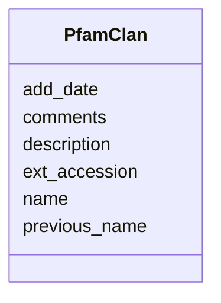

# Class: PfamClan 


URI: [img_sat_v450:PfamClan](https://w3id.org/jgi/img_sat_v450/PfamClan)





<!-- no inheritance hierarchy -->


## Slots

| Name | Cardinality and Range | Description | Inheritance |
| ---  | --- | --- | --- |
| [ext_accession](ext_accession.md) | 0..1 <br/> [String](String.md) |  | direct |
| [name](name.md) | 0..1 <br/> [String](String.md) |  | direct |
| [description](description.md) | 0..1 <br/> [String](String.md) |  | direct |
| [comments](comments.md) | 0..1 <br/> [String](String.md) |  | direct |
| [add_date](add_date.md) | 0..1 <br/> [Datetime](Datetime.md) |  | direct |
| [previous_name](previous_name.md) | 0..1 <br/> [String](String.md) |  | direct |


## Identifier and Mapping Information


### Schema Source


* from schema: https://w3id.org/jgi/img_sat_v450


## Mappings

| Mapping Type | Mapped Value |
| ---  | ---  |
| self | img_sat_v450:PfamClan |
| native | img_sat_v450:PfamClan |


## LinkML Source

<!-- TODO: investigate https://stackoverflow.com/questions/37606292/how-to-create-tabbed-code-blocks-in-mkdocs-or-sphinx -->

### Direct

<details>
```yaml
name: pfam_clan
from_schema: https://w3id.org/jgi/img_sat_v450
attributes:
  ext_accession:
    name: ext_accession
    from_schema: https://w3id.org/jgi/img_sat_v450
    domain_of:
    - compound
    - compound_aliases
    - compound_ext_links
    - interpro
    - interpro_go_terms
    - pfam_clan
    - pfam_clan_pfam_families
    - pfam_family
    - pfam_family_cogs
    - pfam_family_ext_links
    - pfam_family_genome_properties
    - reaction
    - reaction_compounds
    - reaction_enzymes
    - reaction_ext_links
    - tigrfam
    - tigrfam_enzymes
    - tigrfam_genome_properties
    - tigrfam_roles
    range: string
    required: false
  name:
    name: name
    from_schema: https://w3id.org/jgi/img_sat_v450
    domain_of:
    - cog2014
    - cogfunc2014
    - db_source
    - genome_property
    - interpro
    - pfam_clan
    - pfam_dead
    - pfam_family
    - property_step
    range: string
    required: false
  description:
    name: description
    from_schema: https://w3id.org/jgi/img_sat_v450
    domain_of:
    - cog
    - genome_property
    - kegg_pathway
    - kog
    - pfam_clan
    - pfam_family
    - yesnocv
    range: string
    required: false
  comments:
    name: comments
    from_schema: https://w3id.org/jgi/img_sat_v450
    domain_of:
    - biocyc_class
    - biocyc_comp
    - biocyc_enzrxn
    - biocyc_pathway_comments
    - biocyc_protein
    - biocyc_reaction
    - enzyme
    - enzyme_transferred
    - go_term
    - pfam_clan
    - pfam_dead
    - pfam_family
    - reaction
    range: string
    required: false
  add_date:
    name: add_date
    from_schema: https://w3id.org/jgi/img_sat_v450
    domain_of:
    - cog
    - cog_function
    - cog_species
    - compound
    - enzyme
    - enzyme_transferred
    - genome_property
    - go_graph_path
    - go_term
    - image_roi
    - kegg_pathway
    - km_image_roi
    - ko_term
    - kog
    - kog_function
    - mpw_pgl_pathway
    - pfam_clan
    - pfam_family
    - property_step
    - reaction
    - tigr_role
    - tigrfam
    range: datetime
    required: false
  previous_name:
    name: previous_name
    from_schema: https://w3id.org/jgi/img_sat_v450
    rank: 1000
    domain_of:
    - pfam_clan
    - pfam_family
    range: string
    required: false

```
</details>

### Induced

<details>
```yaml
name: pfam_clan
from_schema: https://w3id.org/jgi/img_sat_v450
attributes:
  ext_accession:
    name: ext_accession
    from_schema: https://w3id.org/jgi/img_sat_v450
    alias: ext_accession
    owner: pfam_clan
    domain_of:
    - compound
    - compound_aliases
    - compound_ext_links
    - interpro
    - interpro_go_terms
    - pfam_clan
    - pfam_clan_pfam_families
    - pfam_family
    - pfam_family_cogs
    - pfam_family_ext_links
    - pfam_family_genome_properties
    - reaction
    - reaction_compounds
    - reaction_enzymes
    - reaction_ext_links
    - tigrfam
    - tigrfam_enzymes
    - tigrfam_genome_properties
    - tigrfam_roles
    range: string
    required: false
  name:
    name: name
    from_schema: https://w3id.org/jgi/img_sat_v450
    alias: name
    owner: pfam_clan
    domain_of:
    - cog2014
    - cogfunc2014
    - db_source
    - genome_property
    - interpro
    - pfam_clan
    - pfam_dead
    - pfam_family
    - property_step
    range: string
    required: false
  description:
    name: description
    from_schema: https://w3id.org/jgi/img_sat_v450
    alias: description
    owner: pfam_clan
    domain_of:
    - cog
    - genome_property
    - kegg_pathway
    - kog
    - pfam_clan
    - pfam_family
    - yesnocv
    range: string
    required: false
  comments:
    name: comments
    from_schema: https://w3id.org/jgi/img_sat_v450
    alias: comments
    owner: pfam_clan
    domain_of:
    - biocyc_class
    - biocyc_comp
    - biocyc_enzrxn
    - biocyc_pathway_comments
    - biocyc_protein
    - biocyc_reaction
    - enzyme
    - enzyme_transferred
    - go_term
    - pfam_clan
    - pfam_dead
    - pfam_family
    - reaction
    range: string
    required: false
  add_date:
    name: add_date
    from_schema: https://w3id.org/jgi/img_sat_v450
    alias: add_date
    owner: pfam_clan
    domain_of:
    - cog
    - cog_function
    - cog_species
    - compound
    - enzyme
    - enzyme_transferred
    - genome_property
    - go_graph_path
    - go_term
    - image_roi
    - kegg_pathway
    - km_image_roi
    - ko_term
    - kog
    - kog_function
    - mpw_pgl_pathway
    - pfam_clan
    - pfam_family
    - property_step
    - reaction
    - tigr_role
    - tigrfam
    range: datetime
    required: false
  previous_name:
    name: previous_name
    from_schema: https://w3id.org/jgi/img_sat_v450
    rank: 1000
    alias: previous_name
    owner: pfam_clan
    domain_of:
    - pfam_clan
    - pfam_family
    range: string
    required: false

```
</details>