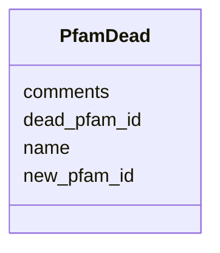

# Class: PfamDead 


URI: [img_sat_v450:PfamDead](https://w3id.org/jgi/img_sat_v450/PfamDead)





<!-- no inheritance hierarchy -->


## Slots

| Name | Cardinality and Range | Description | Inheritance |
| ---  | --- | --- | --- |
| [dead_pfam_id](dead_pfam_id.md) | 0..1 <br/> [String](String.md) |  | direct |
| [name](name.md) | 0..1 <br/> [String](String.md) |  | direct |
| [comments](comments.md) | 0..1 <br/> [String](String.md) |  | direct |
| [new_pfam_id](new_pfam_id.md) | 0..1 <br/> [String](String.md) |  | direct |


## Identifier and Mapping Information


### Schema Source


* from schema: https://w3id.org/jgi/img_sat_v450


## Mappings

| Mapping Type | Mapped Value |
| ---  | ---  |
| self | img_sat_v450:PfamDead |
| native | img_sat_v450:PfamDead |


## LinkML Source

<!-- TODO: investigate https://stackoverflow.com/questions/37606292/how-to-create-tabbed-code-blocks-in-mkdocs-or-sphinx -->

### Direct

<details>
```yaml
name: pfam_dead
from_schema: https://w3id.org/jgi/img_sat_v450
attributes:
  dead_pfam_id:
    name: dead_pfam_id
    from_schema: https://w3id.org/jgi/img_sat_v450
    rank: 1000
    domain_of:
    - pfam_dead
    range: string
    required: false
  name:
    name: name
    from_schema: https://w3id.org/jgi/img_sat_v450
    domain_of:
    - cog2014
    - cogfunc2014
    - db_source
    - genome_property
    - interpro
    - pfam_clan
    - pfam_dead
    - pfam_family
    - property_step
    range: string
    required: false
  comments:
    name: comments
    from_schema: https://w3id.org/jgi/img_sat_v450
    domain_of:
    - biocyc_class
    - biocyc_comp
    - biocyc_enzrxn
    - biocyc_pathway_comments
    - biocyc_protein
    - biocyc_reaction
    - enzyme
    - enzyme_transferred
    - go_term
    - pfam_clan
    - pfam_dead
    - pfam_family
    - reaction
    range: string
    required: false
  new_pfam_id:
    name: new_pfam_id
    from_schema: https://w3id.org/jgi/img_sat_v450
    rank: 1000
    domain_of:
    - pfam_dead
    range: string
    required: false

```
</details>

### Induced

<details>
```yaml
name: pfam_dead
from_schema: https://w3id.org/jgi/img_sat_v450
attributes:
  dead_pfam_id:
    name: dead_pfam_id
    from_schema: https://w3id.org/jgi/img_sat_v450
    rank: 1000
    alias: dead_pfam_id
    owner: pfam_dead
    domain_of:
    - pfam_dead
    range: string
    required: false
  name:
    name: name
    from_schema: https://w3id.org/jgi/img_sat_v450
    alias: name
    owner: pfam_dead
    domain_of:
    - cog2014
    - cogfunc2014
    - db_source
    - genome_property
    - interpro
    - pfam_clan
    - pfam_dead
    - pfam_family
    - property_step
    range: string
    required: false
  comments:
    name: comments
    from_schema: https://w3id.org/jgi/img_sat_v450
    alias: comments
    owner: pfam_dead
    domain_of:
    - biocyc_class
    - biocyc_comp
    - biocyc_enzrxn
    - biocyc_pathway_comments
    - biocyc_protein
    - biocyc_reaction
    - enzyme
    - enzyme_transferred
    - go_term
    - pfam_clan
    - pfam_dead
    - pfam_family
    - reaction
    range: string
    required: false
  new_pfam_id:
    name: new_pfam_id
    from_schema: https://w3id.org/jgi/img_sat_v450
    rank: 1000
    alias: new_pfam_id
    owner: pfam_dead
    domain_of:
    - pfam_dead
    range: string
    required: false

```
</details>