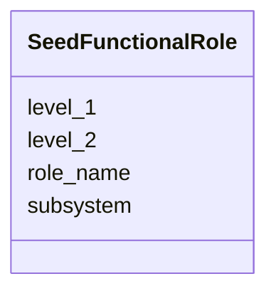

# Class: SeedFunctionalRole 


URI: [img_sat_v450:SeedFunctionalRole](https://w3id.org/jgi/img_sat_v450/SeedFunctionalRole)





<!-- no inheritance hierarchy -->


## Slots

| Name | Cardinality and Range | Description | Inheritance |
| ---  | --- | --- | --- |
| [role_name](role_name.md) | 0..1 <br/> [String](String.md) |  | direct |
| [subsystem](subsystem.md) | 0..1 <br/> [String](String.md) |  | direct |
| [level_1](level_1.md) | 0..1 <br/> [String](String.md) |  | direct |
| [level_2](level_2.md) | 0..1 <br/> [String](String.md) |  | direct |


## Identifier and Mapping Information


### Schema Source


* from schema: https://w3id.org/jgi/img_sat_v450


## Mappings

| Mapping Type | Mapped Value |
| ---  | ---  |
| self | img_sat_v450:SeedFunctionalRole |
| native | img_sat_v450:SeedFunctionalRole |


## LinkML Source

<!-- TODO: investigate https://stackoverflow.com/questions/37606292/how-to-create-tabbed-code-blocks-in-mkdocs-or-sphinx -->

### Direct

<details>
```yaml
name: seed_functional_role
from_schema: https://w3id.org/jgi/img_sat_v450
attributes:
  role_name:
    name: role_name
    from_schema: https://w3id.org/jgi/img_sat_v450
    rank: 1000
    domain_of:
    - seed_functional_role
    range: string
    required: false
  subsystem:
    name: subsystem
    from_schema: https://w3id.org/jgi/img_sat_v450
    rank: 1000
    domain_of:
    - seed_functional_role
    range: string
    required: false
  level_1:
    name: level_1
    from_schema: https://w3id.org/jgi/img_sat_v450
    domain_of:
    - eggnog_hierarchy
    - seed_functional_role
    range: string
    required: false
  level_2:
    name: level_2
    from_schema: https://w3id.org/jgi/img_sat_v450
    domain_of:
    - eggnog_hierarchy
    - eggnog_md52id2ont
    - seed_functional_role
    range: string
    required: false

```
</details>

### Induced

<details>
```yaml
name: seed_functional_role
from_schema: https://w3id.org/jgi/img_sat_v450
attributes:
  role_name:
    name: role_name
    from_schema: https://w3id.org/jgi/img_sat_v450
    rank: 1000
    alias: role_name
    owner: seed_functional_role
    domain_of:
    - seed_functional_role
    range: string
    required: false
  subsystem:
    name: subsystem
    from_schema: https://w3id.org/jgi/img_sat_v450
    rank: 1000
    alias: subsystem
    owner: seed_functional_role
    domain_of:
    - seed_functional_role
    range: string
    required: false
  level_1:
    name: level_1
    from_schema: https://w3id.org/jgi/img_sat_v450
    alias: level_1
    owner: seed_functional_role
    domain_of:
    - eggnog_hierarchy
    - seed_functional_role
    range: string
    required: false
  level_2:
    name: level_2
    from_schema: https://w3id.org/jgi/img_sat_v450
    alias: level_2
    owner: seed_functional_role
    domain_of:
    - eggnog_hierarchy
    - eggnog_md52id2ont
    - seed_functional_role
    range: string
    required: false

```
</details>