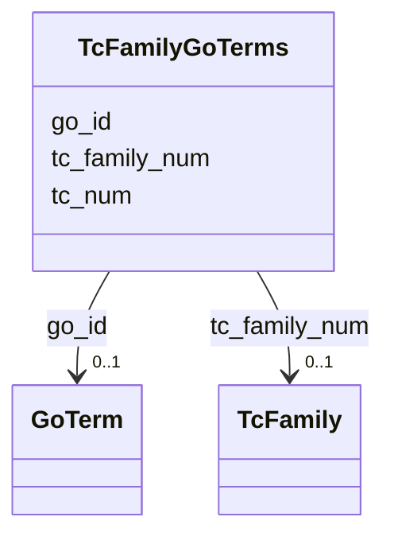

# Class: TcFamilyGoTerms 


URI: [img_sat_v450:TcFamilyGoTerms](https://w3id.org/jgi/img_sat_v450/TcFamilyGoTerms)





<!-- no inheritance hierarchy -->


## Slots

| Name | Cardinality and Range | Description | Inheritance |
| ---  | --- | --- | --- |
| [tc_family_num](tc_family_num.md) | 0..1 <br/> [TcFamily](TcFamily.md) | Foreign key to tc_family | direct |
| [tc_num](tc_num.md) | 0..1 <br/> [String](String.md) |  | direct |
| [go_id](go_id.md) | 0..1 <br/> [GoTerm](GoTerm.md) | Foreign key to go_term | direct |


## Identifier and Mapping Information


### Schema Source


* from schema: https://w3id.org/jgi/img_sat_v450


## Mappings

| Mapping Type | Mapped Value |
| ---  | ---  |
| self | img_sat_v450:TcFamilyGoTerms |
| native | img_sat_v450:TcFamilyGoTerms |


## LinkML Source

<!-- TODO: investigate https://stackoverflow.com/questions/37606292/how-to-create-tabbed-code-blocks-in-mkdocs-or-sphinx -->

### Direct

<details>
```yaml
name: tc_family_go_terms
from_schema: https://w3id.org/jgi/img_sat_v450
attributes:
  tc_family_num:
    name: tc_family_num
    description: Foreign key to tc_family
    from_schema: https://w3id.org/jgi/img_sat_v450
    domain_of:
    - tc_family
    - tc_family_cogs
    - tc_family_go_terms
    - tc_family_img_terms
    - tc_family_pfams
    - tc_family_pfams_iain
    - tc_family_tfams
    range: tc_family
    required: false
  tc_num:
    name: tc_num
    from_schema: https://w3id.org/jgi/img_sat_v450
    rank: 1000
    domain_of:
    - tc_family_go_terms
    - tc_family_pfams
    - tc_family_pfams_iain
    - tc_family_tfams
    range: string
    required: false
  go_id:
    name: go_id
    description: Foreign key to go_term
    from_schema: https://w3id.org/jgi/img_sat_v450
    domain_of:
    - go_term
    - go_term_parents
    - go_term_synonyms
    - ko2go
    - pfam2go
    - tc_family_go_terms
    range: go_term
    required: false

```
</details>

### Induced

<details>
```yaml
name: tc_family_go_terms
from_schema: https://w3id.org/jgi/img_sat_v450
attributes:
  tc_family_num:
    name: tc_family_num
    description: Foreign key to tc_family
    from_schema: https://w3id.org/jgi/img_sat_v450
    alias: tc_family_num
    owner: tc_family_go_terms
    domain_of:
    - tc_family
    - tc_family_cogs
    - tc_family_go_terms
    - tc_family_img_terms
    - tc_family_pfams
    - tc_family_pfams_iain
    - tc_family_tfams
    range: tc_family
    required: false
  tc_num:
    name: tc_num
    from_schema: https://w3id.org/jgi/img_sat_v450
    rank: 1000
    alias: tc_num
    owner: tc_family_go_terms
    domain_of:
    - tc_family_go_terms
    - tc_family_pfams
    - tc_family_pfams_iain
    - tc_family_tfams
    range: string
    required: false
  go_id:
    name: go_id
    description: Foreign key to go_term
    from_schema: https://w3id.org/jgi/img_sat_v450
    alias: go_id
    owner: tc_family_go_terms
    domain_of:
    - go_term
    - go_term_parents
    - go_term_synonyms
    - ko2go
    - pfam2go
    - tc_family_go_terms
    range: go_term
    required: false

```
</details>