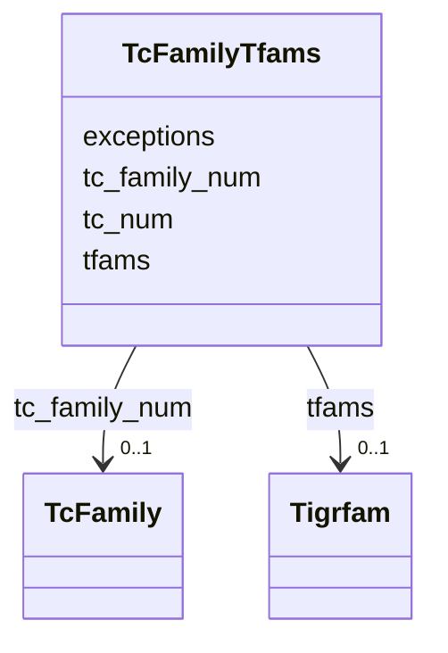

# Class: TcFamilyTfams 


URI: [img_sat_v450:TcFamilyTfams](https://w3id.org/jgi/img_sat_v450/TcFamilyTfams)





<!-- no inheritance hierarchy -->


## Slots

| Name | Cardinality and Range | Description | Inheritance |
| ---  | --- | --- | --- |
| [tc_family_num](tc_family_num.md) | 0..1 <br/> [TcFamily](TcFamily.md) | Foreign key to tc_family | direct |
| [tfams](tfams.md) | 0..1 <br/> [Tigrfam](Tigrfam.md) | Foreign key to tigrfam | direct |
| [exceptions](exceptions.md) | 0..1 <br/> [String](String.md) |  | direct |
| [tc_num](tc_num.md) | 0..1 <br/> [String](String.md) |  | direct |


## Identifier and Mapping Information


### Schema Source


* from schema: https://w3id.org/jgi/img_sat_v450


## Mappings

| Mapping Type | Mapped Value |
| ---  | ---  |
| self | img_sat_v450:TcFamilyTfams |
| native | img_sat_v450:TcFamilyTfams |


## LinkML Source

<!-- TODO: investigate https://stackoverflow.com/questions/37606292/how-to-create-tabbed-code-blocks-in-mkdocs-or-sphinx -->

### Direct

<details>
```yaml
name: tc_family_tfams
from_schema: https://w3id.org/jgi/img_sat_v450
attributes:
  tc_family_num:
    name: tc_family_num
    description: Foreign key to tc_family
    from_schema: https://w3id.org/jgi/img_sat_v450
    domain_of:
    - tc_family
    - tc_family_cogs
    - tc_family_go_terms
    - tc_family_img_terms
    - tc_family_pfams
    - tc_family_pfams_iain
    - tc_family_tfams
    range: tc_family
    required: false
  tfams:
    name: tfams
    description: Foreign key to tigrfam
    from_schema: https://w3id.org/jgi/img_sat_v450
    rank: 1000
    domain_of:
    - tc_family_tfams
    range: tigrfam
    required: false
  exceptions:
    name: exceptions
    from_schema: https://w3id.org/jgi/img_sat_v450
    domain_of:
    - tc_family_cogs
    - tc_family_img_terms
    - tc_family_pfams_iain
    - tc_family_tfams
    range: string
    required: false
  tc_num:
    name: tc_num
    from_schema: https://w3id.org/jgi/img_sat_v450
    domain_of:
    - tc_family_go_terms
    - tc_family_pfams
    - tc_family_pfams_iain
    - tc_family_tfams
    range: string
    required: false

```
</details>

### Induced

<details>
```yaml
name: tc_family_tfams
from_schema: https://w3id.org/jgi/img_sat_v450
attributes:
  tc_family_num:
    name: tc_family_num
    description: Foreign key to tc_family
    from_schema: https://w3id.org/jgi/img_sat_v450
    alias: tc_family_num
    owner: tc_family_tfams
    domain_of:
    - tc_family
    - tc_family_cogs
    - tc_family_go_terms
    - tc_family_img_terms
    - tc_family_pfams
    - tc_family_pfams_iain
    - tc_family_tfams
    range: tc_family
    required: false
  tfams:
    name: tfams
    description: Foreign key to tigrfam
    from_schema: https://w3id.org/jgi/img_sat_v450
    rank: 1000
    alias: tfams
    owner: tc_family_tfams
    domain_of:
    - tc_family_tfams
    range: tigrfam
    required: false
  exceptions:
    name: exceptions
    from_schema: https://w3id.org/jgi/img_sat_v450
    alias: exceptions
    owner: tc_family_tfams
    domain_of:
    - tc_family_cogs
    - tc_family_img_terms
    - tc_family_pfams_iain
    - tc_family_tfams
    range: string
    required: false
  tc_num:
    name: tc_num
    from_schema: https://w3id.org/jgi/img_sat_v450
    alias: tc_num
    owner: tc_family_tfams
    domain_of:
    - tc_family_go_terms
    - tc_family_pfams
    - tc_family_pfams_iain
    - tc_family_tfams
    range: string
    required: false

```
</details>