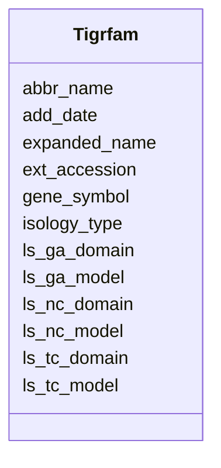

# Class: Tigrfam 


URI: [img_sat_v450:Tigrfam](https://w3id.org/jgi/img_sat_v450/Tigrfam)





<!-- no inheritance hierarchy -->


## Slots

| Name | Cardinality and Range | Description | Inheritance |
| ---  | --- | --- | --- |
| [ext_accession](ext_accession.md) | 0..1 <br/> [String](String.md) |  | direct |
| [abbr_name](abbr_name.md) | 0..1 <br/> [String](String.md) |  | direct |
| [expanded_name](expanded_name.md) | 0..1 <br/> [String](String.md) |  | direct |
| [isology_type](isology_type.md) | 0..1 <br/> [String](String.md) |  | direct |
| [add_date](add_date.md) | 0..1 <br/> [Datetime](Datetime.md) |  | direct |
| [gene_symbol](gene_symbol.md) | 0..1 <br/> [String](String.md) |  | direct |
| [ls_nc_model](ls_nc_model.md) | 0..1 <br/> [Float](Float.md) |  | direct |
| [ls_nc_domain](ls_nc_domain.md) | 0..1 <br/> [Float](Float.md) |  | direct |
| [ls_ga_model](ls_ga_model.md) | 0..1 <br/> [Float](Float.md) |  | direct |
| [ls_ga_domain](ls_ga_domain.md) | 0..1 <br/> [Float](Float.md) |  | direct |
| [ls_tc_model](ls_tc_model.md) | 0..1 <br/> [Float](Float.md) |  | direct |
| [ls_tc_domain](ls_tc_domain.md) | 0..1 <br/> [Float](Float.md) |  | direct |


## Usages

| used by | used in | type | used |
| ---  | --- | --- | --- |
| [TcFamilyTfams](TcFamilyTfams.md) | [tfams](tfams.md) | range | [Tigrfam](Tigrfam.md) |
| [TigrfamEnzymes](TigrfamEnzymes.md) | [ext_accession](ext_accession.md) | range | [Tigrfam](Tigrfam.md) |
| [TigrfamGenomeProperties](TigrfamGenomeProperties.md) | [ext_accession](ext_accession.md) | range | [Tigrfam](Tigrfam.md) |
| [TigrfamRoles](TigrfamRoles.md) | [ext_accession](ext_accession.md) | range | [Tigrfam](Tigrfam.md) |


## Identifier and Mapping Information


### Schema Source


* from schema: https://w3id.org/jgi/img_sat_v450


## Mappings

| Mapping Type | Mapped Value |
| ---  | ---  |
| self | img_sat_v450:Tigrfam |
| native | img_sat_v450:Tigrfam |


## LinkML Source

<!-- TODO: investigate https://stackoverflow.com/questions/37606292/how-to-create-tabbed-code-blocks-in-mkdocs-or-sphinx -->

### Direct

<details>
```yaml
name: tigrfam
from_schema: https://w3id.org/jgi/img_sat_v450
attributes:
  ext_accession:
    name: ext_accession
    from_schema: https://w3id.org/jgi/img_sat_v450
    domain_of:
    - compound
    - compound_aliases
    - compound_ext_links
    - interpro
    - interpro_go_terms
    - pfam_clan
    - pfam_clan_pfam_families
    - pfam_family
    - pfam_family_cogs
    - pfam_family_ext_links
    - pfam_family_genome_properties
    - reaction
    - reaction_compounds
    - reaction_enzymes
    - reaction_ext_links
    - tigrfam
    - tigrfam_enzymes
    - tigrfam_genome_properties
    - tigrfam_roles
    range: string
    required: false
  abbr_name:
    name: abbr_name
    from_schema: https://w3id.org/jgi/img_sat_v450
    rank: 1000
    domain_of:
    - tigrfam
    range: string
    required: false
  expanded_name:
    name: expanded_name
    from_schema: https://w3id.org/jgi/img_sat_v450
    rank: 1000
    domain_of:
    - tigrfam
    range: string
    required: false
  isology_type:
    name: isology_type
    from_schema: https://w3id.org/jgi/img_sat_v450
    rank: 1000
    domain_of:
    - tigrfam
    range: string
    required: false
  add_date:
    name: add_date
    from_schema: https://w3id.org/jgi/img_sat_v450
    domain_of:
    - cog
    - cog_function
    - cog_species
    - compound
    - enzyme
    - enzyme_transferred
    - genome_property
    - go_graph_path
    - go_term
    - image_roi
    - kegg_pathway
    - km_image_roi
    - ko_term
    - kog
    - kog_function
    - mpw_pgl_pathway
    - pfam_clan
    - pfam_family
    - property_step
    - reaction
    - tigr_role
    - tigrfam
    range: datetime
    required: false
  gene_symbol:
    name: gene_symbol
    from_schema: https://w3id.org/jgi/img_sat_v450
    rank: 1000
    domain_of:
    - tigrfam
    range: string
    required: false
  ls_nc_model:
    name: ls_nc_model
    from_schema: https://w3id.org/jgi/img_sat_v450
    rank: 1000
    domain_of:
    - tigrfam
    range: float
    required: false
  ls_nc_domain:
    name: ls_nc_domain
    from_schema: https://w3id.org/jgi/img_sat_v450
    rank: 1000
    domain_of:
    - tigrfam
    range: float
    required: false
  ls_ga_model:
    name: ls_ga_model
    from_schema: https://w3id.org/jgi/img_sat_v450
    rank: 1000
    domain_of:
    - tigrfam
    range: float
    required: false
  ls_ga_domain:
    name: ls_ga_domain
    from_schema: https://w3id.org/jgi/img_sat_v450
    rank: 1000
    domain_of:
    - tigrfam
    range: float
    required: false
  ls_tc_model:
    name: ls_tc_model
    from_schema: https://w3id.org/jgi/img_sat_v450
    rank: 1000
    domain_of:
    - tigrfam
    range: float
    required: false
  ls_tc_domain:
    name: ls_tc_domain
    from_schema: https://w3id.org/jgi/img_sat_v450
    rank: 1000
    domain_of:
    - tigrfam
    range: float
    required: false

```
</details>

### Induced

<details>
```yaml
name: tigrfam
from_schema: https://w3id.org/jgi/img_sat_v450
attributes:
  ext_accession:
    name: ext_accession
    from_schema: https://w3id.org/jgi/img_sat_v450
    alias: ext_accession
    owner: tigrfam
    domain_of:
    - compound
    - compound_aliases
    - compound_ext_links
    - interpro
    - interpro_go_terms
    - pfam_clan
    - pfam_clan_pfam_families
    - pfam_family
    - pfam_family_cogs
    - pfam_family_ext_links
    - pfam_family_genome_properties
    - reaction
    - reaction_compounds
    - reaction_enzymes
    - reaction_ext_links
    - tigrfam
    - tigrfam_enzymes
    - tigrfam_genome_properties
    - tigrfam_roles
    range: string
    required: false
  abbr_name:
    name: abbr_name
    from_schema: https://w3id.org/jgi/img_sat_v450
    rank: 1000
    alias: abbr_name
    owner: tigrfam
    domain_of:
    - tigrfam
    range: string
    required: false
  expanded_name:
    name: expanded_name
    from_schema: https://w3id.org/jgi/img_sat_v450
    rank: 1000
    alias: expanded_name
    owner: tigrfam
    domain_of:
    - tigrfam
    range: string
    required: false
  isology_type:
    name: isology_type
    from_schema: https://w3id.org/jgi/img_sat_v450
    rank: 1000
    alias: isology_type
    owner: tigrfam
    domain_of:
    - tigrfam
    range: string
    required: false
  add_date:
    name: add_date
    from_schema: https://w3id.org/jgi/img_sat_v450
    alias: add_date
    owner: tigrfam
    domain_of:
    - cog
    - cog_function
    - cog_species
    - compound
    - enzyme
    - enzyme_transferred
    - genome_property
    - go_graph_path
    - go_term
    - image_roi
    - kegg_pathway
    - km_image_roi
    - ko_term
    - kog
    - kog_function
    - mpw_pgl_pathway
    - pfam_clan
    - pfam_family
    - property_step
    - reaction
    - tigr_role
    - tigrfam
    range: datetime
    required: false
  gene_symbol:
    name: gene_symbol
    from_schema: https://w3id.org/jgi/img_sat_v450
    rank: 1000
    alias: gene_symbol
    owner: tigrfam
    domain_of:
    - tigrfam
    range: string
    required: false
  ls_nc_model:
    name: ls_nc_model
    from_schema: https://w3id.org/jgi/img_sat_v450
    rank: 1000
    alias: ls_nc_model
    owner: tigrfam
    domain_of:
    - tigrfam
    range: float
    required: false
  ls_nc_domain:
    name: ls_nc_domain
    from_schema: https://w3id.org/jgi/img_sat_v450
    rank: 1000
    alias: ls_nc_domain
    owner: tigrfam
    domain_of:
    - tigrfam
    range: float
    required: false
  ls_ga_model:
    name: ls_ga_model
    from_schema: https://w3id.org/jgi/img_sat_v450
    rank: 1000
    alias: ls_ga_model
    owner: tigrfam
    domain_of:
    - tigrfam
    range: float
    required: false
  ls_ga_domain:
    name: ls_ga_domain
    from_schema: https://w3id.org/jgi/img_sat_v450
    rank: 1000
    alias: ls_ga_domain
    owner: tigrfam
    domain_of:
    - tigrfam
    range: float
    required: false
  ls_tc_model:
    name: ls_tc_model
    from_schema: https://w3id.org/jgi/img_sat_v450
    rank: 1000
    alias: ls_tc_model
    owner: tigrfam
    domain_of:
    - tigrfam
    range: float
    required: false
  ls_tc_domain:
    name: ls_tc_domain
    from_schema: https://w3id.org/jgi/img_sat_v450
    rank: 1000
    alias: ls_tc_domain
    owner: tigrfam
    domain_of:
    - tigrfam
    range: float
    required: false

```
</details>