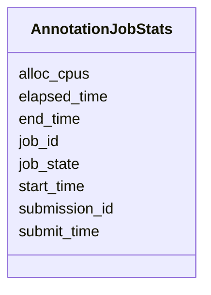

# Class: AnnotationJobStats 


URI: [img_sub:AnnotationJobStats](https://w3id.org/jgi/img_sub/AnnotationJobStats)





<!-- no inheritance hierarchy -->


## Slots

| Name | Cardinality and Range | Description | Inheritance |
| ---  | --- | --- | --- |
| [submission_id](submission_id.md) | 0..1 <br/> [Integer](Integer.md) |  | direct |
| [job_id](job_id.md) | 0..1 <br/> [String](String.md) |  | direct |
| [submit_time](submit_time.md) | 0..1 <br/> [Datetime](Datetime.md) |  | direct |
| [start_time](start_time.md) | 0..1 <br/> [Datetime](Datetime.md) |  | direct |
| [end_time](end_time.md) | 0..1 <br/> [Datetime](Datetime.md) |  | direct |
| [elapsed_time](elapsed_time.md) | 0..1 <br/> [String](String.md) |  | direct |
| [alloc_cpus](alloc_cpus.md) | 0..1 <br/> [Integer](Integer.md) |  | direct |
| [job_state](job_state.md) | 0..1 <br/> [String](String.md) |  | direct |


## Identifier and Mapping Information


### Schema Source


* from schema: https://w3id.org/jgi/img_sub


## Mappings

| Mapping Type | Mapped Value |
| ---  | ---  |
| self | img_sub:AnnotationJobStats |
| native | img_sub:AnnotationJobStats |


## LinkML Source

<!-- TODO: investigate https://stackoverflow.com/questions/37606292/how-to-create-tabbed-code-blocks-in-mkdocs-or-sphinx -->

### Direct

<details>
```yaml
name: annotation_job_stats
from_schema: https://w3id.org/jgi/img_sub
attributes:
  submission_id:
    name: submission_id
    from_schema: https://w3id.org/jgi/img_sub
    domain_of:
    - annotation_contigs_proteins_counts
    - annotation_job_sbatch_args
    - annotation_job_stats
    - annotation_step_stats
    - merfs_aggregate_file_size
    - rnaseq_notify
    - submission
    - submission_data_files
    - submission_data_files_dmpath
    - submission_history
    - submission_img_contacts
    - submission_proc_stats
    - submission_proc_steps
    - submission_reads_file
    - submission_samples
    range: integer
    required: false
  job_id:
    name: job_id
    from_schema: https://w3id.org/jgi/img_sub
    domain_of:
    - annotation_job_sbatch_args
    - annotation_job_stats
    range: string
    required: false
  submit_time:
    name: submit_time
    from_schema: https://w3id.org/jgi/img_sub
    rank: 1000
    domain_of:
    - annotation_job_stats
    range: datetime
    required: false
  start_time:
    name: start_time
    from_schema: https://w3id.org/jgi/img_sub
    rank: 1000
    domain_of:
    - annotation_job_stats
    range: datetime
    required: false
  end_time:
    name: end_time
    from_schema: https://w3id.org/jgi/img_sub
    rank: 1000
    domain_of:
    - annotation_job_stats
    range: datetime
    required: false
  elapsed_time:
    name: elapsed_time
    from_schema: https://w3id.org/jgi/img_sub
    rank: 1000
    domain_of:
    - annotation_job_stats
    range: string
    required: false
  alloc_cpus:
    name: alloc_cpus
    from_schema: https://w3id.org/jgi/img_sub
    rank: 1000
    domain_of:
    - annotation_job_stats
    range: integer
    required: false
  job_state:
    name: job_state
    from_schema: https://w3id.org/jgi/img_sub
    rank: 1000
    domain_of:
    - annotation_job_stats
    range: string
    required: false

```
</details>

### Induced

<details>
```yaml
name: annotation_job_stats
from_schema: https://w3id.org/jgi/img_sub
attributes:
  submission_id:
    name: submission_id
    from_schema: https://w3id.org/jgi/img_sub
    alias: submission_id
    owner: annotation_job_stats
    domain_of:
    - annotation_contigs_proteins_counts
    - annotation_job_sbatch_args
    - annotation_job_stats
    - annotation_step_stats
    - merfs_aggregate_file_size
    - rnaseq_notify
    - submission
    - submission_data_files
    - submission_data_files_dmpath
    - submission_history
    - submission_img_contacts
    - submission_proc_stats
    - submission_proc_steps
    - submission_reads_file
    - submission_samples
    range: integer
    required: false
  job_id:
    name: job_id
    from_schema: https://w3id.org/jgi/img_sub
    alias: job_id
    owner: annotation_job_stats
    domain_of:
    - annotation_job_sbatch_args
    - annotation_job_stats
    range: string
    required: false
  submit_time:
    name: submit_time
    from_schema: https://w3id.org/jgi/img_sub
    rank: 1000
    alias: submit_time
    owner: annotation_job_stats
    domain_of:
    - annotation_job_stats
    range: datetime
    required: false
  start_time:
    name: start_time
    from_schema: https://w3id.org/jgi/img_sub
    rank: 1000
    alias: start_time
    owner: annotation_job_stats
    domain_of:
    - annotation_job_stats
    range: datetime
    required: false
  end_time:
    name: end_time
    from_schema: https://w3id.org/jgi/img_sub
    rank: 1000
    alias: end_time
    owner: annotation_job_stats
    domain_of:
    - annotation_job_stats
    range: datetime
    required: false
  elapsed_time:
    name: elapsed_time
    from_schema: https://w3id.org/jgi/img_sub
    rank: 1000
    alias: elapsed_time
    owner: annotation_job_stats
    domain_of:
    - annotation_job_stats
    range: string
    required: false
  alloc_cpus:
    name: alloc_cpus
    from_schema: https://w3id.org/jgi/img_sub
    rank: 1000
    alias: alloc_cpus
    owner: annotation_job_stats
    domain_of:
    - annotation_job_stats
    range: integer
    required: false
  job_state:
    name: job_state
    from_schema: https://w3id.org/jgi/img_sub
    rank: 1000
    alias: job_state
    owner: annotation_job_stats
    domain_of:
    - annotation_job_stats
    range: string
    required: false

```
</details>