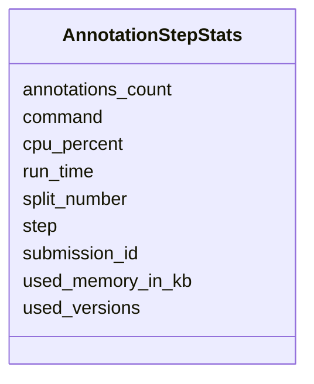

# Class: AnnotationStepStats 


URI: [img_sub:AnnotationStepStats](https://w3id.org/jgi/img_sub/AnnotationStepStats)





<!-- no inheritance hierarchy -->


## Slots

| Name | Cardinality and Range | Description | Inheritance |
| ---  | --- | --- | --- |
| [submission_id](submission_id.md) | 0..1 <br/> [Integer](Integer.md) |  | direct |
| [split_number](split_number.md) | 0..1 <br/> [Integer](Integer.md) |  | direct |
| [step](step.md) | 0..1 <br/> [String](String.md) |  | direct |
| [command](command.md) | 0..1 <br/> [String](String.md) |  | direct |
| [run_time](run_time.md) | 0..1 <br/> [String](String.md) |  | direct |
| [used_memory_in_kb](used_memory_in_kb.md) | 0..1 <br/> [Integer](Integer.md) |  | direct |
| [cpu_percent](cpu_percent.md) | 0..1 <br/> [Integer](Integer.md) |  | direct |
| [annotations_count](annotations_count.md) | 0..1 <br/> [Integer](Integer.md) |  | direct |
| [used_versions](used_versions.md) | 0..1 <br/> [String](String.md) |  | direct |


## Identifier and Mapping Information


### Schema Source


* from schema: https://w3id.org/jgi/img_sub


## Mappings

| Mapping Type | Mapped Value |
| ---  | ---  |
| self | img_sub:AnnotationStepStats |
| native | img_sub:AnnotationStepStats |


## LinkML Source

<!-- TODO: investigate https://stackoverflow.com/questions/37606292/how-to-create-tabbed-code-blocks-in-mkdocs-or-sphinx -->

### Direct

<details>
```yaml
name: annotation_step_stats
from_schema: https://w3id.org/jgi/img_sub
attributes:
  submission_id:
    name: submission_id
    from_schema: https://w3id.org/jgi/img_sub
    domain_of:
    - annotation_contigs_proteins_counts
    - annotation_job_sbatch_args
    - annotation_job_stats
    - annotation_step_stats
    - merfs_aggregate_file_size
    - rnaseq_notify
    - submission
    - submission_data_files
    - submission_data_files_dmpath
    - submission_history
    - submission_img_contacts
    - submission_proc_stats
    - submission_proc_steps
    - submission_reads_file
    - submission_samples
    range: integer
    required: false
  split_number:
    name: split_number
    from_schema: https://w3id.org/jgi/img_sub
    domain_of:
    - annotation_contigs_proteins_counts
    - annotation_step_stats
    range: integer
    required: false
  step:
    name: step
    from_schema: https://w3id.org/jgi/img_sub
    rank: 1000
    domain_of:
    - annotation_step_stats
    - submission_proc_stats
    - submission_proc_steps
    range: string
    required: false
  command:
    name: command
    from_schema: https://w3id.org/jgi/img_sub
    rank: 1000
    domain_of:
    - annotation_step_stats
    range: string
    required: false
  run_time:
    name: run_time
    from_schema: https://w3id.org/jgi/img_sub
    rank: 1000
    domain_of:
    - annotation_step_stats
    range: string
    required: false
  used_memory_in_kb:
    name: used_memory_in_kb
    from_schema: https://w3id.org/jgi/img_sub
    rank: 1000
    domain_of:
    - annotation_step_stats
    range: integer
    required: false
  cpu_percent:
    name: cpu_percent
    from_schema: https://w3id.org/jgi/img_sub
    rank: 1000
    domain_of:
    - annotation_step_stats
    range: integer
    required: false
  annotations_count:
    name: annotations_count
    from_schema: https://w3id.org/jgi/img_sub
    rank: 1000
    domain_of:
    - annotation_step_stats
    range: integer
    required: false
  used_versions:
    name: used_versions
    from_schema: https://w3id.org/jgi/img_sub
    rank: 1000
    domain_of:
    - annotation_step_stats
    range: string
    required: false

```
</details>

### Induced

<details>
```yaml
name: annotation_step_stats
from_schema: https://w3id.org/jgi/img_sub
attributes:
  submission_id:
    name: submission_id
    from_schema: https://w3id.org/jgi/img_sub
    alias: submission_id
    owner: annotation_step_stats
    domain_of:
    - annotation_contigs_proteins_counts
    - annotation_job_sbatch_args
    - annotation_job_stats
    - annotation_step_stats
    - merfs_aggregate_file_size
    - rnaseq_notify
    - submission
    - submission_data_files
    - submission_data_files_dmpath
    - submission_history
    - submission_img_contacts
    - submission_proc_stats
    - submission_proc_steps
    - submission_reads_file
    - submission_samples
    range: integer
    required: false
  split_number:
    name: split_number
    from_schema: https://w3id.org/jgi/img_sub
    alias: split_number
    owner: annotation_step_stats
    domain_of:
    - annotation_contigs_proteins_counts
    - annotation_step_stats
    range: integer
    required: false
  step:
    name: step
    from_schema: https://w3id.org/jgi/img_sub
    rank: 1000
    alias: step
    owner: annotation_step_stats
    domain_of:
    - annotation_step_stats
    - submission_proc_stats
    - submission_proc_steps
    range: string
    required: false
  command:
    name: command
    from_schema: https://w3id.org/jgi/img_sub
    rank: 1000
    alias: command
    owner: annotation_step_stats
    domain_of:
    - annotation_step_stats
    range: string
    required: false
  run_time:
    name: run_time
    from_schema: https://w3id.org/jgi/img_sub
    rank: 1000
    alias: run_time
    owner: annotation_step_stats
    domain_of:
    - annotation_step_stats
    range: string
    required: false
  used_memory_in_kb:
    name: used_memory_in_kb
    from_schema: https://w3id.org/jgi/img_sub
    rank: 1000
    alias: used_memory_in_kb
    owner: annotation_step_stats
    domain_of:
    - annotation_step_stats
    range: integer
    required: false
  cpu_percent:
    name: cpu_percent
    from_schema: https://w3id.org/jgi/img_sub
    rank: 1000
    alias: cpu_percent
    owner: annotation_step_stats
    domain_of:
    - annotation_step_stats
    range: integer
    required: false
  annotations_count:
    name: annotations_count
    from_schema: https://w3id.org/jgi/img_sub
    rank: 1000
    alias: annotations_count
    owner: annotation_step_stats
    domain_of:
    - annotation_step_stats
    range: integer
    required: false
  used_versions:
    name: used_versions
    from_schema: https://w3id.org/jgi/img_sub
    rank: 1000
    alias: used_versions
    owner: annotation_step_stats
    domain_of:
    - annotation_step_stats
    range: string
    required: false

```
</details>