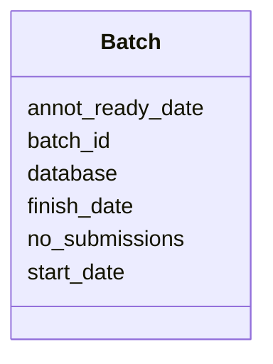

# Class: Batch 


URI: [img_sub:Batch](https://w3id.org/jgi/img_sub/Batch)





<!-- no inheritance hierarchy -->


## Slots

| Name | Cardinality and Range | Description | Inheritance |
| ---  | --- | --- | --- |
| [batch_id](batch_id.md) | 0..1 <br/> [Integer](Integer.md) |  | direct |
| [database](database.md) | 0..1 <br/> [String](String.md) |  | direct |
| [no_submissions](no_submissions.md) | 0..1 <br/> [Integer](Integer.md) |  | direct |
| [start_date](start_date.md) | 0..1 <br/> [Datetime](Datetime.md) |  | direct |
| [annot_ready_date](annot_ready_date.md) | 0..1 <br/> [Datetime](Datetime.md) |  | direct |
| [finish_date](finish_date.md) | 0..1 <br/> [Datetime](Datetime.md) |  | direct |


## Identifier and Mapping Information


### Schema Source


* from schema: https://w3id.org/jgi/img_sub


## Mappings

| Mapping Type | Mapped Value |
| ---  | ---  |
| self | img_sub:Batch |
| native | img_sub:Batch |


## LinkML Source

<!-- TODO: investigate https://stackoverflow.com/questions/37606292/how-to-create-tabbed-code-blocks-in-mkdocs-or-sphinx -->

### Direct

<details>
```yaml
name: batch
from_schema: https://w3id.org/jgi/img_sub
attributes:
  batch_id:
    name: batch_id
    from_schema: https://w3id.org/jgi/img_sub
    rank: 1000
    domain_of:
    - batch
    - submission
    range: integer
    required: false
  database:
    name: database
    from_schema: https://w3id.org/jgi/img_sub
    rank: 1000
    domain_of:
    - batch
    - rnaseq_notify
    - submission
    range: string
    required: false
  no_submissions:
    name: no_submissions
    from_schema: https://w3id.org/jgi/img_sub
    rank: 1000
    domain_of:
    - batch
    range: integer
    required: false
  start_date:
    name: start_date
    from_schema: https://w3id.org/jgi/img_sub
    rank: 1000
    domain_of:
    - batch
    - merfs_aggregate_file_size
    range: datetime
    required: false
  annot_ready_date:
    name: annot_ready_date
    from_schema: https://w3id.org/jgi/img_sub
    rank: 1000
    domain_of:
    - batch
    range: datetime
    required: false
  finish_date:
    name: finish_date
    from_schema: https://w3id.org/jgi/img_sub
    rank: 1000
    domain_of:
    - batch
    range: datetime
    required: false

```
</details>

### Induced

<details>
```yaml
name: batch
from_schema: https://w3id.org/jgi/img_sub
attributes:
  batch_id:
    name: batch_id
    from_schema: https://w3id.org/jgi/img_sub
    rank: 1000
    alias: batch_id
    owner: batch
    domain_of:
    - batch
    - submission
    range: integer
    required: false
  database:
    name: database
    from_schema: https://w3id.org/jgi/img_sub
    rank: 1000
    alias: database
    owner: batch
    domain_of:
    - batch
    - rnaseq_notify
    - submission
    range: string
    required: false
  no_submissions:
    name: no_submissions
    from_schema: https://w3id.org/jgi/img_sub
    rank: 1000
    alias: no_submissions
    owner: batch
    domain_of:
    - batch
    range: integer
    required: false
  start_date:
    name: start_date
    from_schema: https://w3id.org/jgi/img_sub
    rank: 1000
    alias: start_date
    owner: batch
    domain_of:
    - batch
    - merfs_aggregate_file_size
    range: datetime
    required: false
  annot_ready_date:
    name: annot_ready_date
    from_schema: https://w3id.org/jgi/img_sub
    rank: 1000
    alias: annot_ready_date
    owner: batch
    domain_of:
    - batch
    range: datetime
    required: false
  finish_date:
    name: finish_date
    from_schema: https://w3id.org/jgi/img_sub
    rank: 1000
    alias: finish_date
    owner: batch
    domain_of:
    - batch
    range: datetime
    required: false

```
</details>