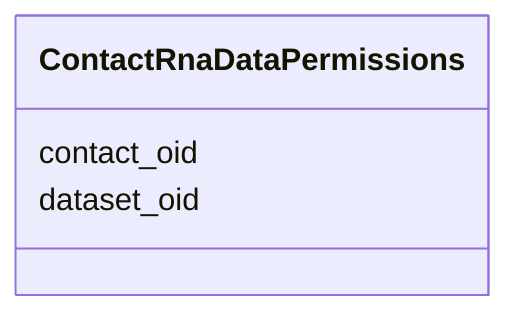

# Class: ContactRnaDataPermissions 


URI: [img_sub:ContactRnaDataPermissions](https://w3id.org/jgi/img_sub/ContactRnaDataPermissions)





<!-- no inheritance hierarchy -->


## Slots

| Name | Cardinality and Range | Description | Inheritance |
| ---  | --- | --- | --- |
| [contact_oid](contact_oid.md) | 0..1 <br/> [Integer](Integer.md) |  | direct |
| [dataset_oid](dataset_oid.md) | 0..1 <br/> [Integer](Integer.md) |  | direct |


## Identifier and Mapping Information


### Schema Source


* from schema: https://w3id.org/jgi/img_sub


## Mappings

| Mapping Type | Mapped Value |
| ---  | ---  |
| self | img_sub:ContactRnaDataPermissions |
| native | img_sub:ContactRnaDataPermissions |


## LinkML Source

<!-- TODO: investigate https://stackoverflow.com/questions/37606292/how-to-create-tabbed-code-blocks-in-mkdocs-or-sphinx -->

### Direct

<details>
```yaml
name: contact_rna_data_permissions
from_schema: https://w3id.org/jgi/img_sub
attributes:
  contact_oid:
    name: contact_oid
    from_schema: https://w3id.org/jgi/img_sub
    domain_of:
    - analysis_project_permissions
    - contact
    - contact_img_groups
    - contact_jgi_accounts
    - contact_rna_data_permissions
    - contact_rnaexp_permissions
    - contact_taxon_permissions
    - contact_workspace_group
    - gene_myimg_groups
    - mygene_img_groups
    range: integer
    required: false
  dataset_oid:
    name: dataset_oid
    from_schema: https://w3id.org/jgi/img_sub
    rank: 1000
    domain_of:
    - contact_rna_data_permissions
    - rnaseq_notify
    range: integer
    required: false

```
</details>

### Induced

<details>
```yaml
name: contact_rna_data_permissions
from_schema: https://w3id.org/jgi/img_sub
attributes:
  contact_oid:
    name: contact_oid
    from_schema: https://w3id.org/jgi/img_sub
    alias: contact_oid
    owner: contact_rna_data_permissions
    domain_of:
    - analysis_project_permissions
    - contact
    - contact_img_groups
    - contact_jgi_accounts
    - contact_rna_data_permissions
    - contact_rnaexp_permissions
    - contact_taxon_permissions
    - contact_workspace_group
    - gene_myimg_groups
    - mygene_img_groups
    range: integer
    required: false
  dataset_oid:
    name: dataset_oid
    from_schema: https://w3id.org/jgi/img_sub
    rank: 1000
    alias: dataset_oid
    owner: contact_rna_data_permissions
    domain_of:
    - contact_rna_data_permissions
    - rnaseq_notify
    range: integer
    required: false

```
</details>