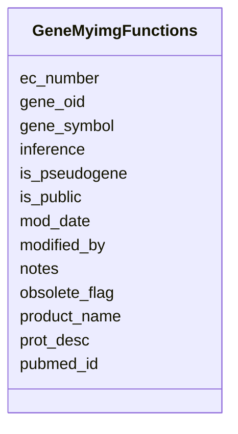

# Class: GeneMyimgFunctions 


URI: [img_sub:GeneMyimgFunctions](https://w3id.org/jgi/img_sub/GeneMyimgFunctions)





<!-- no inheritance hierarchy -->


## Slots

| Name | Cardinality and Range | Description | Inheritance |
| ---  | --- | --- | --- |
| [gene_oid](gene_oid.md) | 0..1 <br/> [Integer](Integer.md) |  | direct |
| [product_name](product_name.md) | 0..1 <br/> [String](String.md) |  | direct |
| [prot_desc](prot_desc.md) | 0..1 <br/> [String](String.md) |  | direct |
| [ec_number](ec_number.md) | 0..1 <br/> [String](String.md) |  | direct |
| [pubmed_id](pubmed_id.md) | 0..1 <br/> [String](String.md) |  | direct |
| [inference](inference.md) | 0..1 <br/> [String](String.md) |  | direct |
| [is_pseudogene](is_pseudogene.md) | 0..1 <br/> [String](String.md) |  | direct |
| [notes](notes.md) | 0..1 <br/> [String](String.md) |  | direct |
| [modified_by](modified_by.md) | 0..1 <br/> [Integer](Integer.md) |  | direct |
| [mod_date](mod_date.md) | 0..1 <br/> [Datetime](Datetime.md) |  | direct |
| [gene_symbol](gene_symbol.md) | 0..1 <br/> [String](String.md) |  | direct |
| [obsolete_flag](obsolete_flag.md) | 0..1 <br/> [String](String.md) |  | direct |
| [is_public](is_public.md) | 0..1 <br/> [String](String.md) |  | direct |


## Identifier and Mapping Information


### Schema Source


* from schema: https://w3id.org/jgi/img_sub


## Mappings

| Mapping Type | Mapped Value |
| ---  | ---  |
| self | img_sub:GeneMyimgFunctions |
| native | img_sub:GeneMyimgFunctions |


## LinkML Source

<!-- TODO: investigate https://stackoverflow.com/questions/37606292/how-to-create-tabbed-code-blocks-in-mkdocs-or-sphinx -->

### Direct

<details>
```yaml
name: gene_myimg_functions
from_schema: https://w3id.org/jgi/img_sub
attributes:
  gene_oid:
    name: gene_oid
    from_schema: https://w3id.org/jgi/img_sub
    domain_of:
    - gene_myimg_enzymes
    - gene_myimg_functions
    - gene_myimg_groups
    range: integer
    required: false
  product_name:
    name: product_name
    from_schema: https://w3id.org/jgi/img_sub
    rank: 1000
    domain_of:
    - gene_myimg_functions
    - mygene
    range: string
    required: false
  prot_desc:
    name: prot_desc
    from_schema: https://w3id.org/jgi/img_sub
    rank: 1000
    domain_of:
    - gene_myimg_functions
    range: string
    required: false
  ec_number:
    name: ec_number
    from_schema: https://w3id.org/jgi/img_sub
    domain_of:
    - gene_myimg_enzymes
    - gene_myimg_functions
    - mygene
    range: string
    required: false
  pubmed_id:
    name: pubmed_id
    from_schema: https://w3id.org/jgi/img_sub
    rank: 1000
    domain_of:
    - gene_myimg_functions
    range: string
    required: false
  inference:
    name: inference
    from_schema: https://w3id.org/jgi/img_sub
    rank: 1000
    domain_of:
    - gene_myimg_functions
    range: string
    required: false
  is_pseudogene:
    name: is_pseudogene
    from_schema: https://w3id.org/jgi/img_sub
    rank: 1000
    domain_of:
    - gene_myimg_functions
    - mygene
    range: string
    required: false
  notes:
    name: notes
    from_schema: https://w3id.org/jgi/img_sub
    domain_of:
    - announcement
    - gene_myimg_functions
    - request_account
    range: string
    required: false
  modified_by:
    name: modified_by
    from_schema: https://w3id.org/jgi/img_sub
    domain_of:
    - announcement
    - gene_myimg_enzymes
    - gene_myimg_functions
    - mygene
    - myimg_bio_cluster_np
    - request_account
    - submission
    - submission_history
    - taxon_history
    range: integer
    required: false
  mod_date:
    name: mod_date
    from_schema: https://w3id.org/jgi/img_sub
    domain_of:
    - announcement
    - gene_myimg_enzymes
    - gene_myimg_functions
    - img_group_news
    - mygene
    - myimg_bio_cluster_np
    - request_account
    - submission
    - submission_history
    - taxon_history
    range: datetime
    required: false
  gene_symbol:
    name: gene_symbol
    from_schema: https://w3id.org/jgi/img_sub
    rank: 1000
    domain_of:
    - gene_myimg_functions
    - mygene
    range: string
    required: false
  obsolete_flag:
    name: obsolete_flag
    from_schema: https://w3id.org/jgi/img_sub
    rank: 1000
    domain_of:
    - gene_myimg_functions
    - mygene
    range: string
    required: false
  is_public:
    name: is_public
    from_schema: https://w3id.org/jgi/img_sub
    rank: 1000
    domain_of:
    - gene_myimg_functions
    - img_group_news
    - mygene
    - myimg_bio_cluster_np
    range: string
    required: false

```
</details>

### Induced

<details>
```yaml
name: gene_myimg_functions
from_schema: https://w3id.org/jgi/img_sub
attributes:
  gene_oid:
    name: gene_oid
    from_schema: https://w3id.org/jgi/img_sub
    alias: gene_oid
    owner: gene_myimg_functions
    domain_of:
    - gene_myimg_enzymes
    - gene_myimg_functions
    - gene_myimg_groups
    range: integer
    required: false
  product_name:
    name: product_name
    from_schema: https://w3id.org/jgi/img_sub
    rank: 1000
    alias: product_name
    owner: gene_myimg_functions
    domain_of:
    - gene_myimg_functions
    - mygene
    range: string
    required: false
  prot_desc:
    name: prot_desc
    from_schema: https://w3id.org/jgi/img_sub
    rank: 1000
    alias: prot_desc
    owner: gene_myimg_functions
    domain_of:
    - gene_myimg_functions
    range: string
    required: false
  ec_number:
    name: ec_number
    from_schema: https://w3id.org/jgi/img_sub
    alias: ec_number
    owner: gene_myimg_functions
    domain_of:
    - gene_myimg_enzymes
    - gene_myimg_functions
    - mygene
    range: string
    required: false
  pubmed_id:
    name: pubmed_id
    from_schema: https://w3id.org/jgi/img_sub
    rank: 1000
    alias: pubmed_id
    owner: gene_myimg_functions
    domain_of:
    - gene_myimg_functions
    range: string
    required: false
  inference:
    name: inference
    from_schema: https://w3id.org/jgi/img_sub
    rank: 1000
    alias: inference
    owner: gene_myimg_functions
    domain_of:
    - gene_myimg_functions
    range: string
    required: false
  is_pseudogene:
    name: is_pseudogene
    from_schema: https://w3id.org/jgi/img_sub
    rank: 1000
    alias: is_pseudogene
    owner: gene_myimg_functions
    domain_of:
    - gene_myimg_functions
    - mygene
    range: string
    required: false
  notes:
    name: notes
    from_schema: https://w3id.org/jgi/img_sub
    alias: notes
    owner: gene_myimg_functions
    domain_of:
    - announcement
    - gene_myimg_functions
    - request_account
    range: string
    required: false
  modified_by:
    name: modified_by
    from_schema: https://w3id.org/jgi/img_sub
    alias: modified_by
    owner: gene_myimg_functions
    domain_of:
    - announcement
    - gene_myimg_enzymes
    - gene_myimg_functions
    - mygene
    - myimg_bio_cluster_np
    - request_account
    - submission
    - submission_history
    - taxon_history
    range: integer
    required: false
  mod_date:
    name: mod_date
    from_schema: https://w3id.org/jgi/img_sub
    alias: mod_date
    owner: gene_myimg_functions
    domain_of:
    - announcement
    - gene_myimg_enzymes
    - gene_myimg_functions
    - img_group_news
    - mygene
    - myimg_bio_cluster_np
    - request_account
    - submission
    - submission_history
    - taxon_history
    range: datetime
    required: false
  gene_symbol:
    name: gene_symbol
    from_schema: https://w3id.org/jgi/img_sub
    rank: 1000
    alias: gene_symbol
    owner: gene_myimg_functions
    domain_of:
    - gene_myimg_functions
    - mygene
    range: string
    required: false
  obsolete_flag:
    name: obsolete_flag
    from_schema: https://w3id.org/jgi/img_sub
    rank: 1000
    alias: obsolete_flag
    owner: gene_myimg_functions
    domain_of:
    - gene_myimg_functions
    - mygene
    range: string
    required: false
  is_public:
    name: is_public
    from_schema: https://w3id.org/jgi/img_sub
    rank: 1000
    alias: is_public
    owner: gene_myimg_functions
    domain_of:
    - gene_myimg_functions
    - img_group_news
    - mygene
    - myimg_bio_cluster_np
    range: string
    required: false

```
</details>