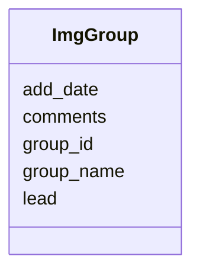

# Class: ImgGroup 


URI: [img_sub:ImgGroup](https://w3id.org/jgi/img_sub/ImgGroup)





<!-- no inheritance hierarchy -->


## Slots

| Name | Cardinality and Range | Description | Inheritance |
| ---  | --- | --- | --- |
| [group_id](group_id.md) | 0..1 <br/> [Integer](Integer.md) |  | direct |
| [group_name](group_name.md) | 0..1 <br/> [String](String.md) |  | direct |
| [lead](lead.md) | 0..1 <br/> [Integer](Integer.md) |  | direct |
| [add_date](add_date.md) | 0..1 <br/> [Datetime](Datetime.md) |  | direct |
| [comments](comments.md) | 0..1 <br/> [String](String.md) |  | direct |


## Identifier and Mapping Information


### Schema Source


* from schema: https://w3id.org/jgi/img_sub


## Mappings

| Mapping Type | Mapped Value |
| ---  | ---  |
| self | img_sub:ImgGroup |
| native | img_sub:ImgGroup |


## LinkML Source

<!-- TODO: investigate https://stackoverflow.com/questions/37606292/how-to-create-tabbed-code-blocks-in-mkdocs-or-sphinx -->

### Direct

<details>
```yaml
name: img_group
from_schema: https://w3id.org/jgi/img_sub
attributes:
  group_id:
    name: group_id
    from_schema: https://w3id.org/jgi/img_sub
    domain_of:
    - contact_workspace_group
    - gene_myimg_groups
    - img_group
    - img_group_news
    - mygene_img_groups
    range: integer
    required: false
  group_name:
    name: group_name
    from_schema: https://w3id.org/jgi/img_sub
    rank: 1000
    domain_of:
    - img_group
    - request_account
    range: string
    required: false
  lead:
    name: lead
    from_schema: https://w3id.org/jgi/img_sub
    rank: 1000
    domain_of:
    - img_group
    range: integer
    required: false
  add_date:
    name: add_date
    from_schema: https://w3id.org/jgi/img_sub
    domain_of:
    - contact
    - img_group
    - img_group_news
    - mygene
    - not_to_release
    - rnaseq_notify
    range: datetime
    required: false
  comments:
    name: comments
    from_schema: https://w3id.org/jgi/img_sub
    domain_of:
    - contact
    - img_group
    - myimg_bio_cluster_np
    - request_account
    - submission
    - submission_history
    - submission_proc_steps
    range: string
    required: false

```
</details>

### Induced

<details>
```yaml
name: img_group
from_schema: https://w3id.org/jgi/img_sub
attributes:
  group_id:
    name: group_id
    from_schema: https://w3id.org/jgi/img_sub
    alias: group_id
    owner: img_group
    domain_of:
    - contact_workspace_group
    - gene_myimg_groups
    - img_group
    - img_group_news
    - mygene_img_groups
    range: integer
    required: false
  group_name:
    name: group_name
    from_schema: https://w3id.org/jgi/img_sub
    rank: 1000
    alias: group_name
    owner: img_group
    domain_of:
    - img_group
    - request_account
    range: string
    required: false
  lead:
    name: lead
    from_schema: https://w3id.org/jgi/img_sub
    rank: 1000
    alias: lead
    owner: img_group
    domain_of:
    - img_group
    range: integer
    required: false
  add_date:
    name: add_date
    from_schema: https://w3id.org/jgi/img_sub
    alias: add_date
    owner: img_group
    domain_of:
    - contact
    - img_group
    - img_group_news
    - mygene
    - not_to_release
    - rnaseq_notify
    range: datetime
    required: false
  comments:
    name: comments
    from_schema: https://w3id.org/jgi/img_sub
    alias: comments
    owner: img_group
    domain_of:
    - contact
    - img_group
    - myimg_bio_cluster_np
    - request_account
    - submission
    - submission_history
    - submission_proc_steps
    range: string
    required: false

```
</details>