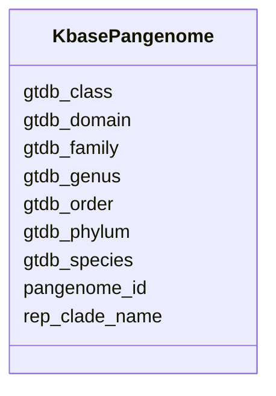

# Class: KbasePangenome 


URI: [img_sub:KbasePangenome](https://w3id.org/jgi/img_sub/KbasePangenome)





<!-- no inheritance hierarchy -->


## Slots

| Name | Cardinality and Range | Description | Inheritance |
| ---  | --- | --- | --- |
| [pangenome_id](pangenome_id.md) | 0..1 <br/> [String](String.md) |  | direct |
| [rep_clade_name](rep_clade_name.md) | 0..1 <br/> [String](String.md) |  | direct |
| [gtdb_domain](gtdb_domain.md) | 0..1 <br/> [String](String.md) |  | direct |
| [gtdb_phylum](gtdb_phylum.md) | 0..1 <br/> [String](String.md) |  | direct |
| [gtdb_class](gtdb_class.md) | 0..1 <br/> [String](String.md) |  | direct |
| [gtdb_order](gtdb_order.md) | 0..1 <br/> [String](String.md) |  | direct |
| [gtdb_family](gtdb_family.md) | 0..1 <br/> [String](String.md) |  | direct |
| [gtdb_genus](gtdb_genus.md) | 0..1 <br/> [String](String.md) |  | direct |
| [gtdb_species](gtdb_species.md) | 0..1 <br/> [String](String.md) |  | direct |


## Identifier and Mapping Information


### Schema Source


* from schema: https://w3id.org/jgi/img_sub


## Mappings

| Mapping Type | Mapped Value |
| ---  | ---  |
| self | img_sub:KbasePangenome |
| native | img_sub:KbasePangenome |


## LinkML Source

<!-- TODO: investigate https://stackoverflow.com/questions/37606292/how-to-create-tabbed-code-blocks-in-mkdocs-or-sphinx -->

### Direct

<details>
```yaml
name: kbase_pangenome
from_schema: https://w3id.org/jgi/img_sub
attributes:
  pangenome_id:
    name: pangenome_id
    from_schema: https://w3id.org/jgi/img_sub
    rank: 1000
    domain_of:
    - kbase_pangenome
    - kbase_pangenome_members
    range: string
    required: false
  rep_clade_name:
    name: rep_clade_name
    from_schema: https://w3id.org/jgi/img_sub
    rank: 1000
    domain_of:
    - kbase_pangenome
    range: string
    required: false
  gtdb_domain:
    name: gtdb_domain
    from_schema: https://w3id.org/jgi/img_sub
    rank: 1000
    domain_of:
    - kbase_pangenome
    range: string
    required: false
  gtdb_phylum:
    name: gtdb_phylum
    from_schema: https://w3id.org/jgi/img_sub
    rank: 1000
    domain_of:
    - kbase_pangenome
    range: string
    required: false
  gtdb_class:
    name: gtdb_class
    from_schema: https://w3id.org/jgi/img_sub
    rank: 1000
    domain_of:
    - kbase_pangenome
    range: string
    required: false
  gtdb_order:
    name: gtdb_order
    from_schema: https://w3id.org/jgi/img_sub
    rank: 1000
    domain_of:
    - kbase_pangenome
    range: string
    required: false
  gtdb_family:
    name: gtdb_family
    from_schema: https://w3id.org/jgi/img_sub
    rank: 1000
    domain_of:
    - kbase_pangenome
    range: string
    required: false
  gtdb_genus:
    name: gtdb_genus
    from_schema: https://w3id.org/jgi/img_sub
    rank: 1000
    domain_of:
    - kbase_pangenome
    range: string
    required: false
  gtdb_species:
    name: gtdb_species
    from_schema: https://w3id.org/jgi/img_sub
    rank: 1000
    domain_of:
    - kbase_pangenome
    range: string
    required: false

```
</details>

### Induced

<details>
```yaml
name: kbase_pangenome
from_schema: https://w3id.org/jgi/img_sub
attributes:
  pangenome_id:
    name: pangenome_id
    from_schema: https://w3id.org/jgi/img_sub
    rank: 1000
    alias: pangenome_id
    owner: kbase_pangenome
    domain_of:
    - kbase_pangenome
    - kbase_pangenome_members
    range: string
    required: false
  rep_clade_name:
    name: rep_clade_name
    from_schema: https://w3id.org/jgi/img_sub
    rank: 1000
    alias: rep_clade_name
    owner: kbase_pangenome
    domain_of:
    - kbase_pangenome
    range: string
    required: false
  gtdb_domain:
    name: gtdb_domain
    from_schema: https://w3id.org/jgi/img_sub
    rank: 1000
    alias: gtdb_domain
    owner: kbase_pangenome
    domain_of:
    - kbase_pangenome
    range: string
    required: false
  gtdb_phylum:
    name: gtdb_phylum
    from_schema: https://w3id.org/jgi/img_sub
    rank: 1000
    alias: gtdb_phylum
    owner: kbase_pangenome
    domain_of:
    - kbase_pangenome
    range: string
    required: false
  gtdb_class:
    name: gtdb_class
    from_schema: https://w3id.org/jgi/img_sub
    rank: 1000
    alias: gtdb_class
    owner: kbase_pangenome
    domain_of:
    - kbase_pangenome
    range: string
    required: false
  gtdb_order:
    name: gtdb_order
    from_schema: https://w3id.org/jgi/img_sub
    rank: 1000
    alias: gtdb_order
    owner: kbase_pangenome
    domain_of:
    - kbase_pangenome
    range: string
    required: false
  gtdb_family:
    name: gtdb_family
    from_schema: https://w3id.org/jgi/img_sub
    rank: 1000
    alias: gtdb_family
    owner: kbase_pangenome
    domain_of:
    - kbase_pangenome
    range: string
    required: false
  gtdb_genus:
    name: gtdb_genus
    from_schema: https://w3id.org/jgi/img_sub
    rank: 1000
    alias: gtdb_genus
    owner: kbase_pangenome
    domain_of:
    - kbase_pangenome
    range: string
    required: false
  gtdb_species:
    name: gtdb_species
    from_schema: https://w3id.org/jgi/img_sub
    rank: 1000
    alias: gtdb_species
    owner: kbase_pangenome
    domain_of:
    - kbase_pangenome
    range: string
    required: false

```
</details>