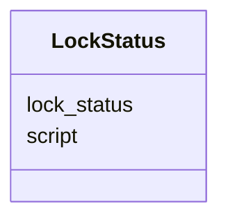

# Class: LockStatus 


URI: [img_sub:LockStatus](https://w3id.org/jgi/img_sub/LockStatus)





<!-- no inheritance hierarchy -->


## Slots

| Name | Cardinality and Range | Description | Inheritance |
| ---  | --- | --- | --- |
| [lock_status](lock_status.md) | 0..1 <br/> [String](String.md) |  | direct |
| [script](script.md) | 0..1 <br/> [String](String.md) |  | direct |


## Identifier and Mapping Information


### Schema Source


* from schema: https://w3id.org/jgi/img_sub


## Mappings

| Mapping Type | Mapped Value |
| ---  | ---  |
| self | img_sub:LockStatus |
| native | img_sub:LockStatus |


## LinkML Source

<!-- TODO: investigate https://stackoverflow.com/questions/37606292/how-to-create-tabbed-code-blocks-in-mkdocs-or-sphinx -->

### Direct

<details>
```yaml
name: lock_status
from_schema: https://w3id.org/jgi/img_sub
attributes:
  lock_status:
    name: lock_status
    from_schema: https://w3id.org/jgi/img_sub
    rank: 1000
    domain_of:
    - lock_status
    range: string
    required: false
  script:
    name: script
    from_schema: https://w3id.org/jgi/img_sub
    rank: 1000
    domain_of:
    - lock_status
    range: string
    required: false

```
</details>

### Induced

<details>
```yaml
name: lock_status
from_schema: https://w3id.org/jgi/img_sub
attributes:
  lock_status:
    name: lock_status
    from_schema: https://w3id.org/jgi/img_sub
    rank: 1000
    alias: lock_status
    owner: lock_status
    domain_of:
    - lock_status
    range: string
    required: false
  script:
    name: script
    from_schema: https://w3id.org/jgi/img_sub
    rank: 1000
    alias: script
    owner: lock_status
    domain_of:
    - lock_status
    range: string
    required: false

```
</details>