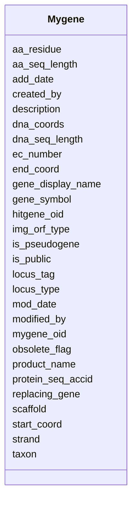

# Class: Mygene 


URI: [img_sub:Mygene](https://w3id.org/jgi/img_sub/Mygene)





<!-- no inheritance hierarchy -->


## Slots

| Name | Cardinality and Range | Description | Inheritance |
| ---  | --- | --- | --- |
| [mygene_oid](mygene_oid.md) | 0..1 <br/> [Integer](Integer.md) |  | direct |
| [gene_symbol](gene_symbol.md) | 0..1 <br/> [String](String.md) |  | direct |
| [gene_display_name](gene_display_name.md) | 0..1 <br/> [String](String.md) |  | direct |
| [product_name](product_name.md) | 0..1 <br/> [String](String.md) |  | direct |
| [ec_number](ec_number.md) | 0..1 <br/> [String](String.md) |  | direct |
| [locus_tag](locus_tag.md) | 0..1 <br/> [String](String.md) |  | direct |
| [locus_type](locus_type.md) | 0..1 <br/> [String](String.md) |  | direct |
| [scaffold](scaffold.md) | 0..1 <br/> [Integer](Integer.md) |  | direct |
| [start_coord](start_coord.md) | 0..1 <br/> [Integer](Integer.md) |  | direct |
| [end_coord](end_coord.md) | 0..1 <br/> [Integer](Integer.md) |  | direct |
| [strand](strand.md) | 0..1 <br/> [String](String.md) |  | direct |
| [dna_seq_length](dna_seq_length.md) | 0..1 <br/> [Integer](Integer.md) |  | direct |
| [aa_seq_length](aa_seq_length.md) | 0..1 <br/> [Integer](Integer.md) |  | direct |
| [is_pseudogene](is_pseudogene.md) | 0..1 <br/> [String](String.md) |  | direct |
| [description](description.md) | 0..1 <br/> [String](String.md) |  | direct |
| [protein_seq_accid](protein_seq_accid.md) | 0..1 <br/> [String](String.md) |  | direct |
| [taxon](taxon.md) | 0..1 <br/> [Integer](Integer.md) |  | direct |
| [img_orf_type](img_orf_type.md) | 0..1 <br/> [String](String.md) |  | direct |
| [obsolete_flag](obsolete_flag.md) | 0..1 <br/> [String](String.md) |  | direct |
| [aa_residue](aa_residue.md) | 0..1 <br/> [String](String.md) |  | direct |
| [add_date](add_date.md) | 0..1 <br/> [Datetime](Datetime.md) |  | direct |
| [mod_date](mod_date.md) | 0..1 <br/> [Datetime](Datetime.md) |  | direct |
| [modified_by](modified_by.md) | 0..1 <br/> [Integer](Integer.md) |  | direct |
| [hitgene_oid](hitgene_oid.md) | 0..1 <br/> [Integer](Integer.md) |  | direct |
| [dna_coords](dna_coords.md) | 0..1 <br/> [String](String.md) |  | direct |
| [is_public](is_public.md) | 0..1 <br/> [String](String.md) |  | direct |
| [replacing_gene](replacing_gene.md) | 0..1 <br/> [String](String.md) |  | direct |
| [created_by](created_by.md) | 0..1 <br/> [Integer](Integer.md) |  | direct |


## Identifier and Mapping Information


### Schema Source


* from schema: https://w3id.org/jgi/img_sub


## Mappings

| Mapping Type | Mapped Value |
| ---  | ---  |
| self | img_sub:Mygene |
| native | img_sub:Mygene |


## LinkML Source

<!-- TODO: investigate https://stackoverflow.com/questions/37606292/how-to-create-tabbed-code-blocks-in-mkdocs-or-sphinx -->

### Direct

<details>
```yaml
name: mygene
from_schema: https://w3id.org/jgi/img_sub
attributes:
  mygene_oid:
    name: mygene_oid
    from_schema: https://w3id.org/jgi/img_sub
    rank: 1000
    domain_of:
    - mygene
    - mygene_img_groups
    range: integer
    required: false
  gene_symbol:
    name: gene_symbol
    from_schema: https://w3id.org/jgi/img_sub
    domain_of:
    - gene_myimg_functions
    - mygene
    range: string
    required: false
  gene_display_name:
    name: gene_display_name
    from_schema: https://w3id.org/jgi/img_sub
    rank: 1000
    domain_of:
    - mygene
    range: string
    required: false
  product_name:
    name: product_name
    from_schema: https://w3id.org/jgi/img_sub
    domain_of:
    - gene_myimg_functions
    - mygene
    range: string
    required: false
  ec_number:
    name: ec_number
    from_schema: https://w3id.org/jgi/img_sub
    domain_of:
    - gene_myimg_enzymes
    - gene_myimg_functions
    - mygene
    range: string
    required: false
  locus_tag:
    name: locus_tag
    from_schema: https://w3id.org/jgi/img_sub
    rank: 1000
    domain_of:
    - mygene
    range: string
    required: false
  locus_type:
    name: locus_type
    from_schema: https://w3id.org/jgi/img_sub
    rank: 1000
    domain_of:
    - mygene
    range: string
    required: false
  scaffold:
    name: scaffold
    from_schema: https://w3id.org/jgi/img_sub
    rank: 1000
    domain_of:
    - mygene
    range: integer
    required: false
  start_coord:
    name: start_coord
    from_schema: https://w3id.org/jgi/img_sub
    rank: 1000
    domain_of:
    - mygene
    range: integer
    required: false
  end_coord:
    name: end_coord
    from_schema: https://w3id.org/jgi/img_sub
    rank: 1000
    domain_of:
    - mygene
    range: integer
    required: false
  strand:
    name: strand
    from_schema: https://w3id.org/jgi/img_sub
    rank: 1000
    domain_of:
    - mygene
    range: string
    required: false
  dna_seq_length:
    name: dna_seq_length
    from_schema: https://w3id.org/jgi/img_sub
    rank: 1000
    domain_of:
    - mygene
    range: integer
    required: false
  aa_seq_length:
    name: aa_seq_length
    from_schema: https://w3id.org/jgi/img_sub
    rank: 1000
    domain_of:
    - mygene
    range: integer
    required: false
  is_pseudogene:
    name: is_pseudogene
    from_schema: https://w3id.org/jgi/img_sub
    domain_of:
    - gene_myimg_functions
    - mygene
    range: string
    required: false
  description:
    name: description
    from_schema: https://w3id.org/jgi/img_sub
    domain_of:
    - img_group_news
    - mygene
    - not_to_release
    - submission_proc_stats
    range: string
    required: false
  protein_seq_accid:
    name: protein_seq_accid
    from_schema: https://w3id.org/jgi/img_sub
    rank: 1000
    domain_of:
    - mygene
    range: string
    required: false
  taxon:
    name: taxon
    from_schema: https://w3id.org/jgi/img_sub
    rank: 1000
    domain_of:
    - mygene
    range: integer
    required: false
  img_orf_type:
    name: img_orf_type
    from_schema: https://w3id.org/jgi/img_sub
    rank: 1000
    domain_of:
    - mygene
    range: string
    required: false
  obsolete_flag:
    name: obsolete_flag
    from_schema: https://w3id.org/jgi/img_sub
    domain_of:
    - gene_myimg_functions
    - mygene
    range: string
    required: false
  aa_residue:
    name: aa_residue
    from_schema: https://w3id.org/jgi/img_sub
    rank: 1000
    domain_of:
    - mygene
    range: string
    required: false
  add_date:
    name: add_date
    from_schema: https://w3id.org/jgi/img_sub
    domain_of:
    - contact
    - img_group
    - img_group_news
    - mygene
    - not_to_release
    - rnaseq_notify
    range: datetime
    required: false
  mod_date:
    name: mod_date
    from_schema: https://w3id.org/jgi/img_sub
    domain_of:
    - announcement
    - gene_myimg_enzymes
    - gene_myimg_functions
    - img_group_news
    - mygene
    - myimg_bio_cluster_np
    - request_account
    - submission
    - submission_history
    - taxon_history
    range: datetime
    required: false
  modified_by:
    name: modified_by
    from_schema: https://w3id.org/jgi/img_sub
    domain_of:
    - announcement
    - gene_myimg_enzymes
    - gene_myimg_functions
    - mygene
    - myimg_bio_cluster_np
    - request_account
    - submission
    - submission_history
    - taxon_history
    range: integer
    required: false
  hitgene_oid:
    name: hitgene_oid
    from_schema: https://w3id.org/jgi/img_sub
    rank: 1000
    domain_of:
    - mygene
    range: integer
    required: false
  dna_coords:
    name: dna_coords
    from_schema: https://w3id.org/jgi/img_sub
    rank: 1000
    domain_of:
    - mygene
    range: string
    required: false
  is_public:
    name: is_public
    from_schema: https://w3id.org/jgi/img_sub
    domain_of:
    - gene_myimg_functions
    - img_group_news
    - mygene
    - myimg_bio_cluster_np
    range: string
    required: false
  replacing_gene:
    name: replacing_gene
    from_schema: https://w3id.org/jgi/img_sub
    rank: 1000
    domain_of:
    - mygene
    range: string
    required: false
  created_by:
    name: created_by
    from_schema: https://w3id.org/jgi/img_sub
    rank: 1000
    domain_of:
    - mygene
    range: integer
    required: false

```
</details>

### Induced

<details>
```yaml
name: mygene
from_schema: https://w3id.org/jgi/img_sub
attributes:
  mygene_oid:
    name: mygene_oid
    from_schema: https://w3id.org/jgi/img_sub
    rank: 1000
    alias: mygene_oid
    owner: mygene
    domain_of:
    - mygene
    - mygene_img_groups
    range: integer
    required: false
  gene_symbol:
    name: gene_symbol
    from_schema: https://w3id.org/jgi/img_sub
    alias: gene_symbol
    owner: mygene
    domain_of:
    - gene_myimg_functions
    - mygene
    range: string
    required: false
  gene_display_name:
    name: gene_display_name
    from_schema: https://w3id.org/jgi/img_sub
    rank: 1000
    alias: gene_display_name
    owner: mygene
    domain_of:
    - mygene
    range: string
    required: false
  product_name:
    name: product_name
    from_schema: https://w3id.org/jgi/img_sub
    alias: product_name
    owner: mygene
    domain_of:
    - gene_myimg_functions
    - mygene
    range: string
    required: false
  ec_number:
    name: ec_number
    from_schema: https://w3id.org/jgi/img_sub
    alias: ec_number
    owner: mygene
    domain_of:
    - gene_myimg_enzymes
    - gene_myimg_functions
    - mygene
    range: string
    required: false
  locus_tag:
    name: locus_tag
    from_schema: https://w3id.org/jgi/img_sub
    rank: 1000
    alias: locus_tag
    owner: mygene
    domain_of:
    - mygene
    range: string
    required: false
  locus_type:
    name: locus_type
    from_schema: https://w3id.org/jgi/img_sub
    rank: 1000
    alias: locus_type
    owner: mygene
    domain_of:
    - mygene
    range: string
    required: false
  scaffold:
    name: scaffold
    from_schema: https://w3id.org/jgi/img_sub
    rank: 1000
    alias: scaffold
    owner: mygene
    domain_of:
    - mygene
    range: integer
    required: false
  start_coord:
    name: start_coord
    from_schema: https://w3id.org/jgi/img_sub
    rank: 1000
    alias: start_coord
    owner: mygene
    domain_of:
    - mygene
    range: integer
    required: false
  end_coord:
    name: end_coord
    from_schema: https://w3id.org/jgi/img_sub
    rank: 1000
    alias: end_coord
    owner: mygene
    domain_of:
    - mygene
    range: integer
    required: false
  strand:
    name: strand
    from_schema: https://w3id.org/jgi/img_sub
    rank: 1000
    alias: strand
    owner: mygene
    domain_of:
    - mygene
    range: string
    required: false
  dna_seq_length:
    name: dna_seq_length
    from_schema: https://w3id.org/jgi/img_sub
    rank: 1000
    alias: dna_seq_length
    owner: mygene
    domain_of:
    - mygene
    range: integer
    required: false
  aa_seq_length:
    name: aa_seq_length
    from_schema: https://w3id.org/jgi/img_sub
    rank: 1000
    alias: aa_seq_length
    owner: mygene
    domain_of:
    - mygene
    range: integer
    required: false
  is_pseudogene:
    name: is_pseudogene
    from_schema: https://w3id.org/jgi/img_sub
    alias: is_pseudogene
    owner: mygene
    domain_of:
    - gene_myimg_functions
    - mygene
    range: string
    required: false
  description:
    name: description
    from_schema: https://w3id.org/jgi/img_sub
    alias: description
    owner: mygene
    domain_of:
    - img_group_news
    - mygene
    - not_to_release
    - submission_proc_stats
    range: string
    required: false
  protein_seq_accid:
    name: protein_seq_accid
    from_schema: https://w3id.org/jgi/img_sub
    rank: 1000
    alias: protein_seq_accid
    owner: mygene
    domain_of:
    - mygene
    range: string
    required: false
  taxon:
    name: taxon
    from_schema: https://w3id.org/jgi/img_sub
    rank: 1000
    alias: taxon
    owner: mygene
    domain_of:
    - mygene
    range: integer
    required: false
  img_orf_type:
    name: img_orf_type
    from_schema: https://w3id.org/jgi/img_sub
    rank: 1000
    alias: img_orf_type
    owner: mygene
    domain_of:
    - mygene
    range: string
    required: false
  obsolete_flag:
    name: obsolete_flag
    from_schema: https://w3id.org/jgi/img_sub
    alias: obsolete_flag
    owner: mygene
    domain_of:
    - gene_myimg_functions
    - mygene
    range: string
    required: false
  aa_residue:
    name: aa_residue
    from_schema: https://w3id.org/jgi/img_sub
    rank: 1000
    alias: aa_residue
    owner: mygene
    domain_of:
    - mygene
    range: string
    required: false
  add_date:
    name: add_date
    from_schema: https://w3id.org/jgi/img_sub
    alias: add_date
    owner: mygene
    domain_of:
    - contact
    - img_group
    - img_group_news
    - mygene
    - not_to_release
    - rnaseq_notify
    range: datetime
    required: false
  mod_date:
    name: mod_date
    from_schema: https://w3id.org/jgi/img_sub
    alias: mod_date
    owner: mygene
    domain_of:
    - announcement
    - gene_myimg_enzymes
    - gene_myimg_functions
    - img_group_news
    - mygene
    - myimg_bio_cluster_np
    - request_account
    - submission
    - submission_history
    - taxon_history
    range: datetime
    required: false
  modified_by:
    name: modified_by
    from_schema: https://w3id.org/jgi/img_sub
    alias: modified_by
    owner: mygene
    domain_of:
    - announcement
    - gene_myimg_enzymes
    - gene_myimg_functions
    - mygene
    - myimg_bio_cluster_np
    - request_account
    - submission
    - submission_history
    - taxon_history
    range: integer
    required: false
  hitgene_oid:
    name: hitgene_oid
    from_schema: https://w3id.org/jgi/img_sub
    rank: 1000
    alias: hitgene_oid
    owner: mygene
    domain_of:
    - mygene
    range: integer
    required: false
  dna_coords:
    name: dna_coords
    from_schema: https://w3id.org/jgi/img_sub
    rank: 1000
    alias: dna_coords
    owner: mygene
    domain_of:
    - mygene
    range: string
    required: false
  is_public:
    name: is_public
    from_schema: https://w3id.org/jgi/img_sub
    alias: is_public
    owner: mygene
    domain_of:
    - gene_myimg_functions
    - img_group_news
    - mygene
    - myimg_bio_cluster_np
    range: string
    required: false
  replacing_gene:
    name: replacing_gene
    from_schema: https://w3id.org/jgi/img_sub
    rank: 1000
    alias: replacing_gene
    owner: mygene
    domain_of:
    - mygene
    range: string
    required: false
  created_by:
    name: created_by
    from_schema: https://w3id.org/jgi/img_sub
    rank: 1000
    alias: created_by
    owner: mygene
    domain_of:
    - mygene
    range: integer
    required: false

```
</details>