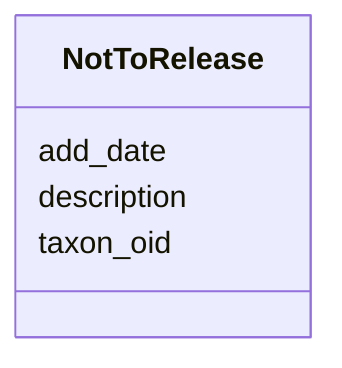

# Class: NotToRelease 


URI: [img_sub:NotToRelease](https://w3id.org/jgi/img_sub/NotToRelease)





<!-- no inheritance hierarchy -->


## Slots

| Name | Cardinality and Range | Description | Inheritance |
| ---  | --- | --- | --- |
| [taxon_oid](taxon_oid.md) | 0..1 <br/> [Integer](Integer.md) |  | direct |
| [description](description.md) | 0..1 <br/> [String](String.md) |  | direct |
| [add_date](add_date.md) | 0..1 <br/> [Datetime](Datetime.md) |  | direct |


## Identifier and Mapping Information


### Schema Source


* from schema: https://w3id.org/jgi/img_sub


## Mappings

| Mapping Type | Mapped Value |
| ---  | ---  |
| self | img_sub:NotToRelease |
| native | img_sub:NotToRelease |


## LinkML Source

<!-- TODO: investigate https://stackoverflow.com/questions/37606292/how-to-create-tabbed-code-blocks-in-mkdocs-or-sphinx -->

### Direct

<details>
```yaml
name: not_to_release
from_schema: https://w3id.org/jgi/img_sub
attributes:
  taxon_oid:
    name: taxon_oid
    from_schema: https://w3id.org/jgi/img_sub
    domain_of:
    - myimg_bio_cluster_np
    - not_to_release
    - taxon_gene_info
    - taxon_history
    - taxon_scaffold_info
    range: integer
    required: false
  description:
    name: description
    from_schema: https://w3id.org/jgi/img_sub
    domain_of:
    - img_group_news
    - mygene
    - not_to_release
    - submission_proc_stats
    range: string
    required: false
  add_date:
    name: add_date
    from_schema: https://w3id.org/jgi/img_sub
    domain_of:
    - contact
    - img_group
    - img_group_news
    - mygene
    - not_to_release
    - rnaseq_notify
    range: datetime
    required: false

```
</details>

### Induced

<details>
```yaml
name: not_to_release
from_schema: https://w3id.org/jgi/img_sub
attributes:
  taxon_oid:
    name: taxon_oid
    from_schema: https://w3id.org/jgi/img_sub
    alias: taxon_oid
    owner: not_to_release
    domain_of:
    - myimg_bio_cluster_np
    - not_to_release
    - taxon_gene_info
    - taxon_history
    - taxon_scaffold_info
    range: integer
    required: false
  description:
    name: description
    from_schema: https://w3id.org/jgi/img_sub
    alias: description
    owner: not_to_release
    domain_of:
    - img_group_news
    - mygene
    - not_to_release
    - submission_proc_stats
    range: string
    required: false
  add_date:
    name: add_date
    from_schema: https://w3id.org/jgi/img_sub
    alias: add_date
    owner: not_to_release
    domain_of:
    - contact
    - img_group
    - img_group_news
    - mygene
    - not_to_release
    - rnaseq_notify
    range: datetime
    required: false

```
</details>