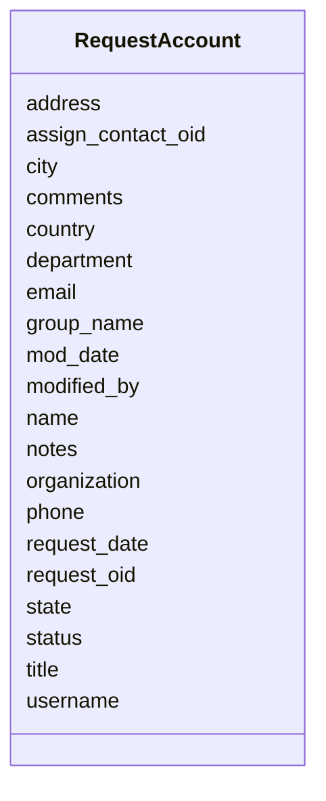

# Class: RequestAccount 


URI: [img_sub:RequestAccount](https://w3id.org/jgi/img_sub/RequestAccount)





<!-- no inheritance hierarchy -->


## Slots

| Name | Cardinality and Range | Description | Inheritance |
| ---  | --- | --- | --- |
| [request_oid](request_oid.md) | 0..1 <br/> [Integer](Integer.md) |  | direct |
| [username](username.md) | 0..1 <br/> [String](String.md) |  | direct |
| [group_name](group_name.md) | 0..1 <br/> [String](String.md) |  | direct |
| [name](name.md) | 0..1 <br/> [String](String.md) |  | direct |
| [title](title.md) | 0..1 <br/> [String](String.md) |  | direct |
| [department](department.md) | 0..1 <br/> [String](String.md) |  | direct |
| [email](email.md) | 0..1 <br/> [String](String.md) |  | direct |
| [phone](phone.md) | 0..1 <br/> [String](String.md) |  | direct |
| [organization](organization.md) | 0..1 <br/> [String](String.md) |  | direct |
| [address](address.md) | 0..1 <br/> [String](String.md) |  | direct |
| [city](city.md) | 0..1 <br/> [String](String.md) |  | direct |
| [state](state.md) | 0..1 <br/> [String](String.md) |  | direct |
| [country](country.md) | 0..1 <br/> [String](String.md) |  | direct |
| [comments](comments.md) | 0..1 <br/> [String](String.md) |  | direct |
| [notes](notes.md) | 0..1 <br/> [String](String.md) |  | direct |
| [status](status.md) | 0..1 <br/> [String](String.md) |  | direct |
| [request_date](request_date.md) | 0..1 <br/> [Datetime](Datetime.md) |  | direct |
| [mod_date](mod_date.md) | 0..1 <br/> [Datetime](Datetime.md) |  | direct |
| [modified_by](modified_by.md) | 0..1 <br/> [Integer](Integer.md) |  | direct |
| [assign_contact_oid](assign_contact_oid.md) | 0..1 <br/> [Integer](Integer.md) |  | direct |


## Identifier and Mapping Information


### Schema Source


* from schema: https://w3id.org/jgi/img_sub


## Mappings

| Mapping Type | Mapped Value |
| ---  | ---  |
| self | img_sub:RequestAccount |
| native | img_sub:RequestAccount |


## LinkML Source

<!-- TODO: investigate https://stackoverflow.com/questions/37606292/how-to-create-tabbed-code-blocks-in-mkdocs-or-sphinx -->

### Direct

<details>
```yaml
name: request_account
from_schema: https://w3id.org/jgi/img_sub
attributes:
  request_oid:
    name: request_oid
    from_schema: https://w3id.org/jgi/img_sub
    rank: 1000
    domain_of:
    - request_account
    range: integer
    required: false
  username:
    name: username
    from_schema: https://w3id.org/jgi/img_sub
    domain_of:
    - contact
    - request_account
    - submission_history
    range: string
    required: false
  group_name:
    name: group_name
    from_schema: https://w3id.org/jgi/img_sub
    domain_of:
    - img_group
    - request_account
    range: string
    required: false
  name:
    name: name
    from_schema: https://w3id.org/jgi/img_sub
    domain_of:
    - contact
    - request_account
    range: string
    required: false
  title:
    name: title
    from_schema: https://w3id.org/jgi/img_sub
    domain_of:
    - contact
    - img_group_news
    - request_account
    range: string
    required: false
  department:
    name: department
    from_schema: https://w3id.org/jgi/img_sub
    domain_of:
    - contact
    - request_account
    range: string
    required: false
  email:
    name: email
    from_schema: https://w3id.org/jgi/img_sub
    domain_of:
    - contact
    - request_account
    range: string
    required: false
  phone:
    name: phone
    from_schema: https://w3id.org/jgi/img_sub
    domain_of:
    - contact
    - request_account
    range: string
    required: false
  organization:
    name: organization
    from_schema: https://w3id.org/jgi/img_sub
    domain_of:
    - contact
    - request_account
    range: string
    required: false
  address:
    name: address
    from_schema: https://w3id.org/jgi/img_sub
    domain_of:
    - contact
    - request_account
    range: string
    required: false
  city:
    name: city
    from_schema: https://w3id.org/jgi/img_sub
    domain_of:
    - contact
    - request_account
    range: string
    required: false
  state:
    name: state
    from_schema: https://w3id.org/jgi/img_sub
    domain_of:
    - contact
    - request_account
    range: string
    required: false
  country:
    name: country
    from_schema: https://w3id.org/jgi/img_sub
    domain_of:
    - contact
    - request_account
    range: string
    required: false
  comments:
    name: comments
    from_schema: https://w3id.org/jgi/img_sub
    domain_of:
    - contact
    - img_group
    - myimg_bio_cluster_np
    - request_account
    - submission
    - submission_history
    - submission_proc_steps
    range: string
    required: false
  notes:
    name: notes
    from_schema: https://w3id.org/jgi/img_sub
    domain_of:
    - announcement
    - gene_myimg_functions
    - request_account
    range: string
    required: false
  status:
    name: status
    from_schema: https://w3id.org/jgi/img_sub
    domain_of:
    - merfs_aggregate_file_size
    - request_account
    - submission
    - submission_history
    range: string
    required: false
  request_date:
    name: request_date
    from_schema: https://w3id.org/jgi/img_sub
    rank: 1000
    domain_of:
    - request_account
    range: datetime
    required: false
  mod_date:
    name: mod_date
    from_schema: https://w3id.org/jgi/img_sub
    domain_of:
    - announcement
    - gene_myimg_enzymes
    - gene_myimg_functions
    - img_group_news
    - mygene
    - myimg_bio_cluster_np
    - request_account
    - submission
    - submission_history
    - taxon_history
    range: datetime
    required: false
  modified_by:
    name: modified_by
    from_schema: https://w3id.org/jgi/img_sub
    domain_of:
    - announcement
    - gene_myimg_enzymes
    - gene_myimg_functions
    - mygene
    - myimg_bio_cluster_np
    - request_account
    - submission
    - submission_history
    - taxon_history
    range: integer
    required: false
  assign_contact_oid:
    name: assign_contact_oid
    from_schema: https://w3id.org/jgi/img_sub
    rank: 1000
    domain_of:
    - request_account
    range: integer
    required: false

```
</details>

### Induced

<details>
```yaml
name: request_account
from_schema: https://w3id.org/jgi/img_sub
attributes:
  request_oid:
    name: request_oid
    from_schema: https://w3id.org/jgi/img_sub
    rank: 1000
    alias: request_oid
    owner: request_account
    domain_of:
    - request_account
    range: integer
    required: false
  username:
    name: username
    from_schema: https://w3id.org/jgi/img_sub
    alias: username
    owner: request_account
    domain_of:
    - contact
    - request_account
    - submission_history
    range: string
    required: false
  group_name:
    name: group_name
    from_schema: https://w3id.org/jgi/img_sub
    alias: group_name
    owner: request_account
    domain_of:
    - img_group
    - request_account
    range: string
    required: false
  name:
    name: name
    from_schema: https://w3id.org/jgi/img_sub
    alias: name
    owner: request_account
    domain_of:
    - contact
    - request_account
    range: string
    required: false
  title:
    name: title
    from_schema: https://w3id.org/jgi/img_sub
    alias: title
    owner: request_account
    domain_of:
    - contact
    - img_group_news
    - request_account
    range: string
    required: false
  department:
    name: department
    from_schema: https://w3id.org/jgi/img_sub
    alias: department
    owner: request_account
    domain_of:
    - contact
    - request_account
    range: string
    required: false
  email:
    name: email
    from_schema: https://w3id.org/jgi/img_sub
    alias: email
    owner: request_account
    domain_of:
    - contact
    - request_account
    range: string
    required: false
  phone:
    name: phone
    from_schema: https://w3id.org/jgi/img_sub
    alias: phone
    owner: request_account
    domain_of:
    - contact
    - request_account
    range: string
    required: false
  organization:
    name: organization
    from_schema: https://w3id.org/jgi/img_sub
    alias: organization
    owner: request_account
    domain_of:
    - contact
    - request_account
    range: string
    required: false
  address:
    name: address
    from_schema: https://w3id.org/jgi/img_sub
    alias: address
    owner: request_account
    domain_of:
    - contact
    - request_account
    range: string
    required: false
  city:
    name: city
    from_schema: https://w3id.org/jgi/img_sub
    alias: city
    owner: request_account
    domain_of:
    - contact
    - request_account
    range: string
    required: false
  state:
    name: state
    from_schema: https://w3id.org/jgi/img_sub
    alias: state
    owner: request_account
    domain_of:
    - contact
    - request_account
    range: string
    required: false
  country:
    name: country
    from_schema: https://w3id.org/jgi/img_sub
    alias: country
    owner: request_account
    domain_of:
    - contact
    - request_account
    range: string
    required: false
  comments:
    name: comments
    from_schema: https://w3id.org/jgi/img_sub
    alias: comments
    owner: request_account
    domain_of:
    - contact
    - img_group
    - myimg_bio_cluster_np
    - request_account
    - submission
    - submission_history
    - submission_proc_steps
    range: string
    required: false
  notes:
    name: notes
    from_schema: https://w3id.org/jgi/img_sub
    alias: notes
    owner: request_account
    domain_of:
    - announcement
    - gene_myimg_functions
    - request_account
    range: string
    required: false
  status:
    name: status
    from_schema: https://w3id.org/jgi/img_sub
    alias: status
    owner: request_account
    domain_of:
    - merfs_aggregate_file_size
    - request_account
    - submission
    - submission_history
    range: string
    required: false
  request_date:
    name: request_date
    from_schema: https://w3id.org/jgi/img_sub
    rank: 1000
    alias: request_date
    owner: request_account
    domain_of:
    - request_account
    range: datetime
    required: false
  mod_date:
    name: mod_date
    from_schema: https://w3id.org/jgi/img_sub
    alias: mod_date
    owner: request_account
    domain_of:
    - announcement
    - gene_myimg_enzymes
    - gene_myimg_functions
    - img_group_news
    - mygene
    - myimg_bio_cluster_np
    - request_account
    - submission
    - submission_history
    - taxon_history
    range: datetime
    required: false
  modified_by:
    name: modified_by
    from_schema: https://w3id.org/jgi/img_sub
    alias: modified_by
    owner: request_account
    domain_of:
    - announcement
    - gene_myimg_enzymes
    - gene_myimg_functions
    - mygene
    - myimg_bio_cluster_np
    - request_account
    - submission
    - submission_history
    - taxon_history
    range: integer
    required: false
  assign_contact_oid:
    name: assign_contact_oid
    from_schema: https://w3id.org/jgi/img_sub
    rank: 1000
    alias: assign_contact_oid
    owner: request_account
    domain_of:
    - request_account
    range: integer
    required: false

```
</details>