# Class: Submission 


URI: [img_sub:Submission](https://w3id.org/jgi/img_sub/Submission)

```mermaid
 classDiagram
    class Submission
    click Submission href "../Submission/"
      Submission : add_to_portal
        
      Submission : admin_notes
        
      Submission : agp_file
        
      Submission : all_reads
        
      Submission : analysis_project_id
        
      Submission : annotation_version
        
      Submission : approval_date
        
      Submission : approval_status
        
      Submission : approved_by
        
      Submission : assembled_seq_file
        
      Submission : assembler_used
        
      Submission : assembly_qc_report
        
      Submission : assembly_qd_report
        
      Submission : bam_file
        
      Submission : batch_id
        
      Submission : bin_method
        
      Submission : binning_file
        
      Submission : cluster_seq
        
      Submission : comments
        
      Submission : compute_platform
        
      Submission : contact
        
      Submission : contact_email
        
      Submission : contigs_file
        
      Submission : database
        
      Submission : embargo_days
        
      Submission : error_file
        
      Submission : error_msg
        
      Submission : exp_experiment_id
        
      Submission : file_location
        
      Submission : gbk_project_id
        
      Submission : genbank_file
        
      Submission : genbank_id
        
      Submission : gene_calling_flag
        
      Submission : genome_completion
        
      Submission : gff_file
        
      Submission : h5_files
        
      Submission : img_beehive
        
      Submission : img_dev_flag
        
      Submission : img_ec_flag
        
      Submission : img_handler
        
      Submission : img_product_flag
        
      Submission : img_taxon_oid
        
      Submission : img_term_transfer_date
        
      Submission : in_file
        
      Submission : info_file
        
      Submission : is_contaminated
        
      Submission : is_img_public
        
      Submission : is_jgi
        
      Submission : jamo_archive
        
      Submission : jat_key_id
        
      Submission : jgi_rnd_flag
        
      Submission : library_info
        
      Submission : loaded_into_img
        
      Submission : met_processing
        
      Submission : mod_date
        
      Submission : modified_by
        
      Submission : mol_topology
        
      Submission : names_map_file
        
      Submission : pass_to_qaqc
        
      Submission : passed_quality_chk
        
      Submission : permute
        
      Submission : portal_release_date
        
      Submission : portal_url
        
      Submission : prev_submission_id
        
      Submission : project_info
        
      Submission : protein_faa_file
        
      Submission : pushed_to_met_ws
        
      Submission : quality_based_trim
        
      Submission : reads_for_assembly
        
      Submission : reference_sub_id
        
      Submission : refseq_project_id
        
      Submission : remove_duplicate_flag
        
      Submission : replace_taxon_oid
        
      Submission : result_exp_file
        
      Submission : result_wig_directory
        
      Submission : rqc_assembly_id
        
      Submission : sample_oid
        
      Submission : scaffold_count
        
      Submission : send_email
        
      Submission : seq_coverage_file
        
      Submission : seq_status
        
      Submission : set_embargo_date
        
      Submission : singlets_file
        
      Submission : source
        
      Submission : species_code
        
      Submission : stats_file
        
      Submission : status
        
      Submission : submission_date
        
      Submission : submission_id
        
      Submission : subtitle
        
      Submission : unassembled_454_file
        
      Submission : unassembled_454_quality_trim
        
      Submission : unassembled_454_trim_method
        
      Submission : unassembled_illum_quality_trim
        
      Submission : unassembled_illum_trim_method
        
      Submission : unassembled_illumina_file
        
      Submission : unassembled_pacbio_file
        
      
```





<!-- no inheritance hierarchy -->


## Slots

| Name | Cardinality and Range | Description | Inheritance |
| ---  | --- | --- | --- |
| [database](database.md) | 0..1 <br/> [String](String.md) |  | direct |
| [contact](contact.md) | 0..1 <br/> [Integer](Integer.md) |  | direct |
| [project_info](project_info.md) | 0..1 <br/> [Integer](Integer.md) |  | direct |
| [submission_date](submission_date.md) | 0..1 <br/> [Datetime](Datetime.md) |  | direct |
| [genbank_file](genbank_file.md) | 0..1 <br/> [String](String.md) |  | direct |
| [img_ec_flag](img_ec_flag.md) | 0..1 <br/> [String](String.md) |  | direct |
| [img_product_flag](img_product_flag.md) | 0..1 <br/> [String](String.md) |  | direct |
| [species_code](species_code.md) | 0..1 <br/> [String](String.md) |  | direct |
| [mod_date](mod_date.md) | 0..1 <br/> [Datetime](Datetime.md) |  | direct |
| [modified_by](modified_by.md) | 0..1 <br/> [Integer](Integer.md) |  | direct |
| [comments](comments.md) | 0..1 <br/> [String](String.md) |  | direct |
| [scaffold_count](scaffold_count.md) | 0..1 <br/> [Integer](Integer.md) |  | direct |
| [error_file](error_file.md) | 0..1 <br/> [String](String.md) |  | direct |
| [status](status.md) | 0..1 <br/> [Integer](Integer.md) |  | direct |
| [gene_calling_flag](gene_calling_flag.md) | 0..1 <br/> [String](String.md) |  | direct |
| [file_location](file_location.md) | 0..1 <br/> [String](String.md) |  | direct |
| [sample_oid](sample_oid.md) | 0..1 <br/> [Integer](Integer.md) |  | direct |
| [submission_id](submission_id.md) | 0..1 <br/> [Integer](Integer.md) |  | direct |
| [contigs_file](contigs_file.md) | 0..1 <br/> [String](String.md) |  | direct |
| [singlets_file](singlets_file.md) | 0..1 <br/> [String](String.md) |  | direct |
| [binning_file](binning_file.md) | 0..1 <br/> [String](String.md) |  | direct |
| [is_img_public](is_img_public.md) | 0..1 <br/> [String](String.md) |  | direct |
| [img_taxon_oid](img_taxon_oid.md) | 0..1 <br/> [Integer](Integer.md) |  | direct |
| [admin_notes](admin_notes.md) | 0..1 <br/> [String](String.md) |  | direct |
| [mol_topology](mol_topology.md) | 0..1 <br/> [String](String.md) |  | direct |
| [approval_status](approval_status.md) | 0..1 <br/> [String](String.md) |  | direct |
| [approved_by](approved_by.md) | 0..1 <br/> [Integer](Integer.md) |  | direct |
| [replace_taxon_oid](replace_taxon_oid.md) | 0..1 <br/> [Integer](Integer.md) |  | direct |
| [error_msg](error_msg.md) | 0..1 <br/> [String](String.md) |  | direct |
| [img_dev_flag](img_dev_flag.md) | 0..1 <br/> [String](String.md) |  | direct |
| [remove_duplicate_flag](remove_duplicate_flag.md) | 0..1 <br/> [String](String.md) |  | direct |
| [seq_status](seq_status.md) | 0..1 <br/> [String](String.md) |  | direct |
| [subtitle](subtitle.md) | 0..1 <br/> [String](String.md) |  | direct |
| [bin_method](bin_method.md) | 0..1 <br/> [String](String.md) |  | direct |
| [stats_file](stats_file.md) | 0..1 <br/> [String](String.md) |  | direct |
| [assembled_seq_file](assembled_seq_file.md) | 0..1 <br/> [String](String.md) |  | direct |
| [assembler_used](assembler_used.md) | 0..1 <br/> [String](String.md) |  | direct |
| [reads_for_assembly](reads_for_assembly.md) | 0..1 <br/> [String](String.md) |  | direct |
| [unassembled_454_file](unassembled_454_file.md) | 0..1 <br/> [String](String.md) |  | direct |
| [unassembled_454_quality_trim](unassembled_454_quality_trim.md) | 0..1 <br/> [String](String.md) |  | direct |
| [unassembled_454_trim_method](unassembled_454_trim_method.md) | 0..1 <br/> [String](String.md) |  | direct |
| [unassembled_illumina_file](unassembled_illumina_file.md) | 0..1 <br/> [String](String.md) |  | direct |
| [cluster_seq](cluster_seq.md) | 0..1 <br/> [String](String.md) |  | direct |
| [quality_based_trim](quality_based_trim.md) | 0..1 <br/> [String](String.md) |  | direct |
| [seq_coverage_file](seq_coverage_file.md) | 0..1 <br/> [String](String.md) |  | direct |
| [unassembled_illum_quality_trim](unassembled_illum_quality_trim.md) | 0..1 <br/> [String](String.md) |  | direct |
| [unassembled_illum_trim_method](unassembled_illum_trim_method.md) | 0..1 <br/> [String](String.md) |  | direct |
| [loaded_into_img](loaded_into_img.md) | 0..1 <br/> [String](String.md) |  | direct |
| [in_file](in_file.md) | 0..1 <br/> [String](String.md) |  | direct |
| [permute](permute.md) | 0..1 <br/> [String](String.md) |  | direct |
| [all_reads](all_reads.md) | 0..1 <br/> [String](String.md) |  | direct |
| [assembly_qd_report](assembly_qd_report.md) | 0..1 <br/> [String](String.md) |  | direct |
| [assembly_qc_report](assembly_qc_report.md) | 0..1 <br/> [String](String.md) |  | direct |
| [info_file](info_file.md) | 0..1 <br/> [String](String.md) |  | direct |
| [agp_file](agp_file.md) | 0..1 <br/> [String](String.md) |  | direct |
| [add_to_portal](add_to_portal.md) | 0..1 <br/> [String](String.md) |  | direct |
| [portal_url](portal_url.md) | 0..1 <br/> [String](String.md) |  | direct |
| [portal_release_date](portal_release_date.md) | 0..1 <br/> [Datetime](Datetime.md) |  | direct |
| [names_map_file](names_map_file.md) | 0..1 <br/> [String](String.md) |  | direct |
| [batch_id](batch_id.md) | 0..1 <br/> [Integer](Integer.md) |  | direct |
| [prev_submission_id](prev_submission_id.md) | 0..1 <br/> [Integer](Integer.md) |  | direct |
| [embargo_days](embargo_days.md) | 0..1 <br/> [Integer](Integer.md) |  | direct |
| [refseq_project_id](refseq_project_id.md) | 0..1 <br/> [Integer](Integer.md) |  | direct |
| [gbk_project_id](gbk_project_id.md) | 0..1 <br/> [Integer](Integer.md) |  | direct |
| [gff_file](gff_file.md) | 0..1 <br/> [String](String.md) |  | direct |
| [approval_date](approval_date.md) | 0..1 <br/> [Datetime](Datetime.md) |  | direct |
| [bam_file](bam_file.md) | 0..1 <br/> [String](String.md) |  | direct |
| [result_wig_directory](result_wig_directory.md) | 0..1 <br/> [String](String.md) |  | direct |
| [result_exp_file](result_exp_file.md) | 0..1 <br/> [String](String.md) |  | direct |
| [reference_sub_id](reference_sub_id.md) | 0..1 <br/> [Integer](Integer.md) |  | direct |
| [exp_experiment_id](exp_experiment_id.md) | 0..1 <br/> [Integer](Integer.md) |  | direct |
| [library_info](library_info.md) | 0..1 <br/> [String](String.md) |  | direct |
| [genbank_id](genbank_id.md) | 0..1 <br/> [String](String.md) |  | direct |
| [h5_files](h5_files.md) | 0..1 <br/> [String](String.md) |  | direct |
| [rqc_assembly_id](rqc_assembly_id.md) | 0..1 <br/> [Integer](Integer.md) |  | direct |
| [unassembled_pacbio_file](unassembled_pacbio_file.md) | 0..1 <br/> [String](String.md) |  | direct |
| [jat_key_id](jat_key_id.md) | 0..1 <br/> [String](String.md) |  | direct |
| [analysis_project_id](analysis_project_id.md) | 0..1 <br/> [String](String.md) |  | direct |
| [passed_quality_chk](passed_quality_chk.md) | 0..1 <br/> [String](String.md) |  | direct |
| [is_jgi](is_jgi.md) | 0..1 <br/> [String](String.md) |  | direct |
| [contact_email](contact_email.md) | 0..1 <br/> [String](String.md) |  | direct |
| [met_processing](met_processing.md) | 0..1 <br/> [String](String.md) |  | direct |
| [set_embargo_date](set_embargo_date.md) | 0..1 <br/> [String](String.md) |  | direct |
| [pushed_to_met_ws](pushed_to_met_ws.md) | 0..1 <br/> [String](String.md) |  | direct |
| [img_term_transfer_date](img_term_transfer_date.md) | 0..1 <br/> [Datetime](Datetime.md) |  | direct |
| [is_contaminated](is_contaminated.md) | 0..1 <br/> [String](String.md) |  | direct |
| [genome_completion](genome_completion.md) | 0..1 <br/> [Float](Float.md) |  | direct |
| [img_handler](img_handler.md) | 0..1 <br/> [String](String.md) |  | direct |
| [jgi_rnd_flag](jgi_rnd_flag.md) | 0..1 <br/> [String](String.md) |  | direct |
| [pass_to_qaqc](pass_to_qaqc.md) | 0..1 <br/> [String](String.md) |  | direct |
| [protein_faa_file](protein_faa_file.md) | 0..1 <br/> [String](String.md) |  | direct |
| [compute_platform](compute_platform.md) | 0..1 <br/> [String](String.md) |  | direct |
| [source](source.md) | 0..1 <br/> [String](String.md) |  | direct |
| [send_email](send_email.md) | 0..1 <br/> [String](String.md) |  | direct |
| [jamo_archive](jamo_archive.md) | 0..1 <br/> [String](String.md) |  | direct |
| [img_beehive](img_beehive.md) | 0..1 <br/> [String](String.md) |  | direct |
| [annotation_version](annotation_version.md) | 0..1 <br/> [String](String.md) |  | direct |


## Identifier and Mapping Information


### Schema Source


* from schema: https://w3id.org/jgi/img_sub


## Mappings

| Mapping Type | Mapped Value |
| ---  | ---  |
| self | img_sub:Submission |
| native | img_sub:Submission |


## LinkML Source

<!-- TODO: investigate https://stackoverflow.com/questions/37606292/how-to-create-tabbed-code-blocks-in-mkdocs-or-sphinx -->

### Direct

<details>
```yaml
name: submission
from_schema: https://w3id.org/jgi/img_sub
attributes:
  database:
    name: database
    from_schema: https://w3id.org/jgi/img_sub
    domain_of:
    - batch
    - rnaseq_notify
    - submission
    range: string
    required: false
  contact:
    name: contact
    from_schema: https://w3id.org/jgi/img_sub
    rank: 1000
    domain_of:
    - submission
    range: integer
    required: false
  project_info:
    name: project_info
    from_schema: https://w3id.org/jgi/img_sub
    rank: 1000
    domain_of:
    - submission
    range: integer
    required: false
  submission_date:
    name: submission_date
    from_schema: https://w3id.org/jgi/img_sub
    domain_of:
    - rnaseq_notify
    - submission
    range: datetime
    required: false
  genbank_file:
    name: genbank_file
    from_schema: https://w3id.org/jgi/img_sub
    rank: 1000
    domain_of:
    - submission
    range: string
    required: false
  img_ec_flag:
    name: img_ec_flag
    from_schema: https://w3id.org/jgi/img_sub
    rank: 1000
    domain_of:
    - submission
    range: string
    required: false
  img_product_flag:
    name: img_product_flag
    from_schema: https://w3id.org/jgi/img_sub
    rank: 1000
    domain_of:
    - submission
    range: string
    required: false
  species_code:
    name: species_code
    from_schema: https://w3id.org/jgi/img_sub
    rank: 1000
    domain_of:
    - submission
    range: string
    required: false
  mod_date:
    name: mod_date
    from_schema: https://w3id.org/jgi/img_sub
    domain_of:
    - announcement
    - gene_myimg_enzymes
    - gene_myimg_functions
    - img_group_news
    - mygene
    - myimg_bio_cluster_np
    - request_account
    - submission
    - submission_history
    - taxon_history
    range: datetime
    required: false
  modified_by:
    name: modified_by
    from_schema: https://w3id.org/jgi/img_sub
    domain_of:
    - announcement
    - gene_myimg_enzymes
    - gene_myimg_functions
    - mygene
    - myimg_bio_cluster_np
    - request_account
    - submission
    - submission_history
    - taxon_history
    range: integer
    required: false
  comments:
    name: comments
    from_schema: https://w3id.org/jgi/img_sub
    domain_of:
    - contact
    - img_group
    - myimg_bio_cluster_np
    - request_account
    - submission
    - submission_history
    - submission_proc_steps
    range: string
    required: false
  scaffold_count:
    name: scaffold_count
    from_schema: https://w3id.org/jgi/img_sub
    rank: 1000
    domain_of:
    - submission
    range: integer
    required: false
  error_file:
    name: error_file
    from_schema: https://w3id.org/jgi/img_sub
    rank: 1000
    domain_of:
    - submission
    range: string
    required: false
  status:
    name: status
    from_schema: https://w3id.org/jgi/img_sub
    domain_of:
    - merfs_aggregate_file_size
    - request_account
    - submission
    - submission_history
    range: integer
    required: false
  gene_calling_flag:
    name: gene_calling_flag
    from_schema: https://w3id.org/jgi/img_sub
    rank: 1000
    domain_of:
    - submission
    range: string
    required: false
  file_location:
    name: file_location
    from_schema: https://w3id.org/jgi/img_sub
    rank: 1000
    domain_of:
    - submission
    range: string
    required: false
  sample_oid:
    name: sample_oid
    from_schema: https://w3id.org/jgi/img_sub
    rank: 1000
    domain_of:
    - submission
    - submission_samples
    range: integer
    required: false
  submission_id:
    name: submission_id
    from_schema: https://w3id.org/jgi/img_sub
    domain_of:
    - annotation_contigs_proteins_counts
    - annotation_job_sbatch_args
    - annotation_job_stats
    - annotation_step_stats
    - merfs_aggregate_file_size
    - rnaseq_notify
    - submission
    - submission_data_files
    - submission_data_files_dmpath
    - submission_history
    - submission_img_contacts
    - submission_proc_stats
    - submission_proc_steps
    - submission_reads_file
    - submission_samples
    range: integer
    required: false
  contigs_file:
    name: contigs_file
    from_schema: https://w3id.org/jgi/img_sub
    rank: 1000
    domain_of:
    - submission
    range: string
    required: false
  singlets_file:
    name: singlets_file
    from_schema: https://w3id.org/jgi/img_sub
    rank: 1000
    domain_of:
    - submission
    range: string
    required: false
  binning_file:
    name: binning_file
    from_schema: https://w3id.org/jgi/img_sub
    rank: 1000
    domain_of:
    - submission
    range: string
    required: false
  is_img_public:
    name: is_img_public
    from_schema: https://w3id.org/jgi/img_sub
    domain_of:
    - rnaseq_notify
    - submission
    range: string
    required: false
  img_taxon_oid:
    name: img_taxon_oid
    from_schema: https://w3id.org/jgi/img_sub
    rank: 1000
    domain_of:
    - submission
    range: integer
    required: false
  admin_notes:
    name: admin_notes
    from_schema: https://w3id.org/jgi/img_sub
    rank: 1000
    domain_of:
    - submission
    range: string
    required: false
  mol_topology:
    name: mol_topology
    from_schema: https://w3id.org/jgi/img_sub
    rank: 1000
    domain_of:
    - submission
    range: string
    required: false
  approval_status:
    name: approval_status
    from_schema: https://w3id.org/jgi/img_sub
    rank: 1000
    domain_of:
    - submission
    range: string
    required: false
  approved_by:
    name: approved_by
    from_schema: https://w3id.org/jgi/img_sub
    rank: 1000
    domain_of:
    - submission
    range: integer
    required: false
  replace_taxon_oid:
    name: replace_taxon_oid
    from_schema: https://w3id.org/jgi/img_sub
    rank: 1000
    domain_of:
    - submission
    range: integer
    required: false
  error_msg:
    name: error_msg
    from_schema: https://w3id.org/jgi/img_sub
    rank: 1000
    domain_of:
    - submission
    range: string
    required: false
  img_dev_flag:
    name: img_dev_flag
    from_schema: https://w3id.org/jgi/img_sub
    rank: 1000
    domain_of:
    - submission
    range: string
    required: false
  remove_duplicate_flag:
    name: remove_duplicate_flag
    from_schema: https://w3id.org/jgi/img_sub
    rank: 1000
    domain_of:
    - submission
    range: string
    required: false
  seq_status:
    name: seq_status
    from_schema: https://w3id.org/jgi/img_sub
    rank: 1000
    domain_of:
    - submission
    range: string
    required: false
  subtitle:
    name: subtitle
    from_schema: https://w3id.org/jgi/img_sub
    rank: 1000
    domain_of:
    - submission
    range: string
    required: false
  bin_method:
    name: bin_method
    from_schema: https://w3id.org/jgi/img_sub
    rank: 1000
    domain_of:
    - submission
    range: string
    required: false
  stats_file:
    name: stats_file
    from_schema: https://w3id.org/jgi/img_sub
    rank: 1000
    domain_of:
    - submission
    range: string
    required: false
  assembled_seq_file:
    name: assembled_seq_file
    from_schema: https://w3id.org/jgi/img_sub
    rank: 1000
    domain_of:
    - submission
    range: string
    required: false
  assembler_used:
    name: assembler_used
    from_schema: https://w3id.org/jgi/img_sub
    rank: 1000
    domain_of:
    - submission
    range: string
    required: false
  reads_for_assembly:
    name: reads_for_assembly
    from_schema: https://w3id.org/jgi/img_sub
    rank: 1000
    domain_of:
    - submission
    range: string
    required: false
  unassembled_454_file:
    name: unassembled_454_file
    from_schema: https://w3id.org/jgi/img_sub
    rank: 1000
    domain_of:
    - submission
    range: string
    required: false
  unassembled_454_quality_trim:
    name: unassembled_454_quality_trim
    from_schema: https://w3id.org/jgi/img_sub
    rank: 1000
    domain_of:
    - submission
    range: string
    required: false
  unassembled_454_trim_method:
    name: unassembled_454_trim_method
    from_schema: https://w3id.org/jgi/img_sub
    rank: 1000
    domain_of:
    - submission
    range: string
    required: false
  unassembled_illumina_file:
    name: unassembled_illumina_file
    from_schema: https://w3id.org/jgi/img_sub
    rank: 1000
    domain_of:
    - submission
    range: string
    required: false
  cluster_seq:
    name: cluster_seq
    from_schema: https://w3id.org/jgi/img_sub
    rank: 1000
    domain_of:
    - submission
    range: string
    required: false
  quality_based_trim:
    name: quality_based_trim
    from_schema: https://w3id.org/jgi/img_sub
    rank: 1000
    domain_of:
    - submission
    range: string
    required: false
  seq_coverage_file:
    name: seq_coverage_file
    from_schema: https://w3id.org/jgi/img_sub
    rank: 1000
    domain_of:
    - submission
    range: string
    required: false
  unassembled_illum_quality_trim:
    name: unassembled_illum_quality_trim
    from_schema: https://w3id.org/jgi/img_sub
    rank: 1000
    domain_of:
    - submission
    range: string
    required: false
  unassembled_illum_trim_method:
    name: unassembled_illum_trim_method
    from_schema: https://w3id.org/jgi/img_sub
    rank: 1000
    domain_of:
    - submission
    range: string
    required: false
  loaded_into_img:
    name: loaded_into_img
    from_schema: https://w3id.org/jgi/img_sub
    rank: 1000
    domain_of:
    - submission
    range: string
    required: false
  in_file:
    name: in_file
    from_schema: https://w3id.org/jgi/img_sub
    domain_of:
    - rnaseq_notify
    - submission
    range: string
    required: false
  permute:
    name: permute
    from_schema: https://w3id.org/jgi/img_sub
    rank: 1000
    domain_of:
    - submission
    range: string
    required: false
  all_reads:
    name: all_reads
    from_schema: https://w3id.org/jgi/img_sub
    rank: 1000
    domain_of:
    - submission
    range: string
    required: false
  assembly_qd_report:
    name: assembly_qd_report
    from_schema: https://w3id.org/jgi/img_sub
    rank: 1000
    domain_of:
    - submission
    range: string
    required: false
  assembly_qc_report:
    name: assembly_qc_report
    from_schema: https://w3id.org/jgi/img_sub
    rank: 1000
    domain_of:
    - submission
    range: string
    required: false
  info_file:
    name: info_file
    from_schema: https://w3id.org/jgi/img_sub
    rank: 1000
    domain_of:
    - submission
    range: string
    required: false
  agp_file:
    name: agp_file
    from_schema: https://w3id.org/jgi/img_sub
    rank: 1000
    domain_of:
    - submission
    range: string
    required: false
  add_to_portal:
    name: add_to_portal
    from_schema: https://w3id.org/jgi/img_sub
    rank: 1000
    domain_of:
    - submission
    range: string
    required: false
  portal_url:
    name: portal_url
    from_schema: https://w3id.org/jgi/img_sub
    rank: 1000
    domain_of:
    - submission
    range: string
    required: false
  portal_release_date:
    name: portal_release_date
    from_schema: https://w3id.org/jgi/img_sub
    rank: 1000
    domain_of:
    - submission
    range: datetime
    required: false
  names_map_file:
    name: names_map_file
    from_schema: https://w3id.org/jgi/img_sub
    rank: 1000
    domain_of:
    - submission
    range: string
    required: false
  batch_id:
    name: batch_id
    from_schema: https://w3id.org/jgi/img_sub
    domain_of:
    - batch
    - submission
    range: integer
    required: false
  prev_submission_id:
    name: prev_submission_id
    from_schema: https://w3id.org/jgi/img_sub
    rank: 1000
    domain_of:
    - submission
    range: integer
    required: false
  embargo_days:
    name: embargo_days
    from_schema: https://w3id.org/jgi/img_sub
    rank: 1000
    domain_of:
    - submission
    range: integer
    required: false
  refseq_project_id:
    name: refseq_project_id
    from_schema: https://w3id.org/jgi/img_sub
    rank: 1000
    domain_of:
    - submission
    range: integer
    required: false
  gbk_project_id:
    name: gbk_project_id
    from_schema: https://w3id.org/jgi/img_sub
    rank: 1000
    domain_of:
    - submission
    range: integer
    required: false
  gff_file:
    name: gff_file
    from_schema: https://w3id.org/jgi/img_sub
    rank: 1000
    domain_of:
    - submission
    range: string
    required: false
  approval_date:
    name: approval_date
    from_schema: https://w3id.org/jgi/img_sub
    rank: 1000
    domain_of:
    - submission
    range: datetime
    required: false
  bam_file:
    name: bam_file
    from_schema: https://w3id.org/jgi/img_sub
    rank: 1000
    domain_of:
    - submission
    range: string
    required: false
  result_wig_directory:
    name: result_wig_directory
    from_schema: https://w3id.org/jgi/img_sub
    rank: 1000
    domain_of:
    - submission
    range: string
    required: false
  result_exp_file:
    name: result_exp_file
    from_schema: https://w3id.org/jgi/img_sub
    rank: 1000
    domain_of:
    - submission
    range: string
    required: false
  reference_sub_id:
    name: reference_sub_id
    from_schema: https://w3id.org/jgi/img_sub
    rank: 1000
    domain_of:
    - submission
    range: integer
    required: false
  exp_experiment_id:
    name: exp_experiment_id
    from_schema: https://w3id.org/jgi/img_sub
    rank: 1000
    domain_of:
    - submission
    range: integer
    required: false
  library_info:
    name: library_info
    from_schema: https://w3id.org/jgi/img_sub
    rank: 1000
    domain_of:
    - submission
    range: string
    required: false
  genbank_id:
    name: genbank_id
    from_schema: https://w3id.org/jgi/img_sub
    rank: 1000
    domain_of:
    - submission
    range: string
    required: false
  h5_files:
    name: h5_files
    from_schema: https://w3id.org/jgi/img_sub
    rank: 1000
    domain_of:
    - submission
    range: string
    required: false
  rqc_assembly_id:
    name: rqc_assembly_id
    from_schema: https://w3id.org/jgi/img_sub
    rank: 1000
    domain_of:
    - submission
    range: integer
    required: false
  unassembled_pacbio_file:
    name: unassembled_pacbio_file
    from_schema: https://w3id.org/jgi/img_sub
    rank: 1000
    domain_of:
    - submission
    range: string
    required: false
  jat_key_id:
    name: jat_key_id
    from_schema: https://w3id.org/jgi/img_sub
    rank: 1000
    domain_of:
    - submission
    range: string
    required: false
  analysis_project_id:
    name: analysis_project_id
    from_schema: https://w3id.org/jgi/img_sub
    domain_of:
    - rnaseq_notify
    - submission
    range: string
    required: false
  passed_quality_chk:
    name: passed_quality_chk
    from_schema: https://w3id.org/jgi/img_sub
    rank: 1000
    domain_of:
    - submission
    range: string
    required: false
  is_jgi:
    name: is_jgi
    from_schema: https://w3id.org/jgi/img_sub
    rank: 1000
    domain_of:
    - submission
    range: string
    required: false
  contact_email:
    name: contact_email
    from_schema: https://w3id.org/jgi/img_sub
    rank: 1000
    domain_of:
    - submission
    range: string
    required: false
  met_processing:
    name: met_processing
    from_schema: https://w3id.org/jgi/img_sub
    rank: 1000
    domain_of:
    - submission
    range: string
    required: false
  set_embargo_date:
    name: set_embargo_date
    from_schema: https://w3id.org/jgi/img_sub
    rank: 1000
    domain_of:
    - submission
    range: string
    required: false
  pushed_to_met_ws:
    name: pushed_to_met_ws
    from_schema: https://w3id.org/jgi/img_sub
    rank: 1000
    domain_of:
    - submission
    range: string
    required: false
  img_term_transfer_date:
    name: img_term_transfer_date
    from_schema: https://w3id.org/jgi/img_sub
    rank: 1000
    domain_of:
    - submission
    range: datetime
    required: false
  is_contaminated:
    name: is_contaminated
    from_schema: https://w3id.org/jgi/img_sub
    rank: 1000
    domain_of:
    - submission
    range: string
    required: false
  genome_completion:
    name: genome_completion
    from_schema: https://w3id.org/jgi/img_sub
    rank: 1000
    domain_of:
    - submission
    range: float
    required: false
  img_handler:
    name: img_handler
    from_schema: https://w3id.org/jgi/img_sub
    rank: 1000
    domain_of:
    - submission
    range: string
    required: false
  jgi_rnd_flag:
    name: jgi_rnd_flag
    from_schema: https://w3id.org/jgi/img_sub
    domain_of:
    - rnaseq_notify
    - submission
    range: string
    required: false
  pass_to_qaqc:
    name: pass_to_qaqc
    from_schema: https://w3id.org/jgi/img_sub
    rank: 1000
    domain_of:
    - submission
    range: string
    required: false
  protein_faa_file:
    name: protein_faa_file
    from_schema: https://w3id.org/jgi/img_sub
    rank: 1000
    domain_of:
    - submission
    range: string
    required: false
  compute_platform:
    name: compute_platform
    from_schema: https://w3id.org/jgi/img_sub
    rank: 1000
    domain_of:
    - submission
    range: string
    required: false
  source:
    name: source
    from_schema: https://w3id.org/jgi/img_sub
    rank: 1000
    domain_of:
    - submission
    range: string
    required: false
  send_email:
    name: send_email
    from_schema: https://w3id.org/jgi/img_sub
    rank: 1000
    domain_of:
    - submission
    range: string
    required: false
  jamo_archive:
    name: jamo_archive
    from_schema: https://w3id.org/jgi/img_sub
    rank: 1000
    domain_of:
    - submission
    range: string
    required: false
  img_beehive:
    name: img_beehive
    from_schema: https://w3id.org/jgi/img_sub
    rank: 1000
    domain_of:
    - submission
    range: string
    required: false
  annotation_version:
    name: annotation_version
    from_schema: https://w3id.org/jgi/img_sub
    rank: 1000
    domain_of:
    - submission
    range: string
    required: false

```
</details>

### Induced

<details>
```yaml
name: submission
from_schema: https://w3id.org/jgi/img_sub
attributes:
  database:
    name: database
    from_schema: https://w3id.org/jgi/img_sub
    alias: database
    owner: submission
    domain_of:
    - batch
    - rnaseq_notify
    - submission
    range: string
    required: false
  contact:
    name: contact
    from_schema: https://w3id.org/jgi/img_sub
    rank: 1000
    alias: contact
    owner: submission
    domain_of:
    - submission
    range: integer
    required: false
  project_info:
    name: project_info
    from_schema: https://w3id.org/jgi/img_sub
    rank: 1000
    alias: project_info
    owner: submission
    domain_of:
    - submission
    range: integer
    required: false
  submission_date:
    name: submission_date
    from_schema: https://w3id.org/jgi/img_sub
    alias: submission_date
    owner: submission
    domain_of:
    - rnaseq_notify
    - submission
    range: datetime
    required: false
  genbank_file:
    name: genbank_file
    from_schema: https://w3id.org/jgi/img_sub
    rank: 1000
    alias: genbank_file
    owner: submission
    domain_of:
    - submission
    range: string
    required: false
  img_ec_flag:
    name: img_ec_flag
    from_schema: https://w3id.org/jgi/img_sub
    rank: 1000
    alias: img_ec_flag
    owner: submission
    domain_of:
    - submission
    range: string
    required: false
  img_product_flag:
    name: img_product_flag
    from_schema: https://w3id.org/jgi/img_sub
    rank: 1000
    alias: img_product_flag
    owner: submission
    domain_of:
    - submission
    range: string
    required: false
  species_code:
    name: species_code
    from_schema: https://w3id.org/jgi/img_sub
    rank: 1000
    alias: species_code
    owner: submission
    domain_of:
    - submission
    range: string
    required: false
  mod_date:
    name: mod_date
    from_schema: https://w3id.org/jgi/img_sub
    alias: mod_date
    owner: submission
    domain_of:
    - announcement
    - gene_myimg_enzymes
    - gene_myimg_functions
    - img_group_news
    - mygene
    - myimg_bio_cluster_np
    - request_account
    - submission
    - submission_history
    - taxon_history
    range: datetime
    required: false
  modified_by:
    name: modified_by
    from_schema: https://w3id.org/jgi/img_sub
    alias: modified_by
    owner: submission
    domain_of:
    - announcement
    - gene_myimg_enzymes
    - gene_myimg_functions
    - mygene
    - myimg_bio_cluster_np
    - request_account
    - submission
    - submission_history
    - taxon_history
    range: integer
    required: false
  comments:
    name: comments
    from_schema: https://w3id.org/jgi/img_sub
    alias: comments
    owner: submission
    domain_of:
    - contact
    - img_group
    - myimg_bio_cluster_np
    - request_account
    - submission
    - submission_history
    - submission_proc_steps
    range: string
    required: false
  scaffold_count:
    name: scaffold_count
    from_schema: https://w3id.org/jgi/img_sub
    rank: 1000
    alias: scaffold_count
    owner: submission
    domain_of:
    - submission
    range: integer
    required: false
  error_file:
    name: error_file
    from_schema: https://w3id.org/jgi/img_sub
    rank: 1000
    alias: error_file
    owner: submission
    domain_of:
    - submission
    range: string
    required: false
  status:
    name: status
    from_schema: https://w3id.org/jgi/img_sub
    alias: status
    owner: submission
    domain_of:
    - merfs_aggregate_file_size
    - request_account
    - submission
    - submission_history
    range: integer
    required: false
  gene_calling_flag:
    name: gene_calling_flag
    from_schema: https://w3id.org/jgi/img_sub
    rank: 1000
    alias: gene_calling_flag
    owner: submission
    domain_of:
    - submission
    range: string
    required: false
  file_location:
    name: file_location
    from_schema: https://w3id.org/jgi/img_sub
    rank: 1000
    alias: file_location
    owner: submission
    domain_of:
    - submission
    range: string
    required: false
  sample_oid:
    name: sample_oid
    from_schema: https://w3id.org/jgi/img_sub
    rank: 1000
    alias: sample_oid
    owner: submission
    domain_of:
    - submission
    - submission_samples
    range: integer
    required: false
  submission_id:
    name: submission_id
    from_schema: https://w3id.org/jgi/img_sub
    alias: submission_id
    owner: submission
    domain_of:
    - annotation_contigs_proteins_counts
    - annotation_job_sbatch_args
    - annotation_job_stats
    - annotation_step_stats
    - merfs_aggregate_file_size
    - rnaseq_notify
    - submission
    - submission_data_files
    - submission_data_files_dmpath
    - submission_history
    - submission_img_contacts
    - submission_proc_stats
    - submission_proc_steps
    - submission_reads_file
    - submission_samples
    range: integer
    required: false
  contigs_file:
    name: contigs_file
    from_schema: https://w3id.org/jgi/img_sub
    rank: 1000
    alias: contigs_file
    owner: submission
    domain_of:
    - submission
    range: string
    required: false
  singlets_file:
    name: singlets_file
    from_schema: https://w3id.org/jgi/img_sub
    rank: 1000
    alias: singlets_file
    owner: submission
    domain_of:
    - submission
    range: string
    required: false
  binning_file:
    name: binning_file
    from_schema: https://w3id.org/jgi/img_sub
    rank: 1000
    alias: binning_file
    owner: submission
    domain_of:
    - submission
    range: string
    required: false
  is_img_public:
    name: is_img_public
    from_schema: https://w3id.org/jgi/img_sub
    alias: is_img_public
    owner: submission
    domain_of:
    - rnaseq_notify
    - submission
    range: string
    required: false
  img_taxon_oid:
    name: img_taxon_oid
    from_schema: https://w3id.org/jgi/img_sub
    rank: 1000
    alias: img_taxon_oid
    owner: submission
    domain_of:
    - submission
    range: integer
    required: false
  admin_notes:
    name: admin_notes
    from_schema: https://w3id.org/jgi/img_sub
    rank: 1000
    alias: admin_notes
    owner: submission
    domain_of:
    - submission
    range: string
    required: false
  mol_topology:
    name: mol_topology
    from_schema: https://w3id.org/jgi/img_sub
    rank: 1000
    alias: mol_topology
    owner: submission
    domain_of:
    - submission
    range: string
    required: false
  approval_status:
    name: approval_status
    from_schema: https://w3id.org/jgi/img_sub
    rank: 1000
    alias: approval_status
    owner: submission
    domain_of:
    - submission
    range: string
    required: false
  approved_by:
    name: approved_by
    from_schema: https://w3id.org/jgi/img_sub
    rank: 1000
    alias: approved_by
    owner: submission
    domain_of:
    - submission
    range: integer
    required: false
  replace_taxon_oid:
    name: replace_taxon_oid
    from_schema: https://w3id.org/jgi/img_sub
    rank: 1000
    alias: replace_taxon_oid
    owner: submission
    domain_of:
    - submission
    range: integer
    required: false
  error_msg:
    name: error_msg
    from_schema: https://w3id.org/jgi/img_sub
    rank: 1000
    alias: error_msg
    owner: submission
    domain_of:
    - submission
    range: string
    required: false
  img_dev_flag:
    name: img_dev_flag
    from_schema: https://w3id.org/jgi/img_sub
    rank: 1000
    alias: img_dev_flag
    owner: submission
    domain_of:
    - submission
    range: string
    required: false
  remove_duplicate_flag:
    name: remove_duplicate_flag
    from_schema: https://w3id.org/jgi/img_sub
    rank: 1000
    alias: remove_duplicate_flag
    owner: submission
    domain_of:
    - submission
    range: string
    required: false
  seq_status:
    name: seq_status
    from_schema: https://w3id.org/jgi/img_sub
    rank: 1000
    alias: seq_status
    owner: submission
    domain_of:
    - submission
    range: string
    required: false
  subtitle:
    name: subtitle
    from_schema: https://w3id.org/jgi/img_sub
    rank: 1000
    alias: subtitle
    owner: submission
    domain_of:
    - submission
    range: string
    required: false
  bin_method:
    name: bin_method
    from_schema: https://w3id.org/jgi/img_sub
    rank: 1000
    alias: bin_method
    owner: submission
    domain_of:
    - submission
    range: string
    required: false
  stats_file:
    name: stats_file
    from_schema: https://w3id.org/jgi/img_sub
    rank: 1000
    alias: stats_file
    owner: submission
    domain_of:
    - submission
    range: string
    required: false
  assembled_seq_file:
    name: assembled_seq_file
    from_schema: https://w3id.org/jgi/img_sub
    rank: 1000
    alias: assembled_seq_file
    owner: submission
    domain_of:
    - submission
    range: string
    required: false
  assembler_used:
    name: assembler_used
    from_schema: https://w3id.org/jgi/img_sub
    rank: 1000
    alias: assembler_used
    owner: submission
    domain_of:
    - submission
    range: string
    required: false
  reads_for_assembly:
    name: reads_for_assembly
    from_schema: https://w3id.org/jgi/img_sub
    rank: 1000
    alias: reads_for_assembly
    owner: submission
    domain_of:
    - submission
    range: string
    required: false
  unassembled_454_file:
    name: unassembled_454_file
    from_schema: https://w3id.org/jgi/img_sub
    rank: 1000
    alias: unassembled_454_file
    owner: submission
    domain_of:
    - submission
    range: string
    required: false
  unassembled_454_quality_trim:
    name: unassembled_454_quality_trim
    from_schema: https://w3id.org/jgi/img_sub
    rank: 1000
    alias: unassembled_454_quality_trim
    owner: submission
    domain_of:
    - submission
    range: string
    required: false
  unassembled_454_trim_method:
    name: unassembled_454_trim_method
    from_schema: https://w3id.org/jgi/img_sub
    rank: 1000
    alias: unassembled_454_trim_method
    owner: submission
    domain_of:
    - submission
    range: string
    required: false
  unassembled_illumina_file:
    name: unassembled_illumina_file
    from_schema: https://w3id.org/jgi/img_sub
    rank: 1000
    alias: unassembled_illumina_file
    owner: submission
    domain_of:
    - submission
    range: string
    required: false
  cluster_seq:
    name: cluster_seq
    from_schema: https://w3id.org/jgi/img_sub
    rank: 1000
    alias: cluster_seq
    owner: submission
    domain_of:
    - submission
    range: string
    required: false
  quality_based_trim:
    name: quality_based_trim
    from_schema: https://w3id.org/jgi/img_sub
    rank: 1000
    alias: quality_based_trim
    owner: submission
    domain_of:
    - submission
    range: string
    required: false
  seq_coverage_file:
    name: seq_coverage_file
    from_schema: https://w3id.org/jgi/img_sub
    rank: 1000
    alias: seq_coverage_file
    owner: submission
    domain_of:
    - submission
    range: string
    required: false
  unassembled_illum_quality_trim:
    name: unassembled_illum_quality_trim
    from_schema: https://w3id.org/jgi/img_sub
    rank: 1000
    alias: unassembled_illum_quality_trim
    owner: submission
    domain_of:
    - submission
    range: string
    required: false
  unassembled_illum_trim_method:
    name: unassembled_illum_trim_method
    from_schema: https://w3id.org/jgi/img_sub
    rank: 1000
    alias: unassembled_illum_trim_method
    owner: submission
    domain_of:
    - submission
    range: string
    required: false
  loaded_into_img:
    name: loaded_into_img
    from_schema: https://w3id.org/jgi/img_sub
    rank: 1000
    alias: loaded_into_img
    owner: submission
    domain_of:
    - submission
    range: string
    required: false
  in_file:
    name: in_file
    from_schema: https://w3id.org/jgi/img_sub
    alias: in_file
    owner: submission
    domain_of:
    - rnaseq_notify
    - submission
    range: string
    required: false
  permute:
    name: permute
    from_schema: https://w3id.org/jgi/img_sub
    rank: 1000
    alias: permute
    owner: submission
    domain_of:
    - submission
    range: string
    required: false
  all_reads:
    name: all_reads
    from_schema: https://w3id.org/jgi/img_sub
    rank: 1000
    alias: all_reads
    owner: submission
    domain_of:
    - submission
    range: string
    required: false
  assembly_qd_report:
    name: assembly_qd_report
    from_schema: https://w3id.org/jgi/img_sub
    rank: 1000
    alias: assembly_qd_report
    owner: submission
    domain_of:
    - submission
    range: string
    required: false
  assembly_qc_report:
    name: assembly_qc_report
    from_schema: https://w3id.org/jgi/img_sub
    rank: 1000
    alias: assembly_qc_report
    owner: submission
    domain_of:
    - submission
    range: string
    required: false
  info_file:
    name: info_file
    from_schema: https://w3id.org/jgi/img_sub
    rank: 1000
    alias: info_file
    owner: submission
    domain_of:
    - submission
    range: string
    required: false
  agp_file:
    name: agp_file
    from_schema: https://w3id.org/jgi/img_sub
    rank: 1000
    alias: agp_file
    owner: submission
    domain_of:
    - submission
    range: string
    required: false
  add_to_portal:
    name: add_to_portal
    from_schema: https://w3id.org/jgi/img_sub
    rank: 1000
    alias: add_to_portal
    owner: submission
    domain_of:
    - submission
    range: string
    required: false
  portal_url:
    name: portal_url
    from_schema: https://w3id.org/jgi/img_sub
    rank: 1000
    alias: portal_url
    owner: submission
    domain_of:
    - submission
    range: string
    required: false
  portal_release_date:
    name: portal_release_date
    from_schema: https://w3id.org/jgi/img_sub
    rank: 1000
    alias: portal_release_date
    owner: submission
    domain_of:
    - submission
    range: datetime
    required: false
  names_map_file:
    name: names_map_file
    from_schema: https://w3id.org/jgi/img_sub
    rank: 1000
    alias: names_map_file
    owner: submission
    domain_of:
    - submission
    range: string
    required: false
  batch_id:
    name: batch_id
    from_schema: https://w3id.org/jgi/img_sub
    alias: batch_id
    owner: submission
    domain_of:
    - batch
    - submission
    range: integer
    required: false
  prev_submission_id:
    name: prev_submission_id
    from_schema: https://w3id.org/jgi/img_sub
    rank: 1000
    alias: prev_submission_id
    owner: submission
    domain_of:
    - submission
    range: integer
    required: false
  embargo_days:
    name: embargo_days
    from_schema: https://w3id.org/jgi/img_sub
    rank: 1000
    alias: embargo_days
    owner: submission
    domain_of:
    - submission
    range: integer
    required: false
  refseq_project_id:
    name: refseq_project_id
    from_schema: https://w3id.org/jgi/img_sub
    rank: 1000
    alias: refseq_project_id
    owner: submission
    domain_of:
    - submission
    range: integer
    required: false
  gbk_project_id:
    name: gbk_project_id
    from_schema: https://w3id.org/jgi/img_sub
    rank: 1000
    alias: gbk_project_id
    owner: submission
    domain_of:
    - submission
    range: integer
    required: false
  gff_file:
    name: gff_file
    from_schema: https://w3id.org/jgi/img_sub
    rank: 1000
    alias: gff_file
    owner: submission
    domain_of:
    - submission
    range: string
    required: false
  approval_date:
    name: approval_date
    from_schema: https://w3id.org/jgi/img_sub
    rank: 1000
    alias: approval_date
    owner: submission
    domain_of:
    - submission
    range: datetime
    required: false
  bam_file:
    name: bam_file
    from_schema: https://w3id.org/jgi/img_sub
    rank: 1000
    alias: bam_file
    owner: submission
    domain_of:
    - submission
    range: string
    required: false
  result_wig_directory:
    name: result_wig_directory
    from_schema: https://w3id.org/jgi/img_sub
    rank: 1000
    alias: result_wig_directory
    owner: submission
    domain_of:
    - submission
    range: string
    required: false
  result_exp_file:
    name: result_exp_file
    from_schema: https://w3id.org/jgi/img_sub
    rank: 1000
    alias: result_exp_file
    owner: submission
    domain_of:
    - submission
    range: string
    required: false
  reference_sub_id:
    name: reference_sub_id
    from_schema: https://w3id.org/jgi/img_sub
    rank: 1000
    alias: reference_sub_id
    owner: submission
    domain_of:
    - submission
    range: integer
    required: false
  exp_experiment_id:
    name: exp_experiment_id
    from_schema: https://w3id.org/jgi/img_sub
    rank: 1000
    alias: exp_experiment_id
    owner: submission
    domain_of:
    - submission
    range: integer
    required: false
  library_info:
    name: library_info
    from_schema: https://w3id.org/jgi/img_sub
    rank: 1000
    alias: library_info
    owner: submission
    domain_of:
    - submission
    range: string
    required: false
  genbank_id:
    name: genbank_id
    from_schema: https://w3id.org/jgi/img_sub
    rank: 1000
    alias: genbank_id
    owner: submission
    domain_of:
    - submission
    range: string
    required: false
  h5_files:
    name: h5_files
    from_schema: https://w3id.org/jgi/img_sub
    rank: 1000
    alias: h5_files
    owner: submission
    domain_of:
    - submission
    range: string
    required: false
  rqc_assembly_id:
    name: rqc_assembly_id
    from_schema: https://w3id.org/jgi/img_sub
    rank: 1000
    alias: rqc_assembly_id
    owner: submission
    domain_of:
    - submission
    range: integer
    required: false
  unassembled_pacbio_file:
    name: unassembled_pacbio_file
    from_schema: https://w3id.org/jgi/img_sub
    rank: 1000
    alias: unassembled_pacbio_file
    owner: submission
    domain_of:
    - submission
    range: string
    required: false
  jat_key_id:
    name: jat_key_id
    from_schema: https://w3id.org/jgi/img_sub
    rank: 1000
    alias: jat_key_id
    owner: submission
    domain_of:
    - submission
    range: string
    required: false
  analysis_project_id:
    name: analysis_project_id
    from_schema: https://w3id.org/jgi/img_sub
    alias: analysis_project_id
    owner: submission
    domain_of:
    - rnaseq_notify
    - submission
    range: string
    required: false
  passed_quality_chk:
    name: passed_quality_chk
    from_schema: https://w3id.org/jgi/img_sub
    rank: 1000
    alias: passed_quality_chk
    owner: submission
    domain_of:
    - submission
    range: string
    required: false
  is_jgi:
    name: is_jgi
    from_schema: https://w3id.org/jgi/img_sub
    rank: 1000
    alias: is_jgi
    owner: submission
    domain_of:
    - submission
    range: string
    required: false
  contact_email:
    name: contact_email
    from_schema: https://w3id.org/jgi/img_sub
    rank: 1000
    alias: contact_email
    owner: submission
    domain_of:
    - submission
    range: string
    required: false
  met_processing:
    name: met_processing
    from_schema: https://w3id.org/jgi/img_sub
    rank: 1000
    alias: met_processing
    owner: submission
    domain_of:
    - submission
    range: string
    required: false
  set_embargo_date:
    name: set_embargo_date
    from_schema: https://w3id.org/jgi/img_sub
    rank: 1000
    alias: set_embargo_date
    owner: submission
    domain_of:
    - submission
    range: string
    required: false
  pushed_to_met_ws:
    name: pushed_to_met_ws
    from_schema: https://w3id.org/jgi/img_sub
    rank: 1000
    alias: pushed_to_met_ws
    owner: submission
    domain_of:
    - submission
    range: string
    required: false
  img_term_transfer_date:
    name: img_term_transfer_date
    from_schema: https://w3id.org/jgi/img_sub
    rank: 1000
    alias: img_term_transfer_date
    owner: submission
    domain_of:
    - submission
    range: datetime
    required: false
  is_contaminated:
    name: is_contaminated
    from_schema: https://w3id.org/jgi/img_sub
    rank: 1000
    alias: is_contaminated
    owner: submission
    domain_of:
    - submission
    range: string
    required: false
  genome_completion:
    name: genome_completion
    from_schema: https://w3id.org/jgi/img_sub
    rank: 1000
    alias: genome_completion
    owner: submission
    domain_of:
    - submission
    range: float
    required: false
  img_handler:
    name: img_handler
    from_schema: https://w3id.org/jgi/img_sub
    rank: 1000
    alias: img_handler
    owner: submission
    domain_of:
    - submission
    range: string
    required: false
  jgi_rnd_flag:
    name: jgi_rnd_flag
    from_schema: https://w3id.org/jgi/img_sub
    alias: jgi_rnd_flag
    owner: submission
    domain_of:
    - rnaseq_notify
    - submission
    range: string
    required: false
  pass_to_qaqc:
    name: pass_to_qaqc
    from_schema: https://w3id.org/jgi/img_sub
    rank: 1000
    alias: pass_to_qaqc
    owner: submission
    domain_of:
    - submission
    range: string
    required: false
  protein_faa_file:
    name: protein_faa_file
    from_schema: https://w3id.org/jgi/img_sub
    rank: 1000
    alias: protein_faa_file
    owner: submission
    domain_of:
    - submission
    range: string
    required: false
  compute_platform:
    name: compute_platform
    from_schema: https://w3id.org/jgi/img_sub
    rank: 1000
    alias: compute_platform
    owner: submission
    domain_of:
    - submission
    range: string
    required: false
  source:
    name: source
    from_schema: https://w3id.org/jgi/img_sub
    rank: 1000
    alias: source
    owner: submission
    domain_of:
    - submission
    range: string
    required: false
  send_email:
    name: send_email
    from_schema: https://w3id.org/jgi/img_sub
    rank: 1000
    alias: send_email
    owner: submission
    domain_of:
    - submission
    range: string
    required: false
  jamo_archive:
    name: jamo_archive
    from_schema: https://w3id.org/jgi/img_sub
    rank: 1000
    alias: jamo_archive
    owner: submission
    domain_of:
    - submission
    range: string
    required: false
  img_beehive:
    name: img_beehive
    from_schema: https://w3id.org/jgi/img_sub
    rank: 1000
    alias: img_beehive
    owner: submission
    domain_of:
    - submission
    range: string
    required: false
  annotation_version:
    name: annotation_version
    from_schema: https://w3id.org/jgi/img_sub
    rank: 1000
    alias: annotation_version
    owner: submission
    domain_of:
    - submission
    range: string
    required: false

```
</details>