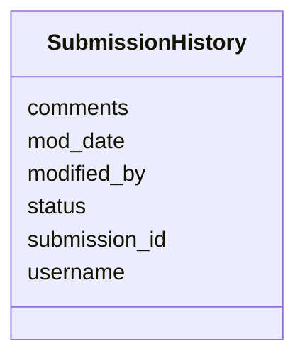

# Class: SubmissionHistory 


URI: [img_sub:SubmissionHistory](https://w3id.org/jgi/img_sub/SubmissionHistory)





<!-- no inheritance hierarchy -->


## Slots

| Name | Cardinality and Range | Description | Inheritance |
| ---  | --- | --- | --- |
| [submission_id](submission_id.md) | 0..1 <br/> [Integer](Integer.md) |  | direct |
| [status](status.md) | 0..1 <br/> [Integer](Integer.md) |  | direct |
| [comments](comments.md) | 0..1 <br/> [String](String.md) |  | direct |
| [username](username.md) | 0..1 <br/> [String](String.md) |  | direct |
| [modified_by](modified_by.md) | 0..1 <br/> [Integer](Integer.md) |  | direct |
| [mod_date](mod_date.md) | 0..1 <br/> [Datetime](Datetime.md) |  | direct |


## Identifier and Mapping Information


### Schema Source


* from schema: https://w3id.org/jgi/img_sub


## Mappings

| Mapping Type | Mapped Value |
| ---  | ---  |
| self | img_sub:SubmissionHistory |
| native | img_sub:SubmissionHistory |


## LinkML Source

<!-- TODO: investigate https://stackoverflow.com/questions/37606292/how-to-create-tabbed-code-blocks-in-mkdocs-or-sphinx -->

### Direct

<details>
```yaml
name: submission_history
from_schema: https://w3id.org/jgi/img_sub
attributes:
  submission_id:
    name: submission_id
    from_schema: https://w3id.org/jgi/img_sub
    domain_of:
    - annotation_contigs_proteins_counts
    - annotation_job_sbatch_args
    - annotation_job_stats
    - annotation_step_stats
    - merfs_aggregate_file_size
    - rnaseq_notify
    - submission
    - submission_data_files
    - submission_data_files_dmpath
    - submission_history
    - submission_img_contacts
    - submission_proc_stats
    - submission_proc_steps
    - submission_reads_file
    - submission_samples
    range: integer
    required: false
  status:
    name: status
    from_schema: https://w3id.org/jgi/img_sub
    domain_of:
    - merfs_aggregate_file_size
    - request_account
    - submission
    - submission_history
    range: integer
    required: false
  comments:
    name: comments
    from_schema: https://w3id.org/jgi/img_sub
    domain_of:
    - contact
    - img_group
    - myimg_bio_cluster_np
    - request_account
    - submission
    - submission_history
    - submission_proc_steps
    range: string
    required: false
  username:
    name: username
    from_schema: https://w3id.org/jgi/img_sub
    domain_of:
    - contact
    - request_account
    - submission_history
    range: string
    required: false
  modified_by:
    name: modified_by
    from_schema: https://w3id.org/jgi/img_sub
    domain_of:
    - announcement
    - gene_myimg_enzymes
    - gene_myimg_functions
    - mygene
    - myimg_bio_cluster_np
    - request_account
    - submission
    - submission_history
    - taxon_history
    range: integer
    required: false
  mod_date:
    name: mod_date
    from_schema: https://w3id.org/jgi/img_sub
    domain_of:
    - announcement
    - gene_myimg_enzymes
    - gene_myimg_functions
    - img_group_news
    - mygene
    - myimg_bio_cluster_np
    - request_account
    - submission
    - submission_history
    - taxon_history
    range: datetime
    required: false

```
</details>

### Induced

<details>
```yaml
name: submission_history
from_schema: https://w3id.org/jgi/img_sub
attributes:
  submission_id:
    name: submission_id
    from_schema: https://w3id.org/jgi/img_sub
    alias: submission_id
    owner: submission_history
    domain_of:
    - annotation_contigs_proteins_counts
    - annotation_job_sbatch_args
    - annotation_job_stats
    - annotation_step_stats
    - merfs_aggregate_file_size
    - rnaseq_notify
    - submission
    - submission_data_files
    - submission_data_files_dmpath
    - submission_history
    - submission_img_contacts
    - submission_proc_stats
    - submission_proc_steps
    - submission_reads_file
    - submission_samples
    range: integer
    required: false
  status:
    name: status
    from_schema: https://w3id.org/jgi/img_sub
    alias: status
    owner: submission_history
    domain_of:
    - merfs_aggregate_file_size
    - request_account
    - submission
    - submission_history
    range: integer
    required: false
  comments:
    name: comments
    from_schema: https://w3id.org/jgi/img_sub
    alias: comments
    owner: submission_history
    domain_of:
    - contact
    - img_group
    - myimg_bio_cluster_np
    - request_account
    - submission
    - submission_history
    - submission_proc_steps
    range: string
    required: false
  username:
    name: username
    from_schema: https://w3id.org/jgi/img_sub
    alias: username
    owner: submission_history
    domain_of:
    - contact
    - request_account
    - submission_history
    range: string
    required: false
  modified_by:
    name: modified_by
    from_schema: https://w3id.org/jgi/img_sub
    alias: modified_by
    owner: submission_history
    domain_of:
    - announcement
    - gene_myimg_enzymes
    - gene_myimg_functions
    - mygene
    - myimg_bio_cluster_np
    - request_account
    - submission
    - submission_history
    - taxon_history
    range: integer
    required: false
  mod_date:
    name: mod_date
    from_schema: https://w3id.org/jgi/img_sub
    alias: mod_date
    owner: submission_history
    domain_of:
    - announcement
    - gene_myimg_enzymes
    - gene_myimg_functions
    - img_group_news
    - mygene
    - myimg_bio_cluster_np
    - request_account
    - submission
    - submission_history
    - taxon_history
    range: datetime
    required: false

```
</details>