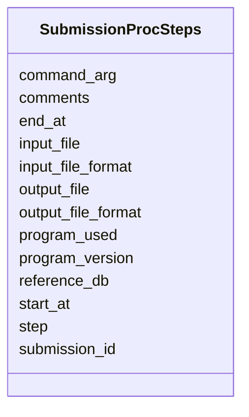

# Class: SubmissionProcSteps 


URI: [img_sub:SubmissionProcSteps](https://w3id.org/jgi/img_sub/SubmissionProcSteps)





<!-- no inheritance hierarchy -->


## Slots

| Name | Cardinality and Range | Description | Inheritance |
| ---  | --- | --- | --- |
| [submission_id](submission_id.md) | 0..1 <br/> [Integer](Integer.md) |  | direct |
| [step](step.md) | 0..1 <br/> [String](String.md) |  | direct |
| [program_used](program_used.md) | 0..1 <br/> [String](String.md) |  | direct |
| [program_version](program_version.md) | 0..1 <br/> [String](String.md) |  | direct |
| [input_file](input_file.md) | 0..1 <br/> [String](String.md) |  | direct |
| [input_file_format](input_file_format.md) | 0..1 <br/> [String](String.md) |  | direct |
| [output_file](output_file.md) | 0..1 <br/> [String](String.md) |  | direct |
| [output_file_format](output_file_format.md) | 0..1 <br/> [String](String.md) |  | direct |
| [reference_db](reference_db.md) | 0..1 <br/> [String](String.md) |  | direct |
| [command_arg](command_arg.md) | 0..1 <br/> [String](String.md) |  | direct |
| [comments](comments.md) | 0..1 <br/> [String](String.md) |  | direct |
| [start_at](start_at.md) | 0..1 <br/> [Datetime](Datetime.md) |  | direct |
| [end_at](end_at.md) | 0..1 <br/> [Datetime](Datetime.md) |  | direct |


## Identifier and Mapping Information


### Schema Source


* from schema: https://w3id.org/jgi/img_sub


## Mappings

| Mapping Type | Mapped Value |
| ---  | ---  |
| self | img_sub:SubmissionProcSteps |
| native | img_sub:SubmissionProcSteps |


## LinkML Source

<!-- TODO: investigate https://stackoverflow.com/questions/37606292/how-to-create-tabbed-code-blocks-in-mkdocs-or-sphinx -->

### Direct

<details>
```yaml
name: submission_proc_steps
from_schema: https://w3id.org/jgi/img_sub
attributes:
  submission_id:
    name: submission_id
    from_schema: https://w3id.org/jgi/img_sub
    domain_of:
    - annotation_contigs_proteins_counts
    - annotation_job_sbatch_args
    - annotation_job_stats
    - annotation_step_stats
    - merfs_aggregate_file_size
    - rnaseq_notify
    - submission
    - submission_data_files
    - submission_data_files_dmpath
    - submission_history
    - submission_img_contacts
    - submission_proc_stats
    - submission_proc_steps
    - submission_reads_file
    - submission_samples
    range: integer
    required: false
  step:
    name: step
    from_schema: https://w3id.org/jgi/img_sub
    domain_of:
    - annotation_step_stats
    - submission_proc_stats
    - submission_proc_steps
    range: string
    required: false
  program_used:
    name: program_used
    from_schema: https://w3id.org/jgi/img_sub
    rank: 1000
    domain_of:
    - submission_proc_steps
    range: string
    required: false
  program_version:
    name: program_version
    from_schema: https://w3id.org/jgi/img_sub
    rank: 1000
    domain_of:
    - submission_proc_steps
    range: string
    required: false
  input_file:
    name: input_file
    from_schema: https://w3id.org/jgi/img_sub
    rank: 1000
    domain_of:
    - submission_proc_steps
    range: string
    required: false
  input_file_format:
    name: input_file_format
    from_schema: https://w3id.org/jgi/img_sub
    rank: 1000
    domain_of:
    - submission_proc_steps
    range: string
    required: false
  output_file:
    name: output_file
    from_schema: https://w3id.org/jgi/img_sub
    rank: 1000
    domain_of:
    - submission_proc_steps
    range: string
    required: false
  output_file_format:
    name: output_file_format
    from_schema: https://w3id.org/jgi/img_sub
    rank: 1000
    domain_of:
    - submission_proc_steps
    range: string
    required: false
  reference_db:
    name: reference_db
    from_schema: https://w3id.org/jgi/img_sub
    rank: 1000
    domain_of:
    - submission_proc_steps
    range: string
    required: false
  command_arg:
    name: command_arg
    from_schema: https://w3id.org/jgi/img_sub
    rank: 1000
    domain_of:
    - submission_proc_steps
    range: string
    required: false
  comments:
    name: comments
    from_schema: https://w3id.org/jgi/img_sub
    domain_of:
    - contact
    - img_group
    - myimg_bio_cluster_np
    - request_account
    - submission
    - submission_history
    - submission_proc_steps
    range: string
    required: false
  start_at:
    name: start_at
    from_schema: https://w3id.org/jgi/img_sub
    rank: 1000
    domain_of:
    - submission_proc_steps
    range: datetime
    required: false
  end_at:
    name: end_at
    from_schema: https://w3id.org/jgi/img_sub
    rank: 1000
    domain_of:
    - submission_proc_steps
    range: datetime
    required: false

```
</details>

### Induced

<details>
```yaml
name: submission_proc_steps
from_schema: https://w3id.org/jgi/img_sub
attributes:
  submission_id:
    name: submission_id
    from_schema: https://w3id.org/jgi/img_sub
    alias: submission_id
    owner: submission_proc_steps
    domain_of:
    - annotation_contigs_proteins_counts
    - annotation_job_sbatch_args
    - annotation_job_stats
    - annotation_step_stats
    - merfs_aggregate_file_size
    - rnaseq_notify
    - submission
    - submission_data_files
    - submission_data_files_dmpath
    - submission_history
    - submission_img_contacts
    - submission_proc_stats
    - submission_proc_steps
    - submission_reads_file
    - submission_samples
    range: integer
    required: false
  step:
    name: step
    from_schema: https://w3id.org/jgi/img_sub
    alias: step
    owner: submission_proc_steps
    domain_of:
    - annotation_step_stats
    - submission_proc_stats
    - submission_proc_steps
    range: string
    required: false
  program_used:
    name: program_used
    from_schema: https://w3id.org/jgi/img_sub
    rank: 1000
    alias: program_used
    owner: submission_proc_steps
    domain_of:
    - submission_proc_steps
    range: string
    required: false
  program_version:
    name: program_version
    from_schema: https://w3id.org/jgi/img_sub
    rank: 1000
    alias: program_version
    owner: submission_proc_steps
    domain_of:
    - submission_proc_steps
    range: string
    required: false
  input_file:
    name: input_file
    from_schema: https://w3id.org/jgi/img_sub
    rank: 1000
    alias: input_file
    owner: submission_proc_steps
    domain_of:
    - submission_proc_steps
    range: string
    required: false
  input_file_format:
    name: input_file_format
    from_schema: https://w3id.org/jgi/img_sub
    rank: 1000
    alias: input_file_format
    owner: submission_proc_steps
    domain_of:
    - submission_proc_steps
    range: string
    required: false
  output_file:
    name: output_file
    from_schema: https://w3id.org/jgi/img_sub
    rank: 1000
    alias: output_file
    owner: submission_proc_steps
    domain_of:
    - submission_proc_steps
    range: string
    required: false
  output_file_format:
    name: output_file_format
    from_schema: https://w3id.org/jgi/img_sub
    rank: 1000
    alias: output_file_format
    owner: submission_proc_steps
    domain_of:
    - submission_proc_steps
    range: string
    required: false
  reference_db:
    name: reference_db
    from_schema: https://w3id.org/jgi/img_sub
    rank: 1000
    alias: reference_db
    owner: submission_proc_steps
    domain_of:
    - submission_proc_steps
    range: string
    required: false
  command_arg:
    name: command_arg
    from_schema: https://w3id.org/jgi/img_sub
    rank: 1000
    alias: command_arg
    owner: submission_proc_steps
    domain_of:
    - submission_proc_steps
    range: string
    required: false
  comments:
    name: comments
    from_schema: https://w3id.org/jgi/img_sub
    alias: comments
    owner: submission_proc_steps
    domain_of:
    - contact
    - img_group
    - myimg_bio_cluster_np
    - request_account
    - submission
    - submission_history
    - submission_proc_steps
    range: string
    required: false
  start_at:
    name: start_at
    from_schema: https://w3id.org/jgi/img_sub
    rank: 1000
    alias: start_at
    owner: submission_proc_steps
    domain_of:
    - submission_proc_steps
    range: datetime
    required: false
  end_at:
    name: end_at
    from_schema: https://w3id.org/jgi/img_sub
    rank: 1000
    alias: end_at
    owner: submission_proc_steps
    domain_of:
    - submission_proc_steps
    range: datetime
    required: false

```
</details>