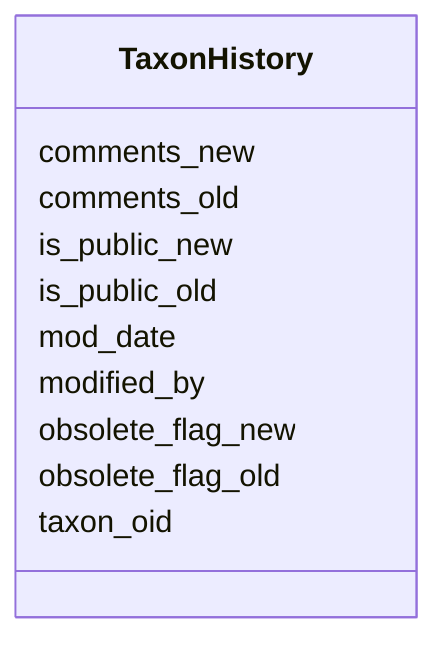

# Class: TaxonHistory 


URI: [img_sub:TaxonHistory](https://w3id.org/jgi/img_sub/TaxonHistory)





<!-- no inheritance hierarchy -->


## Slots

| Name | Cardinality and Range | Description | Inheritance |
| ---  | --- | --- | --- |
| [taxon_oid](taxon_oid.md) | 0..1 <br/> [Float](Float.md) |  | direct |
| [modified_by](modified_by.md) | 0..1 <br/> [Float](Float.md) |  | direct |
| [mod_date](mod_date.md) | 0..1 <br/> [Datetime](Datetime.md) |  | direct |
| [comments_old](comments_old.md) | 0..1 <br/> [String](String.md) |  | direct |
| [is_public_old](is_public_old.md) | 0..1 <br/> [String](String.md) |  | direct |
| [obsolete_flag_old](obsolete_flag_old.md) | 0..1 <br/> [String](String.md) |  | direct |
| [is_public_new](is_public_new.md) | 0..1 <br/> [String](String.md) |  | direct |
| [obsolete_flag_new](obsolete_flag_new.md) | 0..1 <br/> [String](String.md) |  | direct |
| [comments_new](comments_new.md) | 0..1 <br/> [String](String.md) |  | direct |


## Identifier and Mapping Information


### Schema Source


* from schema: https://w3id.org/jgi/img_sub


## Mappings

| Mapping Type | Mapped Value |
| ---  | ---  |
| self | img_sub:TaxonHistory |
| native | img_sub:TaxonHistory |


## LinkML Source

<!-- TODO: investigate https://stackoverflow.com/questions/37606292/how-to-create-tabbed-code-blocks-in-mkdocs-or-sphinx -->

### Direct

<details>
```yaml
name: taxon_history
from_schema: https://w3id.org/jgi/img_sub
attributes:
  taxon_oid:
    name: taxon_oid
    from_schema: https://w3id.org/jgi/img_sub
    domain_of:
    - myimg_bio_cluster_np
    - not_to_release
    - taxon_gene_info
    - taxon_history
    - taxon_scaffold_info
    range: float
    required: false
  modified_by:
    name: modified_by
    from_schema: https://w3id.org/jgi/img_sub
    domain_of:
    - announcement
    - gene_myimg_enzymes
    - gene_myimg_functions
    - mygene
    - myimg_bio_cluster_np
    - request_account
    - submission
    - submission_history
    - taxon_history
    range: float
    required: false
  mod_date:
    name: mod_date
    from_schema: https://w3id.org/jgi/img_sub
    domain_of:
    - announcement
    - gene_myimg_enzymes
    - gene_myimg_functions
    - img_group_news
    - mygene
    - myimg_bio_cluster_np
    - request_account
    - submission
    - submission_history
    - taxon_history
    range: datetime
    required: false
  comments_old:
    name: comments_old
    from_schema: https://w3id.org/jgi/img_sub
    rank: 1000
    domain_of:
    - taxon_history
    range: string
    required: false
  is_public_old:
    name: is_public_old
    from_schema: https://w3id.org/jgi/img_sub
    rank: 1000
    domain_of:
    - taxon_history
    range: string
    required: false
  obsolete_flag_old:
    name: obsolete_flag_old
    from_schema: https://w3id.org/jgi/img_sub
    rank: 1000
    domain_of:
    - taxon_history
    range: string
    required: false
  is_public_new:
    name: is_public_new
    from_schema: https://w3id.org/jgi/img_sub
    rank: 1000
    domain_of:
    - taxon_history
    range: string
    required: false
  obsolete_flag_new:
    name: obsolete_flag_new
    from_schema: https://w3id.org/jgi/img_sub
    rank: 1000
    domain_of:
    - taxon_history
    range: string
    required: false
  comments_new:
    name: comments_new
    from_schema: https://w3id.org/jgi/img_sub
    rank: 1000
    domain_of:
    - taxon_history
    range: string
    required: false

```
</details>

### Induced

<details>
```yaml
name: taxon_history
from_schema: https://w3id.org/jgi/img_sub
attributes:
  taxon_oid:
    name: taxon_oid
    from_schema: https://w3id.org/jgi/img_sub
    alias: taxon_oid
    owner: taxon_history
    domain_of:
    - myimg_bio_cluster_np
    - not_to_release
    - taxon_gene_info
    - taxon_history
    - taxon_scaffold_info
    range: float
    required: false
  modified_by:
    name: modified_by
    from_schema: https://w3id.org/jgi/img_sub
    alias: modified_by
    owner: taxon_history
    domain_of:
    - announcement
    - gene_myimg_enzymes
    - gene_myimg_functions
    - mygene
    - myimg_bio_cluster_np
    - request_account
    - submission
    - submission_history
    - taxon_history
    range: float
    required: false
  mod_date:
    name: mod_date
    from_schema: https://w3id.org/jgi/img_sub
    alias: mod_date
    owner: taxon_history
    domain_of:
    - announcement
    - gene_myimg_enzymes
    - gene_myimg_functions
    - img_group_news
    - mygene
    - myimg_bio_cluster_np
    - request_account
    - submission
    - submission_history
    - taxon_history
    range: datetime
    required: false
  comments_old:
    name: comments_old
    from_schema: https://w3id.org/jgi/img_sub
    rank: 1000
    alias: comments_old
    owner: taxon_history
    domain_of:
    - taxon_history
    range: string
    required: false
  is_public_old:
    name: is_public_old
    from_schema: https://w3id.org/jgi/img_sub
    rank: 1000
    alias: is_public_old
    owner: taxon_history
    domain_of:
    - taxon_history
    range: string
    required: false
  obsolete_flag_old:
    name: obsolete_flag_old
    from_schema: https://w3id.org/jgi/img_sub
    rank: 1000
    alias: obsolete_flag_old
    owner: taxon_history
    domain_of:
    - taxon_history
    range: string
    required: false
  is_public_new:
    name: is_public_new
    from_schema: https://w3id.org/jgi/img_sub
    rank: 1000
    alias: is_public_new
    owner: taxon_history
    domain_of:
    - taxon_history
    range: string
    required: false
  obsolete_flag_new:
    name: obsolete_flag_new
    from_schema: https://w3id.org/jgi/img_sub
    rank: 1000
    alias: obsolete_flag_new
    owner: taxon_history
    domain_of:
    - taxon_history
    range: string
    required: false
  comments_new:
    name: comments_new
    from_schema: https://w3id.org/jgi/img_sub
    rank: 1000
    alias: comments_new
    owner: taxon_history
    domain_of:
    - taxon_history
    range: string
    required: false

```
</details>