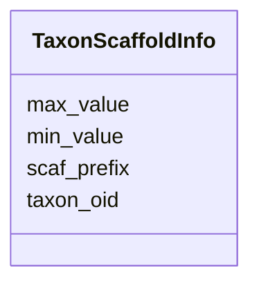

# Class: TaxonScaffoldInfo 


URI: [img_sub:TaxonScaffoldInfo](https://w3id.org/jgi/img_sub/TaxonScaffoldInfo)





<!-- no inheritance hierarchy -->


## Slots

| Name | Cardinality and Range | Description | Inheritance |
| ---  | --- | --- | --- |
| [taxon_oid](taxon_oid.md) | 0..1 <br/> [Integer](Integer.md) |  | direct |
| [scaf_prefix](scaf_prefix.md) | 0..1 <br/> [String](String.md) |  | direct |
| [min_value](min_value.md) | 0..1 <br/> [Integer](Integer.md) |  | direct |
| [max_value](max_value.md) | 0..1 <br/> [Integer](Integer.md) |  | direct |


## Identifier and Mapping Information


### Schema Source


* from schema: https://w3id.org/jgi/img_sub


## Mappings

| Mapping Type | Mapped Value |
| ---  | ---  |
| self | img_sub:TaxonScaffoldInfo |
| native | img_sub:TaxonScaffoldInfo |


## LinkML Source

<!-- TODO: investigate https://stackoverflow.com/questions/37606292/how-to-create-tabbed-code-blocks-in-mkdocs-or-sphinx -->

### Direct

<details>
```yaml
name: taxon_scaffold_info
from_schema: https://w3id.org/jgi/img_sub
attributes:
  taxon_oid:
    name: taxon_oid
    from_schema: https://w3id.org/jgi/img_sub
    domain_of:
    - myimg_bio_cluster_np
    - not_to_release
    - taxon_gene_info
    - taxon_history
    - taxon_scaffold_info
    range: integer
    required: false
  scaf_prefix:
    name: scaf_prefix
    from_schema: https://w3id.org/jgi/img_sub
    rank: 1000
    domain_of:
    - taxon_scaffold_info
    range: string
    required: false
  min_value:
    name: min_value
    from_schema: https://w3id.org/jgi/img_sub
    domain_of:
    - taxon_gene_info
    - taxon_scaffold_info
    range: integer
    required: false
  max_value:
    name: max_value
    from_schema: https://w3id.org/jgi/img_sub
    domain_of:
    - taxon_gene_info
    - taxon_scaffold_info
    range: integer
    required: false

```
</details>

### Induced

<details>
```yaml
name: taxon_scaffold_info
from_schema: https://w3id.org/jgi/img_sub
attributes:
  taxon_oid:
    name: taxon_oid
    from_schema: https://w3id.org/jgi/img_sub
    alias: taxon_oid
    owner: taxon_scaffold_info
    domain_of:
    - myimg_bio_cluster_np
    - not_to_release
    - taxon_gene_info
    - taxon_history
    - taxon_scaffold_info
    range: integer
    required: false
  scaf_prefix:
    name: scaf_prefix
    from_schema: https://w3id.org/jgi/img_sub
    rank: 1000
    alias: scaf_prefix
    owner: taxon_scaffold_info
    domain_of:
    - taxon_scaffold_info
    range: string
    required: false
  min_value:
    name: min_value
    from_schema: https://w3id.org/jgi/img_sub
    alias: min_value
    owner: taxon_scaffold_info
    domain_of:
    - taxon_gene_info
    - taxon_scaffold_info
    range: integer
    required: false
  max_value:
    name: max_value
    from_schema: https://w3id.org/jgi/img_sub
    alias: max_value
    owner: taxon_scaffold_info
    domain_of:
    - taxon_gene_info
    - taxon_scaffold_info
    range: integer
    required: false

```
</details>