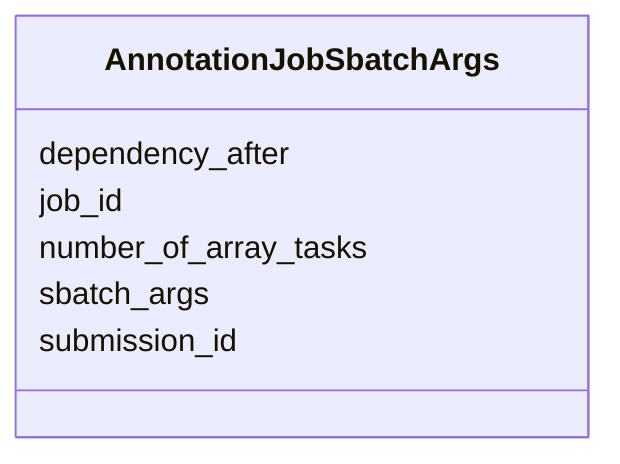

# Class: AnnotationJobSbatchArgs 


URI: [imgsg_dev:AnnotationJobSbatchArgs](https://w3id.org/jgi/imgsg_dev/AnnotationJobSbatchArgs)





<!-- no inheritance hierarchy -->


## Slots

| Name | Cardinality and Range | Description | Inheritance |
| ---  | --- | --- | --- |
| [submission_id](submission_id.md) | 0..1 <br/> [Integer](Integer.md) |  | direct |
| [job_id](job_id.md) | 0..1 <br/> [String](String.md) |  | direct |
| [sbatch_args](sbatch_args.md) | 0..1 <br/> [String](String.md) |  | direct |
| [dependency_after](dependency_after.md) | 0..1 <br/> [Integer](Integer.md) |  | direct |
| [number_of_array_tasks](number_of_array_tasks.md) | 0..1 <br/> [Integer](Integer.md) |  | direct |


## Identifier and Mapping Information


### Schema Source


* from schema: https://w3id.org/jgi/imgsg_dev


## Mappings

| Mapping Type | Mapped Value |
| ---  | ---  |
| self | imgsg_dev:AnnotationJobSbatchArgs |
| native | imgsg_dev:AnnotationJobSbatchArgs |


## LinkML Source

<!-- TODO: investigate https://stackoverflow.com/questions/37606292/how-to-create-tabbed-code-blocks-in-mkdocs-or-sphinx -->

### Direct

<details>
```yaml
name: annotation_job_sbatch_args
from_schema: https://w3id.org/jgi/imgsg_dev
attributes:
  submission_id:
    name: submission_id
    from_schema: https://w3id.org/jgi/imgsg_dev
    domain_of:
    - annotation_contigs_proteins_counts
    - annotation_job_sbatch_args
    - annotation_job_stats
    - annotation_step_stats
    - bad_depth_file_warnings
    - bioproject_propagation
    - gold_analysis_project
    - mer_submissions_queue
    - merfs_aggregate_file_size
    - phajek_test
    - pig_tracks
    - project_info_bioproject
    - project_info_biosample
    - project_info_genbank
    - rnaseq_notify_phajek
    - rnaseq_notify_phajek_dev
    - submission
    - submission_data_files
    - submission_data_files_dmpath
    - submission_history
    - submission_img_contacts
    - submission_proc_stats
    - submission_proc_steps
    - submission_reads_file
    - submission_samples
    - t1_audit
    - v5_ap_imperfect_view
    range: integer
    required: false
  job_id:
    name: job_id
    from_schema: https://w3id.org/jgi/imgsg_dev
    rank: 1000
    domain_of:
    - annotation_job_sbatch_args
    - annotation_job_stats
    range: string
    required: false
  sbatch_args:
    name: sbatch_args
    from_schema: https://w3id.org/jgi/imgsg_dev
    rank: 1000
    domain_of:
    - annotation_job_sbatch_args
    range: string
    required: false
  dependency_after:
    name: dependency_after
    from_schema: https://w3id.org/jgi/imgsg_dev
    rank: 1000
    domain_of:
    - annotation_job_sbatch_args
    range: integer
    required: false
  number_of_array_tasks:
    name: number_of_array_tasks
    from_schema: https://w3id.org/jgi/imgsg_dev
    rank: 1000
    domain_of:
    - annotation_job_sbatch_args
    range: integer
    required: false

```
</details>

### Induced

<details>
```yaml
name: annotation_job_sbatch_args
from_schema: https://w3id.org/jgi/imgsg_dev
attributes:
  submission_id:
    name: submission_id
    from_schema: https://w3id.org/jgi/imgsg_dev
    alias: submission_id
    owner: annotation_job_sbatch_args
    domain_of:
    - annotation_contigs_proteins_counts
    - annotation_job_sbatch_args
    - annotation_job_stats
    - annotation_step_stats
    - bad_depth_file_warnings
    - bioproject_propagation
    - gold_analysis_project
    - mer_submissions_queue
    - merfs_aggregate_file_size
    - phajek_test
    - pig_tracks
    - project_info_bioproject
    - project_info_biosample
    - project_info_genbank
    - rnaseq_notify_phajek
    - rnaseq_notify_phajek_dev
    - submission
    - submission_data_files
    - submission_data_files_dmpath
    - submission_history
    - submission_img_contacts
    - submission_proc_stats
    - submission_proc_steps
    - submission_reads_file
    - submission_samples
    - t1_audit
    - v5_ap_imperfect_view
    range: integer
    required: false
  job_id:
    name: job_id
    from_schema: https://w3id.org/jgi/imgsg_dev
    rank: 1000
    alias: job_id
    owner: annotation_job_sbatch_args
    domain_of:
    - annotation_job_sbatch_args
    - annotation_job_stats
    range: string
    required: false
  sbatch_args:
    name: sbatch_args
    from_schema: https://w3id.org/jgi/imgsg_dev
    rank: 1000
    alias: sbatch_args
    owner: annotation_job_sbatch_args
    domain_of:
    - annotation_job_sbatch_args
    range: string
    required: false
  dependency_after:
    name: dependency_after
    from_schema: https://w3id.org/jgi/imgsg_dev
    rank: 1000
    alias: dependency_after
    owner: annotation_job_sbatch_args
    domain_of:
    - annotation_job_sbatch_args
    range: integer
    required: false
  number_of_array_tasks:
    name: number_of_array_tasks
    from_schema: https://w3id.org/jgi/imgsg_dev
    rank: 1000
    alias: number_of_array_tasks
    owner: annotation_job_sbatch_args
    domain_of:
    - annotation_job_sbatch_args
    range: integer
    required: false

```
</details>