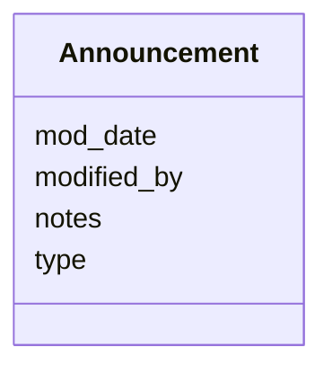

# Class: Announcement 


URI: [imgsg_dev:Announcement](https://w3id.org/jgi/imgsg_dev/Announcement)





<!-- no inheritance hierarchy -->


## Slots

| Name | Cardinality and Range | Description | Inheritance |
| ---  | --- | --- | --- |
| [type](type.md) | 0..1 <br/> [String](String.md) |  | direct |
| [notes](notes.md) | 0..1 <br/> [String](String.md) |  | direct |
| [modified_by](modified_by.md) | 0..1 <br/> [Integer](Integer.md) |  | direct |
| [mod_date](mod_date.md) | 0..1 <br/> [Datetime](Datetime.md) |  | direct |


## Identifier and Mapping Information


### Schema Source


* from schema: https://w3id.org/jgi/imgsg_dev


## Mappings

| Mapping Type | Mapped Value |
| ---  | ---  |
| self | imgsg_dev:Announcement |
| native | imgsg_dev:Announcement |


## LinkML Source

<!-- TODO: investigate https://stackoverflow.com/questions/37606292/how-to-create-tabbed-code-blocks-in-mkdocs-or-sphinx -->

### Direct

<details>
```yaml
name: announcement
from_schema: https://w3id.org/jgi/imgsg_dev
attributes:
  type:
    name: type
    from_schema: https://w3id.org/jgi/imgsg_dev
    rank: 1000
    domain_of:
    - announcement
    - gold_analysis_project_genbanks
    - ncbi_accessions
    - ncbi_accessions_jbtest
    - workflow_stats
    range: string
    required: false
  notes:
    name: notes
    from_schema: https://w3id.org/jgi/imgsg_dev
    rank: 1000
    domain_of:
    - announcement
    - bioproject_propagation
    - request_account
    range: string
    required: false
  modified_by:
    name: modified_by
    from_schema: https://w3id.org/jgi/imgsg_dev
    rank: 1000
    domain_of:
    - announcement
    - cancelled_user
    - env_sample
    - gold_sequencing_project
    - project_info
    - project_info_04112013
    - project_info_natural_prods
    - request_account
    - submission
    - submission_history
    - vsample
    range: integer
    required: false
  mod_date:
    name: mod_date
    from_schema: https://w3id.org/jgi/imgsg_dev
    rank: 1000
    domain_of:
    - announcement
    - cancelled_user
    - env_sample
    - gold_analysis_project
    - gold_sequencing_project
    - gold_study
    - img_group_news
    - lanl_project
    - ornl_project
    - project_info
    - project_info_04112013
    - project_info_natural_prods
    - request_account
    - study_load
    - submission
    - submission_history
    - vsample
    range: datetime
    required: false

```
</details>

### Induced

<details>
```yaml
name: announcement
from_schema: https://w3id.org/jgi/imgsg_dev
attributes:
  type:
    name: type
    from_schema: https://w3id.org/jgi/imgsg_dev
    rank: 1000
    alias: type
    owner: announcement
    domain_of:
    - announcement
    - gold_analysis_project_genbanks
    - ncbi_accessions
    - ncbi_accessions_jbtest
    - workflow_stats
    range: string
    required: false
  notes:
    name: notes
    from_schema: https://w3id.org/jgi/imgsg_dev
    rank: 1000
    alias: notes
    owner: announcement
    domain_of:
    - announcement
    - bioproject_propagation
    - request_account
    range: string
    required: false
  modified_by:
    name: modified_by
    from_schema: https://w3id.org/jgi/imgsg_dev
    rank: 1000
    alias: modified_by
    owner: announcement
    domain_of:
    - announcement
    - cancelled_user
    - env_sample
    - gold_sequencing_project
    - project_info
    - project_info_04112013
    - project_info_natural_prods
    - request_account
    - submission
    - submission_history
    - vsample
    range: integer
    required: false
  mod_date:
    name: mod_date
    from_schema: https://w3id.org/jgi/imgsg_dev
    rank: 1000
    alias: mod_date
    owner: announcement
    domain_of:
    - announcement
    - cancelled_user
    - env_sample
    - gold_analysis_project
    - gold_sequencing_project
    - gold_study
    - img_group_news
    - lanl_project
    - ornl_project
    - project_info
    - project_info_04112013
    - project_info_natural_prods
    - request_account
    - study_load
    - submission
    - submission_history
    - vsample
    range: datetime
    required: false

```
</details>