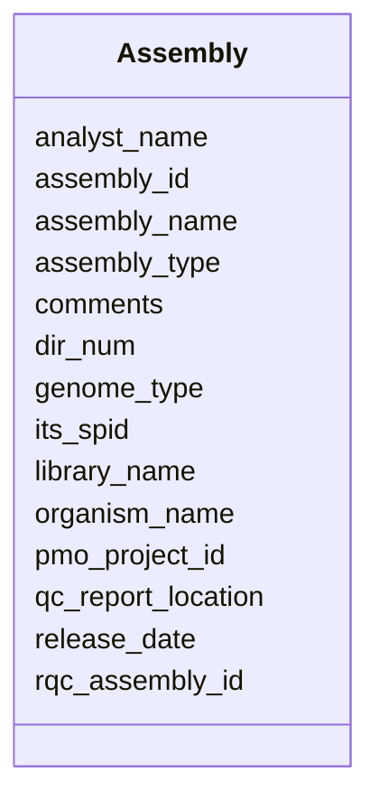

# Class: Assembly 


URI: [imgsg_dev:Assembly](https://w3id.org/jgi/imgsg_dev/Assembly)





<!-- no inheritance hierarchy -->


## Slots

| Name | Cardinality and Range | Description | Inheritance |
| ---  | --- | --- | --- |
| [assembly_id](assembly_id.md) | 0..1 <br/> [Integer](Integer.md) |  | direct |
| [its_spid](its_spid.md) | 0..1 <br/> [Integer](Integer.md) |  | direct |
| [pmo_project_id](pmo_project_id.md) | 0..1 <br/> [Integer](Integer.md) |  | direct |
| [organism_name](organism_name.md) | 0..1 <br/> [String](String.md) |  | direct |
| [library_name](library_name.md) | 0..1 <br/> [String](String.md) |  | direct |
| [genome_type](genome_type.md) | 0..1 <br/> [String](String.md) |  | direct |
| [assembly_type](assembly_type.md) | 0..1 <br/> [String](String.md) |  | direct |
| [analyst_name](analyst_name.md) | 0..1 <br/> [String](String.md) |  | direct |
| [release_date](release_date.md) | 0..1 <br/> [Datetime](Datetime.md) |  | direct |
| [comments](comments.md) | 0..1 <br/> [String](String.md) |  | direct |
| [dir_num](dir_num.md) | 0..1 <br/> [Integer](Integer.md) |  | direct |
| [rqc_assembly_id](rqc_assembly_id.md) | 0..1 <br/> [Integer](Integer.md) |  | direct |
| [assembly_name](assembly_name.md) | 0..1 <br/> [String](String.md) |  | direct |
| [qc_report_location](qc_report_location.md) | 0..1 <br/> [String](String.md) |  | direct |


## Identifier and Mapping Information


### Schema Source


* from schema: https://w3id.org/jgi/imgsg_dev


## Mappings

| Mapping Type | Mapped Value |
| ---  | ---  |
| self | imgsg_dev:Assembly |
| native | imgsg_dev:Assembly |


## LinkML Source

<!-- TODO: investigate https://stackoverflow.com/questions/37606292/how-to-create-tabbed-code-blocks-in-mkdocs-or-sphinx -->

### Direct

<details>
```yaml
name: assembly
from_schema: https://w3id.org/jgi/imgsg_dev
attributes:
  assembly_id:
    name: assembly_id
    from_schema: https://w3id.org/jgi/imgsg_dev
    rank: 1000
    domain_of:
    - assembly
    range: integer
    required: false
  its_spid:
    name: its_spid
    from_schema: https://w3id.org/jgi/imgsg_dev
    rank: 1000
    domain_of:
    - assembly
    - env_sample
    - gold_analysis_project_lookup
    - gold_analysis_project_lookup2
    - gold_sequencing_project
    - goldv5_view
    - project_info
    - project_info_04112013
    - rnaseq_notify_phajek
    - rnaseq_notify_phajek_dev
    - t_all_gold_jgi_projects
    range: integer
    required: false
  pmo_project_id:
    name: pmo_project_id
    from_schema: https://w3id.org/jgi/imgsg_dev
    rank: 1000
    domain_of:
    - assembly
    - env_sample
    - gold_analysis_project_lookup
    - gold_analysis_project_lookup2
    - gold_sequencing_project
    - goldv5_view
    - project_info
    - project_info_04112013
    range: integer
    required: false
  organism_name:
    name: organism_name
    from_schema: https://w3id.org/jgi/imgsg_dev
    rank: 1000
    domain_of:
    - assembly
    - project_info_bioproject
    range: string
    required: false
  library_name:
    name: library_name
    from_schema: https://w3id.org/jgi/imgsg_dev
    rank: 1000
    domain_of:
    - assembly
    range: string
    required: false
  genome_type:
    name: genome_type
    from_schema: https://w3id.org/jgi/imgsg_dev
    rank: 1000
    domain_of:
    - assembly
    - gold_analysis_project
    range: string
    required: false
  assembly_type:
    name: assembly_type
    from_schema: https://w3id.org/jgi/imgsg_dev
    rank: 1000
    domain_of:
    - assembly
    range: string
    required: false
  analyst_name:
    name: analyst_name
    from_schema: https://w3id.org/jgi/imgsg_dev
    rank: 1000
    domain_of:
    - assembly
    range: string
    required: false
  release_date:
    name: release_date
    from_schema: https://w3id.org/jgi/imgsg_dev
    rank: 1000
    domain_of:
    - assembly
    - img_group_news
    - master_list
    - project_info_bioproject
    - project_info_biosample
    range: datetime
    required: false
  comments:
    name: comments
    from_schema: https://w3id.org/jgi/imgsg_dev
    rank: 1000
    domain_of:
    - assembly
    - cancelled_user
    - contact
    - env_sample
    - gold_analysis_project
    - gold_sequencing_project
    - img_group
    - ora_aspnet_membership
    - project_info
    - project_info_04112013
    - project_info_genbank_authors
    - project_info_nitrogen_fixation
    - request_account
    - submission
    - submission_history
    - submission_proc_steps
    - v5_ap_imperfect_view
    - vsample
    range: string
    required: false
  dir_num:
    name: dir_num
    from_schema: https://w3id.org/jgi/imgsg_dev
    rank: 1000
    domain_of:
    - assembly
    range: integer
    required: false
  rqc_assembly_id:
    name: rqc_assembly_id
    from_schema: https://w3id.org/jgi/imgsg_dev
    rank: 1000
    domain_of:
    - assembly
    - submission
    range: integer
    required: false
  assembly_name:
    name: assembly_name
    from_schema: https://w3id.org/jgi/imgsg_dev
    rank: 1000
    domain_of:
    - assembly
    range: string
    required: false
  qc_report_location:
    name: qc_report_location
    from_schema: https://w3id.org/jgi/imgsg_dev
    rank: 1000
    domain_of:
    - assembly
    range: string
    required: false

```
</details>

### Induced

<details>
```yaml
name: assembly
from_schema: https://w3id.org/jgi/imgsg_dev
attributes:
  assembly_id:
    name: assembly_id
    from_schema: https://w3id.org/jgi/imgsg_dev
    rank: 1000
    alias: assembly_id
    owner: assembly
    domain_of:
    - assembly
    range: integer
    required: false
  its_spid:
    name: its_spid
    from_schema: https://w3id.org/jgi/imgsg_dev
    rank: 1000
    alias: its_spid
    owner: assembly
    domain_of:
    - assembly
    - env_sample
    - gold_analysis_project_lookup
    - gold_analysis_project_lookup2
    - gold_sequencing_project
    - goldv5_view
    - project_info
    - project_info_04112013
    - rnaseq_notify_phajek
    - rnaseq_notify_phajek_dev
    - t_all_gold_jgi_projects
    range: integer
    required: false
  pmo_project_id:
    name: pmo_project_id
    from_schema: https://w3id.org/jgi/imgsg_dev
    rank: 1000
    alias: pmo_project_id
    owner: assembly
    domain_of:
    - assembly
    - env_sample
    - gold_analysis_project_lookup
    - gold_analysis_project_lookup2
    - gold_sequencing_project
    - goldv5_view
    - project_info
    - project_info_04112013
    range: integer
    required: false
  organism_name:
    name: organism_name
    from_schema: https://w3id.org/jgi/imgsg_dev
    rank: 1000
    alias: organism_name
    owner: assembly
    domain_of:
    - assembly
    - project_info_bioproject
    range: string
    required: false
  library_name:
    name: library_name
    from_schema: https://w3id.org/jgi/imgsg_dev
    rank: 1000
    alias: library_name
    owner: assembly
    domain_of:
    - assembly
    range: string
    required: false
  genome_type:
    name: genome_type
    from_schema: https://w3id.org/jgi/imgsg_dev
    rank: 1000
    alias: genome_type
    owner: assembly
    domain_of:
    - assembly
    - gold_analysis_project
    range: string
    required: false
  assembly_type:
    name: assembly_type
    from_schema: https://w3id.org/jgi/imgsg_dev
    rank: 1000
    alias: assembly_type
    owner: assembly
    domain_of:
    - assembly
    range: string
    required: false
  analyst_name:
    name: analyst_name
    from_schema: https://w3id.org/jgi/imgsg_dev
    rank: 1000
    alias: analyst_name
    owner: assembly
    domain_of:
    - assembly
    range: string
    required: false
  release_date:
    name: release_date
    from_schema: https://w3id.org/jgi/imgsg_dev
    rank: 1000
    alias: release_date
    owner: assembly
    domain_of:
    - assembly
    - img_group_news
    - master_list
    - project_info_bioproject
    - project_info_biosample
    range: datetime
    required: false
  comments:
    name: comments
    from_schema: https://w3id.org/jgi/imgsg_dev
    rank: 1000
    alias: comments
    owner: assembly
    domain_of:
    - assembly
    - cancelled_user
    - contact
    - env_sample
    - gold_analysis_project
    - gold_sequencing_project
    - img_group
    - ora_aspnet_membership
    - project_info
    - project_info_04112013
    - project_info_genbank_authors
    - project_info_nitrogen_fixation
    - request_account
    - submission
    - submission_history
    - submission_proc_steps
    - v5_ap_imperfect_view
    - vsample
    range: string
    required: false
  dir_num:
    name: dir_num
    from_schema: https://w3id.org/jgi/imgsg_dev
    rank: 1000
    alias: dir_num
    owner: assembly
    domain_of:
    - assembly
    range: integer
    required: false
  rqc_assembly_id:
    name: rqc_assembly_id
    from_schema: https://w3id.org/jgi/imgsg_dev
    rank: 1000
    alias: rqc_assembly_id
    owner: assembly
    domain_of:
    - assembly
    - submission
    range: integer
    required: false
  assembly_name:
    name: assembly_name
    from_schema: https://w3id.org/jgi/imgsg_dev
    rank: 1000
    alias: assembly_name
    owner: assembly
    domain_of:
    - assembly
    range: string
    required: false
  qc_report_location:
    name: qc_report_location
    from_schema: https://w3id.org/jgi/imgsg_dev
    rank: 1000
    alias: qc_report_location
    owner: assembly
    domain_of:
    - assembly
    range: string
    required: false

```
</details>