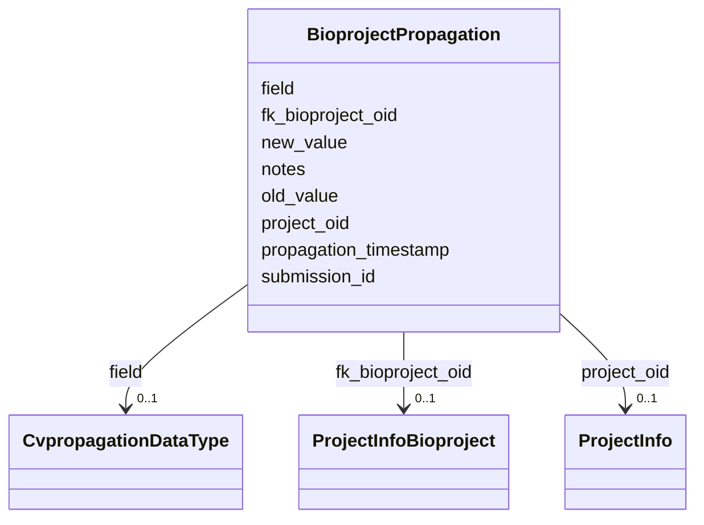

# Class: BioprojectPropagation 


URI: [imgsg_dev:BioprojectPropagation](https://w3id.org/jgi/imgsg_dev/BioprojectPropagation)





<!-- no inheritance hierarchy -->


## Slots

| Name | Cardinality and Range | Description | Inheritance |
| ---  | --- | --- | --- |
| [project_oid](project_oid.md) | 0..1 <br/> [ProjectInfo](ProjectInfo.md) | Foreign key to project_info | direct |
| [submission_id](submission_id.md) | 0..1 <br/> [Integer](Integer.md) |  | direct |
| [propagation_timestamp](propagation_timestamp.md) | 0..1 <br/> [Datetime](Datetime.md) |  | direct |
| [old_value](old_value.md) | 0..1 <br/> [String](String.md) |  | direct |
| [new_value](new_value.md) | 0..1 <br/> [String](String.md) |  | direct |
| [notes](notes.md) | 0..1 <br/> [String](String.md) |  | direct |
| [fk_bioproject_oid](fk_bioproject_oid.md) | 0..1 <br/> [ProjectInfoBioproject](ProjectInfoBioproject.md) | Foreign key to project_info_bioproject | direct |
| [field](field.md) | 0..1 <br/> [CvpropagationDataType](CvpropagationDataType.md) | Foreign key to cvpropagation_data_type | direct |


## Identifier and Mapping Information


### Schema Source


* from schema: https://w3id.org/jgi/imgsg_dev


## Mappings

| Mapping Type | Mapped Value |
| ---  | ---  |
| self | imgsg_dev:BioprojectPropagation |
| native | imgsg_dev:BioprojectPropagation |


## LinkML Source

<!-- TODO: investigate https://stackoverflow.com/questions/37606292/how-to-create-tabbed-code-blocks-in-mkdocs-or-sphinx -->

### Direct

<details>
```yaml
name: bioproject_propagation
from_schema: https://w3id.org/jgi/imgsg_dev
attributes:
  project_oid:
    name: project_oid
    description: Foreign key to project_info
    from_schema: https://w3id.org/jgi/imgsg_dev
    rank: 1000
    domain_of:
    - bioproject_propagation
    - biosample
    - data_quality_flags
    - env_sample_soil_metadata
    - genbank_refseq_crossover
    - gold_analysis_project_lookup
    - gold_analysis_project_lookup2
    - gold_img_nat_prod_entity
    - ncbi_accessions
    - ncbi_accessions_jbtest
    - proj_info_cell_arrange_042014
    - project_info
    - project_info_04112013
    - project_info_bioproject
    - project_info_body_products
    - project_info_body_sites
    - project_info_cell_arrangement
    - project_info_collaborators
    - project_info_cyano_metadata
    - project_info_data_links
    - project_info_data_links_112013
    - project_info_diseases
    - project_info_energy_source
    - project_info_habitat
    - project_info_jgi_url
    - project_info_metabolism
    - project_info_natural_prods
    - project_info_nitrogen_fixation
    - project_info_nprods_metadata
    - project_info_phenotypes
    - project_info_project_relevance
    - project_info_seq_method
    - project_meta_updates
    - study_load
    - t_alex_test
    - t_all_gold_jgi_projects
    range: project_info
    required: false
  submission_id:
    name: submission_id
    from_schema: https://w3id.org/jgi/imgsg_dev
    domain_of:
    - annotation_contigs_proteins_counts
    - annotation_job_sbatch_args
    - annotation_job_stats
    - annotation_step_stats
    - bad_depth_file_warnings
    - bioproject_propagation
    - gold_analysis_project
    - mer_submissions_queue
    - merfs_aggregate_file_size
    - phajek_test
    - pig_tracks
    - project_info_bioproject
    - project_info_biosample
    - project_info_genbank
    - rnaseq_notify_phajek
    - rnaseq_notify_phajek_dev
    - submission
    - submission_data_files
    - submission_data_files_dmpath
    - submission_history
    - submission_img_contacts
    - submission_proc_stats
    - submission_proc_steps
    - submission_reads_file
    - submission_samples
    - t1_audit
    - v5_ap_imperfect_view
    range: integer
    required: false
  propagation_timestamp:
    name: propagation_timestamp
    from_schema: https://w3id.org/jgi/imgsg_dev
    rank: 1000
    domain_of:
    - bioproject_propagation
    range: datetime
    required: false
  old_value:
    name: old_value
    from_schema: https://w3id.org/jgi/imgsg_dev
    rank: 1000
    domain_of:
    - bioproject_propagation
    range: string
    required: false
  new_value:
    name: new_value
    from_schema: https://w3id.org/jgi/imgsg_dev
    rank: 1000
    domain_of:
    - bioproject_propagation
    range: string
    required: false
  notes:
    name: notes
    from_schema: https://w3id.org/jgi/imgsg_dev
    domain_of:
    - announcement
    - bioproject_propagation
    - request_account
    range: string
    required: false
  fk_bioproject_oid:
    name: fk_bioproject_oid
    description: Foreign key to project_info_bioproject
    from_schema: https://w3id.org/jgi/imgsg_dev
    rank: 1000
    domain_of:
    - bioproject_propagation
    range: project_info_bioproject
    required: false
  field:
    name: field
    description: Foreign key to cvpropagation_data_type
    from_schema: https://w3id.org/jgi/imgsg_dev
    rank: 1000
    domain_of:
    - bioproject_propagation
    range: cvpropagation_data_type
    required: false

```
</details>

### Induced

<details>
```yaml
name: bioproject_propagation
from_schema: https://w3id.org/jgi/imgsg_dev
attributes:
  project_oid:
    name: project_oid
    description: Foreign key to project_info
    from_schema: https://w3id.org/jgi/imgsg_dev
    rank: 1000
    alias: project_oid
    owner: bioproject_propagation
    domain_of:
    - bioproject_propagation
    - biosample
    - data_quality_flags
    - env_sample_soil_metadata
    - genbank_refseq_crossover
    - gold_analysis_project_lookup
    - gold_analysis_project_lookup2
    - gold_img_nat_prod_entity
    - ncbi_accessions
    - ncbi_accessions_jbtest
    - proj_info_cell_arrange_042014
    - project_info
    - project_info_04112013
    - project_info_bioproject
    - project_info_body_products
    - project_info_body_sites
    - project_info_cell_arrangement
    - project_info_collaborators
    - project_info_cyano_metadata
    - project_info_data_links
    - project_info_data_links_112013
    - project_info_diseases
    - project_info_energy_source
    - project_info_habitat
    - project_info_jgi_url
    - project_info_metabolism
    - project_info_natural_prods
    - project_info_nitrogen_fixation
    - project_info_nprods_metadata
    - project_info_phenotypes
    - project_info_project_relevance
    - project_info_seq_method
    - project_meta_updates
    - study_load
    - t_alex_test
    - t_all_gold_jgi_projects
    range: project_info
    required: false
  submission_id:
    name: submission_id
    from_schema: https://w3id.org/jgi/imgsg_dev
    alias: submission_id
    owner: bioproject_propagation
    domain_of:
    - annotation_contigs_proteins_counts
    - annotation_job_sbatch_args
    - annotation_job_stats
    - annotation_step_stats
    - bad_depth_file_warnings
    - bioproject_propagation
    - gold_analysis_project
    - mer_submissions_queue
    - merfs_aggregate_file_size
    - phajek_test
    - pig_tracks
    - project_info_bioproject
    - project_info_biosample
    - project_info_genbank
    - rnaseq_notify_phajek
    - rnaseq_notify_phajek_dev
    - submission
    - submission_data_files
    - submission_data_files_dmpath
    - submission_history
    - submission_img_contacts
    - submission_proc_stats
    - submission_proc_steps
    - submission_reads_file
    - submission_samples
    - t1_audit
    - v5_ap_imperfect_view
    range: integer
    required: false
  propagation_timestamp:
    name: propagation_timestamp
    from_schema: https://w3id.org/jgi/imgsg_dev
    rank: 1000
    alias: propagation_timestamp
    owner: bioproject_propagation
    domain_of:
    - bioproject_propagation
    range: datetime
    required: false
  old_value:
    name: old_value
    from_schema: https://w3id.org/jgi/imgsg_dev
    rank: 1000
    alias: old_value
    owner: bioproject_propagation
    domain_of:
    - bioproject_propagation
    range: string
    required: false
  new_value:
    name: new_value
    from_schema: https://w3id.org/jgi/imgsg_dev
    rank: 1000
    alias: new_value
    owner: bioproject_propagation
    domain_of:
    - bioproject_propagation
    range: string
    required: false
  notes:
    name: notes
    from_schema: https://w3id.org/jgi/imgsg_dev
    alias: notes
    owner: bioproject_propagation
    domain_of:
    - announcement
    - bioproject_propagation
    - request_account
    range: string
    required: false
  fk_bioproject_oid:
    name: fk_bioproject_oid
    description: Foreign key to project_info_bioproject
    from_schema: https://w3id.org/jgi/imgsg_dev
    rank: 1000
    alias: fk_bioproject_oid
    owner: bioproject_propagation
    domain_of:
    - bioproject_propagation
    range: project_info_bioproject
    required: false
  field:
    name: field
    description: Foreign key to cvpropagation_data_type
    from_schema: https://w3id.org/jgi/imgsg_dev
    rank: 1000
    alias: field
    owner: bioproject_propagation
    domain_of:
    - bioproject_propagation
    range: cvpropagation_data_type
    required: false

```
</details>