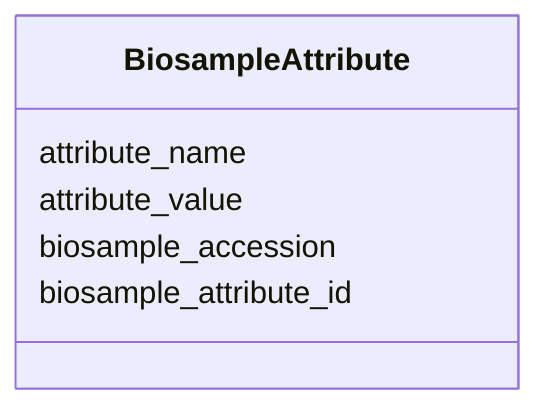

# Class: BiosampleAttribute 


URI: [imgsg_dev:BiosampleAttribute](https://w3id.org/jgi/imgsg_dev/BiosampleAttribute)





<!-- no inheritance hierarchy -->


## Slots

| Name | Cardinality and Range | Description | Inheritance |
| ---  | --- | --- | --- |
| [biosample_attribute_id](biosample_attribute_id.md) | 0..1 <br/> [Integer](Integer.md) |  | direct |
| [biosample_accession](biosample_accession.md) | 0..1 <br/> [String](String.md) |  | direct |
| [attribute_name](attribute_name.md) | 0..1 <br/> [String](String.md) |  | direct |
| [attribute_value](attribute_value.md) | 0..1 <br/> [String](String.md) |  | direct |


## Identifier and Mapping Information


### Schema Source


* from schema: https://w3id.org/jgi/imgsg_dev


## Mappings

| Mapping Type | Mapped Value |
| ---  | ---  |
| self | imgsg_dev:BiosampleAttribute |
| native | imgsg_dev:BiosampleAttribute |


## LinkML Source

<!-- TODO: investigate https://stackoverflow.com/questions/37606292/how-to-create-tabbed-code-blocks-in-mkdocs-or-sphinx -->

### Direct

<details>
```yaml
name: biosample_attribute
from_schema: https://w3id.org/jgi/imgsg_dev
attributes:
  biosample_attribute_id:
    name: biosample_attribute_id
    from_schema: https://w3id.org/jgi/imgsg_dev
    rank: 1000
    domain_of:
    - biosample_attribute
    range: integer
    required: false
  biosample_accession:
    name: biosample_accession
    from_schema: https://w3id.org/jgi/imgsg_dev
    domain_of:
    - biosample
    - biosample_attribute
    - env_sample
    - gold_sequencing_project
    - load_genbank_prok_data
    - project_info
    - project_info_04112013
    range: string
    required: false
  attribute_name:
    name: attribute_name
    from_schema: https://w3id.org/jgi/imgsg_dev
    rank: 1000
    domain_of:
    - biosample_attribute
    range: string
    required: false
  attribute_value:
    name: attribute_value
    from_schema: https://w3id.org/jgi/imgsg_dev
    rank: 1000
    domain_of:
    - biosample_attribute
    range: string
    required: false

```
</details>

### Induced

<details>
```yaml
name: biosample_attribute
from_schema: https://w3id.org/jgi/imgsg_dev
attributes:
  biosample_attribute_id:
    name: biosample_attribute_id
    from_schema: https://w3id.org/jgi/imgsg_dev
    rank: 1000
    alias: biosample_attribute_id
    owner: biosample_attribute
    domain_of:
    - biosample_attribute
    range: integer
    required: false
  biosample_accession:
    name: biosample_accession
    from_schema: https://w3id.org/jgi/imgsg_dev
    alias: biosample_accession
    owner: biosample_attribute
    domain_of:
    - biosample
    - biosample_attribute
    - env_sample
    - gold_sequencing_project
    - load_genbank_prok_data
    - project_info
    - project_info_04112013
    range: string
    required: false
  attribute_name:
    name: attribute_name
    from_schema: https://w3id.org/jgi/imgsg_dev
    rank: 1000
    alias: attribute_name
    owner: biosample_attribute
    domain_of:
    - biosample_attribute
    range: string
    required: false
  attribute_value:
    name: attribute_value
    from_schema: https://w3id.org/jgi/imgsg_dev
    rank: 1000
    alias: attribute_value
    owner: biosample_attribute
    domain_of:
    - biosample_attribute
    range: string
    required: false

```
</details>