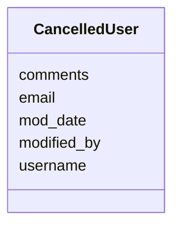

# Class: CancelledUser 


URI: [imgsg_dev:CancelledUser](https://w3id.org/jgi/imgsg_dev/CancelledUser)





<!-- no inheritance hierarchy -->


## Slots

| Name | Cardinality and Range | Description | Inheritance |
| ---  | --- | --- | --- |
| [username](username.md) | 0..1 <br/> [String](String.md) |  | direct |
| [email](email.md) | 0..1 <br/> [String](String.md) |  | direct |
| [comments](comments.md) | 0..1 <br/> [String](String.md) |  | direct |
| [modified_by](modified_by.md) | 0..1 <br/> [Integer](Integer.md) |  | direct |
| [mod_date](mod_date.md) | 0..1 <br/> [Datetime](Datetime.md) |  | direct |


## Identifier and Mapping Information


### Schema Source


* from schema: https://w3id.org/jgi/imgsg_dev


## Mappings

| Mapping Type | Mapped Value |
| ---  | ---  |
| self | imgsg_dev:CancelledUser |
| native | imgsg_dev:CancelledUser |


## LinkML Source

<!-- TODO: investigate https://stackoverflow.com/questions/37606292/how-to-create-tabbed-code-blocks-in-mkdocs-or-sphinx -->

### Direct

<details>
```yaml
name: cancelled_user
from_schema: https://w3id.org/jgi/imgsg_dev
attributes:
  username:
    name: username
    from_schema: https://w3id.org/jgi/imgsg_dev
    rank: 1000
    domain_of:
    - cancelled_user
    - contact
    - dacc_logon
    - ora_aspnet_users
    - request_account
    - submission_history
    range: string
    required: false
  email:
    name: email
    from_schema: https://w3id.org/jgi/imgsg_dev
    rank: 1000
    domain_of:
    - cancelled_user
    - contact
    - gold_analysis_project_users
    - ora_aspnet_membership
    - request_account
    range: string
    required: false
  comments:
    name: comments
    from_schema: https://w3id.org/jgi/imgsg_dev
    domain_of:
    - assembly
    - cancelled_user
    - contact
    - env_sample
    - gold_analysis_project
    - gold_sequencing_project
    - img_group
    - ora_aspnet_membership
    - project_info
    - project_info_04112013
    - project_info_genbank_authors
    - project_info_nitrogen_fixation
    - request_account
    - submission
    - submission_history
    - submission_proc_steps
    - v5_ap_imperfect_view
    - vsample
    range: string
    required: false
  modified_by:
    name: modified_by
    from_schema: https://w3id.org/jgi/imgsg_dev
    domain_of:
    - announcement
    - cancelled_user
    - env_sample
    - gold_sequencing_project
    - project_info
    - project_info_04112013
    - project_info_natural_prods
    - request_account
    - submission
    - submission_history
    - vsample
    range: integer
    required: false
  mod_date:
    name: mod_date
    from_schema: https://w3id.org/jgi/imgsg_dev
    domain_of:
    - announcement
    - cancelled_user
    - env_sample
    - gold_analysis_project
    - gold_sequencing_project
    - gold_study
    - img_group_news
    - lanl_project
    - ornl_project
    - project_info
    - project_info_04112013
    - project_info_natural_prods
    - request_account
    - study_load
    - submission
    - submission_history
    - vsample
    range: datetime
    required: false

```
</details>

### Induced

<details>
```yaml
name: cancelled_user
from_schema: https://w3id.org/jgi/imgsg_dev
attributes:
  username:
    name: username
    from_schema: https://w3id.org/jgi/imgsg_dev
    rank: 1000
    alias: username
    owner: cancelled_user
    domain_of:
    - cancelled_user
    - contact
    - dacc_logon
    - ora_aspnet_users
    - request_account
    - submission_history
    range: string
    required: false
  email:
    name: email
    from_schema: https://w3id.org/jgi/imgsg_dev
    rank: 1000
    alias: email
    owner: cancelled_user
    domain_of:
    - cancelled_user
    - contact
    - gold_analysis_project_users
    - ora_aspnet_membership
    - request_account
    range: string
    required: false
  comments:
    name: comments
    from_schema: https://w3id.org/jgi/imgsg_dev
    alias: comments
    owner: cancelled_user
    domain_of:
    - assembly
    - cancelled_user
    - contact
    - env_sample
    - gold_analysis_project
    - gold_sequencing_project
    - img_group
    - ora_aspnet_membership
    - project_info
    - project_info_04112013
    - project_info_genbank_authors
    - project_info_nitrogen_fixation
    - request_account
    - submission
    - submission_history
    - submission_proc_steps
    - v5_ap_imperfect_view
    - vsample
    range: string
    required: false
  modified_by:
    name: modified_by
    from_schema: https://w3id.org/jgi/imgsg_dev
    alias: modified_by
    owner: cancelled_user
    domain_of:
    - announcement
    - cancelled_user
    - env_sample
    - gold_sequencing_project
    - project_info
    - project_info_04112013
    - project_info_natural_prods
    - request_account
    - submission
    - submission_history
    - vsample
    range: integer
    required: false
  mod_date:
    name: mod_date
    from_schema: https://w3id.org/jgi/imgsg_dev
    alias: mod_date
    owner: cancelled_user
    domain_of:
    - announcement
    - cancelled_user
    - env_sample
    - gold_analysis_project
    - gold_sequencing_project
    - gold_study
    - img_group_news
    - lanl_project
    - ornl_project
    - project_info
    - project_info_04112013
    - project_info_natural_prods
    - request_account
    - study_load
    - submission
    - submission_history
    - vsample
    range: datetime
    required: false

```
</details>