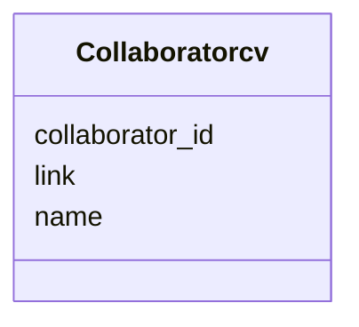

# Class: Collaboratorcv 


URI: [imgsg_dev:Collaboratorcv](https://w3id.org/jgi/imgsg_dev/Collaboratorcv)





<!-- no inheritance hierarchy -->


## Slots

| Name | Cardinality and Range | Description | Inheritance |
| ---  | --- | --- | --- |
| [collaborator_id](collaborator_id.md) | 0..1 <br/> [Integer](Integer.md) |  | direct |
| [name](name.md) | 0..1 <br/> [String](String.md) |  | direct |
| [link](link.md) | 0..1 <br/> [String](String.md) |  | direct |


## Identifier and Mapping Information


### Schema Source


* from schema: https://w3id.org/jgi/imgsg_dev


## Mappings

| Mapping Type | Mapped Value |
| ---  | ---  |
| self | imgsg_dev:Collaboratorcv |
| native | imgsg_dev:Collaboratorcv |


## LinkML Source

<!-- TODO: investigate https://stackoverflow.com/questions/37606292/how-to-create-tabbed-code-blocks-in-mkdocs-or-sphinx -->

### Direct

<details>
```yaml
name: collaboratorcv
from_schema: https://w3id.org/jgi/imgsg_dev
attributes:
  collaborator_id:
    name: collaborator_id
    from_schema: https://w3id.org/jgi/imgsg_dev
    rank: 1000
    domain_of:
    - collaboratorcv
    - project_info_collaborators
    range: integer
    required: false
  name:
    name: name
    from_schema: https://w3id.org/jgi/imgsg_dev
    rank: 1000
    domain_of:
    - collaboratorcv
    - contact
    - gold_analysis_project_users
    - gold_sp_collaborator
    - gold_sp_seq_center
    - load_genbank_prok_data
    - luseq_center
    - request_account
    - seq_centercv
    - t_reddy_test
    range: string
    required: false
  link:
    name: link
    from_schema: https://w3id.org/jgi/imgsg_dev
    rank: 1000
    domain_of:
    - collaboratorcv
    - project_info_bioproject
    - project_info_biosample
    - seq_centercv
    range: string
    required: false

```
</details>

### Induced

<details>
```yaml
name: collaboratorcv
from_schema: https://w3id.org/jgi/imgsg_dev
attributes:
  collaborator_id:
    name: collaborator_id
    from_schema: https://w3id.org/jgi/imgsg_dev
    rank: 1000
    alias: collaborator_id
    owner: collaboratorcv
    domain_of:
    - collaboratorcv
    - project_info_collaborators
    range: integer
    required: false
  name:
    name: name
    from_schema: https://w3id.org/jgi/imgsg_dev
    rank: 1000
    alias: name
    owner: collaboratorcv
    domain_of:
    - collaboratorcv
    - contact
    - gold_analysis_project_users
    - gold_sp_collaborator
    - gold_sp_seq_center
    - load_genbank_prok_data
    - luseq_center
    - request_account
    - seq_centercv
    - t_reddy_test
    range: string
    required: false
  link:
    name: link
    from_schema: https://w3id.org/jgi/imgsg_dev
    rank: 1000
    alias: link
    owner: collaboratorcv
    domain_of:
    - collaboratorcv
    - project_info_bioproject
    - project_info_biosample
    - seq_centercv
    range: string
    required: false

```
</details>