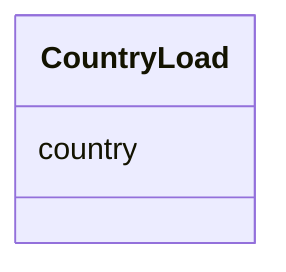

# Class: CountryLoad 


URI: [imgsg_dev:CountryLoad](https://w3id.org/jgi/imgsg_dev/CountryLoad)





<!-- no inheritance hierarchy -->


## Slots

| Name | Cardinality and Range | Description | Inheritance |
| ---  | --- | --- | --- |
| [country](country.md) | 0..1 <br/> [String](String.md) |  | direct |


## Identifier and Mapping Information


### Schema Source


* from schema: https://w3id.org/jgi/imgsg_dev


## Mappings

| Mapping Type | Mapped Value |
| ---  | ---  |
| self | imgsg_dev:CountryLoad |
| native | imgsg_dev:CountryLoad |


## LinkML Source

<!-- TODO: investigate https://stackoverflow.com/questions/37606292/how-to-create-tabbed-code-blocks-in-mkdocs-or-sphinx -->

### Direct

<details>
```yaml
name: country_load
from_schema: https://w3id.org/jgi/imgsg_dev
attributes:
  country:
    name: country
    from_schema: https://w3id.org/jgi/imgsg_dev
    domain_of:
    - contact
    - country_load
    - gold_sp_collaborator
    - gold_sp_seq_center
    - institutes
    - request_account
    - t_institutes_bak
    range: string
    required: false

```
</details>

### Induced

<details>
```yaml
name: country_load
from_schema: https://w3id.org/jgi/imgsg_dev
attributes:
  country:
    name: country
    from_schema: https://w3id.org/jgi/imgsg_dev
    alias: country
    owner: country_load
    domain_of:
    - contact
    - country_load
    - gold_sp_collaborator
    - gold_sp_seq_center
    - institutes
    - request_account
    - t_institutes_bak
    range: string
    required: false

```
</details>