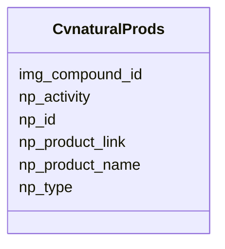

# Class: CvnaturalProds 


URI: [imgsg_dev:CvnaturalProds](https://w3id.org/jgi/imgsg_dev/CvnaturalProds)





<!-- no inheritance hierarchy -->


## Slots

| Name | Cardinality and Range | Description | Inheritance |
| ---  | --- | --- | --- |
| [np_id](np_id.md) | 0..1 <br/> [Integer](Integer.md) |  | direct |
| [np_product_name](np_product_name.md) | 0..1 <br/> [String](String.md) |  | direct |
| [np_product_link](np_product_link.md) | 0..1 <br/> [String](String.md) |  | direct |
| [np_type](np_type.md) | 0..1 <br/> [String](String.md) |  | direct |
| [np_activity](np_activity.md) | 0..1 <br/> [String](String.md) |  | direct |
| [img_compound_id](img_compound_id.md) | 0..1 <br/> [Integer](Integer.md) |  | direct |


## Identifier and Mapping Information


### Schema Source


* from schema: https://w3id.org/jgi/imgsg_dev


## Mappings

| Mapping Type | Mapped Value |
| ---  | ---  |
| self | imgsg_dev:CvnaturalProds |
| native | imgsg_dev:CvnaturalProds |


## LinkML Source

<!-- TODO: investigate https://stackoverflow.com/questions/37606292/how-to-create-tabbed-code-blocks-in-mkdocs-or-sphinx -->

### Direct

<details>
```yaml
name: cvnatural_prods
from_schema: https://w3id.org/jgi/imgsg_dev
attributes:
  np_id:
    name: np_id
    from_schema: https://w3id.org/jgi/imgsg_dev
    rank: 1000
    domain_of:
    - cvnatural_prods
    - gold_img_nat_prod_entity
    - project_info_natural_prods
    - project_info_nprods_metadata
    - x_project_info_np
    range: integer
    required: false
  np_product_name:
    name: np_product_name
    from_schema: https://w3id.org/jgi/imgsg_dev
    rank: 1000
    domain_of:
    - cvnatural_prods
    - project_info_nprods_metadata
    - x_project_info_np
    range: string
    required: false
  np_product_link:
    name: np_product_link
    from_schema: https://w3id.org/jgi/imgsg_dev
    rank: 1000
    domain_of:
    - cvnatural_prods
    - project_info_nprods_metadata
    - x_project_info_np
    range: string
    required: false
  np_type:
    name: np_type
    from_schema: https://w3id.org/jgi/imgsg_dev
    rank: 1000
    domain_of:
    - cvnatural_prods
    - project_info_nprods_metadata
    - x_project_info_np
    range: string
    required: false
  np_activity:
    name: np_activity
    from_schema: https://w3id.org/jgi/imgsg_dev
    rank: 1000
    domain_of:
    - cvnatural_prods
    - project_info_nprods_metadata
    - x_project_info_np
    range: string
    required: false
  img_compound_id:
    name: img_compound_id
    from_schema: https://w3id.org/jgi/imgsg_dev
    rank: 1000
    domain_of:
    - cvnatural_prods
    - x_project_info_np
    range: integer
    required: false

```
</details>

### Induced

<details>
```yaml
name: cvnatural_prods
from_schema: https://w3id.org/jgi/imgsg_dev
attributes:
  np_id:
    name: np_id
    from_schema: https://w3id.org/jgi/imgsg_dev
    rank: 1000
    alias: np_id
    owner: cvnatural_prods
    domain_of:
    - cvnatural_prods
    - gold_img_nat_prod_entity
    - project_info_natural_prods
    - project_info_nprods_metadata
    - x_project_info_np
    range: integer
    required: false
  np_product_name:
    name: np_product_name
    from_schema: https://w3id.org/jgi/imgsg_dev
    rank: 1000
    alias: np_product_name
    owner: cvnatural_prods
    domain_of:
    - cvnatural_prods
    - project_info_nprods_metadata
    - x_project_info_np
    range: string
    required: false
  np_product_link:
    name: np_product_link
    from_schema: https://w3id.org/jgi/imgsg_dev
    rank: 1000
    alias: np_product_link
    owner: cvnatural_prods
    domain_of:
    - cvnatural_prods
    - project_info_nprods_metadata
    - x_project_info_np
    range: string
    required: false
  np_type:
    name: np_type
    from_schema: https://w3id.org/jgi/imgsg_dev
    rank: 1000
    alias: np_type
    owner: cvnatural_prods
    domain_of:
    - cvnatural_prods
    - project_info_nprods_metadata
    - x_project_info_np
    range: string
    required: false
  np_activity:
    name: np_activity
    from_schema: https://w3id.org/jgi/imgsg_dev
    rank: 1000
    alias: np_activity
    owner: cvnatural_prods
    domain_of:
    - cvnatural_prods
    - project_info_nprods_metadata
    - x_project_info_np
    range: string
    required: false
  img_compound_id:
    name: img_compound_id
    from_schema: https://w3id.org/jgi/imgsg_dev
    rank: 1000
    alias: img_compound_id
    owner: cvnatural_prods
    domain_of:
    - cvnatural_prods
    - x_project_info_np
    range: integer
    required: false

```
</details>