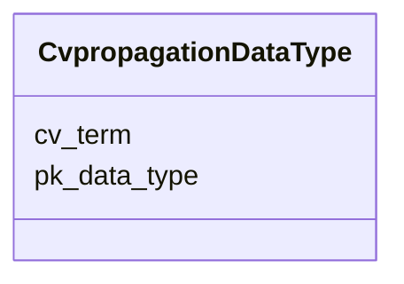

# Class: CvpropagationDataType 


URI: [imgsg_dev:CvpropagationDataType](https://w3id.org/jgi/imgsg_dev/CvpropagationDataType)





<!-- no inheritance hierarchy -->


## Slots

| Name | Cardinality and Range | Description | Inheritance |
| ---  | --- | --- | --- |
| [pk_data_type](pk_data_type.md) | 0..1 <br/> [Integer](Integer.md) |  | direct |
| [cv_term](cv_term.md) | 0..1 <br/> [String](String.md) |  | direct |


## Usages

| used by | used in | type | used |
| ---  | --- | --- | --- |
| [BioprojectPropagation](BioprojectPropagation.md) | [field](field.md) | range | [CvpropagationDataType](CvpropagationDataType.md) |


## Identifier and Mapping Information


### Schema Source


* from schema: https://w3id.org/jgi/imgsg_dev


## Mappings

| Mapping Type | Mapped Value |
| ---  | ---  |
| self | imgsg_dev:CvpropagationDataType |
| native | imgsg_dev:CvpropagationDataType |


## LinkML Source

<!-- TODO: investigate https://stackoverflow.com/questions/37606292/how-to-create-tabbed-code-blocks-in-mkdocs-or-sphinx -->

### Direct

<details>
```yaml
name: cvpropagation_data_type
from_schema: https://w3id.org/jgi/imgsg_dev
attributes:
  pk_data_type:
    name: pk_data_type
    from_schema: https://w3id.org/jgi/imgsg_dev
    rank: 1000
    domain_of:
    - cvpropagation_data_type
    range: integer
    required: false
  cv_term:
    name: cv_term
    from_schema: https://w3id.org/jgi/imgsg_dev
    domain_of:
    - availabilitycv
    - bei_statuscv
    - bin_methodcv
    - body_productcv
    - body_sitecv
    - body_subsitecv
    - capturecv
    - cell_arrcv
    - cell_shapecv
    - colorcv
    - countrycv
    - cv_community
    - cvculture_type
    - cvdata_validity_type
    - cvecosystem
    - cvecosystem_category
    - cvecosystem_subtype
    - cvecosystem_type
    - cvjgi_its_final_deliverable
    - cvorganism_type
    - cvpropagation_data_type
    - cvspecific_ecosystem
    - cvuncultured_type
    - db_namecv
    - diseasecv
    - diseasecv_parents
    - energy_sourcecv
    - funding_programcv
    - genecallingcv
    - gold_contactcv
    - habitat_categorycv
    - habitatcv
    - habitatcv_parents
    - hmp_project_statuscv
    - imgcv
    - isolate_suggestion_sourcecv
    - jgi_funding_progcv
    - library_infocv
    - link_typecv
    - materialcv
    - metabolismcv
    - methodcv
    - motilitycv
    - ncbi_submit_statuscv
    - oxygencv
    - phenotypecv
    - phenotypecv_parents
    - phylogenycv
    - project_goalcv
    - project_statuscv
    - project_typecv
    - publication_journalcv
    - publication_statuscv
    - relevancecv
    - relevancecv_parents
    - request_statuscv
    - salinitycv
    - sample_scopecv
    - sample_typecv
    - sci_progcv
    - seq_methodcv
    - seq_qualitycv
    - seq_statuscv
    - sporulationcv
    - submission_querycv
    - submission_statuscv
    - temp_rangecv
    - unitcv
    - webpagecv
    - yesnocv
    - yesnoonlycv
    range: string
    required: false

```
</details>

### Induced

<details>
```yaml
name: cvpropagation_data_type
from_schema: https://w3id.org/jgi/imgsg_dev
attributes:
  pk_data_type:
    name: pk_data_type
    from_schema: https://w3id.org/jgi/imgsg_dev
    rank: 1000
    alias: pk_data_type
    owner: cvpropagation_data_type
    domain_of:
    - cvpropagation_data_type
    range: integer
    required: false
  cv_term:
    name: cv_term
    from_schema: https://w3id.org/jgi/imgsg_dev
    alias: cv_term
    owner: cvpropagation_data_type
    domain_of:
    - availabilitycv
    - bei_statuscv
    - bin_methodcv
    - body_productcv
    - body_sitecv
    - body_subsitecv
    - capturecv
    - cell_arrcv
    - cell_shapecv
    - colorcv
    - countrycv
    - cv_community
    - cvculture_type
    - cvdata_validity_type
    - cvecosystem
    - cvecosystem_category
    - cvecosystem_subtype
    - cvecosystem_type
    - cvjgi_its_final_deliverable
    - cvorganism_type
    - cvpropagation_data_type
    - cvspecific_ecosystem
    - cvuncultured_type
    - db_namecv
    - diseasecv
    - diseasecv_parents
    - energy_sourcecv
    - funding_programcv
    - genecallingcv
    - gold_contactcv
    - habitat_categorycv
    - habitatcv
    - habitatcv_parents
    - hmp_project_statuscv
    - imgcv
    - isolate_suggestion_sourcecv
    - jgi_funding_progcv
    - library_infocv
    - link_typecv
    - materialcv
    - metabolismcv
    - methodcv
    - motilitycv
    - ncbi_submit_statuscv
    - oxygencv
    - phenotypecv
    - phenotypecv_parents
    - phylogenycv
    - project_goalcv
    - project_statuscv
    - project_typecv
    - publication_journalcv
    - publication_statuscv
    - relevancecv
    - relevancecv_parents
    - request_statuscv
    - salinitycv
    - sample_scopecv
    - sample_typecv
    - sci_progcv
    - seq_methodcv
    - seq_qualitycv
    - seq_statuscv
    - sporulationcv
    - submission_querycv
    - submission_statuscv
    - temp_rangecv
    - unitcv
    - webpagecv
    - yesnocv
    - yesnoonlycv
    range: string
    required: false

```
</details>