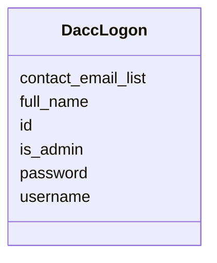

# Class: DaccLogon 


URI: [imgsg_dev:DaccLogon](https://w3id.org/jgi/imgsg_dev/DaccLogon)





<!-- no inheritance hierarchy -->


## Slots

| Name | Cardinality and Range | Description | Inheritance |
| ---  | --- | --- | --- |
| [id](id.md) | 0..1 <br/> [Integer](Integer.md) |  | direct |
| [username](username.md) | 0..1 <br/> [String](String.md) |  | direct |
| [password](password.md) | 0..1 <br/> [String](String.md) |  | direct |
| [full_name](full_name.md) | 0..1 <br/> [String](String.md) |  | direct |
| [is_admin](is_admin.md) | 0..1 <br/> [String](String.md) |  | direct |
| [contact_email_list](contact_email_list.md) | 0..1 <br/> [String](String.md) |  | direct |


## Identifier and Mapping Information


### Schema Source


* from schema: https://w3id.org/jgi/imgsg_dev


## Mappings

| Mapping Type | Mapped Value |
| ---  | ---  |
| self | imgsg_dev:DaccLogon |
| native | imgsg_dev:DaccLogon |


## LinkML Source

<!-- TODO: investigate https://stackoverflow.com/questions/37606292/how-to-create-tabbed-code-blocks-in-mkdocs-or-sphinx -->

### Direct

<details>
```yaml
name: dacc_logon
from_schema: https://w3id.org/jgi/imgsg_dev
attributes:
  id:
    name: id
    from_schema: https://w3id.org/jgi/imgsg_dev
    rank: 1000
    domain_of:
    - dacc_logon
    - env_sample_data_links
    - gold_ap_genbank
    - master_list
    - oprop
    - ora_aspnet_personaliznperuser
    - ora_aspnet_sitemap
    - pig_genbank_emailed_accs
    - pig_reruns
    - pig_retractions
    - pig_tracks
    - plan_table
    - plan_table_20131114
    - project_info_data_links
    - project_info_data_links_112013
    - t_reddy_test
    - workflow_stats
    range: integer
    required: false
  username:
    name: username
    from_schema: https://w3id.org/jgi/imgsg_dev
    domain_of:
    - cancelled_user
    - contact
    - dacc_logon
    - ora_aspnet_users
    - request_account
    - submission_history
    range: string
    required: false
  password:
    name: password
    from_schema: https://w3id.org/jgi/imgsg_dev
    domain_of:
    - contact
    - dacc_logon
    - ora_aspnet_membership
    range: string
    required: false
  full_name:
    name: full_name
    from_schema: https://w3id.org/jgi/imgsg_dev
    rank: 1000
    domain_of:
    - dacc_logon
    range: string
    required: false
  is_admin:
    name: is_admin
    from_schema: https://w3id.org/jgi/imgsg_dev
    rank: 1000
    domain_of:
    - dacc_logon
    range: string
    required: false
  contact_email_list:
    name: contact_email_list
    from_schema: https://w3id.org/jgi/imgsg_dev
    rank: 1000
    domain_of:
    - dacc_logon
    range: string
    required: false

```
</details>

### Induced

<details>
```yaml
name: dacc_logon
from_schema: https://w3id.org/jgi/imgsg_dev
attributes:
  id:
    name: id
    from_schema: https://w3id.org/jgi/imgsg_dev
    rank: 1000
    alias: id
    owner: dacc_logon
    domain_of:
    - dacc_logon
    - env_sample_data_links
    - gold_ap_genbank
    - master_list
    - oprop
    - ora_aspnet_personaliznperuser
    - ora_aspnet_sitemap
    - pig_genbank_emailed_accs
    - pig_reruns
    - pig_retractions
    - pig_tracks
    - plan_table
    - plan_table_20131114
    - project_info_data_links
    - project_info_data_links_112013
    - t_reddy_test
    - workflow_stats
    range: integer
    required: false
  username:
    name: username
    from_schema: https://w3id.org/jgi/imgsg_dev
    alias: username
    owner: dacc_logon
    domain_of:
    - cancelled_user
    - contact
    - dacc_logon
    - ora_aspnet_users
    - request_account
    - submission_history
    range: string
    required: false
  password:
    name: password
    from_schema: https://w3id.org/jgi/imgsg_dev
    alias: password
    owner: dacc_logon
    domain_of:
    - contact
    - dacc_logon
    - ora_aspnet_membership
    range: string
    required: false
  full_name:
    name: full_name
    from_schema: https://w3id.org/jgi/imgsg_dev
    rank: 1000
    alias: full_name
    owner: dacc_logon
    domain_of:
    - dacc_logon
    range: string
    required: false
  is_admin:
    name: is_admin
    from_schema: https://w3id.org/jgi/imgsg_dev
    rank: 1000
    alias: is_admin
    owner: dacc_logon
    domain_of:
    - dacc_logon
    range: string
    required: false
  contact_email_list:
    name: contact_email_list
    from_schema: https://w3id.org/jgi/imgsg_dev
    rank: 1000
    alias: contact_email_list
    owner: dacc_logon
    domain_of:
    - dacc_logon
    range: string
    required: false

```
</details>