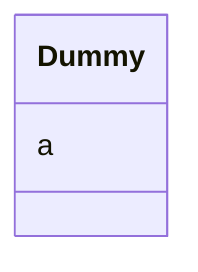

# Class: Dummy 


URI: [imgsg_dev:Dummy](https://w3id.org/jgi/imgsg_dev/Dummy)





<!-- no inheritance hierarchy -->


## Slots

| Name | Cardinality and Range | Description | Inheritance |
| ---  | --- | --- | --- |
| [a](a.md) | 0..1 <br/> [Integer](Integer.md) |  | direct |


## Identifier and Mapping Information


### Schema Source


* from schema: https://w3id.org/jgi/imgsg_dev


## Mappings

| Mapping Type | Mapped Value |
| ---  | ---  |
| self | imgsg_dev:Dummy |
| native | imgsg_dev:Dummy |


## LinkML Source

<!-- TODO: investigate https://stackoverflow.com/questions/37606292/how-to-create-tabbed-code-blocks-in-mkdocs-or-sphinx -->

### Direct

<details>
```yaml
name: dummy
from_schema: https://w3id.org/jgi/imgsg_dev
attributes:
  a:
    name: a
    from_schema: https://w3id.org/jgi/imgsg_dev
    rank: 1000
    domain_of:
    - dummy
    range: integer
    required: false

```
</details>

### Induced

<details>
```yaml
name: dummy
from_schema: https://w3id.org/jgi/imgsg_dev
attributes:
  a:
    name: a
    from_schema: https://w3id.org/jgi/imgsg_dev
    rank: 1000
    alias: a
    owner: dummy
    domain_of:
    - dummy
    range: integer
    required: false

```
</details>