# Class: EnvSample 


URI: [imgsg_dev:EnvSample](https://w3id.org/jgi/imgsg_dev/EnvSample)

```mermaid
 classDiagram
    class EnvSample
    click EnvSample href "../EnvSample/"
      EnvSample : add_date
        
      EnvSample : altitude
        
      EnvSample : annotator_comments
        
      EnvSample : assembly_method
        
      EnvSample : binning_method
        
      EnvSample : bioproject_accession
        
      EnvSample : bioproject_description
        
      EnvSample : biosample_accession
        
      EnvSample : biosample_name
        
      EnvSample : body_product
        
      EnvSample : body_site
        
      EnvSample : body_subsite
        
      EnvSample : chromosome_count
        
      EnvSample : clade
        
      EnvSample : comments
        
      EnvSample : contact
        
      EnvSample : contig_count
        
      EnvSample : coordinate_type
        
      EnvSample : date_collected
        
      EnvSample : depth
        
      EnvSample : ecosystem
        
      EnvSample : ecosystem_category
        
      EnvSample : ecosystem_subtype
        
      EnvSample : ecosystem_type
        
      EnvSample : ecotype
        
      EnvSample : est_biomass
        
      EnvSample : est_diversity
        
      EnvSample : est_size
        
      EnvSample : gc_perc
        
      EnvSample : gene_calling_method
        
      EnvSample : gene_count
        
      EnvSample : geo_location
        
      EnvSample : gold_id
        
      EnvSample : goldv5_project_id
        
      EnvSample : gpts_comments
        
      EnvSample : gpts_embargo_days
        
      EnvSample : gpts_embargo_start_date
        
      EnvSample : gpts_last_mod_date
        
      EnvSample : gpts_public_release_date
        
      EnvSample : growth_conditions
        
      EnvSample : host_age
        
      EnvSample : host_comments
        
      EnvSample : host_gender
        
      EnvSample : host_health_condition
        
      EnvSample : host_medication
        
      EnvSample : host_name
        
      EnvSample : host_ncbi_taxid
        
      EnvSample : host_race
        
      EnvSample : host_spec
        
      EnvSample : host_taxon_id
        
      EnvSample : image_url
        
      EnvSample : img_exp_oid
        
      EnvSample : img_oid
        
      EnvSample : iso_comments
        
      EnvSample : iso_country
        
      EnvSample : iso_pubmed_id
        
      EnvSample : iso_source
        
      EnvSample : its_proposal_id
        
      EnvSample : its_spid
        
      EnvSample : its_spid_old
        
      EnvSample : jgi_dir_number
        
      EnvSample : jgi_final_deliverable
        
      EnvSample : jgi_funding_program
        
      EnvSample : jgi_funding_year
        
      EnvSample : jgi_product_name
        
      EnvSample : jgi_project_type
        
      EnvSample : jgi_status
        
      EnvSample : jgi_visibility
        
      EnvSample : latitude
        
      EnvSample : legacy_gold_id
        
      EnvSample : library_method
        
      EnvSample : locus_tag_prefix
        
      EnvSample : longhurst_code
        
      EnvSample : longhurst_description
        
      EnvSample : longitude
        
      EnvSample : member_samples
        
      EnvSample : mod_date
        
      EnvSample : modified_by
        
      EnvSample : mrn
        
      EnvSample : ncbi_archive_id
        
      EnvSample : ncbi_project_accession
        
      EnvSample : ncbi_project_id
        
      EnvSample : ncbi_project_name
        
      EnvSample : ncbi_taxon_id
        
      EnvSample : nucleic_acid_type
        
      EnvSample : oxygen_req
        
      EnvSample : ph
        
      EnvSample : phase
        
      EnvSample : phase_status
        
      EnvSample : plasmid_count
        
      EnvSample : pmo_project_id
        
      EnvSample : pressure
        
      EnvSample : project_info
        
      EnvSample : project_status
        
      EnvSample : proposal_name
        
      EnvSample : pub_journal
        
      EnvSample : pub_link
        
      EnvSample : pub_vol
        
      EnvSample : reads_count
        
      EnvSample : replicate_num
        
      EnvSample : salinity
        
      EnvSample : sample_description
        
      EnvSample : sample_display_name
        
      EnvSample : sample_isolation
        
      EnvSample : sample_link
        
      EnvSample : sample_oid
        
      EnvSample : sample_site
        
      EnvSample : sample_type
        
      EnvSample : sample_volume
        
      EnvSample : sampling_strategy
        
      EnvSample : scaffold_count
        
      EnvSample : scientific_program
        
      EnvSample : scope_of_work
        
      EnvSample : seq_center_name
        
      EnvSample : seq_center_pid
        
      EnvSample : seq_center_url
        
      EnvSample : seq_comments
        
      EnvSample : seq_country
        
      EnvSample : seq_depth
        
      EnvSample : seq_quality
        
      EnvSample : seq_status
        
      EnvSample : seq_status_link
        
      EnvSample : show_in_dacc
        
      EnvSample : singlet_count
        
      EnvSample : specific_ecosystem
        
      EnvSample : sra_id
        
      EnvSample : submitters_name
        
      EnvSample : temp
        
      EnvSample : temp_range
        
      EnvSample : units
        
      EnvSample : vector
        
      EnvSample : visit_num
        
      
```





<!-- no inheritance hierarchy -->


## Slots

| Name | Cardinality and Range | Description | Inheritance |
| ---  | --- | --- | --- |
| [sample_oid](sample_oid.md) | 0..1 <br/> [Integer](Integer.md) |  | direct |
| [gold_id](gold_id.md) | 0..1 <br/> [String](String.md) |  | direct |
| [sample_display_name](sample_display_name.md) | 0..1 <br/> [String](String.md) |  | direct |
| [sample_site](sample_site.md) | 0..1 <br/> [String](String.md) |  | direct |
| [date_collected](date_collected.md) | 0..1 <br/> [String](String.md) |  | direct |
| [geo_location](geo_location.md) | 0..1 <br/> [String](String.md) |  | direct |
| [latitude](latitude.md) | 0..1 <br/> [String](String.md) |  | direct |
| [longitude](longitude.md) | 0..1 <br/> [String](String.md) |  | direct |
| [altitude](altitude.md) | 0..1 <br/> [String](String.md) |  | direct |
| [sampling_strategy](sampling_strategy.md) | 0..1 <br/> [String](String.md) |  | direct |
| [sample_isolation](sample_isolation.md) | 0..1 <br/> [String](String.md) |  | direct |
| [sample_volume](sample_volume.md) | 0..1 <br/> [String](String.md) |  | direct |
| [est_biomass](est_biomass.md) | 0..1 <br/> [String](String.md) |  | direct |
| [est_diversity](est_diversity.md) | 0..1 <br/> [String](String.md) |  | direct |
| [oxygen_req](oxygen_req.md) | 0..1 <br/> [String](String.md) |  | direct |
| [temp](temp.md) | 0..1 <br/> [String](String.md) |  | direct |
| [salinity](salinity.md) | 0..1 <br/> [String](String.md) |  | direct |
| [pressure](pressure.md) | 0..1 <br/> [String](String.md) |  | direct |
| [ph](ph.md) | 0..1 <br/> [String](String.md) |  | direct |
| [host_ncbi_taxid](host_ncbi_taxid.md) | 0..1 <br/> [Integer](Integer.md) |  | direct |
| [host_name](host_name.md) | 0..1 <br/> [String](String.md) |  | direct |
| [host_gender](host_gender.md) | 0..1 <br/> [String](String.md) |  | direct |
| [host_age](host_age.md) | 0..1 <br/> [String](String.md) |  | direct |
| [host_health_condition](host_health_condition.md) | 0..1 <br/> [String](String.md) |  | direct |
| [library_method](library_method.md) | 0..1 <br/> [String](String.md) |  | direct |
| [est_size](est_size.md) | 0..1 <br/> [Integer](Integer.md) |  | direct |
| [binning_method](binning_method.md) | 0..1 <br/> [String](String.md) |  | direct |
| [contig_count](contig_count.md) | 0..1 <br/> [Integer](Integer.md) |  | direct |
| [singlet_count](singlet_count.md) | 0..1 <br/> [Integer](Integer.md) |  | direct |
| [units](units.md) | 0..1 <br/> [String](String.md) |  | direct |
| [gene_count](gene_count.md) | 0..1 <br/> [Integer](Integer.md) |  | direct |
| [comments](comments.md) | 0..1 <br/> [String](String.md) |  | direct |
| [add_date](add_date.md) | 0..1 <br/> [Datetime](Datetime.md) |  | direct |
| [mod_date](mod_date.md) | 0..1 <br/> [Datetime](Datetime.md) |  | direct |
| [modified_by](modified_by.md) | 0..1 <br/> [Integer](Integer.md) |  | direct |
| [contact](contact.md) | 0..1 <br/> [Integer](Integer.md) |  | direct |
| [project_info](project_info.md) | 0..1 <br/> [Integer](Integer.md) |  | direct |
| [temp_range](temp_range.md) | 0..1 <br/> [String](String.md) |  | direct |
| [sample_link](sample_link.md) | 0..1 <br/> [String](String.md) |  | direct |
| [assembly_method](assembly_method.md) | 0..1 <br/> [String](String.md) |  | direct |
| [seq_depth](seq_depth.md) | 0..1 <br/> [String](String.md) |  | direct |
| [gene_calling_method](gene_calling_method.md) | 0..1 <br/> [String](String.md) |  | direct |
| [gc_perc](gc_perc.md) | 0..1 <br/> [Float](Float.md) |  | direct |
| [chromosome_count](chromosome_count.md) | 0..1 <br/> [Integer](Integer.md) |  | direct |
| [plasmid_count](plasmid_count.md) | 0..1 <br/> [Integer](Integer.md) |  | direct |
| [ncbi_project_id](ncbi_project_id.md) | 0..1 <br/> [Integer](Integer.md) |  | direct |
| [img_oid](img_oid.md) | 0..1 <br/> [Integer](Integer.md) |  | direct |
| [iso_country](iso_country.md) | 0..1 <br/> [String](String.md) |  | direct |
| [pub_journal](pub_journal.md) | 0..1 <br/> [String](String.md) |  | direct |
| [pub_vol](pub_vol.md) | 0..1 <br/> [String](String.md) |  | direct |
| [pub_link](pub_link.md) | 0..1 <br/> [String](String.md) |  | direct |
| [ncbi_archive_id](ncbi_archive_id.md) | 0..1 <br/> [Integer](Integer.md) |  | direct |
| [depth](depth.md) | 0..1 <br/> [String](String.md) |  | direct |
| [iso_comments](iso_comments.md) | 0..1 <br/> [String](String.md) |  | direct |
| [iso_source](iso_source.md) | 0..1 <br/> [String](String.md) |  | direct |
| [ecosystem](ecosystem.md) | 0..1 <br/> [String](String.md) |  | direct |
| [ecosystem_category](ecosystem_category.md) | 0..1 <br/> [String](String.md) |  | direct |
| [ecosystem_type](ecosystem_type.md) | 0..1 <br/> [String](String.md) |  | direct |
| [ecosystem_subtype](ecosystem_subtype.md) | 0..1 <br/> [String](String.md) |  | direct |
| [specific_ecosystem](specific_ecosystem.md) | 0..1 <br/> [String](String.md) |  | direct |
| [sample_description](sample_description.md) | 0..1 <br/> [String](String.md) |  | direct |
| [seq_status](seq_status.md) | 0..1 <br/> [String](String.md) |  | direct |
| [seq_status_link](seq_status_link.md) | 0..1 <br/> [String](String.md) |  | direct |
| [reads_count](reads_count.md) | 0..1 <br/> [String](String.md) |  | direct |
| [vector](vector.md) | 0..1 <br/> [String](String.md) |  | direct |
| [seq_country](seq_country.md) | 0..1 <br/> [String](String.md) |  | direct |
| [seq_quality](seq_quality.md) | 0..1 <br/> [String](String.md) |  | direct |
| [host_spec](host_spec.md) | 0..1 <br/> [Integer](Integer.md) |  | direct |
| [host_race](host_race.md) | 0..1 <br/> [String](String.md) |  | direct |
| [host_comments](host_comments.md) | 0..1 <br/> [String](String.md) |  | direct |
| [host_medication](host_medication.md) | 0..1 <br/> [String](String.md) |  | direct |
| [host_taxon_id](host_taxon_id.md) | 0..1 <br/> [Integer](Integer.md) |  | direct |
| [iso_pubmed_id](iso_pubmed_id.md) | 0..1 <br/> [Integer](Integer.md) |  | direct |
| [seq_comments](seq_comments.md) | 0..1 <br/> [String](String.md) |  | direct |
| [sra_id](sra_id.md) | 0..1 <br/> [String](String.md) |  | direct |
| [ncbi_project_name](ncbi_project_name.md) | 0..1 <br/> [String](String.md) |  | direct |
| [seq_center_pid](seq_center_pid.md) | 0..1 <br/> [Integer](Integer.md) |  | direct |
| [mrn](mrn.md) | 0..1 <br/> [Integer](Integer.md) |  | direct |
| [body_site](body_site.md) | 0..1 <br/> [String](String.md) |  | direct |
| [body_subsite](body_subsite.md) | 0..1 <br/> [String](String.md) |  | direct |
| [body_product](body_product.md) | 0..1 <br/> [String](String.md) |  | direct |
| [seq_center_name](seq_center_name.md) | 0..1 <br/> [String](String.md) |  | direct |
| [seq_center_url](seq_center_url.md) | 0..1 <br/> [String](String.md) |  | direct |
| [image_url](image_url.md) | 0..1 <br/> [String](String.md) |  | direct |
| [show_in_dacc](show_in_dacc.md) | 0..1 <br/> [String](String.md) |  | direct |
| [visit_num](visit_num.md) | 0..1 <br/> [Integer](Integer.md) |  | direct |
| [replicate_num](replicate_num.md) | 0..1 <br/> [Integer](Integer.md) |  | direct |
| [submitters_name](submitters_name.md) | 0..1 <br/> [String](String.md) |  | direct |
| [ncbi_taxon_id](ncbi_taxon_id.md) | 0..1 <br/> [String](String.md) |  | direct |
| [scope_of_work](scope_of_work.md) | 0..1 <br/> [String](String.md) |  | direct |
| [pmo_project_id](pmo_project_id.md) | 0..1 <br/> [Integer](Integer.md) |  | direct |
| [sample_type](sample_type.md) | 0..1 <br/> [String](String.md) |  | direct |
| [proposal_name](proposal_name.md) | 0..1 <br/> [String](String.md) |  | direct |
| [scientific_program](scientific_program.md) | 0..1 <br/> [String](String.md) |  | direct |
| [jgi_project_type](jgi_project_type.md) | 0..1 <br/> [String](String.md) |  | direct |
| [jgi_status](jgi_status.md) | 0..1 <br/> [String](String.md) |  | direct |
| [gpts_comments](gpts_comments.md) | 0..1 <br/> [String](String.md) |  | direct |
| [gpts_last_mod_date](gpts_last_mod_date.md) | 0..1 <br/> [Datetime](Datetime.md) |  | direct |
| [jgi_funding_program](jgi_funding_program.md) | 0..1 <br/> [String](String.md) |  | direct |
| [jgi_dir_number](jgi_dir_number.md) | 0..1 <br/> [Integer](Integer.md) |  | direct |
| [jgi_funding_year](jgi_funding_year.md) | 0..1 <br/> [Integer](Integer.md) |  | direct |
| [jgi_product_name](jgi_product_name.md) | 0..1 <br/> [String](String.md) |  | direct |
| [jgi_final_deliverable](jgi_final_deliverable.md) | 0..1 <br/> [String](String.md) |  | direct |
| [jgi_visibility](jgi_visibility.md) | 0..1 <br/> [String](String.md) |  | direct |
| [growth_conditions](growth_conditions.md) | 0..1 <br/> [String](String.md) |  | direct |
| [coordinate_type](coordinate_type.md) | 0..1 <br/> [String](String.md) |  | direct |
| [scaffold_count](scaffold_count.md) | 0..1 <br/> [Integer](Integer.md) |  | direct |
| [member_samples](member_samples.md) | 0..1 <br/> [String](String.md) |  | direct |
| [gpts_public_release_date](gpts_public_release_date.md) | 0..1 <br/> [Datetime](Datetime.md) |  | direct |
| [gpts_embargo_start_date](gpts_embargo_start_date.md) | 0..1 <br/> [Datetime](Datetime.md) |  | direct |
| [gpts_embargo_days](gpts_embargo_days.md) | 0..1 <br/> [Integer](Integer.md) |  | direct |
| [phase](phase.md) | 0..1 <br/> [String](String.md) |  | direct |
| [phase_status](phase_status.md) | 0..1 <br/> [String](String.md) |  | direct |
| [its_spid](its_spid.md) | 0..1 <br/> [Integer](Integer.md) |  | direct |
| [bioproject_description](bioproject_description.md) | 0..1 <br/> [String](String.md) |  | direct |
| [biosample_accession](biosample_accession.md) | 0..1 <br/> [String](String.md) |  | direct |
| [locus_tag_prefix](locus_tag_prefix.md) | 0..1 <br/> [String](String.md) |  | direct |
| [nucleic_acid_type](nucleic_acid_type.md) | 0..1 <br/> [String](String.md) |  | direct |
| [annotator_comments](annotator_comments.md) | 0..1 <br/> [String](String.md) |  | direct |
| [biosample_name](biosample_name.md) | 0..1 <br/> [String](String.md) |  | direct |
| [its_spid_old](its_spid_old.md) | 0..1 <br/> [Integer](Integer.md) |  | direct |
| [img_exp_oid](img_exp_oid.md) | 0..1 <br/> [String](String.md) |  | direct |
| [goldv5_project_id](goldv5_project_id.md) | 0..1 <br/> [Integer](Integer.md) |  | direct |
| [ncbi_project_accession](ncbi_project_accession.md) | 0..1 <br/> [String](String.md) |  | direct |
| [legacy_gold_id](legacy_gold_id.md) | 0..1 <br/> [String](String.md) |  | direct |
| [bioproject_accession](bioproject_accession.md) | 0..1 <br/> [String](String.md) |  | direct |
| [clade](clade.md) | 0..1 <br/> [String](String.md) |  | direct |
| [ecotype](ecotype.md) | 0..1 <br/> [String](String.md) |  | direct |
| [longhurst_code](longhurst_code.md) | 0..1 <br/> [String](String.md) |  | direct |
| [longhurst_description](longhurst_description.md) | 0..1 <br/> [String](String.md) |  | direct |
| [project_status](project_status.md) | 0..1 <br/> [String](String.md) |  | direct |
| [its_proposal_id](its_proposal_id.md) | 0..1 <br/> [Integer](Integer.md) |  | direct |


## Usages

| used by | used in | type | used |
| ---  | --- | --- | --- |
| [EnvSampleDataLinks](EnvSampleDataLinks.md) | [sample_oid](sample_oid.md) | range | [EnvSample](EnvSample.md) |
| [ProjectInfoBioproject](ProjectInfoBioproject.md) | [sample_oid](sample_oid.md) | range | [EnvSample](EnvSample.md) |


## Identifier and Mapping Information


### Schema Source


* from schema: https://w3id.org/jgi/imgsg_dev


## Mappings

| Mapping Type | Mapped Value |
| ---  | ---  |
| self | imgsg_dev:EnvSample |
| native | imgsg_dev:EnvSample |


## LinkML Source

<!-- TODO: investigate https://stackoverflow.com/questions/37606292/how-to-create-tabbed-code-blocks-in-mkdocs-or-sphinx -->

### Direct

<details>
```yaml
name: env_sample
from_schema: https://w3id.org/jgi/imgsg_dev
attributes:
  sample_oid:
    name: sample_oid
    from_schema: https://w3id.org/jgi/imgsg_dev
    domain_of:
    - contact_sample_perms
    - env_sample
    - env_sample_data_links
    - env_sample_diseases
    - env_sample_energy_source
    - env_sample_habitat_type
    - env_sample_jgi_url
    - env_sample_metabolism
    - env_sample_misc_meta_data
    - env_sample_phenotypes
    - env_sample_seq_method
    - gold_analysis_project_lookup
    - gold_analysis_project_lookup2
    - project_info
    - project_info_04112013
    - project_info_bioproject
    - project_info_biosample
    - submission
    - submission_samples
    - vsample
    range: integer
    required: false
  gold_id:
    name: gold_id
    from_schema: https://w3id.org/jgi/imgsg_dev
    domain_of:
    - analysis_project_permissions
    - env_sample
    - gold_analysis_project
    - gold_analysis_project_genbanks
    - gold_analysis_project_jgi_award_dois
    - gold_analysis_project_lookup
    - gold_analysis_project_lookup2
    - gold_analysis_project_sra_runs
    - gold_analysis_project_users
    - gold_ap_genbank_anomalous_reasons
    - gold_ap_publications
    - gold_sequencing_project
    - gold_sp_cell_arrangement
    - gold_sp_collaborator
    - gold_sp_disease
    - gold_sp_energy_source
    - gold_sp_genome_publications
    - gold_sp_habitat
    - gold_sp_metabolism
    - gold_sp_phenotype
    - gold_sp_relevance
    - gold_sp_seq_center
    - gold_sp_seq_method
    - gold_sp_sra
    - gold_sp_study_gold_id
    - gold_study
    - gold_study_info
    - rnaseq_notify_phajek
    - rnaseq_notify_phajek_dev
    - study_load
    - v5_ap_imperfect_view
    - vsample
    range: string
    required: false
  sample_display_name:
    name: sample_display_name
    from_schema: https://w3id.org/jgi/imgsg_dev
    rank: 1000
    domain_of:
    - env_sample
    - vsample
    range: string
    required: false
  sample_site:
    name: sample_site
    from_schema: https://w3id.org/jgi/imgsg_dev
    rank: 1000
    domain_of:
    - env_sample
    - vsample
    range: string
    required: false
  date_collected:
    name: date_collected
    from_schema: https://w3id.org/jgi/imgsg_dev
    rank: 1000
    domain_of:
    - env_sample
    - gold_sequencing_project
    - vsample
    range: string
    required: false
  geo_location:
    name: geo_location
    from_schema: https://w3id.org/jgi/imgsg_dev
    rank: 1000
    domain_of:
    - env_sample
    - gold_sequencing_project
    - project_info
    - project_info_04112013
    - vsample
    range: string
    required: false
  latitude:
    name: latitude
    from_schema: https://w3id.org/jgi/imgsg_dev
    domain_of:
    - countrycv
    - env_sample
    - gold_sequencing_project
    - project_info
    - project_info_04112013
    - vsample
    range: string
    required: false
  longitude:
    name: longitude
    from_schema: https://w3id.org/jgi/imgsg_dev
    domain_of:
    - countrycv
    - env_sample
    - gold_sequencing_project
    - project_info
    - project_info_04112013
    - vsample
    range: string
    required: false
  altitude:
    name: altitude
    from_schema: https://w3id.org/jgi/imgsg_dev
    rank: 1000
    domain_of:
    - env_sample
    - gold_sequencing_project
    - project_info
    - project_info_04112013
    - vsample
    range: string
    required: false
  sampling_strategy:
    name: sampling_strategy
    from_schema: https://w3id.org/jgi/imgsg_dev
    rank: 1000
    domain_of:
    - env_sample
    - vsample
    range: string
    required: false
  sample_isolation:
    name: sample_isolation
    from_schema: https://w3id.org/jgi/imgsg_dev
    rank: 1000
    domain_of:
    - env_sample
    - vsample
    range: string
    required: false
  sample_volume:
    name: sample_volume
    from_schema: https://w3id.org/jgi/imgsg_dev
    rank: 1000
    domain_of:
    - env_sample
    - vsample
    range: string
    required: false
  est_biomass:
    name: est_biomass
    from_schema: https://w3id.org/jgi/imgsg_dev
    rank: 1000
    domain_of:
    - env_sample
    - vsample
    range: string
    required: false
  est_diversity:
    name: est_diversity
    from_schema: https://w3id.org/jgi/imgsg_dev
    rank: 1000
    domain_of:
    - env_sample
    - vsample
    range: string
    required: false
  oxygen_req:
    name: oxygen_req
    from_schema: https://w3id.org/jgi/imgsg_dev
    rank: 1000
    domain_of:
    - env_sample
    - gold_sequencing_project
    - project_info
    - project_info_04112013
    - vsample
    range: string
    required: false
  temp:
    name: temp
    from_schema: https://w3id.org/jgi/imgsg_dev
    rank: 1000
    domain_of:
    - env_sample
    - vsample
    range: string
    required: false
  salinity:
    name: salinity
    from_schema: https://w3id.org/jgi/imgsg_dev
    rank: 1000
    domain_of:
    - env_sample
    - gold_sequencing_project
    - project_info
    - project_info_04112013
    - vsample
    range: string
    required: false
  pressure:
    name: pressure
    from_schema: https://w3id.org/jgi/imgsg_dev
    rank: 1000
    domain_of:
    - env_sample
    - gold_sequencing_project
    - project_info
    - project_info_04112013
    - vsample
    range: string
    required: false
  ph:
    name: ph
    from_schema: https://w3id.org/jgi/imgsg_dev
    rank: 1000
    domain_of:
    - env_sample
    - gold_sequencing_project
    - project_info
    - project_info_04112013
    - vsample
    range: string
    required: false
  host_ncbi_taxid:
    name: host_ncbi_taxid
    from_schema: https://w3id.org/jgi/imgsg_dev
    rank: 1000
    domain_of:
    - env_sample
    - gold_sequencing_project
    - vsample
    range: integer
    required: false
  host_name:
    name: host_name
    from_schema: https://w3id.org/jgi/imgsg_dev
    rank: 1000
    domain_of:
    - env_sample
    - gold_sequencing_project
    - project_info
    - project_info_04112013
    - vsample
    range: string
    required: false
  host_gender:
    name: host_gender
    from_schema: https://w3id.org/jgi/imgsg_dev
    rank: 1000
    domain_of:
    - env_sample
    - gold_sequencing_project
    - project_info
    - project_info_04112013
    - vsample
    range: string
    required: false
  host_age:
    name: host_age
    from_schema: https://w3id.org/jgi/imgsg_dev
    rank: 1000
    domain_of:
    - env_sample
    - project_info
    - project_info_04112013
    - vsample
    range: string
    required: false
  host_health_condition:
    name: host_health_condition
    from_schema: https://w3id.org/jgi/imgsg_dev
    rank: 1000
    domain_of:
    - env_sample
    - vsample
    range: string
    required: false
  library_method:
    name: library_method
    from_schema: https://w3id.org/jgi/imgsg_dev
    rank: 1000
    domain_of:
    - env_sample
    - project_info
    - project_info_04112013
    - vsample
    range: string
    required: false
  est_size:
    name: est_size
    from_schema: https://w3id.org/jgi/imgsg_dev
    rank: 1000
    domain_of:
    - env_sample
    - project_info
    - project_info_04112013
    - vsample
    range: integer
    required: false
  binning_method:
    name: binning_method
    from_schema: https://w3id.org/jgi/imgsg_dev
    rank: 1000
    domain_of:
    - env_sample
    - gold_analysis_project
    - project_info
    - project_info_04112013
    - vsample
    range: string
    required: false
  contig_count:
    name: contig_count
    from_schema: https://w3id.org/jgi/imgsg_dev
    rank: 1000
    domain_of:
    - env_sample
    - gold_analysis_project
    - pig_tracks
    - project_info
    - project_info_04112013
    - project_info_genbank
    - v5_ap_imperfect_view
    - vsample
    range: integer
    required: false
  singlet_count:
    name: singlet_count
    from_schema: https://w3id.org/jgi/imgsg_dev
    rank: 1000
    domain_of:
    - env_sample
    - project_info
    - project_info_04112013
    - vsample
    range: integer
    required: false
  units:
    name: units
    from_schema: https://w3id.org/jgi/imgsg_dev
    rank: 1000
    domain_of:
    - env_sample
    - project_info
    - project_info_04112013
    - vsample
    range: string
    required: false
  gene_count:
    name: gene_count
    from_schema: https://w3id.org/jgi/imgsg_dev
    rank: 1000
    domain_of:
    - env_sample
    - gold_analysis_project
    - project_info
    - project_info_04112013
    - vsample
    range: integer
    required: false
  comments:
    name: comments
    from_schema: https://w3id.org/jgi/imgsg_dev
    domain_of:
    - assembly
    - cancelled_user
    - contact
    - env_sample
    - gold_analysis_project
    - gold_sequencing_project
    - img_group
    - ora_aspnet_membership
    - project_info
    - project_info_04112013
    - project_info_genbank_authors
    - project_info_nitrogen_fixation
    - request_account
    - submission
    - submission_history
    - submission_proc_steps
    - v5_ap_imperfect_view
    - vsample
    range: string
    required: false
  add_date:
    name: add_date
    from_schema: https://w3id.org/jgi/imgsg_dev
    domain_of:
    - contact
    - env_sample
    - gold_sequencing_project
    - img_group
    - img_group_news
    - not_to_release
    - perferred_mbin_queue
    - project_info
    - project_info_04112013
    - rnaseq_notify_phajek
    - rnaseq_notify_phajek_dev
    - study_load
    - vsample
    range: datetime
    required: false
  mod_date:
    name: mod_date
    from_schema: https://w3id.org/jgi/imgsg_dev
    domain_of:
    - announcement
    - cancelled_user
    - env_sample
    - gold_analysis_project
    - gold_sequencing_project
    - gold_study
    - img_group_news
    - lanl_project
    - ornl_project
    - project_info
    - project_info_04112013
    - project_info_natural_prods
    - request_account
    - study_load
    - submission
    - submission_history
    - vsample
    range: datetime
    required: false
  modified_by:
    name: modified_by
    from_schema: https://w3id.org/jgi/imgsg_dev
    domain_of:
    - announcement
    - cancelled_user
    - env_sample
    - gold_sequencing_project
    - project_info
    - project_info_04112013
    - project_info_natural_prods
    - request_account
    - submission
    - submission_history
    - vsample
    range: integer
    required: false
  contact:
    name: contact
    from_schema: https://w3id.org/jgi/imgsg_dev
    rank: 1000
    domain_of:
    - env_sample
    - submission
    - vsample
    range: integer
    required: false
  project_info:
    name: project_info
    from_schema: https://w3id.org/jgi/imgsg_dev
    rank: 1000
    domain_of:
    - env_sample
    - submission
    - vsample
    range: integer
    required: false
  temp_range:
    name: temp_range
    from_schema: https://w3id.org/jgi/imgsg_dev
    rank: 1000
    domain_of:
    - env_sample
    - gold_sequencing_project
    - project_info
    - project_info_04112013
    - vsample
    range: string
    required: false
  sample_link:
    name: sample_link
    from_schema: https://w3id.org/jgi/imgsg_dev
    rank: 1000
    domain_of:
    - env_sample
    - vsample
    range: string
    required: false
  assembly_method:
    name: assembly_method
    from_schema: https://w3id.org/jgi/imgsg_dev
    rank: 1000
    domain_of:
    - env_sample
    - gold_analysis_project
    - pig_tracks
    - project_info
    - project_info_04112013
    - project_info_genbank
    - vsample
    range: string
    required: false
  seq_depth:
    name: seq_depth
    from_schema: https://w3id.org/jgi/imgsg_dev
    rank: 1000
    domain_of:
    - env_sample
    - project_info
    - project_info_04112013
    - vsample
    range: string
    required: false
  gene_calling_method:
    name: gene_calling_method
    from_schema: https://w3id.org/jgi/imgsg_dev
    rank: 1000
    domain_of:
    - env_sample
    - gold_analysis_project
    - project_info
    - project_info_04112013
    - vsample
    range: string
    required: false
  gc_perc:
    name: gc_perc
    from_schema: https://w3id.org/jgi/imgsg_dev
    rank: 1000
    domain_of:
    - env_sample
    - project_info
    - project_info_04112013
    - vsample
    range: float
    required: false
  chromosome_count:
    name: chromosome_count
    from_schema: https://w3id.org/jgi/imgsg_dev
    rank: 1000
    domain_of:
    - env_sample
    - pig_tracks
    - project_info
    - project_info_04112013
    - project_info_genbank
    - vsample
    range: integer
    required: false
  plasmid_count:
    name: plasmid_count
    from_schema: https://w3id.org/jgi/imgsg_dev
    rank: 1000
    domain_of:
    - env_sample
    - pig_tracks
    - project_info
    - project_info_04112013
    - project_info_genbank
    - vsample
    range: integer
    required: false
  ncbi_project_id:
    name: ncbi_project_id
    from_schema: https://w3id.org/jgi/imgsg_dev
    rank: 1000
    domain_of:
    - env_sample
    - gold_sequencing_project
    - project_info
    - project_info_04112013
    - project_info_bioproject
    - project_info_biosample
    - study_load
    - vsample
    range: integer
    required: false
  img_oid:
    name: img_oid
    from_schema: https://w3id.org/jgi/imgsg_dev
    rank: 1000
    domain_of:
    - env_sample
    - gold_img_nat_prod_entity
    - project_info
    - project_info_04112013
    - project_info_natural_prods
    - project_info_nprods_metadata
    - vsample
    range: integer
    required: false
  iso_country:
    name: iso_country
    from_schema: https://w3id.org/jgi/imgsg_dev
    rank: 1000
    domain_of:
    - env_sample
    - gold_sequencing_project
    - project_info
    - project_info_04112013
    - vsample
    range: string
    required: false
  pub_journal:
    name: pub_journal
    from_schema: https://w3id.org/jgi/imgsg_dev
    rank: 1000
    domain_of:
    - env_sample
    - project_info
    - project_info_04112013
    - vsample
    range: string
    required: false
  pub_vol:
    name: pub_vol
    from_schema: https://w3id.org/jgi/imgsg_dev
    rank: 1000
    domain_of:
    - env_sample
    - project_info
    - project_info_04112013
    - vsample
    range: string
    required: false
  pub_link:
    name: pub_link
    from_schema: https://w3id.org/jgi/imgsg_dev
    rank: 1000
    domain_of:
    - env_sample
    - project_info
    - project_info_04112013
    - vsample
    range: string
    required: false
  ncbi_archive_id:
    name: ncbi_archive_id
    from_schema: https://w3id.org/jgi/imgsg_dev
    rank: 1000
    domain_of:
    - env_sample
    - project_info
    - project_info_04112013
    - vsample
    range: integer
    required: false
  depth:
    name: depth
    from_schema: https://w3id.org/jgi/imgsg_dev
    rank: 1000
    domain_of:
    - env_sample
    - gold_sequencing_project
    - plan_table
    - project_info
    - project_info_04112013
    - vsample
    range: string
    required: false
  iso_comments:
    name: iso_comments
    from_schema: https://w3id.org/jgi/imgsg_dev
    rank: 1000
    domain_of:
    - env_sample
    - project_info
    - project_info_04112013
    - vsample
    range: string
    required: false
  iso_source:
    name: iso_source
    from_schema: https://w3id.org/jgi/imgsg_dev
    rank: 1000
    domain_of:
    - env_sample
    - project_info
    - project_info_04112013
    - vsample
    range: string
    required: false
  ecosystem:
    name: ecosystem
    from_schema: https://w3id.org/jgi/imgsg_dev
    domain_of:
    - cvecosystem
    - env_sample
    - gold_analysis_project
    - gold_sequencing_project
    - gold_study
    - metagenomic_class_nodes
    - metagenomic_class_nodes_new
    - metagenomic_class_nodes_new_bk
    - metagenomic_classification
    - project_info
    - project_info_04112013
    - v5_ap_imperfect_view
    - vsample
    range: string
    required: false
  ecosystem_category:
    name: ecosystem_category
    from_schema: https://w3id.org/jgi/imgsg_dev
    domain_of:
    - cvecosystem_category
    - env_sample
    - gold_analysis_project
    - gold_sequencing_project
    - gold_study
    - metagenomic_class_nodes
    - metagenomic_class_nodes_new
    - metagenomic_class_nodes_new_bk
    - metagenomic_classification
    - project_info
    - project_info_04112013
    - v5_ap_imperfect_view
    - vsample
    range: string
    required: false
  ecosystem_type:
    name: ecosystem_type
    from_schema: https://w3id.org/jgi/imgsg_dev
    domain_of:
    - cvecosystem_type
    - env_sample
    - gold_analysis_project
    - gold_sequencing_project
    - gold_study
    - metagenomic_class_nodes
    - metagenomic_class_nodes_new
    - metagenomic_class_nodes_new_bk
    - metagenomic_classification
    - project_info
    - project_info_04112013
    - v5_ap_imperfect_view
    - vsample
    range: string
    required: false
  ecosystem_subtype:
    name: ecosystem_subtype
    from_schema: https://w3id.org/jgi/imgsg_dev
    domain_of:
    - cvecosystem_subtype
    - env_sample
    - gold_analysis_project
    - gold_sequencing_project
    - gold_study
    - metagenomic_class_nodes
    - metagenomic_class_nodes_new
    - metagenomic_class_nodes_new_bk
    - metagenomic_classification
    - project_info
    - project_info_04112013
    - v5_ap_imperfect_view
    - vsample
    range: string
    required: false
  specific_ecosystem:
    name: specific_ecosystem
    from_schema: https://w3id.org/jgi/imgsg_dev
    domain_of:
    - cvspecific_ecosystem
    - env_sample
    - gold_analysis_project
    - gold_sequencing_project
    - gold_study
    - metagenomic_class_nodes
    - metagenomic_class_nodes_new
    - metagenomic_class_nodes_new_bk
    - metagenomic_classification
    - project_info
    - project_info_04112013
    - v5_ap_imperfect_view
    - vsample
    range: string
    required: false
  sample_description:
    name: sample_description
    from_schema: https://w3id.org/jgi/imgsg_dev
    rank: 1000
    domain_of:
    - env_sample
    - vsample
    range: string
    required: false
  seq_status:
    name: seq_status
    from_schema: https://w3id.org/jgi/imgsg_dev
    rank: 1000
    domain_of:
    - env_sample
    - gold_sequencing_project
    - project_info
    - project_info_04112013
    - submission
    - vsample
    range: string
    required: false
  seq_status_link:
    name: seq_status_link
    from_schema: https://w3id.org/jgi/imgsg_dev
    rank: 1000
    domain_of:
    - env_sample
    - project_info
    - project_info_04112013
    - vsample
    range: string
    required: false
  reads_count:
    name: reads_count
    from_schema: https://w3id.org/jgi/imgsg_dev
    rank: 1000
    domain_of:
    - env_sample
    - vsample
    range: string
    required: false
  vector:
    name: vector
    from_schema: https://w3id.org/jgi/imgsg_dev
    rank: 1000
    domain_of:
    - env_sample
    - project_info
    - project_info_04112013
    - vsample
    range: string
    required: false
  seq_country:
    name: seq_country
    from_schema: https://w3id.org/jgi/imgsg_dev
    rank: 1000
    domain_of:
    - env_sample
    - project_info
    - project_info_04112013
    - vsample
    range: string
    required: false
  seq_quality:
    name: seq_quality
    from_schema: https://w3id.org/jgi/imgsg_dev
    rank: 1000
    domain_of:
    - env_sample
    - gold_sequencing_project
    - project_info
    - project_info_04112013
    - vsample
    range: string
    required: false
  host_spec:
    name: host_spec
    from_schema: https://w3id.org/jgi/imgsg_dev
    rank: 1000
    domain_of:
    - env_sample
    - project_info
    - project_info_04112013
    - vsample
    range: integer
    required: false
  host_race:
    name: host_race
    from_schema: https://w3id.org/jgi/imgsg_dev
    rank: 1000
    domain_of:
    - env_sample
    - project_info
    - project_info_04112013
    - vsample
    range: string
    required: false
  host_comments:
    name: host_comments
    from_schema: https://w3id.org/jgi/imgsg_dev
    rank: 1000
    domain_of:
    - env_sample
    - project_info
    - project_info_04112013
    - vsample
    range: string
    required: false
  host_medication:
    name: host_medication
    from_schema: https://w3id.org/jgi/imgsg_dev
    rank: 1000
    domain_of:
    - env_sample
    - project_info
    - project_info_04112013
    - vsample
    range: string
    required: false
  host_taxon_id:
    name: host_taxon_id
    from_schema: https://w3id.org/jgi/imgsg_dev
    rank: 1000
    domain_of:
    - env_sample
    - project_info
    - project_info_04112013
    - vsample
    range: integer
    required: false
  iso_pubmed_id:
    name: iso_pubmed_id
    from_schema: https://w3id.org/jgi/imgsg_dev
    rank: 1000
    domain_of:
    - env_sample
    - project_info
    - project_info_04112013
    - vsample
    range: integer
    required: false
  seq_comments:
    name: seq_comments
    from_schema: https://w3id.org/jgi/imgsg_dev
    rank: 1000
    domain_of:
    - env_sample
    - vsample
    range: string
    required: false
  sra_id:
    name: sra_id
    from_schema: https://w3id.org/jgi/imgsg_dev
    domain_of:
    - biosample
    - env_sample
    - gold_sp_sra
    - vsample
    range: string
    required: false
  ncbi_project_name:
    name: ncbi_project_name
    from_schema: https://w3id.org/jgi/imgsg_dev
    rank: 1000
    domain_of:
    - env_sample
    - project_info
    - project_info_04112013
    - project_info_bioproject
    - project_info_biosample
    - vsample
    range: string
    required: false
  seq_center_pid:
    name: seq_center_pid
    from_schema: https://w3id.org/jgi/imgsg_dev
    rank: 1000
    domain_of:
    - env_sample
    - vsample
    range: integer
    required: false
  mrn:
    name: mrn
    from_schema: https://w3id.org/jgi/imgsg_dev
    rank: 1000
    domain_of:
    - env_sample
    - gold_sequencing_project
    - vsample
    range: integer
    required: false
  body_site:
    name: body_site
    from_schema: https://w3id.org/jgi/imgsg_dev
    rank: 1000
    domain_of:
    - env_sample
    - vsample
    range: string
    required: false
  body_subsite:
    name: body_subsite
    from_schema: https://w3id.org/jgi/imgsg_dev
    rank: 1000
    domain_of:
    - env_sample
    - vsample
    range: string
    required: false
  body_product:
    name: body_product
    from_schema: https://w3id.org/jgi/imgsg_dev
    rank: 1000
    domain_of:
    - env_sample
    - project_info
    - project_info_04112013
    - project_info_body_products
    - vsample
    range: string
    required: false
  seq_center_name:
    name: seq_center_name
    from_schema: https://w3id.org/jgi/imgsg_dev
    rank: 1000
    domain_of:
    - env_sample
    - vsample
    range: string
    required: false
  seq_center_url:
    name: seq_center_url
    from_schema: https://w3id.org/jgi/imgsg_dev
    rank: 1000
    domain_of:
    - env_sample
    - vsample
    range: string
    required: false
  image_url:
    name: image_url
    from_schema: https://w3id.org/jgi/imgsg_dev
    rank: 1000
    domain_of:
    - env_sample
    - project_info
    - project_info_04112013
    - vsample
    range: string
    required: false
  show_in_dacc:
    name: show_in_dacc
    from_schema: https://w3id.org/jgi/imgsg_dev
    rank: 1000
    domain_of:
    - env_sample
    - project_info
    - project_info_04112013
    - vsample
    range: string
    required: false
  visit_num:
    name: visit_num
    from_schema: https://w3id.org/jgi/imgsg_dev
    rank: 1000
    domain_of:
    - env_sample
    - gold_sequencing_project
    - vsample
    range: integer
    required: false
  replicate_num:
    name: replicate_num
    from_schema: https://w3id.org/jgi/imgsg_dev
    rank: 1000
    domain_of:
    - env_sample
    - gold_sequencing_project
    - vsample
    range: integer
    required: false
  submitters_name:
    name: submitters_name
    from_schema: https://w3id.org/jgi/imgsg_dev
    rank: 1000
    domain_of:
    - env_sample
    range: string
    required: false
  ncbi_taxon_id:
    name: ncbi_taxon_id
    from_schema: https://w3id.org/jgi/imgsg_dev
    rank: 1000
    domain_of:
    - env_sample
    - genbank_refseq_crossover
    - gold_sequencing_project
    - organism_sort
    - project_info
    - project_info_04112013
    - project_info_bioproject
    range: string
    required: false
  scope_of_work:
    name: scope_of_work
    from_schema: https://w3id.org/jgi/imgsg_dev
    rank: 1000
    domain_of:
    - env_sample
    - project_info
    - project_info_04112013
    range: string
    required: false
  pmo_project_id:
    name: pmo_project_id
    from_schema: https://w3id.org/jgi/imgsg_dev
    domain_of:
    - assembly
    - env_sample
    - gold_analysis_project_lookup
    - gold_analysis_project_lookup2
    - gold_sequencing_project
    - goldv5_view
    - project_info
    - project_info_04112013
    range: integer
    required: false
  sample_type:
    name: sample_type
    from_schema: https://w3id.org/jgi/imgsg_dev
    rank: 1000
    domain_of:
    - env_sample
    range: string
    required: false
  proposal_name:
    name: proposal_name
    from_schema: https://w3id.org/jgi/imgsg_dev
    rank: 1000
    domain_of:
    - env_sample
    - project_info
    - project_info_04112013
    - project_info_bioproject
    range: string
    required: false
  scientific_program:
    name: scientific_program
    from_schema: https://w3id.org/jgi/imgsg_dev
    rank: 1000
    domain_of:
    - env_sample
    - project_info
    - project_info_04112013
    - project_info_bioproject
    - project_info_biosample
    range: string
    required: false
  jgi_project_type:
    name: jgi_project_type
    from_schema: https://w3id.org/jgi/imgsg_dev
    rank: 1000
    domain_of:
    - env_sample
    - project_info
    - project_info_04112013
    range: string
    required: false
  jgi_status:
    name: jgi_status
    from_schema: https://w3id.org/jgi/imgsg_dev
    rank: 1000
    domain_of:
    - env_sample
    - project_info
    - project_info_04112013
    range: string
    required: false
  gpts_comments:
    name: gpts_comments
    from_schema: https://w3id.org/jgi/imgsg_dev
    rank: 1000
    domain_of:
    - env_sample
    - project_info
    - project_info_04112013
    range: string
    required: false
  gpts_last_mod_date:
    name: gpts_last_mod_date
    from_schema: https://w3id.org/jgi/imgsg_dev
    rank: 1000
    domain_of:
    - env_sample
    - project_info
    - project_info_04112013
    range: datetime
    required: false
  jgi_funding_program:
    name: jgi_funding_program
    from_schema: https://w3id.org/jgi/imgsg_dev
    rank: 1000
    domain_of:
    - env_sample
    - project_info
    - project_info_04112013
    range: string
    required: false
  jgi_dir_number:
    name: jgi_dir_number
    from_schema: https://w3id.org/jgi/imgsg_dev
    rank: 1000
    domain_of:
    - env_sample
    - project_info
    - project_info_04112013
    range: integer
    required: false
  jgi_funding_year:
    name: jgi_funding_year
    from_schema: https://w3id.org/jgi/imgsg_dev
    rank: 1000
    domain_of:
    - env_sample
    - project_info
    - project_info_04112013
    range: integer
    required: false
  jgi_product_name:
    name: jgi_product_name
    from_schema: https://w3id.org/jgi/imgsg_dev
    rank: 1000
    domain_of:
    - env_sample
    - project_info
    - project_info_04112013
    range: string
    required: false
  jgi_final_deliverable:
    name: jgi_final_deliverable
    from_schema: https://w3id.org/jgi/imgsg_dev
    rank: 1000
    domain_of:
    - env_sample
    - project_info
    - project_info_04112013
    range: string
    required: false
  jgi_visibility:
    name: jgi_visibility
    from_schema: https://w3id.org/jgi/imgsg_dev
    rank: 1000
    domain_of:
    - env_sample
    - project_info
    - project_info_04112013
    range: string
    required: false
  growth_conditions:
    name: growth_conditions
    from_schema: https://w3id.org/jgi/imgsg_dev
    rank: 1000
    domain_of:
    - env_sample
    - project_info
    - project_info_04112013
    range: string
    required: false
  coordinate_type:
    name: coordinate_type
    from_schema: https://w3id.org/jgi/imgsg_dev
    rank: 1000
    domain_of:
    - env_sample
    - project_info
    - project_info_04112013
    range: string
    required: false
  scaffold_count:
    name: scaffold_count
    from_schema: https://w3id.org/jgi/imgsg_dev
    rank: 1000
    domain_of:
    - env_sample
    - gold_analysis_project
    - project_info
    - project_info_04112013
    - submission
    - v5_ap_imperfect_view
    range: integer
    required: false
  member_samples:
    name: member_samples
    from_schema: https://w3id.org/jgi/imgsg_dev
    rank: 1000
    domain_of:
    - env_sample
    range: string
    required: false
  gpts_public_release_date:
    name: gpts_public_release_date
    from_schema: https://w3id.org/jgi/imgsg_dev
    rank: 1000
    domain_of:
    - env_sample
    - project_info
    - project_info_04112013
    range: datetime
    required: false
  gpts_embargo_start_date:
    name: gpts_embargo_start_date
    from_schema: https://w3id.org/jgi/imgsg_dev
    rank: 1000
    domain_of:
    - env_sample
    - project_info
    - project_info_04112013
    range: datetime
    required: false
  gpts_embargo_days:
    name: gpts_embargo_days
    from_schema: https://w3id.org/jgi/imgsg_dev
    rank: 1000
    domain_of:
    - env_sample
    - project_info
    - project_info_04112013
    range: integer
    required: false
  phase:
    name: phase
    from_schema: https://w3id.org/jgi/imgsg_dev
    rank: 1000
    domain_of:
    - env_sample
    - project_info
    - project_info_04112013
    range: string
    required: false
  phase_status:
    name: phase_status
    from_schema: https://w3id.org/jgi/imgsg_dev
    rank: 1000
    domain_of:
    - env_sample
    - project_info
    - project_info_04112013
    range: string
    required: false
  its_spid:
    name: its_spid
    from_schema: https://w3id.org/jgi/imgsg_dev
    domain_of:
    - assembly
    - env_sample
    - gold_analysis_project_lookup
    - gold_analysis_project_lookup2
    - gold_sequencing_project
    - goldv5_view
    - project_info
    - project_info_04112013
    - rnaseq_notify_phajek
    - rnaseq_notify_phajek_dev
    - t_all_gold_jgi_projects
    range: integer
    required: false
  bioproject_description:
    name: bioproject_description
    from_schema: https://w3id.org/jgi/imgsg_dev
    rank: 1000
    domain_of:
    - env_sample
    - project_info
    - project_info_04112013
    range: string
    required: false
  biosample_accession:
    name: biosample_accession
    from_schema: https://w3id.org/jgi/imgsg_dev
    domain_of:
    - biosample
    - biosample_attribute
    - env_sample
    - gold_sequencing_project
    - load_genbank_prok_data
    - project_info
    - project_info_04112013
    range: string
    required: false
  locus_tag_prefix:
    name: locus_tag_prefix
    from_schema: https://w3id.org/jgi/imgsg_dev
    rank: 1000
    domain_of:
    - env_sample
    - pig_tracks
    - project_info_bioproject
    - project_info_biosample
    - project_info_genbank
    range: string
    required: false
  nucleic_acid_type:
    name: nucleic_acid_type
    from_schema: https://w3id.org/jgi/imgsg_dev
    rank: 1000
    domain_of:
    - env_sample
    - project_info
    - project_info_04112013
    range: string
    required: false
  annotator_comments:
    name: annotator_comments
    from_schema: https://w3id.org/jgi/imgsg_dev
    rank: 1000
    domain_of:
    - env_sample
    - project_info
    - project_info_04112013
    range: string
    required: false
  biosample_name:
    name: biosample_name
    from_schema: https://w3id.org/jgi/imgsg_dev
    domain_of:
    - biosample
    - env_sample
    - goldv5_view
    range: string
    required: false
  its_spid_old:
    name: its_spid_old
    from_schema: https://w3id.org/jgi/imgsg_dev
    rank: 1000
    domain_of:
    - env_sample
    - project_info
    - project_info_04112013
    range: integer
    required: false
  img_exp_oid:
    name: img_exp_oid
    from_schema: https://w3id.org/jgi/imgsg_dev
    rank: 1000
    domain_of:
    - env_sample
    - project_info
    - project_info_04112013
    range: string
    required: false
  goldv5_project_id:
    name: goldv5_project_id
    from_schema: https://w3id.org/jgi/imgsg_dev
    rank: 1000
    domain_of:
    - env_sample
    - gold_analysis_project_lookup
    - project_info
    range: integer
    required: false
  ncbi_project_accession:
    name: ncbi_project_accession
    from_schema: https://w3id.org/jgi/imgsg_dev
    rank: 1000
    domain_of:
    - env_sample
    range: string
    required: false
  legacy_gold_id:
    name: legacy_gold_id
    from_schema: https://w3id.org/jgi/imgsg_dev
    rank: 1000
    domain_of:
    - env_sample
    - gold_analysis_project_lookup
    - goldv5_view
    - project_info
    - study_load
    range: string
    required: false
  bioproject_accession:
    name: bioproject_accession
    from_schema: https://w3id.org/jgi/imgsg_dev
    rank: 1000
    domain_of:
    - env_sample
    - gold_sequencing_project
    - load_genbank_prok_data
    - ncbi_accessions
    - ncbi_accessions_jbtest
    - project_info
    - project_info_04112013
    range: string
    required: false
  clade:
    name: clade
    from_schema: https://w3id.org/jgi/imgsg_dev
    rank: 1000
    domain_of:
    - env_sample
    - gold_sequencing_project
    - project_info
    range: string
    required: false
  ecotype:
    name: ecotype
    from_schema: https://w3id.org/jgi/imgsg_dev
    rank: 1000
    domain_of:
    - env_sample
    - gold_sequencing_project
    - project_info
    range: string
    required: false
  longhurst_code:
    name: longhurst_code
    from_schema: https://w3id.org/jgi/imgsg_dev
    rank: 1000
    domain_of:
    - env_sample
    - gold_sequencing_project
    - project_info
    range: string
    required: false
  longhurst_description:
    name: longhurst_description
    from_schema: https://w3id.org/jgi/imgsg_dev
    rank: 1000
    domain_of:
    - env_sample
    - gold_sequencing_project
    - project_info
    range: string
    required: false
  project_status:
    name: project_status
    from_schema: https://w3id.org/jgi/imgsg_dev
    rank: 1000
    domain_of:
    - env_sample
    - gold_sequencing_project
    - project_info
    - project_info_04112013
    - t_all_gold_jgi_projects
    range: string
    required: false
  its_proposal_id:
    name: its_proposal_id
    from_schema: https://w3id.org/jgi/imgsg_dev
    rank: 1000
    domain_of:
    - env_sample
    - gold_sequencing_project
    - project_info
    - project_info_04112013
    - study_load
    range: integer
    required: false

```
</details>

### Induced

<details>
```yaml
name: env_sample
from_schema: https://w3id.org/jgi/imgsg_dev
attributes:
  sample_oid:
    name: sample_oid
    from_schema: https://w3id.org/jgi/imgsg_dev
    alias: sample_oid
    owner: env_sample
    domain_of:
    - contact_sample_perms
    - env_sample
    - env_sample_data_links
    - env_sample_diseases
    - env_sample_energy_source
    - env_sample_habitat_type
    - env_sample_jgi_url
    - env_sample_metabolism
    - env_sample_misc_meta_data
    - env_sample_phenotypes
    - env_sample_seq_method
    - gold_analysis_project_lookup
    - gold_analysis_project_lookup2
    - project_info
    - project_info_04112013
    - project_info_bioproject
    - project_info_biosample
    - submission
    - submission_samples
    - vsample
    range: integer
    required: false
  gold_id:
    name: gold_id
    from_schema: https://w3id.org/jgi/imgsg_dev
    alias: gold_id
    owner: env_sample
    domain_of:
    - analysis_project_permissions
    - env_sample
    - gold_analysis_project
    - gold_analysis_project_genbanks
    - gold_analysis_project_jgi_award_dois
    - gold_analysis_project_lookup
    - gold_analysis_project_lookup2
    - gold_analysis_project_sra_runs
    - gold_analysis_project_users
    - gold_ap_genbank_anomalous_reasons
    - gold_ap_publications
    - gold_sequencing_project
    - gold_sp_cell_arrangement
    - gold_sp_collaborator
    - gold_sp_disease
    - gold_sp_energy_source
    - gold_sp_genome_publications
    - gold_sp_habitat
    - gold_sp_metabolism
    - gold_sp_phenotype
    - gold_sp_relevance
    - gold_sp_seq_center
    - gold_sp_seq_method
    - gold_sp_sra
    - gold_sp_study_gold_id
    - gold_study
    - gold_study_info
    - rnaseq_notify_phajek
    - rnaseq_notify_phajek_dev
    - study_load
    - v5_ap_imperfect_view
    - vsample
    range: string
    required: false
  sample_display_name:
    name: sample_display_name
    from_schema: https://w3id.org/jgi/imgsg_dev
    rank: 1000
    alias: sample_display_name
    owner: env_sample
    domain_of:
    - env_sample
    - vsample
    range: string
    required: false
  sample_site:
    name: sample_site
    from_schema: https://w3id.org/jgi/imgsg_dev
    rank: 1000
    alias: sample_site
    owner: env_sample
    domain_of:
    - env_sample
    - vsample
    range: string
    required: false
  date_collected:
    name: date_collected
    from_schema: https://w3id.org/jgi/imgsg_dev
    rank: 1000
    alias: date_collected
    owner: env_sample
    domain_of:
    - env_sample
    - gold_sequencing_project
    - vsample
    range: string
    required: false
  geo_location:
    name: geo_location
    from_schema: https://w3id.org/jgi/imgsg_dev
    rank: 1000
    alias: geo_location
    owner: env_sample
    domain_of:
    - env_sample
    - gold_sequencing_project
    - project_info
    - project_info_04112013
    - vsample
    range: string
    required: false
  latitude:
    name: latitude
    from_schema: https://w3id.org/jgi/imgsg_dev
    alias: latitude
    owner: env_sample
    domain_of:
    - countrycv
    - env_sample
    - gold_sequencing_project
    - project_info
    - project_info_04112013
    - vsample
    range: string
    required: false
  longitude:
    name: longitude
    from_schema: https://w3id.org/jgi/imgsg_dev
    alias: longitude
    owner: env_sample
    domain_of:
    - countrycv
    - env_sample
    - gold_sequencing_project
    - project_info
    - project_info_04112013
    - vsample
    range: string
    required: false
  altitude:
    name: altitude
    from_schema: https://w3id.org/jgi/imgsg_dev
    rank: 1000
    alias: altitude
    owner: env_sample
    domain_of:
    - env_sample
    - gold_sequencing_project
    - project_info
    - project_info_04112013
    - vsample
    range: string
    required: false
  sampling_strategy:
    name: sampling_strategy
    from_schema: https://w3id.org/jgi/imgsg_dev
    rank: 1000
    alias: sampling_strategy
    owner: env_sample
    domain_of:
    - env_sample
    - vsample
    range: string
    required: false
  sample_isolation:
    name: sample_isolation
    from_schema: https://w3id.org/jgi/imgsg_dev
    rank: 1000
    alias: sample_isolation
    owner: env_sample
    domain_of:
    - env_sample
    - vsample
    range: string
    required: false
  sample_volume:
    name: sample_volume
    from_schema: https://w3id.org/jgi/imgsg_dev
    rank: 1000
    alias: sample_volume
    owner: env_sample
    domain_of:
    - env_sample
    - vsample
    range: string
    required: false
  est_biomass:
    name: est_biomass
    from_schema: https://w3id.org/jgi/imgsg_dev
    rank: 1000
    alias: est_biomass
    owner: env_sample
    domain_of:
    - env_sample
    - vsample
    range: string
    required: false
  est_diversity:
    name: est_diversity
    from_schema: https://w3id.org/jgi/imgsg_dev
    rank: 1000
    alias: est_diversity
    owner: env_sample
    domain_of:
    - env_sample
    - vsample
    range: string
    required: false
  oxygen_req:
    name: oxygen_req
    from_schema: https://w3id.org/jgi/imgsg_dev
    rank: 1000
    alias: oxygen_req
    owner: env_sample
    domain_of:
    - env_sample
    - gold_sequencing_project
    - project_info
    - project_info_04112013
    - vsample
    range: string
    required: false
  temp:
    name: temp
    from_schema: https://w3id.org/jgi/imgsg_dev
    rank: 1000
    alias: temp
    owner: env_sample
    domain_of:
    - env_sample
    - vsample
    range: string
    required: false
  salinity:
    name: salinity
    from_schema: https://w3id.org/jgi/imgsg_dev
    rank: 1000
    alias: salinity
    owner: env_sample
    domain_of:
    - env_sample
    - gold_sequencing_project
    - project_info
    - project_info_04112013
    - vsample
    range: string
    required: false
  pressure:
    name: pressure
    from_schema: https://w3id.org/jgi/imgsg_dev
    rank: 1000
    alias: pressure
    owner: env_sample
    domain_of:
    - env_sample
    - gold_sequencing_project
    - project_info
    - project_info_04112013
    - vsample
    range: string
    required: false
  ph:
    name: ph
    from_schema: https://w3id.org/jgi/imgsg_dev
    rank: 1000
    alias: ph
    owner: env_sample
    domain_of:
    - env_sample
    - gold_sequencing_project
    - project_info
    - project_info_04112013
    - vsample
    range: string
    required: false
  host_ncbi_taxid:
    name: host_ncbi_taxid
    from_schema: https://w3id.org/jgi/imgsg_dev
    rank: 1000
    alias: host_ncbi_taxid
    owner: env_sample
    domain_of:
    - env_sample
    - gold_sequencing_project
    - vsample
    range: integer
    required: false
  host_name:
    name: host_name
    from_schema: https://w3id.org/jgi/imgsg_dev
    rank: 1000
    alias: host_name
    owner: env_sample
    domain_of:
    - env_sample
    - gold_sequencing_project
    - project_info
    - project_info_04112013
    - vsample
    range: string
    required: false
  host_gender:
    name: host_gender
    from_schema: https://w3id.org/jgi/imgsg_dev
    rank: 1000
    alias: host_gender
    owner: env_sample
    domain_of:
    - env_sample
    - gold_sequencing_project
    - project_info
    - project_info_04112013
    - vsample
    range: string
    required: false
  host_age:
    name: host_age
    from_schema: https://w3id.org/jgi/imgsg_dev
    rank: 1000
    alias: host_age
    owner: env_sample
    domain_of:
    - env_sample
    - project_info
    - project_info_04112013
    - vsample
    range: string
    required: false
  host_health_condition:
    name: host_health_condition
    from_schema: https://w3id.org/jgi/imgsg_dev
    rank: 1000
    alias: host_health_condition
    owner: env_sample
    domain_of:
    - env_sample
    - vsample
    range: string
    required: false
  library_method:
    name: library_method
    from_schema: https://w3id.org/jgi/imgsg_dev
    rank: 1000
    alias: library_method
    owner: env_sample
    domain_of:
    - env_sample
    - project_info
    - project_info_04112013
    - vsample
    range: string
    required: false
  est_size:
    name: est_size
    from_schema: https://w3id.org/jgi/imgsg_dev
    rank: 1000
    alias: est_size
    owner: env_sample
    domain_of:
    - env_sample
    - project_info
    - project_info_04112013
    - vsample
    range: integer
    required: false
  binning_method:
    name: binning_method
    from_schema: https://w3id.org/jgi/imgsg_dev
    rank: 1000
    alias: binning_method
    owner: env_sample
    domain_of:
    - env_sample
    - gold_analysis_project
    - project_info
    - project_info_04112013
    - vsample
    range: string
    required: false
  contig_count:
    name: contig_count
    from_schema: https://w3id.org/jgi/imgsg_dev
    rank: 1000
    alias: contig_count
    owner: env_sample
    domain_of:
    - env_sample
    - gold_analysis_project
    - pig_tracks
    - project_info
    - project_info_04112013
    - project_info_genbank
    - v5_ap_imperfect_view
    - vsample
    range: integer
    required: false
  singlet_count:
    name: singlet_count
    from_schema: https://w3id.org/jgi/imgsg_dev
    rank: 1000
    alias: singlet_count
    owner: env_sample
    domain_of:
    - env_sample
    - project_info
    - project_info_04112013
    - vsample
    range: integer
    required: false
  units:
    name: units
    from_schema: https://w3id.org/jgi/imgsg_dev
    rank: 1000
    alias: units
    owner: env_sample
    domain_of:
    - env_sample
    - project_info
    - project_info_04112013
    - vsample
    range: string
    required: false
  gene_count:
    name: gene_count
    from_schema: https://w3id.org/jgi/imgsg_dev
    rank: 1000
    alias: gene_count
    owner: env_sample
    domain_of:
    - env_sample
    - gold_analysis_project
    - project_info
    - project_info_04112013
    - vsample
    range: integer
    required: false
  comments:
    name: comments
    from_schema: https://w3id.org/jgi/imgsg_dev
    alias: comments
    owner: env_sample
    domain_of:
    - assembly
    - cancelled_user
    - contact
    - env_sample
    - gold_analysis_project
    - gold_sequencing_project
    - img_group
    - ora_aspnet_membership
    - project_info
    - project_info_04112013
    - project_info_genbank_authors
    - project_info_nitrogen_fixation
    - request_account
    - submission
    - submission_history
    - submission_proc_steps
    - v5_ap_imperfect_view
    - vsample
    range: string
    required: false
  add_date:
    name: add_date
    from_schema: https://w3id.org/jgi/imgsg_dev
    alias: add_date
    owner: env_sample
    domain_of:
    - contact
    - env_sample
    - gold_sequencing_project
    - img_group
    - img_group_news
    - not_to_release
    - perferred_mbin_queue
    - project_info
    - project_info_04112013
    - rnaseq_notify_phajek
    - rnaseq_notify_phajek_dev
    - study_load
    - vsample
    range: datetime
    required: false
  mod_date:
    name: mod_date
    from_schema: https://w3id.org/jgi/imgsg_dev
    alias: mod_date
    owner: env_sample
    domain_of:
    - announcement
    - cancelled_user
    - env_sample
    - gold_analysis_project
    - gold_sequencing_project
    - gold_study
    - img_group_news
    - lanl_project
    - ornl_project
    - project_info
    - project_info_04112013
    - project_info_natural_prods
    - request_account
    - study_load
    - submission
    - submission_history
    - vsample
    range: datetime
    required: false
  modified_by:
    name: modified_by
    from_schema: https://w3id.org/jgi/imgsg_dev
    alias: modified_by
    owner: env_sample
    domain_of:
    - announcement
    - cancelled_user
    - env_sample
    - gold_sequencing_project
    - project_info
    - project_info_04112013
    - project_info_natural_prods
    - request_account
    - submission
    - submission_history
    - vsample
    range: integer
    required: false
  contact:
    name: contact
    from_schema: https://w3id.org/jgi/imgsg_dev
    rank: 1000
    alias: contact
    owner: env_sample
    domain_of:
    - env_sample
    - submission
    - vsample
    range: integer
    required: false
  project_info:
    name: project_info
    from_schema: https://w3id.org/jgi/imgsg_dev
    rank: 1000
    alias: project_info
    owner: env_sample
    domain_of:
    - env_sample
    - submission
    - vsample
    range: integer
    required: false
  temp_range:
    name: temp_range
    from_schema: https://w3id.org/jgi/imgsg_dev
    rank: 1000
    alias: temp_range
    owner: env_sample
    domain_of:
    - env_sample
    - gold_sequencing_project
    - project_info
    - project_info_04112013
    - vsample
    range: string
    required: false
  sample_link:
    name: sample_link
    from_schema: https://w3id.org/jgi/imgsg_dev
    rank: 1000
    alias: sample_link
    owner: env_sample
    domain_of:
    - env_sample
    - vsample
    range: string
    required: false
  assembly_method:
    name: assembly_method
    from_schema: https://w3id.org/jgi/imgsg_dev
    rank: 1000
    alias: assembly_method
    owner: env_sample
    domain_of:
    - env_sample
    - gold_analysis_project
    - pig_tracks
    - project_info
    - project_info_04112013
    - project_info_genbank
    - vsample
    range: string
    required: false
  seq_depth:
    name: seq_depth
    from_schema: https://w3id.org/jgi/imgsg_dev
    rank: 1000
    alias: seq_depth
    owner: env_sample
    domain_of:
    - env_sample
    - project_info
    - project_info_04112013
    - vsample
    range: string
    required: false
  gene_calling_method:
    name: gene_calling_method
    from_schema: https://w3id.org/jgi/imgsg_dev
    rank: 1000
    alias: gene_calling_method
    owner: env_sample
    domain_of:
    - env_sample
    - gold_analysis_project
    - project_info
    - project_info_04112013
    - vsample
    range: string
    required: false
  gc_perc:
    name: gc_perc
    from_schema: https://w3id.org/jgi/imgsg_dev
    rank: 1000
    alias: gc_perc
    owner: env_sample
    domain_of:
    - env_sample
    - project_info
    - project_info_04112013
    - vsample
    range: float
    required: false
  chromosome_count:
    name: chromosome_count
    from_schema: https://w3id.org/jgi/imgsg_dev
    rank: 1000
    alias: chromosome_count
    owner: env_sample
    domain_of:
    - env_sample
    - pig_tracks
    - project_info
    - project_info_04112013
    - project_info_genbank
    - vsample
    range: integer
    required: false
  plasmid_count:
    name: plasmid_count
    from_schema: https://w3id.org/jgi/imgsg_dev
    rank: 1000
    alias: plasmid_count
    owner: env_sample
    domain_of:
    - env_sample
    - pig_tracks
    - project_info
    - project_info_04112013
    - project_info_genbank
    - vsample
    range: integer
    required: false
  ncbi_project_id:
    name: ncbi_project_id
    from_schema: https://w3id.org/jgi/imgsg_dev
    rank: 1000
    alias: ncbi_project_id
    owner: env_sample
    domain_of:
    - env_sample
    - gold_sequencing_project
    - project_info
    - project_info_04112013
    - project_info_bioproject
    - project_info_biosample
    - study_load
    - vsample
    range: integer
    required: false
  img_oid:
    name: img_oid
    from_schema: https://w3id.org/jgi/imgsg_dev
    rank: 1000
    alias: img_oid
    owner: env_sample
    domain_of:
    - env_sample
    - gold_img_nat_prod_entity
    - project_info
    - project_info_04112013
    - project_info_natural_prods
    - project_info_nprods_metadata
    - vsample
    range: integer
    required: false
  iso_country:
    name: iso_country
    from_schema: https://w3id.org/jgi/imgsg_dev
    rank: 1000
    alias: iso_country
    owner: env_sample
    domain_of:
    - env_sample
    - gold_sequencing_project
    - project_info
    - project_info_04112013
    - vsample
    range: string
    required: false
  pub_journal:
    name: pub_journal
    from_schema: https://w3id.org/jgi/imgsg_dev
    rank: 1000
    alias: pub_journal
    owner: env_sample
    domain_of:
    - env_sample
    - project_info
    - project_info_04112013
    - vsample
    range: string
    required: false
  pub_vol:
    name: pub_vol
    from_schema: https://w3id.org/jgi/imgsg_dev
    rank: 1000
    alias: pub_vol
    owner: env_sample
    domain_of:
    - env_sample
    - project_info
    - project_info_04112013
    - vsample
    range: string
    required: false
  pub_link:
    name: pub_link
    from_schema: https://w3id.org/jgi/imgsg_dev
    rank: 1000
    alias: pub_link
    owner: env_sample
    domain_of:
    - env_sample
    - project_info
    - project_info_04112013
    - vsample
    range: string
    required: false
  ncbi_archive_id:
    name: ncbi_archive_id
    from_schema: https://w3id.org/jgi/imgsg_dev
    rank: 1000
    alias: ncbi_archive_id
    owner: env_sample
    domain_of:
    - env_sample
    - project_info
    - project_info_04112013
    - vsample
    range: integer
    required: false
  depth:
    name: depth
    from_schema: https://w3id.org/jgi/imgsg_dev
    rank: 1000
    alias: depth
    owner: env_sample
    domain_of:
    - env_sample
    - gold_sequencing_project
    - plan_table
    - project_info
    - project_info_04112013
    - vsample
    range: string
    required: false
  iso_comments:
    name: iso_comments
    from_schema: https://w3id.org/jgi/imgsg_dev
    rank: 1000
    alias: iso_comments
    owner: env_sample
    domain_of:
    - env_sample
    - project_info
    - project_info_04112013
    - vsample
    range: string
    required: false
  iso_source:
    name: iso_source
    from_schema: https://w3id.org/jgi/imgsg_dev
    rank: 1000
    alias: iso_source
    owner: env_sample
    domain_of:
    - env_sample
    - project_info
    - project_info_04112013
    - vsample
    range: string
    required: false
  ecosystem:
    name: ecosystem
    from_schema: https://w3id.org/jgi/imgsg_dev
    alias: ecosystem
    owner: env_sample
    domain_of:
    - cvecosystem
    - env_sample
    - gold_analysis_project
    - gold_sequencing_project
    - gold_study
    - metagenomic_class_nodes
    - metagenomic_class_nodes_new
    - metagenomic_class_nodes_new_bk
    - metagenomic_classification
    - project_info
    - project_info_04112013
    - v5_ap_imperfect_view
    - vsample
    range: string
    required: false
  ecosystem_category:
    name: ecosystem_category
    from_schema: https://w3id.org/jgi/imgsg_dev
    alias: ecosystem_category
    owner: env_sample
    domain_of:
    - cvecosystem_category
    - env_sample
    - gold_analysis_project
    - gold_sequencing_project
    - gold_study
    - metagenomic_class_nodes
    - metagenomic_class_nodes_new
    - metagenomic_class_nodes_new_bk
    - metagenomic_classification
    - project_info
    - project_info_04112013
    - v5_ap_imperfect_view
    - vsample
    range: string
    required: false
  ecosystem_type:
    name: ecosystem_type
    from_schema: https://w3id.org/jgi/imgsg_dev
    alias: ecosystem_type
    owner: env_sample
    domain_of:
    - cvecosystem_type
    - env_sample
    - gold_analysis_project
    - gold_sequencing_project
    - gold_study
    - metagenomic_class_nodes
    - metagenomic_class_nodes_new
    - metagenomic_class_nodes_new_bk
    - metagenomic_classification
    - project_info
    - project_info_04112013
    - v5_ap_imperfect_view
    - vsample
    range: string
    required: false
  ecosystem_subtype:
    name: ecosystem_subtype
    from_schema: https://w3id.org/jgi/imgsg_dev
    alias: ecosystem_subtype
    owner: env_sample
    domain_of:
    - cvecosystem_subtype
    - env_sample
    - gold_analysis_project
    - gold_sequencing_project
    - gold_study
    - metagenomic_class_nodes
    - metagenomic_class_nodes_new
    - metagenomic_class_nodes_new_bk
    - metagenomic_classification
    - project_info
    - project_info_04112013
    - v5_ap_imperfect_view
    - vsample
    range: string
    required: false
  specific_ecosystem:
    name: specific_ecosystem
    from_schema: https://w3id.org/jgi/imgsg_dev
    alias: specific_ecosystem
    owner: env_sample
    domain_of:
    - cvspecific_ecosystem
    - env_sample
    - gold_analysis_project
    - gold_sequencing_project
    - gold_study
    - metagenomic_class_nodes
    - metagenomic_class_nodes_new
    - metagenomic_class_nodes_new_bk
    - metagenomic_classification
    - project_info
    - project_info_04112013
    - v5_ap_imperfect_view
    - vsample
    range: string
    required: false
  sample_description:
    name: sample_description
    from_schema: https://w3id.org/jgi/imgsg_dev
    rank: 1000
    alias: sample_description
    owner: env_sample
    domain_of:
    - env_sample
    - vsample
    range: string
    required: false
  seq_status:
    name: seq_status
    from_schema: https://w3id.org/jgi/imgsg_dev
    rank: 1000
    alias: seq_status
    owner: env_sample
    domain_of:
    - env_sample
    - gold_sequencing_project
    - project_info
    - project_info_04112013
    - submission
    - vsample
    range: string
    required: false
  seq_status_link:
    name: seq_status_link
    from_schema: https://w3id.org/jgi/imgsg_dev
    rank: 1000
    alias: seq_status_link
    owner: env_sample
    domain_of:
    - env_sample
    - project_info
    - project_info_04112013
    - vsample
    range: string
    required: false
  reads_count:
    name: reads_count
    from_schema: https://w3id.org/jgi/imgsg_dev
    rank: 1000
    alias: reads_count
    owner: env_sample
    domain_of:
    - env_sample
    - vsample
    range: string
    required: false
  vector:
    name: vector
    from_schema: https://w3id.org/jgi/imgsg_dev
    rank: 1000
    alias: vector
    owner: env_sample
    domain_of:
    - env_sample
    - project_info
    - project_info_04112013
    - vsample
    range: string
    required: false
  seq_country:
    name: seq_country
    from_schema: https://w3id.org/jgi/imgsg_dev
    rank: 1000
    alias: seq_country
    owner: env_sample
    domain_of:
    - env_sample
    - project_info
    - project_info_04112013
    - vsample
    range: string
    required: false
  seq_quality:
    name: seq_quality
    from_schema: https://w3id.org/jgi/imgsg_dev
    rank: 1000
    alias: seq_quality
    owner: env_sample
    domain_of:
    - env_sample
    - gold_sequencing_project
    - project_info
    - project_info_04112013
    - vsample
    range: string
    required: false
  host_spec:
    name: host_spec
    from_schema: https://w3id.org/jgi/imgsg_dev
    rank: 1000
    alias: host_spec
    owner: env_sample
    domain_of:
    - env_sample
    - project_info
    - project_info_04112013
    - vsample
    range: integer
    required: false
  host_race:
    name: host_race
    from_schema: https://w3id.org/jgi/imgsg_dev
    rank: 1000
    alias: host_race
    owner: env_sample
    domain_of:
    - env_sample
    - project_info
    - project_info_04112013
    - vsample
    range: string
    required: false
  host_comments:
    name: host_comments
    from_schema: https://w3id.org/jgi/imgsg_dev
    rank: 1000
    alias: host_comments
    owner: env_sample
    domain_of:
    - env_sample
    - project_info
    - project_info_04112013
    - vsample
    range: string
    required: false
  host_medication:
    name: host_medication
    from_schema: https://w3id.org/jgi/imgsg_dev
    rank: 1000
    alias: host_medication
    owner: env_sample
    domain_of:
    - env_sample
    - project_info
    - project_info_04112013
    - vsample
    range: string
    required: false
  host_taxon_id:
    name: host_taxon_id
    from_schema: https://w3id.org/jgi/imgsg_dev
    rank: 1000
    alias: host_taxon_id
    owner: env_sample
    domain_of:
    - env_sample
    - project_info
    - project_info_04112013
    - vsample
    range: integer
    required: false
  iso_pubmed_id:
    name: iso_pubmed_id
    from_schema: https://w3id.org/jgi/imgsg_dev
    rank: 1000
    alias: iso_pubmed_id
    owner: env_sample
    domain_of:
    - env_sample
    - project_info
    - project_info_04112013
    - vsample
    range: integer
    required: false
  seq_comments:
    name: seq_comments
    from_schema: https://w3id.org/jgi/imgsg_dev
    rank: 1000
    alias: seq_comments
    owner: env_sample
    domain_of:
    - env_sample
    - vsample
    range: string
    required: false
  sra_id:
    name: sra_id
    from_schema: https://w3id.org/jgi/imgsg_dev
    alias: sra_id
    owner: env_sample
    domain_of:
    - biosample
    - env_sample
    - gold_sp_sra
    - vsample
    range: string
    required: false
  ncbi_project_name:
    name: ncbi_project_name
    from_schema: https://w3id.org/jgi/imgsg_dev
    rank: 1000
    alias: ncbi_project_name
    owner: env_sample
    domain_of:
    - env_sample
    - project_info
    - project_info_04112013
    - project_info_bioproject
    - project_info_biosample
    - vsample
    range: string
    required: false
  seq_center_pid:
    name: seq_center_pid
    from_schema: https://w3id.org/jgi/imgsg_dev
    rank: 1000
    alias: seq_center_pid
    owner: env_sample
    domain_of:
    - env_sample
    - vsample
    range: integer
    required: false
  mrn:
    name: mrn
    from_schema: https://w3id.org/jgi/imgsg_dev
    rank: 1000
    alias: mrn
    owner: env_sample
    domain_of:
    - env_sample
    - gold_sequencing_project
    - vsample
    range: integer
    required: false
  body_site:
    name: body_site
    from_schema: https://w3id.org/jgi/imgsg_dev
    rank: 1000
    alias: body_site
    owner: env_sample
    domain_of:
    - env_sample
    - vsample
    range: string
    required: false
  body_subsite:
    name: body_subsite
    from_schema: https://w3id.org/jgi/imgsg_dev
    rank: 1000
    alias: body_subsite
    owner: env_sample
    domain_of:
    - env_sample
    - vsample
    range: string
    required: false
  body_product:
    name: body_product
    from_schema: https://w3id.org/jgi/imgsg_dev
    rank: 1000
    alias: body_product
    owner: env_sample
    domain_of:
    - env_sample
    - project_info
    - project_info_04112013
    - project_info_body_products
    - vsample
    range: string
    required: false
  seq_center_name:
    name: seq_center_name
    from_schema: https://w3id.org/jgi/imgsg_dev
    rank: 1000
    alias: seq_center_name
    owner: env_sample
    domain_of:
    - env_sample
    - vsample
    range: string
    required: false
  seq_center_url:
    name: seq_center_url
    from_schema: https://w3id.org/jgi/imgsg_dev
    rank: 1000
    alias: seq_center_url
    owner: env_sample
    domain_of:
    - env_sample
    - vsample
    range: string
    required: false
  image_url:
    name: image_url
    from_schema: https://w3id.org/jgi/imgsg_dev
    rank: 1000
    alias: image_url
    owner: env_sample
    domain_of:
    - env_sample
    - project_info
    - project_info_04112013
    - vsample
    range: string
    required: false
  show_in_dacc:
    name: show_in_dacc
    from_schema: https://w3id.org/jgi/imgsg_dev
    rank: 1000
    alias: show_in_dacc
    owner: env_sample
    domain_of:
    - env_sample
    - project_info
    - project_info_04112013
    - vsample
    range: string
    required: false
  visit_num:
    name: visit_num
    from_schema: https://w3id.org/jgi/imgsg_dev
    rank: 1000
    alias: visit_num
    owner: env_sample
    domain_of:
    - env_sample
    - gold_sequencing_project
    - vsample
    range: integer
    required: false
  replicate_num:
    name: replicate_num
    from_schema: https://w3id.org/jgi/imgsg_dev
    rank: 1000
    alias: replicate_num
    owner: env_sample
    domain_of:
    - env_sample
    - gold_sequencing_project
    - vsample
    range: integer
    required: false
  submitters_name:
    name: submitters_name
    from_schema: https://w3id.org/jgi/imgsg_dev
    rank: 1000
    alias: submitters_name
    owner: env_sample
    domain_of:
    - env_sample
    range: string
    required: false
  ncbi_taxon_id:
    name: ncbi_taxon_id
    from_schema: https://w3id.org/jgi/imgsg_dev
    rank: 1000
    alias: ncbi_taxon_id
    owner: env_sample
    domain_of:
    - env_sample
    - genbank_refseq_crossover
    - gold_sequencing_project
    - organism_sort
    - project_info
    - project_info_04112013
    - project_info_bioproject
    range: string
    required: false
  scope_of_work:
    name: scope_of_work
    from_schema: https://w3id.org/jgi/imgsg_dev
    rank: 1000
    alias: scope_of_work
    owner: env_sample
    domain_of:
    - env_sample
    - project_info
    - project_info_04112013
    range: string
    required: false
  pmo_project_id:
    name: pmo_project_id
    from_schema: https://w3id.org/jgi/imgsg_dev
    alias: pmo_project_id
    owner: env_sample
    domain_of:
    - assembly
    - env_sample
    - gold_analysis_project_lookup
    - gold_analysis_project_lookup2
    - gold_sequencing_project
    - goldv5_view
    - project_info
    - project_info_04112013
    range: integer
    required: false
  sample_type:
    name: sample_type
    from_schema: https://w3id.org/jgi/imgsg_dev
    rank: 1000
    alias: sample_type
    owner: env_sample
    domain_of:
    - env_sample
    range: string
    required: false
  proposal_name:
    name: proposal_name
    from_schema: https://w3id.org/jgi/imgsg_dev
    rank: 1000
    alias: proposal_name
    owner: env_sample
    domain_of:
    - env_sample
    - project_info
    - project_info_04112013
    - project_info_bioproject
    range: string
    required: false
  scientific_program:
    name: scientific_program
    from_schema: https://w3id.org/jgi/imgsg_dev
    rank: 1000
    alias: scientific_program
    owner: env_sample
    domain_of:
    - env_sample
    - project_info
    - project_info_04112013
    - project_info_bioproject
    - project_info_biosample
    range: string
    required: false
  jgi_project_type:
    name: jgi_project_type
    from_schema: https://w3id.org/jgi/imgsg_dev
    rank: 1000
    alias: jgi_project_type
    owner: env_sample
    domain_of:
    - env_sample
    - project_info
    - project_info_04112013
    range: string
    required: false
  jgi_status:
    name: jgi_status
    from_schema: https://w3id.org/jgi/imgsg_dev
    rank: 1000
    alias: jgi_status
    owner: env_sample
    domain_of:
    - env_sample
    - project_info
    - project_info_04112013
    range: string
    required: false
  gpts_comments:
    name: gpts_comments
    from_schema: https://w3id.org/jgi/imgsg_dev
    rank: 1000
    alias: gpts_comments
    owner: env_sample
    domain_of:
    - env_sample
    - project_info
    - project_info_04112013
    range: string
    required: false
  gpts_last_mod_date:
    name: gpts_last_mod_date
    from_schema: https://w3id.org/jgi/imgsg_dev
    rank: 1000
    alias: gpts_last_mod_date
    owner: env_sample
    domain_of:
    - env_sample
    - project_info
    - project_info_04112013
    range: datetime
    required: false
  jgi_funding_program:
    name: jgi_funding_program
    from_schema: https://w3id.org/jgi/imgsg_dev
    rank: 1000
    alias: jgi_funding_program
    owner: env_sample
    domain_of:
    - env_sample
    - project_info
    - project_info_04112013
    range: string
    required: false
  jgi_dir_number:
    name: jgi_dir_number
    from_schema: https://w3id.org/jgi/imgsg_dev
    rank: 1000
    alias: jgi_dir_number
    owner: env_sample
    domain_of:
    - env_sample
    - project_info
    - project_info_04112013
    range: integer
    required: false
  jgi_funding_year:
    name: jgi_funding_year
    from_schema: https://w3id.org/jgi/imgsg_dev
    rank: 1000
    alias: jgi_funding_year
    owner: env_sample
    domain_of:
    - env_sample
    - project_info
    - project_info_04112013
    range: integer
    required: false
  jgi_product_name:
    name: jgi_product_name
    from_schema: https://w3id.org/jgi/imgsg_dev
    rank: 1000
    alias: jgi_product_name
    owner: env_sample
    domain_of:
    - env_sample
    - project_info
    - project_info_04112013
    range: string
    required: false
  jgi_final_deliverable:
    name: jgi_final_deliverable
    from_schema: https://w3id.org/jgi/imgsg_dev
    rank: 1000
    alias: jgi_final_deliverable
    owner: env_sample
    domain_of:
    - env_sample
    - project_info
    - project_info_04112013
    range: string
    required: false
  jgi_visibility:
    name: jgi_visibility
    from_schema: https://w3id.org/jgi/imgsg_dev
    rank: 1000
    alias: jgi_visibility
    owner: env_sample
    domain_of:
    - env_sample
    - project_info
    - project_info_04112013
    range: string
    required: false
  growth_conditions:
    name: growth_conditions
    from_schema: https://w3id.org/jgi/imgsg_dev
    rank: 1000
    alias: growth_conditions
    owner: env_sample
    domain_of:
    - env_sample
    - project_info
    - project_info_04112013
    range: string
    required: false
  coordinate_type:
    name: coordinate_type
    from_schema: https://w3id.org/jgi/imgsg_dev
    rank: 1000
    alias: coordinate_type
    owner: env_sample
    domain_of:
    - env_sample
    - project_info
    - project_info_04112013
    range: string
    required: false
  scaffold_count:
    name: scaffold_count
    from_schema: https://w3id.org/jgi/imgsg_dev
    rank: 1000
    alias: scaffold_count
    owner: env_sample
    domain_of:
    - env_sample
    - gold_analysis_project
    - project_info
    - project_info_04112013
    - submission
    - v5_ap_imperfect_view
    range: integer
    required: false
  member_samples:
    name: member_samples
    from_schema: https://w3id.org/jgi/imgsg_dev
    rank: 1000
    alias: member_samples
    owner: env_sample
    domain_of:
    - env_sample
    range: string
    required: false
  gpts_public_release_date:
    name: gpts_public_release_date
    from_schema: https://w3id.org/jgi/imgsg_dev
    rank: 1000
    alias: gpts_public_release_date
    owner: env_sample
    domain_of:
    - env_sample
    - project_info
    - project_info_04112013
    range: datetime
    required: false
  gpts_embargo_start_date:
    name: gpts_embargo_start_date
    from_schema: https://w3id.org/jgi/imgsg_dev
    rank: 1000
    alias: gpts_embargo_start_date
    owner: env_sample
    domain_of:
    - env_sample
    - project_info
    - project_info_04112013
    range: datetime
    required: false
  gpts_embargo_days:
    name: gpts_embargo_days
    from_schema: https://w3id.org/jgi/imgsg_dev
    rank: 1000
    alias: gpts_embargo_days
    owner: env_sample
    domain_of:
    - env_sample
    - project_info
    - project_info_04112013
    range: integer
    required: false
  phase:
    name: phase
    from_schema: https://w3id.org/jgi/imgsg_dev
    rank: 1000
    alias: phase
    owner: env_sample
    domain_of:
    - env_sample
    - project_info
    - project_info_04112013
    range: string
    required: false
  phase_status:
    name: phase_status
    from_schema: https://w3id.org/jgi/imgsg_dev
    rank: 1000
    alias: phase_status
    owner: env_sample
    domain_of:
    - env_sample
    - project_info
    - project_info_04112013
    range: string
    required: false
  its_spid:
    name: its_spid
    from_schema: https://w3id.org/jgi/imgsg_dev
    alias: its_spid
    owner: env_sample
    domain_of:
    - assembly
    - env_sample
    - gold_analysis_project_lookup
    - gold_analysis_project_lookup2
    - gold_sequencing_project
    - goldv5_view
    - project_info
    - project_info_04112013
    - rnaseq_notify_phajek
    - rnaseq_notify_phajek_dev
    - t_all_gold_jgi_projects
    range: integer
    required: false
  bioproject_description:
    name: bioproject_description
    from_schema: https://w3id.org/jgi/imgsg_dev
    rank: 1000
    alias: bioproject_description
    owner: env_sample
    domain_of:
    - env_sample
    - project_info
    - project_info_04112013
    range: string
    required: false
  biosample_accession:
    name: biosample_accession
    from_schema: https://w3id.org/jgi/imgsg_dev
    alias: biosample_accession
    owner: env_sample
    domain_of:
    - biosample
    - biosample_attribute
    - env_sample
    - gold_sequencing_project
    - load_genbank_prok_data
    - project_info
    - project_info_04112013
    range: string
    required: false
  locus_tag_prefix:
    name: locus_tag_prefix
    from_schema: https://w3id.org/jgi/imgsg_dev
    rank: 1000
    alias: locus_tag_prefix
    owner: env_sample
    domain_of:
    - env_sample
    - pig_tracks
    - project_info_bioproject
    - project_info_biosample
    - project_info_genbank
    range: string
    required: false
  nucleic_acid_type:
    name: nucleic_acid_type
    from_schema: https://w3id.org/jgi/imgsg_dev
    rank: 1000
    alias: nucleic_acid_type
    owner: env_sample
    domain_of:
    - env_sample
    - project_info
    - project_info_04112013
    range: string
    required: false
  annotator_comments:
    name: annotator_comments
    from_schema: https://w3id.org/jgi/imgsg_dev
    rank: 1000
    alias: annotator_comments
    owner: env_sample
    domain_of:
    - env_sample
    - project_info
    - project_info_04112013
    range: string
    required: false
  biosample_name:
    name: biosample_name
    from_schema: https://w3id.org/jgi/imgsg_dev
    alias: biosample_name
    owner: env_sample
    domain_of:
    - biosample
    - env_sample
    - goldv5_view
    range: string
    required: false
  its_spid_old:
    name: its_spid_old
    from_schema: https://w3id.org/jgi/imgsg_dev
    rank: 1000
    alias: its_spid_old
    owner: env_sample
    domain_of:
    - env_sample
    - project_info
    - project_info_04112013
    range: integer
    required: false
  img_exp_oid:
    name: img_exp_oid
    from_schema: https://w3id.org/jgi/imgsg_dev
    rank: 1000
    alias: img_exp_oid
    owner: env_sample
    domain_of:
    - env_sample
    - project_info
    - project_info_04112013
    range: string
    required: false
  goldv5_project_id:
    name: goldv5_project_id
    from_schema: https://w3id.org/jgi/imgsg_dev
    rank: 1000
    alias: goldv5_project_id
    owner: env_sample
    domain_of:
    - env_sample
    - gold_analysis_project_lookup
    - project_info
    range: integer
    required: false
  ncbi_project_accession:
    name: ncbi_project_accession
    from_schema: https://w3id.org/jgi/imgsg_dev
    rank: 1000
    alias: ncbi_project_accession
    owner: env_sample
    domain_of:
    - env_sample
    range: string
    required: false
  legacy_gold_id:
    name: legacy_gold_id
    from_schema: https://w3id.org/jgi/imgsg_dev
    rank: 1000
    alias: legacy_gold_id
    owner: env_sample
    domain_of:
    - env_sample
    - gold_analysis_project_lookup
    - goldv5_view
    - project_info
    - study_load
    range: string
    required: false
  bioproject_accession:
    name: bioproject_accession
    from_schema: https://w3id.org/jgi/imgsg_dev
    rank: 1000
    alias: bioproject_accession
    owner: env_sample
    domain_of:
    - env_sample
    - gold_sequencing_project
    - load_genbank_prok_data
    - ncbi_accessions
    - ncbi_accessions_jbtest
    - project_info
    - project_info_04112013
    range: string
    required: false
  clade:
    name: clade
    from_schema: https://w3id.org/jgi/imgsg_dev
    rank: 1000
    alias: clade
    owner: env_sample
    domain_of:
    - env_sample
    - gold_sequencing_project
    - project_info
    range: string
    required: false
  ecotype:
    name: ecotype
    from_schema: https://w3id.org/jgi/imgsg_dev
    rank: 1000
    alias: ecotype
    owner: env_sample
    domain_of:
    - env_sample
    - gold_sequencing_project
    - project_info
    range: string
    required: false
  longhurst_code:
    name: longhurst_code
    from_schema: https://w3id.org/jgi/imgsg_dev
    rank: 1000
    alias: longhurst_code
    owner: env_sample
    domain_of:
    - env_sample
    - gold_sequencing_project
    - project_info
    range: string
    required: false
  longhurst_description:
    name: longhurst_description
    from_schema: https://w3id.org/jgi/imgsg_dev
    rank: 1000
    alias: longhurst_description
    owner: env_sample
    domain_of:
    - env_sample
    - gold_sequencing_project
    - project_info
    range: string
    required: false
  project_status:
    name: project_status
    from_schema: https://w3id.org/jgi/imgsg_dev
    rank: 1000
    alias: project_status
    owner: env_sample
    domain_of:
    - env_sample
    - gold_sequencing_project
    - project_info
    - project_info_04112013
    - t_all_gold_jgi_projects
    range: string
    required: false
  its_proposal_id:
    name: its_proposal_id
    from_schema: https://w3id.org/jgi/imgsg_dev
    rank: 1000
    alias: its_proposal_id
    owner: env_sample
    domain_of:
    - env_sample
    - gold_sequencing_project
    - project_info
    - project_info_04112013
    - study_load
    range: integer
    required: false

```
</details>