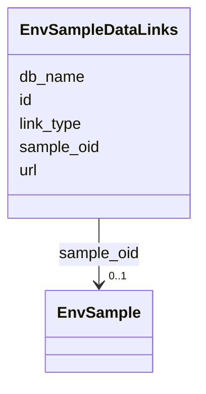

# Class: EnvSampleDataLinks 


URI: [imgsg_dev:EnvSampleDataLinks](https://w3id.org/jgi/imgsg_dev/EnvSampleDataLinks)





<!-- no inheritance hierarchy -->


## Slots

| Name | Cardinality and Range | Description | Inheritance |
| ---  | --- | --- | --- |
| [sample_oid](sample_oid.md) | 0..1 <br/> [EnvSample](EnvSample.md) | Foreign key to env_sample | direct |
| [db_name](db_name.md) | 0..1 <br/> [String](String.md) |  | direct |
| [id](id.md) | 0..1 <br/> [String](String.md) |  | direct |
| [url](url.md) | 0..1 <br/> [String](String.md) |  | direct |
| [link_type](link_type.md) | 0..1 <br/> [String](String.md) |  | direct |


## Identifier and Mapping Information


### Schema Source


* from schema: https://w3id.org/jgi/imgsg_dev


## Mappings

| Mapping Type | Mapped Value |
| ---  | ---  |
| self | imgsg_dev:EnvSampleDataLinks |
| native | imgsg_dev:EnvSampleDataLinks |


## LinkML Source

<!-- TODO: investigate https://stackoverflow.com/questions/37606292/how-to-create-tabbed-code-blocks-in-mkdocs-or-sphinx -->

### Direct

<details>
```yaml
name: env_sample_data_links
from_schema: https://w3id.org/jgi/imgsg_dev
attributes:
  sample_oid:
    name: sample_oid
    description: Foreign key to env_sample
    from_schema: https://w3id.org/jgi/imgsg_dev
    domain_of:
    - contact_sample_perms
    - env_sample
    - env_sample_data_links
    - env_sample_diseases
    - env_sample_energy_source
    - env_sample_habitat_type
    - env_sample_jgi_url
    - env_sample_metabolism
    - env_sample_misc_meta_data
    - env_sample_phenotypes
    - env_sample_seq_method
    - gold_analysis_project_lookup
    - gold_analysis_project_lookup2
    - project_info
    - project_info_04112013
    - project_info_bioproject
    - project_info_biosample
    - submission
    - submission_samples
    - vsample
    range: env_sample
    required: false
  db_name:
    name: db_name
    from_schema: https://w3id.org/jgi/imgsg_dev
    rank: 1000
    domain_of:
    - env_sample_data_links
    - env_sample_jgi_url
    - project_info_data_links
    - project_info_data_links_112013
    - project_info_jgi_url
    range: string
    required: false
  id:
    name: id
    from_schema: https://w3id.org/jgi/imgsg_dev
    domain_of:
    - dacc_logon
    - env_sample_data_links
    - gold_ap_genbank
    - master_list
    - oprop
    - ora_aspnet_personaliznperuser
    - ora_aspnet_sitemap
    - pig_genbank_emailed_accs
    - pig_reruns
    - pig_retractions
    - pig_tracks
    - plan_table
    - plan_table_20131114
    - project_info_data_links
    - project_info_data_links_112013
    - t_reddy_test
    - workflow_stats
    range: string
    required: false
  url:
    name: url
    from_schema: https://w3id.org/jgi/imgsg_dev
    rank: 1000
    domain_of:
    - env_sample_data_links
    - env_sample_jgi_url
    - gold_sp_collaborator
    - gold_sp_seq_center
    - institutes
    - luseq_center
    - ora_aspnet_sitemap
    - project_info_data_links
    - project_info_data_links_112013
    - project_info_jgi_url
    - t_institutes_bak
    range: string
    required: false
  link_type:
    name: link_type
    from_schema: https://w3id.org/jgi/imgsg_dev
    rank: 1000
    domain_of:
    - env_sample_data_links
    - project_info_data_links
    - project_info_data_links_112013
    range: string
    required: false

```
</details>

### Induced

<details>
```yaml
name: env_sample_data_links
from_schema: https://w3id.org/jgi/imgsg_dev
attributes:
  sample_oid:
    name: sample_oid
    description: Foreign key to env_sample
    from_schema: https://w3id.org/jgi/imgsg_dev
    alias: sample_oid
    owner: env_sample_data_links
    domain_of:
    - contact_sample_perms
    - env_sample
    - env_sample_data_links
    - env_sample_diseases
    - env_sample_energy_source
    - env_sample_habitat_type
    - env_sample_jgi_url
    - env_sample_metabolism
    - env_sample_misc_meta_data
    - env_sample_phenotypes
    - env_sample_seq_method
    - gold_analysis_project_lookup
    - gold_analysis_project_lookup2
    - project_info
    - project_info_04112013
    - project_info_bioproject
    - project_info_biosample
    - submission
    - submission_samples
    - vsample
    range: env_sample
    required: false
  db_name:
    name: db_name
    from_schema: https://w3id.org/jgi/imgsg_dev
    rank: 1000
    alias: db_name
    owner: env_sample_data_links
    domain_of:
    - env_sample_data_links
    - env_sample_jgi_url
    - project_info_data_links
    - project_info_data_links_112013
    - project_info_jgi_url
    range: string
    required: false
  id:
    name: id
    from_schema: https://w3id.org/jgi/imgsg_dev
    alias: id
    owner: env_sample_data_links
    domain_of:
    - dacc_logon
    - env_sample_data_links
    - gold_ap_genbank
    - master_list
    - oprop
    - ora_aspnet_personaliznperuser
    - ora_aspnet_sitemap
    - pig_genbank_emailed_accs
    - pig_reruns
    - pig_retractions
    - pig_tracks
    - plan_table
    - plan_table_20131114
    - project_info_data_links
    - project_info_data_links_112013
    - t_reddy_test
    - workflow_stats
    range: string
    required: false
  url:
    name: url
    from_schema: https://w3id.org/jgi/imgsg_dev
    rank: 1000
    alias: url
    owner: env_sample_data_links
    domain_of:
    - env_sample_data_links
    - env_sample_jgi_url
    - gold_sp_collaborator
    - gold_sp_seq_center
    - institutes
    - luseq_center
    - ora_aspnet_sitemap
    - project_info_data_links
    - project_info_data_links_112013
    - project_info_jgi_url
    - t_institutes_bak
    range: string
    required: false
  link_type:
    name: link_type
    from_schema: https://w3id.org/jgi/imgsg_dev
    rank: 1000
    alias: link_type
    owner: env_sample_data_links
    domain_of:
    - env_sample_data_links
    - project_info_data_links
    - project_info_data_links_112013
    range: string
    required: false

```
</details>