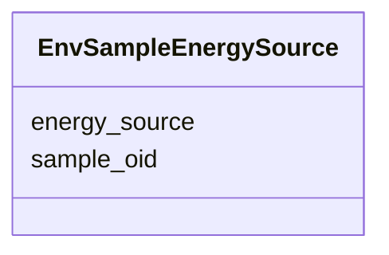

# Class: EnvSampleEnergySource 


URI: [imgsg_dev:EnvSampleEnergySource](https://w3id.org/jgi/imgsg_dev/EnvSampleEnergySource)





<!-- no inheritance hierarchy -->


## Slots

| Name | Cardinality and Range | Description | Inheritance |
| ---  | --- | --- | --- |
| [sample_oid](sample_oid.md) | 0..1 <br/> [Integer](Integer.md) |  | direct |
| [energy_source](energy_source.md) | 0..1 <br/> [String](String.md) |  | direct |


## Identifier and Mapping Information


### Schema Source


* from schema: https://w3id.org/jgi/imgsg_dev


## Mappings

| Mapping Type | Mapped Value |
| ---  | ---  |
| self | imgsg_dev:EnvSampleEnergySource |
| native | imgsg_dev:EnvSampleEnergySource |


## LinkML Source

<!-- TODO: investigate https://stackoverflow.com/questions/37606292/how-to-create-tabbed-code-blocks-in-mkdocs-or-sphinx -->

### Direct

<details>
```yaml
name: env_sample_energy_source
from_schema: https://w3id.org/jgi/imgsg_dev
attributes:
  sample_oid:
    name: sample_oid
    from_schema: https://w3id.org/jgi/imgsg_dev
    domain_of:
    - contact_sample_perms
    - env_sample
    - env_sample_data_links
    - env_sample_diseases
    - env_sample_energy_source
    - env_sample_habitat_type
    - env_sample_jgi_url
    - env_sample_metabolism
    - env_sample_misc_meta_data
    - env_sample_phenotypes
    - env_sample_seq_method
    - gold_analysis_project_lookup
    - gold_analysis_project_lookup2
    - project_info
    - project_info_04112013
    - project_info_bioproject
    - project_info_biosample
    - submission
    - submission_samples
    - vsample
    range: integer
    required: false
  energy_source:
    name: energy_source
    from_schema: https://w3id.org/jgi/imgsg_dev
    rank: 1000
    domain_of:
    - env_sample_energy_source
    - gold_sp_energy_source
    - project_info_energy_source
    range: string
    required: false

```
</details>

### Induced

<details>
```yaml
name: env_sample_energy_source
from_schema: https://w3id.org/jgi/imgsg_dev
attributes:
  sample_oid:
    name: sample_oid
    from_schema: https://w3id.org/jgi/imgsg_dev
    alias: sample_oid
    owner: env_sample_energy_source
    domain_of:
    - contact_sample_perms
    - env_sample
    - env_sample_data_links
    - env_sample_diseases
    - env_sample_energy_source
    - env_sample_habitat_type
    - env_sample_jgi_url
    - env_sample_metabolism
    - env_sample_misc_meta_data
    - env_sample_phenotypes
    - env_sample_seq_method
    - gold_analysis_project_lookup
    - gold_analysis_project_lookup2
    - project_info
    - project_info_04112013
    - project_info_bioproject
    - project_info_biosample
    - submission
    - submission_samples
    - vsample
    range: integer
    required: false
  energy_source:
    name: energy_source
    from_schema: https://w3id.org/jgi/imgsg_dev
    rank: 1000
    alias: energy_source
    owner: env_sample_energy_source
    domain_of:
    - env_sample_energy_source
    - gold_sp_energy_source
    - project_info_energy_source
    range: string
    required: false

```
</details>