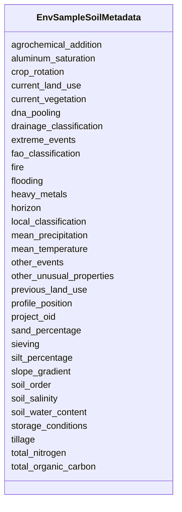

# Class: EnvSampleSoilMetadata 


URI: [imgsg_dev:EnvSampleSoilMetadata](https://w3id.org/jgi/imgsg_dev/EnvSampleSoilMetadata)





<!-- no inheritance hierarchy -->


## Slots

| Name | Cardinality and Range | Description | Inheritance |
| ---  | --- | --- | --- |
| [project_oid](project_oid.md) | 0..1 <br/> [Integer](Integer.md) |  | direct |
| [current_land_use](current_land_use.md) | 0..1 <br/> [String](String.md) |  | direct |
| [current_vegetation](current_vegetation.md) | 0..1 <br/> [String](String.md) |  | direct |
| [previous_land_use](previous_land_use.md) | 0..1 <br/> [String](String.md) |  | direct |
| [crop_rotation](crop_rotation.md) | 0..1 <br/> [String](String.md) |  | direct |
| [agrochemical_addition](agrochemical_addition.md) | 0..1 <br/> [String](String.md) |  | direct |
| [tillage](tillage.md) | 0..1 <br/> [String](String.md) |  | direct |
| [fire](fire.md) | 0..1 <br/> [String](String.md) |  | direct |
| [flooding](flooding.md) | 0..1 <br/> [String](String.md) |  | direct |
| [extreme_events](extreme_events.md) | 0..1 <br/> [String](String.md) |  | direct |
| [other_events](other_events.md) | 0..1 <br/> [String](String.md) |  | direct |
| [horizon](horizon.md) | 0..1 <br/> [String](String.md) |  | direct |
| [sieving](sieving.md) | 0..1 <br/> [String](String.md) |  | direct |
| [soil_water_content](soil_water_content.md) | 0..1 <br/> [String](String.md) |  | direct |
| [dna_pooling](dna_pooling.md) | 0..1 <br/> [String](String.md) |  | direct |
| [storage_conditions](storage_conditions.md) | 0..1 <br/> [String](String.md) |  | direct |
| [mean_temperature](mean_temperature.md) | 0..1 <br/> [String](String.md) |  | direct |
| [mean_precipitation](mean_precipitation.md) | 0..1 <br/> [String](String.md) |  | direct |
| [fao_classification](fao_classification.md) | 0..1 <br/> [String](String.md) |  | direct |
| [local_classification](local_classification.md) | 0..1 <br/> [String](String.md) |  | direct |
| [soil_order](soil_order.md) | 0..1 <br/> [String](String.md) |  | direct |
| [slope_gradient](slope_gradient.md) | 0..1 <br/> [String](String.md) |  | direct |
| [profile_position](profile_position.md) | 0..1 <br/> [String](String.md) |  | direct |
| [drainage_classification](drainage_classification.md) | 0..1 <br/> [String](String.md) |  | direct |
| [sand_percentage](sand_percentage.md) | 0..1 <br/> [String](String.md) |  | direct |
| [silt_percentage](silt_percentage.md) | 0..1 <br/> [String](String.md) |  | direct |
| [total_organic_carbon](total_organic_carbon.md) | 0..1 <br/> [String](String.md) |  | direct |
| [total_nitrogen](total_nitrogen.md) | 0..1 <br/> [String](String.md) |  | direct |
| [soil_salinity](soil_salinity.md) | 0..1 <br/> [String](String.md) |  | direct |
| [heavy_metals](heavy_metals.md) | 0..1 <br/> [String](String.md) |  | direct |
| [aluminum_saturation](aluminum_saturation.md) | 0..1 <br/> [String](String.md) |  | direct |
| [other_unusual_properties](other_unusual_properties.md) | 0..1 <br/> [String](String.md) |  | direct |


## Identifier and Mapping Information


### Schema Source


* from schema: https://w3id.org/jgi/imgsg_dev


## Mappings

| Mapping Type | Mapped Value |
| ---  | ---  |
| self | imgsg_dev:EnvSampleSoilMetadata |
| native | imgsg_dev:EnvSampleSoilMetadata |


## LinkML Source

<!-- TODO: investigate https://stackoverflow.com/questions/37606292/how-to-create-tabbed-code-blocks-in-mkdocs-or-sphinx -->

### Direct

<details>
```yaml
name: env_sample_soil_metadata
from_schema: https://w3id.org/jgi/imgsg_dev
attributes:
  project_oid:
    name: project_oid
    from_schema: https://w3id.org/jgi/imgsg_dev
    domain_of:
    - bioproject_propagation
    - biosample
    - data_quality_flags
    - env_sample_soil_metadata
    - genbank_refseq_crossover
    - gold_analysis_project_lookup
    - gold_analysis_project_lookup2
    - gold_img_nat_prod_entity
    - ncbi_accessions
    - ncbi_accessions_jbtest
    - proj_info_cell_arrange_042014
    - project_info
    - project_info_04112013
    - project_info_bioproject
    - project_info_body_products
    - project_info_body_sites
    - project_info_cell_arrangement
    - project_info_collaborators
    - project_info_cyano_metadata
    - project_info_data_links
    - project_info_data_links_112013
    - project_info_diseases
    - project_info_energy_source
    - project_info_habitat
    - project_info_jgi_url
    - project_info_metabolism
    - project_info_natural_prods
    - project_info_nitrogen_fixation
    - project_info_nprods_metadata
    - project_info_phenotypes
    - project_info_project_relevance
    - project_info_seq_method
    - project_meta_updates
    - study_load
    - t_alex_test
    - t_all_gold_jgi_projects
    range: integer
    required: false
  current_land_use:
    name: current_land_use
    from_schema: https://w3id.org/jgi/imgsg_dev
    rank: 1000
    domain_of:
    - env_sample_soil_metadata
    range: string
    required: false
  current_vegetation:
    name: current_vegetation
    from_schema: https://w3id.org/jgi/imgsg_dev
    rank: 1000
    domain_of:
    - env_sample_soil_metadata
    range: string
    required: false
  previous_land_use:
    name: previous_land_use
    from_schema: https://w3id.org/jgi/imgsg_dev
    rank: 1000
    domain_of:
    - env_sample_soil_metadata
    range: string
    required: false
  crop_rotation:
    name: crop_rotation
    from_schema: https://w3id.org/jgi/imgsg_dev
    rank: 1000
    domain_of:
    - env_sample_soil_metadata
    range: string
    required: false
  agrochemical_addition:
    name: agrochemical_addition
    from_schema: https://w3id.org/jgi/imgsg_dev
    rank: 1000
    domain_of:
    - env_sample_soil_metadata
    range: string
    required: false
  tillage:
    name: tillage
    from_schema: https://w3id.org/jgi/imgsg_dev
    rank: 1000
    domain_of:
    - env_sample_soil_metadata
    range: string
    required: false
  fire:
    name: fire
    from_schema: https://w3id.org/jgi/imgsg_dev
    rank: 1000
    domain_of:
    - env_sample_soil_metadata
    range: string
    required: false
  flooding:
    name: flooding
    from_schema: https://w3id.org/jgi/imgsg_dev
    rank: 1000
    domain_of:
    - env_sample_soil_metadata
    range: string
    required: false
  extreme_events:
    name: extreme_events
    from_schema: https://w3id.org/jgi/imgsg_dev
    rank: 1000
    domain_of:
    - env_sample_soil_metadata
    range: string
    required: false
  other_events:
    name: other_events
    from_schema: https://w3id.org/jgi/imgsg_dev
    rank: 1000
    domain_of:
    - env_sample_soil_metadata
    range: string
    required: false
  horizon:
    name: horizon
    from_schema: https://w3id.org/jgi/imgsg_dev
    rank: 1000
    domain_of:
    - env_sample_soil_metadata
    range: string
    required: false
  sieving:
    name: sieving
    from_schema: https://w3id.org/jgi/imgsg_dev
    rank: 1000
    domain_of:
    - env_sample_soil_metadata
    range: string
    required: false
  soil_water_content:
    name: soil_water_content
    from_schema: https://w3id.org/jgi/imgsg_dev
    rank: 1000
    domain_of:
    - env_sample_soil_metadata
    range: string
    required: false
  dna_pooling:
    name: dna_pooling
    from_schema: https://w3id.org/jgi/imgsg_dev
    rank: 1000
    domain_of:
    - env_sample_soil_metadata
    range: string
    required: false
  storage_conditions:
    name: storage_conditions
    from_schema: https://w3id.org/jgi/imgsg_dev
    rank: 1000
    domain_of:
    - env_sample_soil_metadata
    range: string
    required: false
  mean_temperature:
    name: mean_temperature
    from_schema: https://w3id.org/jgi/imgsg_dev
    rank: 1000
    domain_of:
    - env_sample_soil_metadata
    range: string
    required: false
  mean_precipitation:
    name: mean_precipitation
    from_schema: https://w3id.org/jgi/imgsg_dev
    rank: 1000
    domain_of:
    - env_sample_soil_metadata
    range: string
    required: false
  fao_classification:
    name: fao_classification
    from_schema: https://w3id.org/jgi/imgsg_dev
    rank: 1000
    domain_of:
    - env_sample_soil_metadata
    range: string
    required: false
  local_classification:
    name: local_classification
    from_schema: https://w3id.org/jgi/imgsg_dev
    rank: 1000
    domain_of:
    - env_sample_soil_metadata
    range: string
    required: false
  soil_order:
    name: soil_order
    from_schema: https://w3id.org/jgi/imgsg_dev
    rank: 1000
    domain_of:
    - env_sample_soil_metadata
    range: string
    required: false
  slope_gradient:
    name: slope_gradient
    from_schema: https://w3id.org/jgi/imgsg_dev
    rank: 1000
    domain_of:
    - env_sample_soil_metadata
    range: string
    required: false
  profile_position:
    name: profile_position
    from_schema: https://w3id.org/jgi/imgsg_dev
    rank: 1000
    domain_of:
    - env_sample_soil_metadata
    range: string
    required: false
  drainage_classification:
    name: drainage_classification
    from_schema: https://w3id.org/jgi/imgsg_dev
    rank: 1000
    domain_of:
    - env_sample_soil_metadata
    range: string
    required: false
  sand_percentage:
    name: sand_percentage
    from_schema: https://w3id.org/jgi/imgsg_dev
    rank: 1000
    domain_of:
    - env_sample_soil_metadata
    range: string
    required: false
  silt_percentage:
    name: silt_percentage
    from_schema: https://w3id.org/jgi/imgsg_dev
    rank: 1000
    domain_of:
    - env_sample_soil_metadata
    range: string
    required: false
  total_organic_carbon:
    name: total_organic_carbon
    from_schema: https://w3id.org/jgi/imgsg_dev
    rank: 1000
    domain_of:
    - env_sample_soil_metadata
    range: string
    required: false
  total_nitrogen:
    name: total_nitrogen
    from_schema: https://w3id.org/jgi/imgsg_dev
    rank: 1000
    domain_of:
    - env_sample_soil_metadata
    range: string
    required: false
  soil_salinity:
    name: soil_salinity
    from_schema: https://w3id.org/jgi/imgsg_dev
    rank: 1000
    domain_of:
    - env_sample_soil_metadata
    range: string
    required: false
  heavy_metals:
    name: heavy_metals
    from_schema: https://w3id.org/jgi/imgsg_dev
    rank: 1000
    domain_of:
    - env_sample_soil_metadata
    range: string
    required: false
  aluminum_saturation:
    name: aluminum_saturation
    from_schema: https://w3id.org/jgi/imgsg_dev
    rank: 1000
    domain_of:
    - env_sample_soil_metadata
    range: string
    required: false
  other_unusual_properties:
    name: other_unusual_properties
    from_schema: https://w3id.org/jgi/imgsg_dev
    rank: 1000
    domain_of:
    - env_sample_soil_metadata
    range: string
    required: false

```
</details>

### Induced

<details>
```yaml
name: env_sample_soil_metadata
from_schema: https://w3id.org/jgi/imgsg_dev
attributes:
  project_oid:
    name: project_oid
    from_schema: https://w3id.org/jgi/imgsg_dev
    alias: project_oid
    owner: env_sample_soil_metadata
    domain_of:
    - bioproject_propagation
    - biosample
    - data_quality_flags
    - env_sample_soil_metadata
    - genbank_refseq_crossover
    - gold_analysis_project_lookup
    - gold_analysis_project_lookup2
    - gold_img_nat_prod_entity
    - ncbi_accessions
    - ncbi_accessions_jbtest
    - proj_info_cell_arrange_042014
    - project_info
    - project_info_04112013
    - project_info_bioproject
    - project_info_body_products
    - project_info_body_sites
    - project_info_cell_arrangement
    - project_info_collaborators
    - project_info_cyano_metadata
    - project_info_data_links
    - project_info_data_links_112013
    - project_info_diseases
    - project_info_energy_source
    - project_info_habitat
    - project_info_jgi_url
    - project_info_metabolism
    - project_info_natural_prods
    - project_info_nitrogen_fixation
    - project_info_nprods_metadata
    - project_info_phenotypes
    - project_info_project_relevance
    - project_info_seq_method
    - project_meta_updates
    - study_load
    - t_alex_test
    - t_all_gold_jgi_projects
    range: integer
    required: false
  current_land_use:
    name: current_land_use
    from_schema: https://w3id.org/jgi/imgsg_dev
    rank: 1000
    alias: current_land_use
    owner: env_sample_soil_metadata
    domain_of:
    - env_sample_soil_metadata
    range: string
    required: false
  current_vegetation:
    name: current_vegetation
    from_schema: https://w3id.org/jgi/imgsg_dev
    rank: 1000
    alias: current_vegetation
    owner: env_sample_soil_metadata
    domain_of:
    - env_sample_soil_metadata
    range: string
    required: false
  previous_land_use:
    name: previous_land_use
    from_schema: https://w3id.org/jgi/imgsg_dev
    rank: 1000
    alias: previous_land_use
    owner: env_sample_soil_metadata
    domain_of:
    - env_sample_soil_metadata
    range: string
    required: false
  crop_rotation:
    name: crop_rotation
    from_schema: https://w3id.org/jgi/imgsg_dev
    rank: 1000
    alias: crop_rotation
    owner: env_sample_soil_metadata
    domain_of:
    - env_sample_soil_metadata
    range: string
    required: false
  agrochemical_addition:
    name: agrochemical_addition
    from_schema: https://w3id.org/jgi/imgsg_dev
    rank: 1000
    alias: agrochemical_addition
    owner: env_sample_soil_metadata
    domain_of:
    - env_sample_soil_metadata
    range: string
    required: false
  tillage:
    name: tillage
    from_schema: https://w3id.org/jgi/imgsg_dev
    rank: 1000
    alias: tillage
    owner: env_sample_soil_metadata
    domain_of:
    - env_sample_soil_metadata
    range: string
    required: false
  fire:
    name: fire
    from_schema: https://w3id.org/jgi/imgsg_dev
    rank: 1000
    alias: fire
    owner: env_sample_soil_metadata
    domain_of:
    - env_sample_soil_metadata
    range: string
    required: false
  flooding:
    name: flooding
    from_schema: https://w3id.org/jgi/imgsg_dev
    rank: 1000
    alias: flooding
    owner: env_sample_soil_metadata
    domain_of:
    - env_sample_soil_metadata
    range: string
    required: false
  extreme_events:
    name: extreme_events
    from_schema: https://w3id.org/jgi/imgsg_dev
    rank: 1000
    alias: extreme_events
    owner: env_sample_soil_metadata
    domain_of:
    - env_sample_soil_metadata
    range: string
    required: false
  other_events:
    name: other_events
    from_schema: https://w3id.org/jgi/imgsg_dev
    rank: 1000
    alias: other_events
    owner: env_sample_soil_metadata
    domain_of:
    - env_sample_soil_metadata
    range: string
    required: false
  horizon:
    name: horizon
    from_schema: https://w3id.org/jgi/imgsg_dev
    rank: 1000
    alias: horizon
    owner: env_sample_soil_metadata
    domain_of:
    - env_sample_soil_metadata
    range: string
    required: false
  sieving:
    name: sieving
    from_schema: https://w3id.org/jgi/imgsg_dev
    rank: 1000
    alias: sieving
    owner: env_sample_soil_metadata
    domain_of:
    - env_sample_soil_metadata
    range: string
    required: false
  soil_water_content:
    name: soil_water_content
    from_schema: https://w3id.org/jgi/imgsg_dev
    rank: 1000
    alias: soil_water_content
    owner: env_sample_soil_metadata
    domain_of:
    - env_sample_soil_metadata
    range: string
    required: false
  dna_pooling:
    name: dna_pooling
    from_schema: https://w3id.org/jgi/imgsg_dev
    rank: 1000
    alias: dna_pooling
    owner: env_sample_soil_metadata
    domain_of:
    - env_sample_soil_metadata
    range: string
    required: false
  storage_conditions:
    name: storage_conditions
    from_schema: https://w3id.org/jgi/imgsg_dev
    rank: 1000
    alias: storage_conditions
    owner: env_sample_soil_metadata
    domain_of:
    - env_sample_soil_metadata
    range: string
    required: false
  mean_temperature:
    name: mean_temperature
    from_schema: https://w3id.org/jgi/imgsg_dev
    rank: 1000
    alias: mean_temperature
    owner: env_sample_soil_metadata
    domain_of:
    - env_sample_soil_metadata
    range: string
    required: false
  mean_precipitation:
    name: mean_precipitation
    from_schema: https://w3id.org/jgi/imgsg_dev
    rank: 1000
    alias: mean_precipitation
    owner: env_sample_soil_metadata
    domain_of:
    - env_sample_soil_metadata
    range: string
    required: false
  fao_classification:
    name: fao_classification
    from_schema: https://w3id.org/jgi/imgsg_dev
    rank: 1000
    alias: fao_classification
    owner: env_sample_soil_metadata
    domain_of:
    - env_sample_soil_metadata
    range: string
    required: false
  local_classification:
    name: local_classification
    from_schema: https://w3id.org/jgi/imgsg_dev
    rank: 1000
    alias: local_classification
    owner: env_sample_soil_metadata
    domain_of:
    - env_sample_soil_metadata
    range: string
    required: false
  soil_order:
    name: soil_order
    from_schema: https://w3id.org/jgi/imgsg_dev
    rank: 1000
    alias: soil_order
    owner: env_sample_soil_metadata
    domain_of:
    - env_sample_soil_metadata
    range: string
    required: false
  slope_gradient:
    name: slope_gradient
    from_schema: https://w3id.org/jgi/imgsg_dev
    rank: 1000
    alias: slope_gradient
    owner: env_sample_soil_metadata
    domain_of:
    - env_sample_soil_metadata
    range: string
    required: false
  profile_position:
    name: profile_position
    from_schema: https://w3id.org/jgi/imgsg_dev
    rank: 1000
    alias: profile_position
    owner: env_sample_soil_metadata
    domain_of:
    - env_sample_soil_metadata
    range: string
    required: false
  drainage_classification:
    name: drainage_classification
    from_schema: https://w3id.org/jgi/imgsg_dev
    rank: 1000
    alias: drainage_classification
    owner: env_sample_soil_metadata
    domain_of:
    - env_sample_soil_metadata
    range: string
    required: false
  sand_percentage:
    name: sand_percentage
    from_schema: https://w3id.org/jgi/imgsg_dev
    rank: 1000
    alias: sand_percentage
    owner: env_sample_soil_metadata
    domain_of:
    - env_sample_soil_metadata
    range: string
    required: false
  silt_percentage:
    name: silt_percentage
    from_schema: https://w3id.org/jgi/imgsg_dev
    rank: 1000
    alias: silt_percentage
    owner: env_sample_soil_metadata
    domain_of:
    - env_sample_soil_metadata
    range: string
    required: false
  total_organic_carbon:
    name: total_organic_carbon
    from_schema: https://w3id.org/jgi/imgsg_dev
    rank: 1000
    alias: total_organic_carbon
    owner: env_sample_soil_metadata
    domain_of:
    - env_sample_soil_metadata
    range: string
    required: false
  total_nitrogen:
    name: total_nitrogen
    from_schema: https://w3id.org/jgi/imgsg_dev
    rank: 1000
    alias: total_nitrogen
    owner: env_sample_soil_metadata
    domain_of:
    - env_sample_soil_metadata
    range: string
    required: false
  soil_salinity:
    name: soil_salinity
    from_schema: https://w3id.org/jgi/imgsg_dev
    rank: 1000
    alias: soil_salinity
    owner: env_sample_soil_metadata
    domain_of:
    - env_sample_soil_metadata
    range: string
    required: false
  heavy_metals:
    name: heavy_metals
    from_schema: https://w3id.org/jgi/imgsg_dev
    rank: 1000
    alias: heavy_metals
    owner: env_sample_soil_metadata
    domain_of:
    - env_sample_soil_metadata
    range: string
    required: false
  aluminum_saturation:
    name: aluminum_saturation
    from_schema: https://w3id.org/jgi/imgsg_dev
    rank: 1000
    alias: aluminum_saturation
    owner: env_sample_soil_metadata
    domain_of:
    - env_sample_soil_metadata
    range: string
    required: false
  other_unusual_properties:
    name: other_unusual_properties
    from_schema: https://w3id.org/jgi/imgsg_dev
    rank: 1000
    alias: other_unusual_properties
    owner: env_sample_soil_metadata
    domain_of:
    - env_sample_soil_metadata
    range: string
    required: false

```
</details>