# Class: GoldAnalysisProject 


URI: [imgsg_dev:GoldAnalysisProject](https://w3id.org/jgi/imgsg_dev/GoldAnalysisProject)

```mermaid
 classDiagram
    class GoldAnalysisProject
    click GoldAnalysisProject href "../GoldAnalysisProject/"
      GoldAnalysisProject : analysis_product_name
        
      GoldAnalysisProject : analysis_project_name
        
      GoldAnalysisProject : assembly_method
        
      GoldAnalysisProject : binning_method
        
      GoldAnalysisProject : caliban_id
        
      GoldAnalysisProject : comments
        
      GoldAnalysisProject : completion_date
        
      GoldAnalysisProject : contig_count
        
      GoldAnalysisProject : culture_type
        
      GoldAnalysisProject : cultured
        
      GoldAnalysisProject : domain
        
      GoldAnalysisProject : ecosystem
        
      GoldAnalysisProject : ecosystem_category
        
      GoldAnalysisProject : ecosystem_subtype
        
      GoldAnalysisProject : ecosystem_type
        
      GoldAnalysisProject : external
        
      GoldAnalysisProject : genbank_low_quality_annotation
        
      GoldAnalysisProject : genbank_low_quality_genome
        
      GoldAnalysisProject : gene_calling_method
        
      GoldAnalysisProject : gene_count
        
      GoldAnalysisProject : gene_primp_date
        
      GoldAnalysisProject : genome_size
        
      GoldAnalysisProject : genome_type
        
      GoldAnalysisProject : genus
        
      GoldAnalysisProject : gold_analysis_project_id
        
      GoldAnalysisProject : gold_analysis_project_type
        
      GoldAnalysisProject : gold_id
        
      GoldAnalysisProject : gold_phylogeny
        
      GoldAnalysisProject : gold_proposal_name
        
      GoldAnalysisProject : img_analysis_complete
        
      GoldAnalysisProject : img_annotation_version
        
      GoldAnalysisProject : img_dataset_id
        
      GoldAnalysisProject : img_use
        
      GoldAnalysisProject : is_assembled
        
      GoldAnalysisProject : is_decontamination
        
      GoldAnalysisProject : is_genbank_anomalous_assembly
        
      GoldAnalysisProject : is_gene_primp
        
      GoldAnalysisProject : is_img_annotation
        
      GoldAnalysisProject : its_analysis_project_id
        
      GoldAnalysisProject : its_analysis_project_name
        
      GoldAnalysisProject : its_annotation_at_id
        
      GoldAnalysisProject : its_assembly_at_id
        
      GoldAnalysisProject : its_data_utilization_status
        
      GoldAnalysisProject : jgi_sequenced
        
      GoldAnalysisProject : locus_tag
        
      GoldAnalysisProject : mod_date
        
      GoldAnalysisProject : ncbi_class
        
      GoldAnalysisProject : ncbi_family
        
      GoldAnalysisProject : ncbi_genus
        
      GoldAnalysisProject : ncbi_order
        
      GoldAnalysisProject : ncbi_phylum
        
      GoldAnalysisProject : ncbi_species
        
      GoldAnalysisProject : ncbi_superkingdom
        
      GoldAnalysisProject : ncbi_tax_id
        
      GoldAnalysisProject : pi_email
        
      GoldAnalysisProject : pi_name
        
      GoldAnalysisProject : pipeline_version
        
      GoldAnalysisProject : reference_gold_ap_id
        
      GoldAnalysisProject : reference_gold_id
        
      GoldAnalysisProject : reference_img_experiment_id
        
      GoldAnalysisProject : reference_img_oid
        
      GoldAnalysisProject : review_status
        
      GoldAnalysisProject : scaffold_count
        
      GoldAnalysisProject : sequencing_depth
        
      GoldAnalysisProject : species
        
      GoldAnalysisProject : specific_ecosystem
        
      GoldAnalysisProject : specimen
        
      GoldAnalysisProject : status
        
      GoldAnalysisProject : strain
        
      GoldAnalysisProject : study_gold_id
        
      GoldAnalysisProject : submission_id
        
      GoldAnalysisProject : submission_type
        
      GoldAnalysisProject : submitter_contact_oid
        
      GoldAnalysisProject : submitter_email
        
      GoldAnalysisProject : uncultured_type
        
      GoldAnalysisProject : visibility
        
      
```





<!-- no inheritance hierarchy -->


## Slots

| Name | Cardinality and Range | Description | Inheritance |
| ---  | --- | --- | --- |
| [gold_analysis_project_id](gold_analysis_project_id.md) | 0..1 <br/> [Integer](Integer.md) |  | direct |
| [its_analysis_project_id](its_analysis_project_id.md) | 0..1 <br/> [Integer](Integer.md) |  | direct |
| [analysis_project_name](analysis_project_name.md) | 0..1 <br/> [String](String.md) |  | direct |
| [ncbi_tax_id](ncbi_tax_id.md) | 0..1 <br/> [Integer](Integer.md) |  | direct |
| [img_dataset_id](img_dataset_id.md) | 0..1 <br/> [String](String.md) |  | direct |
| [analysis_product_name](analysis_product_name.md) | 0..1 <br/> [String](String.md) |  | direct |
| [visibility](visibility.md) | 0..1 <br/> [String](String.md) |  | direct |
| [domain](domain.md) | 0..1 <br/> [String](String.md) |  | direct |
| [ncbi_phylum](ncbi_phylum.md) | 0..1 <br/> [String](String.md) |  | direct |
| [ncbi_class](ncbi_class.md) | 0..1 <br/> [String](String.md) |  | direct |
| [ncbi_order](ncbi_order.md) | 0..1 <br/> [String](String.md) |  | direct |
| [ncbi_family](ncbi_family.md) | 0..1 <br/> [String](String.md) |  | direct |
| [ncbi_genus](ncbi_genus.md) | 0..1 <br/> [String](String.md) |  | direct |
| [ncbi_species](ncbi_species.md) | 0..1 <br/> [String](String.md) |  | direct |
| [gold_analysis_project_type](gold_analysis_project_type.md) | 0..1 <br/> [String](String.md) |  | direct |
| [gold_proposal_name](gold_proposal_name.md) | 0..1 <br/> [String](String.md) |  | direct |
| [ecosystem](ecosystem.md) | 0..1 <br/> [String](String.md) |  | direct |
| [ecosystem_category](ecosystem_category.md) | 0..1 <br/> [String](String.md) |  | direct |
| [ecosystem_subtype](ecosystem_subtype.md) | 0..1 <br/> [String](String.md) |  | direct |
| [specific_ecosystem](specific_ecosystem.md) | 0..1 <br/> [String](String.md) |  | direct |
| [reference_img_oid](reference_img_oid.md) | 0..1 <br/> [Integer](Integer.md) |  | direct |
| [pi_name](pi_name.md) | 0..1 <br/> [String](String.md) |  | direct |
| [pi_email](pi_email.md) | 0..1 <br/> [String](String.md) |  | direct |
| [submitter_contact_oid](submitter_contact_oid.md) | 0..1 <br/> [Integer](Integer.md) |  | direct |
| [ecosystem_type](ecosystem_type.md) | 0..1 <br/> [String](String.md) |  | direct |
| [specimen](specimen.md) | 0..1 <br/> [String](String.md) |  | direct |
| [comments](comments.md) | 0..1 <br/> [String](String.md) |  | direct |
| [reference_img_experiment_id](reference_img_experiment_id.md) | 0..1 <br/> [Integer](Integer.md) |  | direct |
| [reference_gold_ap_id](reference_gold_ap_id.md) | 0..1 <br/> [Integer](Integer.md) |  | direct |
| [gold_id](gold_id.md) | 0..1 <br/> [String](String.md) |  | direct |
| [genome_size](genome_size.md) | 0..1 <br/> [Integer](Integer.md) |  | direct |
| [gene_count](gene_count.md) | 0..1 <br/> [Integer](Integer.md) |  | direct |
| [scaffold_count](scaffold_count.md) | 0..1 <br/> [Integer](Integer.md) |  | direct |
| [its_analysis_project_name](its_analysis_project_name.md) | 0..1 <br/> [String](String.md) |  | direct |
| [contig_count](contig_count.md) | 0..1 <br/> [Integer](Integer.md) |  | direct |
| [genbank_low_quality_annotation](genbank_low_quality_annotation.md) | 0..1 <br/> [String](String.md) |  | direct |
| [genbank_low_quality_genome](genbank_low_quality_genome.md) | 0..1 <br/> [String](String.md) |  | direct |
| [completion_date](completion_date.md) | 0..1 <br/> [Datetime](Datetime.md) |  | direct |
| [binning_method](binning_method.md) | 0..1 <br/> [String](String.md) |  | direct |
| [gene_calling_method](gene_calling_method.md) | 0..1 <br/> [String](String.md) |  | direct |
| [submission_id](submission_id.md) | 0..1 <br/> [Integer](Integer.md) |  | direct |
| [img_analysis_complete](img_analysis_complete.md) | 0..1 <br/> [String](String.md) |  | direct |
| [status](status.md) | 0..1 <br/> [String](String.md) |  | direct |
| [is_gene_primp](is_gene_primp.md) | 0..1 <br/> [String](String.md) |  | direct |
| [gene_primp_date](gene_primp_date.md) | 0..1 <br/> [Datetime](Datetime.md) |  | direct |
| [is_decontamination](is_decontamination.md) | 0..1 <br/> [String](String.md) |  | direct |
| [is_img_annotation](is_img_annotation.md) | 0..1 <br/> [String](String.md) |  | direct |
| [its_annotation_at_id](its_annotation_at_id.md) | 0..1 <br/> [Integer](Integer.md) |  | direct |
| [its_assembly_at_id](its_assembly_at_id.md) | 0..1 <br/> [Integer](Integer.md) |  | direct |
| [is_assembled](is_assembled.md) | 0..1 <br/> [String](String.md) |  | direct |
| [genome_type](genome_type.md) | 0..1 <br/> [String](String.md) |  | direct |
| [study_gold_id](study_gold_id.md) | 0..1 <br/> [String](String.md) |  | direct |
| [locus_tag](locus_tag.md) | 0..1 <br/> [String](String.md) |  | direct |
| [cultured](cultured.md) | 0..1 <br/> [String](String.md) |  | direct |
| [jgi_sequenced](jgi_sequenced.md) | 0..1 <br/> [String](String.md) |  | direct |
| [reference_gold_id](reference_gold_id.md) | 0..1 <br/> [String](String.md) |  | direct |
| [strain](strain.md) | 0..1 <br/> [String](String.md) |  | direct |
| [mod_date](mod_date.md) | 0..1 <br/> [Datetime](Datetime.md) |  | direct |
| [submission_type](submission_type.md) | 0..1 <br/> [String](String.md) |  | direct |
| [submitter_email](submitter_email.md) | 0..1 <br/> [String](String.md) |  | direct |
| [review_status](review_status.md) | 0..1 <br/> [String](String.md) |  | direct |
| [caliban_id](caliban_id.md) | 0..1 <br/> [Integer](Integer.md) |  | direct |
| [assembly_method](assembly_method.md) | 0..1 <br/> [String](String.md) |  | direct |
| [genus](genus.md) | 0..1 <br/> [String](String.md) |  | direct |
| [species](species.md) | 0..1 <br/> [String](String.md) |  | direct |
| [sequencing_depth](sequencing_depth.md) | 0..1 <br/> [String](String.md) |  | direct |
| [img_use](img_use.md) | 0..1 <br/> [String](String.md) |  | direct |
| [gold_phylogeny](gold_phylogeny.md) | 0..1 <br/> [String](String.md) |  | direct |
| [uncultured_type](uncultured_type.md) | 0..1 <br/> [String](String.md) |  | direct |
| [culture_type](culture_type.md) | 0..1 <br/> [String](String.md) |  | direct |
| [ncbi_superkingdom](ncbi_superkingdom.md) | 0..1 <br/> [String](String.md) |  | direct |
| [external](external.md) | 0..1 <br/> [String](String.md) |  | direct |
| [pipeline_version](pipeline_version.md) | 0..1 <br/> [String](String.md) |  | direct |
| [its_data_utilization_status](its_data_utilization_status.md) | 0..1 <br/> [String](String.md) |  | direct |
| [is_genbank_anomalous_assembly](is_genbank_anomalous_assembly.md) | 0..1 <br/> [String](String.md) |  | direct |
| [img_annotation_version](img_annotation_version.md) | 0..1 <br/> [String](String.md) |  | direct |


## Usages

| used by | used in | type | used |
| ---  | --- | --- | --- |
| [GoldAnalysisProjectLookup2](GoldAnalysisProjectLookup2.md) | [gold_id](gold_id.md) | range | [GoldAnalysisProject](GoldAnalysisProject.md) |
| [GoldAnalysisProjectUsers](GoldAnalysisProjectUsers.md) | [gold_id](gold_id.md) | range | [GoldAnalysisProject](GoldAnalysisProject.md) |


## Identifier and Mapping Information


### Schema Source


* from schema: https://w3id.org/jgi/imgsg_dev


## Mappings

| Mapping Type | Mapped Value |
| ---  | ---  |
| self | imgsg_dev:GoldAnalysisProject |
| native | imgsg_dev:GoldAnalysisProject |


## LinkML Source

<!-- TODO: investigate https://stackoverflow.com/questions/37606292/how-to-create-tabbed-code-blocks-in-mkdocs-or-sphinx -->

### Direct

<details>
```yaml
name: gold_analysis_project
from_schema: https://w3id.org/jgi/imgsg_dev
attributes:
  gold_analysis_project_id:
    name: gold_analysis_project_id
    from_schema: https://w3id.org/jgi/imgsg_dev
    rank: 1000
    domain_of:
    - gold_analysis_project
    - gold_analysis_project_lookup
    - gold_ap_genbank
    - ncbi_accessions
    - v5_ap_imperfect_view
    range: integer
    required: false
  its_analysis_project_id:
    name: its_analysis_project_id
    from_schema: https://w3id.org/jgi/imgsg_dev
    rank: 1000
    domain_of:
    - gold_analysis_project
    - v5_ap_imperfect_view
    range: integer
    required: false
  analysis_project_name:
    name: analysis_project_name
    from_schema: https://w3id.org/jgi/imgsg_dev
    rank: 1000
    domain_of:
    - gold_analysis_project
    - v5_ap_imperfect_view
    range: string
    required: false
  ncbi_tax_id:
    name: ncbi_tax_id
    from_schema: https://w3id.org/jgi/imgsg_dev
    rank: 1000
    domain_of:
    - gold_analysis_project
    - v5_ap_imperfect_view
    range: integer
    required: false
  img_dataset_id:
    name: img_dataset_id
    from_schema: https://w3id.org/jgi/imgsg_dev
    rank: 1000
    domain_of:
    - gold_analysis_project
    - v5_ap_imperfect_view
    range: string
    required: false
  analysis_product_name:
    name: analysis_product_name
    from_schema: https://w3id.org/jgi/imgsg_dev
    rank: 1000
    domain_of:
    - gold_analysis_project
    - v5_ap_imperfect_view
    range: string
    required: false
  visibility:
    name: visibility
    from_schema: https://w3id.org/jgi/imgsg_dev
    rank: 1000
    domain_of:
    - gold_analysis_project
    - v5_ap_imperfect_view
    range: string
    required: false
  domain:
    name: domain
    from_schema: https://w3id.org/jgi/imgsg_dev
    rank: 1000
    domain_of:
    - gold_analysis_project
    - gold_sequencing_project
    - organism_sort
    - project_info
    - project_info_04112013
    - v5_ap_imperfect_view
    range: string
    required: false
  ncbi_phylum:
    name: ncbi_phylum
    from_schema: https://w3id.org/jgi/imgsg_dev
    rank: 1000
    domain_of:
    - gold_analysis_project
    - gold_sequencing_project
    - organism_sort
    - project_info
    - project_info_04112013
    - v5_ap_imperfect_view
    range: string
    required: false
  ncbi_class:
    name: ncbi_class
    from_schema: https://w3id.org/jgi/imgsg_dev
    rank: 1000
    domain_of:
    - gold_analysis_project
    - gold_sequencing_project
    - organism_sort
    - project_info
    - project_info_04112013
    - v5_ap_imperfect_view
    range: string
    required: false
  ncbi_order:
    name: ncbi_order
    from_schema: https://w3id.org/jgi/imgsg_dev
    rank: 1000
    domain_of:
    - gold_analysis_project
    - gold_sequencing_project
    - organism_sort
    - project_info
    - project_info_04112013
    - v5_ap_imperfect_view
    range: string
    required: false
  ncbi_family:
    name: ncbi_family
    from_schema: https://w3id.org/jgi/imgsg_dev
    rank: 1000
    domain_of:
    - gold_analysis_project
    - gold_sequencing_project
    - project_info
    - project_info_04112013
    - v5_ap_imperfect_view
    range: string
    required: false
  ncbi_genus:
    name: ncbi_genus
    from_schema: https://w3id.org/jgi/imgsg_dev
    rank: 1000
    domain_of:
    - gold_analysis_project
    - gold_sequencing_project
    - organism_sort
    - project_info
    - project_info_04112013
    - v5_ap_imperfect_view
    range: string
    required: false
  ncbi_species:
    name: ncbi_species
    from_schema: https://w3id.org/jgi/imgsg_dev
    rank: 1000
    domain_of:
    - gold_analysis_project
    - gold_sequencing_project
    - organism_sort
    - project_info
    - project_info_04112013
    - v5_ap_imperfect_view
    range: string
    required: false
  gold_analysis_project_type:
    name: gold_analysis_project_type
    from_schema: https://w3id.org/jgi/imgsg_dev
    rank: 1000
    domain_of:
    - gold_analysis_project
    - v5_ap_imperfect_view
    range: string
    required: false
  gold_proposal_name:
    name: gold_proposal_name
    from_schema: https://w3id.org/jgi/imgsg_dev
    rank: 1000
    domain_of:
    - gold_analysis_project
    - v5_ap_imperfect_view
    range: string
    required: false
  ecosystem:
    name: ecosystem
    from_schema: https://w3id.org/jgi/imgsg_dev
    domain_of:
    - cvecosystem
    - env_sample
    - gold_analysis_project
    - gold_sequencing_project
    - gold_study
    - metagenomic_class_nodes
    - metagenomic_class_nodes_new
    - metagenomic_class_nodes_new_bk
    - metagenomic_classification
    - project_info
    - project_info_04112013
    - v5_ap_imperfect_view
    - vsample
    range: string
    required: false
  ecosystem_category:
    name: ecosystem_category
    from_schema: https://w3id.org/jgi/imgsg_dev
    domain_of:
    - cvecosystem_category
    - env_sample
    - gold_analysis_project
    - gold_sequencing_project
    - gold_study
    - metagenomic_class_nodes
    - metagenomic_class_nodes_new
    - metagenomic_class_nodes_new_bk
    - metagenomic_classification
    - project_info
    - project_info_04112013
    - v5_ap_imperfect_view
    - vsample
    range: string
    required: false
  ecosystem_subtype:
    name: ecosystem_subtype
    from_schema: https://w3id.org/jgi/imgsg_dev
    domain_of:
    - cvecosystem_subtype
    - env_sample
    - gold_analysis_project
    - gold_sequencing_project
    - gold_study
    - metagenomic_class_nodes
    - metagenomic_class_nodes_new
    - metagenomic_class_nodes_new_bk
    - metagenomic_classification
    - project_info
    - project_info_04112013
    - v5_ap_imperfect_view
    - vsample
    range: string
    required: false
  specific_ecosystem:
    name: specific_ecosystem
    from_schema: https://w3id.org/jgi/imgsg_dev
    domain_of:
    - cvspecific_ecosystem
    - env_sample
    - gold_analysis_project
    - gold_sequencing_project
    - gold_study
    - metagenomic_class_nodes
    - metagenomic_class_nodes_new
    - metagenomic_class_nodes_new_bk
    - metagenomic_classification
    - project_info
    - project_info_04112013
    - v5_ap_imperfect_view
    - vsample
    range: string
    required: false
  reference_img_oid:
    name: reference_img_oid
    from_schema: https://w3id.org/jgi/imgsg_dev
    rank: 1000
    domain_of:
    - gold_analysis_project
    range: integer
    required: false
  pi_name:
    name: pi_name
    from_schema: https://w3id.org/jgi/imgsg_dev
    rank: 1000
    domain_of:
    - gold_analysis_project
    - gold_sequencing_project
    - v5_ap_imperfect_view
    range: string
    required: false
  pi_email:
    name: pi_email
    from_schema: https://w3id.org/jgi/imgsg_dev
    rank: 1000
    domain_of:
    - gold_analysis_project
    - gold_sequencing_project
    - rnaseq_notify_phajek
    - rnaseq_notify_phajek_dev
    - v5_ap_imperfect_view
    range: string
    required: false
  submitter_contact_oid:
    name: submitter_contact_oid
    from_schema: https://w3id.org/jgi/imgsg_dev
    rank: 1000
    domain_of:
    - gold_analysis_project
    - v5_ap_imperfect_view
    range: integer
    required: false
  ecosystem_type:
    name: ecosystem_type
    from_schema: https://w3id.org/jgi/imgsg_dev
    domain_of:
    - cvecosystem_type
    - env_sample
    - gold_analysis_project
    - gold_sequencing_project
    - gold_study
    - metagenomic_class_nodes
    - metagenomic_class_nodes_new
    - metagenomic_class_nodes_new_bk
    - metagenomic_classification
    - project_info
    - project_info_04112013
    - v5_ap_imperfect_view
    - vsample
    range: string
    required: false
  specimen:
    name: specimen
    from_schema: https://w3id.org/jgi/imgsg_dev
    rank: 1000
    domain_of:
    - gold_analysis_project
    - v5_ap_imperfect_view
    range: string
    required: false
  comments:
    name: comments
    from_schema: https://w3id.org/jgi/imgsg_dev
    domain_of:
    - assembly
    - cancelled_user
    - contact
    - env_sample
    - gold_analysis_project
    - gold_sequencing_project
    - img_group
    - ora_aspnet_membership
    - project_info
    - project_info_04112013
    - project_info_genbank_authors
    - project_info_nitrogen_fixation
    - request_account
    - submission
    - submission_history
    - submission_proc_steps
    - v5_ap_imperfect_view
    - vsample
    range: string
    required: false
  reference_img_experiment_id:
    name: reference_img_experiment_id
    from_schema: https://w3id.org/jgi/imgsg_dev
    rank: 1000
    domain_of:
    - gold_analysis_project
    range: integer
    required: false
  reference_gold_ap_id:
    name: reference_gold_ap_id
    from_schema: https://w3id.org/jgi/imgsg_dev
    rank: 1000
    domain_of:
    - gold_analysis_project
    - v5_ap_imperfect_view
    range: integer
    required: false
  gold_id:
    name: gold_id
    from_schema: https://w3id.org/jgi/imgsg_dev
    domain_of:
    - analysis_project_permissions
    - env_sample
    - gold_analysis_project
    - gold_analysis_project_genbanks
    - gold_analysis_project_jgi_award_dois
    - gold_analysis_project_lookup
    - gold_analysis_project_lookup2
    - gold_analysis_project_sra_runs
    - gold_analysis_project_users
    - gold_ap_genbank_anomalous_reasons
    - gold_ap_publications
    - gold_sequencing_project
    - gold_sp_cell_arrangement
    - gold_sp_collaborator
    - gold_sp_disease
    - gold_sp_energy_source
    - gold_sp_genome_publications
    - gold_sp_habitat
    - gold_sp_metabolism
    - gold_sp_phenotype
    - gold_sp_relevance
    - gold_sp_seq_center
    - gold_sp_seq_method
    - gold_sp_sra
    - gold_sp_study_gold_id
    - gold_study
    - gold_study_info
    - rnaseq_notify_phajek
    - rnaseq_notify_phajek_dev
    - study_load
    - v5_ap_imperfect_view
    - vsample
    range: string
    required: false
  genome_size:
    name: genome_size
    from_schema: https://w3id.org/jgi/imgsg_dev
    rank: 1000
    domain_of:
    - gold_analysis_project
    range: integer
    required: false
  gene_count:
    name: gene_count
    from_schema: https://w3id.org/jgi/imgsg_dev
    domain_of:
    - env_sample
    - gold_analysis_project
    - project_info
    - project_info_04112013
    - vsample
    range: integer
    required: false
  scaffold_count:
    name: scaffold_count
    from_schema: https://w3id.org/jgi/imgsg_dev
    domain_of:
    - env_sample
    - gold_analysis_project
    - project_info
    - project_info_04112013
    - submission
    - v5_ap_imperfect_view
    range: integer
    required: false
  its_analysis_project_name:
    name: its_analysis_project_name
    from_schema: https://w3id.org/jgi/imgsg_dev
    rank: 1000
    domain_of:
    - gold_analysis_project
    - v5_ap_imperfect_view
    range: string
    required: false
  contig_count:
    name: contig_count
    from_schema: https://w3id.org/jgi/imgsg_dev
    domain_of:
    - env_sample
    - gold_analysis_project
    - pig_tracks
    - project_info
    - project_info_04112013
    - project_info_genbank
    - v5_ap_imperfect_view
    - vsample
    range: integer
    required: false
  genbank_low_quality_annotation:
    name: genbank_low_quality_annotation
    from_schema: https://w3id.org/jgi/imgsg_dev
    rank: 1000
    domain_of:
    - gold_analysis_project
    - project_info
    range: string
    required: false
  genbank_low_quality_genome:
    name: genbank_low_quality_genome
    from_schema: https://w3id.org/jgi/imgsg_dev
    rank: 1000
    domain_of:
    - gold_analysis_project
    - project_info
    range: string
    required: false
  completion_date:
    name: completion_date
    from_schema: https://w3id.org/jgi/imgsg_dev
    rank: 1000
    domain_of:
    - gold_analysis_project
    - project_info
    - project_info_04112013
    range: datetime
    required: false
  binning_method:
    name: binning_method
    from_schema: https://w3id.org/jgi/imgsg_dev
    domain_of:
    - env_sample
    - gold_analysis_project
    - project_info
    - project_info_04112013
    - vsample
    range: string
    required: false
  gene_calling_method:
    name: gene_calling_method
    from_schema: https://w3id.org/jgi/imgsg_dev
    domain_of:
    - env_sample
    - gold_analysis_project
    - project_info
    - project_info_04112013
    - vsample
    range: string
    required: false
  submission_id:
    name: submission_id
    from_schema: https://w3id.org/jgi/imgsg_dev
    domain_of:
    - annotation_contigs_proteins_counts
    - annotation_job_sbatch_args
    - annotation_job_stats
    - annotation_step_stats
    - bad_depth_file_warnings
    - bioproject_propagation
    - gold_analysis_project
    - mer_submissions_queue
    - merfs_aggregate_file_size
    - phajek_test
    - pig_tracks
    - project_info_bioproject
    - project_info_biosample
    - project_info_genbank
    - rnaseq_notify_phajek
    - rnaseq_notify_phajek_dev
    - submission
    - submission_data_files
    - submission_data_files_dmpath
    - submission_history
    - submission_img_contacts
    - submission_proc_stats
    - submission_proc_steps
    - submission_reads_file
    - submission_samples
    - t1_audit
    - v5_ap_imperfect_view
    range: integer
    required: false
  img_analysis_complete:
    name: img_analysis_complete
    from_schema: https://w3id.org/jgi/imgsg_dev
    rank: 1000
    domain_of:
    - gold_analysis_project
    range: string
    required: false
  status:
    name: status
    from_schema: https://w3id.org/jgi/imgsg_dev
    rank: 1000
    domain_of:
    - gold_analysis_project
    - lanl_project
    - load_genbank_prok_data
    - mer_submissions_queue
    - merfs_aggregate_file_size
    - ornl_project
    - request_account
    - submission
    - submission_history
    - t_jgi_catalogue
    - v5_ap_imperfect_view
    range: string
    required: false
  is_gene_primp:
    name: is_gene_primp
    from_schema: https://w3id.org/jgi/imgsg_dev
    rank: 1000
    domain_of:
    - gold_analysis_project
    - v5_ap_imperfect_view
    range: string
    required: false
  gene_primp_date:
    name: gene_primp_date
    from_schema: https://w3id.org/jgi/imgsg_dev
    rank: 1000
    domain_of:
    - gold_analysis_project
    - v5_ap_imperfect_view
    range: datetime
    required: false
  is_decontamination:
    name: is_decontamination
    from_schema: https://w3id.org/jgi/imgsg_dev
    rank: 1000
    domain_of:
    - gold_analysis_project
    - v5_ap_imperfect_view
    range: string
    required: false
  is_img_annotation:
    name: is_img_annotation
    from_schema: https://w3id.org/jgi/imgsg_dev
    rank: 1000
    domain_of:
    - gold_analysis_project
    range: string
    required: false
  its_annotation_at_id:
    name: its_annotation_at_id
    from_schema: https://w3id.org/jgi/imgsg_dev
    rank: 1000
    domain_of:
    - gold_analysis_project
    - goldv5_view
    - v5_ap_imperfect_view
    range: integer
    required: false
  its_assembly_at_id:
    name: its_assembly_at_id
    from_schema: https://w3id.org/jgi/imgsg_dev
    rank: 1000
    domain_of:
    - gold_analysis_project
    - v5_ap_imperfect_view
    range: integer
    required: false
  is_assembled:
    name: is_assembled
    from_schema: https://w3id.org/jgi/imgsg_dev
    rank: 1000
    domain_of:
    - gold_analysis_project
    - v5_ap_imperfect_view
    range: string
    required: false
  genome_type:
    name: genome_type
    from_schema: https://w3id.org/jgi/imgsg_dev
    domain_of:
    - assembly
    - gold_analysis_project
    range: string
    required: false
  study_gold_id:
    name: study_gold_id
    from_schema: https://w3id.org/jgi/imgsg_dev
    rank: 1000
    domain_of:
    - gold_analysis_project
    - gold_sp_study_gold_id
    - goldv5_view
    - v5_ap_imperfect_view
    range: string
    required: false
  locus_tag:
    name: locus_tag
    from_schema: https://w3id.org/jgi/imgsg_dev
    rank: 1000
    domain_of:
    - gold_analysis_project
    - gold_sequencing_project
    - project_info
    - project_info_04112013
    range: string
    required: false
  cultured:
    name: cultured
    from_schema: https://w3id.org/jgi/imgsg_dev
    rank: 1000
    domain_of:
    - gold_analysis_project
    - gold_sequencing_project
    - project_info
    - project_info_04112013
    range: string
    required: false
  jgi_sequenced:
    name: jgi_sequenced
    from_schema: https://w3id.org/jgi/imgsg_dev
    rank: 1000
    domain_of:
    - gold_analysis_project
    range: string
    required: false
  reference_gold_id:
    name: reference_gold_id
    from_schema: https://w3id.org/jgi/imgsg_dev
    rank: 1000
    domain_of:
    - gold_analysis_project
    range: string
    required: false
  strain:
    name: strain
    from_schema: https://w3id.org/jgi/imgsg_dev
    rank: 1000
    domain_of:
    - gold_analysis_project
    - gold_sequencing_project
    - organism_sort
    - project_info
    - project_info_04112013
    - project_info_biosample
    range: string
    required: false
  mod_date:
    name: mod_date
    from_schema: https://w3id.org/jgi/imgsg_dev
    domain_of:
    - announcement
    - cancelled_user
    - env_sample
    - gold_analysis_project
    - gold_sequencing_project
    - gold_study
    - img_group_news
    - lanl_project
    - ornl_project
    - project_info
    - project_info_04112013
    - project_info_natural_prods
    - request_account
    - study_load
    - submission
    - submission_history
    - vsample
    range: datetime
    required: false
  submission_type:
    name: submission_type
    from_schema: https://w3id.org/jgi/imgsg_dev
    rank: 1000
    domain_of:
    - gold_analysis_project
    range: string
    required: false
  submitter_email:
    name: submitter_email
    from_schema: https://w3id.org/jgi/imgsg_dev
    rank: 1000
    domain_of:
    - gold_analysis_project
    - v5_ap_imperfect_view
    range: string
    required: false
  review_status:
    name: review_status
    from_schema: https://w3id.org/jgi/imgsg_dev
    rank: 1000
    domain_of:
    - gold_analysis_project
    range: string
    required: false
  caliban_id:
    name: caliban_id
    from_schema: https://w3id.org/jgi/imgsg_dev
    domain_of:
    - contact
    - gold_analysis_project
    - gold_analysis_project_users
    range: integer
    required: false
  assembly_method:
    name: assembly_method
    from_schema: https://w3id.org/jgi/imgsg_dev
    domain_of:
    - env_sample
    - gold_analysis_project
    - pig_tracks
    - project_info
    - project_info_04112013
    - project_info_genbank
    - vsample
    range: string
    required: false
  genus:
    name: genus
    from_schema: https://w3id.org/jgi/imgsg_dev
    rank: 1000
    domain_of:
    - gold_analysis_project
    - gold_sequencing_project
    - organism_sort
    - project_info
    - project_info_04112013
    range: string
    required: false
  species:
    name: species
    from_schema: https://w3id.org/jgi/imgsg_dev
    rank: 1000
    domain_of:
    - gold_analysis_project
    - gold_sequencing_project
    - organism_sort
    - project_info
    - project_info_04112013
    range: string
    required: false
  sequencing_depth:
    name: sequencing_depth
    from_schema: https://w3id.org/jgi/imgsg_dev
    rank: 1000
    domain_of:
    - gold_analysis_project
    - gold_sequencing_project
    range: string
    required: false
  img_use:
    name: img_use
    from_schema: https://w3id.org/jgi/imgsg_dev
    rank: 1000
    domain_of:
    - gold_analysis_project
    range: string
    required: false
  gold_phylogeny:
    name: gold_phylogeny
    from_schema: https://w3id.org/jgi/imgsg_dev
    rank: 1000
    domain_of:
    - gold_analysis_project
    range: string
    required: false
  uncultured_type:
    name: uncultured_type
    from_schema: https://w3id.org/jgi/imgsg_dev
    rank: 1000
    domain_of:
    - gold_analysis_project
    - gold_sequencing_project
    - project_info
    - project_info_04112013
    range: string
    required: false
  culture_type:
    name: culture_type
    from_schema: https://w3id.org/jgi/imgsg_dev
    rank: 1000
    domain_of:
    - gold_analysis_project
    - gold_sequencing_project
    - pig_retractions
    - project_info
    - project_info_04112013
    range: string
    required: false
  ncbi_superkingdom:
    name: ncbi_superkingdom
    from_schema: https://w3id.org/jgi/imgsg_dev
    rank: 1000
    domain_of:
    - gold_analysis_project
    - project_info
    - project_info_04112013
    range: string
    required: false
  external:
    name: external
    from_schema: https://w3id.org/jgi/imgsg_dev
    rank: 1000
    domain_of:
    - gold_analysis_project
    range: string
    required: false
  pipeline_version:
    name: pipeline_version
    from_schema: https://w3id.org/jgi/imgsg_dev
    rank: 1000
    domain_of:
    - gold_analysis_project
    - reprocess_submissions_phajek
    - reprocess_with_coverage_phajek
    range: string
    required: false
  its_data_utilization_status:
    name: its_data_utilization_status
    from_schema: https://w3id.org/jgi/imgsg_dev
    rank: 1000
    domain_of:
    - gold_analysis_project
    - gold_sequencing_project
    range: string
    required: false
  is_genbank_anomalous_assembly:
    name: is_genbank_anomalous_assembly
    from_schema: https://w3id.org/jgi/imgsg_dev
    rank: 1000
    domain_of:
    - gold_analysis_project
    range: string
    required: false
  img_annotation_version:
    name: img_annotation_version
    from_schema: https://w3id.org/jgi/imgsg_dev
    rank: 1000
    domain_of:
    - gold_analysis_project
    range: string
    required: false

```
</details>

### Induced

<details>
```yaml
name: gold_analysis_project
from_schema: https://w3id.org/jgi/imgsg_dev
attributes:
  gold_analysis_project_id:
    name: gold_analysis_project_id
    from_schema: https://w3id.org/jgi/imgsg_dev
    rank: 1000
    alias: gold_analysis_project_id
    owner: gold_analysis_project
    domain_of:
    - gold_analysis_project
    - gold_analysis_project_lookup
    - gold_ap_genbank
    - ncbi_accessions
    - v5_ap_imperfect_view
    range: integer
    required: false
  its_analysis_project_id:
    name: its_analysis_project_id
    from_schema: https://w3id.org/jgi/imgsg_dev
    rank: 1000
    alias: its_analysis_project_id
    owner: gold_analysis_project
    domain_of:
    - gold_analysis_project
    - v5_ap_imperfect_view
    range: integer
    required: false
  analysis_project_name:
    name: analysis_project_name
    from_schema: https://w3id.org/jgi/imgsg_dev
    rank: 1000
    alias: analysis_project_name
    owner: gold_analysis_project
    domain_of:
    - gold_analysis_project
    - v5_ap_imperfect_view
    range: string
    required: false
  ncbi_tax_id:
    name: ncbi_tax_id
    from_schema: https://w3id.org/jgi/imgsg_dev
    rank: 1000
    alias: ncbi_tax_id
    owner: gold_analysis_project
    domain_of:
    - gold_analysis_project
    - v5_ap_imperfect_view
    range: integer
    required: false
  img_dataset_id:
    name: img_dataset_id
    from_schema: https://w3id.org/jgi/imgsg_dev
    rank: 1000
    alias: img_dataset_id
    owner: gold_analysis_project
    domain_of:
    - gold_analysis_project
    - v5_ap_imperfect_view
    range: string
    required: false
  analysis_product_name:
    name: analysis_product_name
    from_schema: https://w3id.org/jgi/imgsg_dev
    rank: 1000
    alias: analysis_product_name
    owner: gold_analysis_project
    domain_of:
    - gold_analysis_project
    - v5_ap_imperfect_view
    range: string
    required: false
  visibility:
    name: visibility
    from_schema: https://w3id.org/jgi/imgsg_dev
    rank: 1000
    alias: visibility
    owner: gold_analysis_project
    domain_of:
    - gold_analysis_project
    - v5_ap_imperfect_view
    range: string
    required: false
  domain:
    name: domain
    from_schema: https://w3id.org/jgi/imgsg_dev
    rank: 1000
    alias: domain
    owner: gold_analysis_project
    domain_of:
    - gold_analysis_project
    - gold_sequencing_project
    - organism_sort
    - project_info
    - project_info_04112013
    - v5_ap_imperfect_view
    range: string
    required: false
  ncbi_phylum:
    name: ncbi_phylum
    from_schema: https://w3id.org/jgi/imgsg_dev
    rank: 1000
    alias: ncbi_phylum
    owner: gold_analysis_project
    domain_of:
    - gold_analysis_project
    - gold_sequencing_project
    - organism_sort
    - project_info
    - project_info_04112013
    - v5_ap_imperfect_view
    range: string
    required: false
  ncbi_class:
    name: ncbi_class
    from_schema: https://w3id.org/jgi/imgsg_dev
    rank: 1000
    alias: ncbi_class
    owner: gold_analysis_project
    domain_of:
    - gold_analysis_project
    - gold_sequencing_project
    - organism_sort
    - project_info
    - project_info_04112013
    - v5_ap_imperfect_view
    range: string
    required: false
  ncbi_order:
    name: ncbi_order
    from_schema: https://w3id.org/jgi/imgsg_dev
    rank: 1000
    alias: ncbi_order
    owner: gold_analysis_project
    domain_of:
    - gold_analysis_project
    - gold_sequencing_project
    - organism_sort
    - project_info
    - project_info_04112013
    - v5_ap_imperfect_view
    range: string
    required: false
  ncbi_family:
    name: ncbi_family
    from_schema: https://w3id.org/jgi/imgsg_dev
    rank: 1000
    alias: ncbi_family
    owner: gold_analysis_project
    domain_of:
    - gold_analysis_project
    - gold_sequencing_project
    - project_info
    - project_info_04112013
    - v5_ap_imperfect_view
    range: string
    required: false
  ncbi_genus:
    name: ncbi_genus
    from_schema: https://w3id.org/jgi/imgsg_dev
    rank: 1000
    alias: ncbi_genus
    owner: gold_analysis_project
    domain_of:
    - gold_analysis_project
    - gold_sequencing_project
    - organism_sort
    - project_info
    - project_info_04112013
    - v5_ap_imperfect_view
    range: string
    required: false
  ncbi_species:
    name: ncbi_species
    from_schema: https://w3id.org/jgi/imgsg_dev
    rank: 1000
    alias: ncbi_species
    owner: gold_analysis_project
    domain_of:
    - gold_analysis_project
    - gold_sequencing_project
    - organism_sort
    - project_info
    - project_info_04112013
    - v5_ap_imperfect_view
    range: string
    required: false
  gold_analysis_project_type:
    name: gold_analysis_project_type
    from_schema: https://w3id.org/jgi/imgsg_dev
    rank: 1000
    alias: gold_analysis_project_type
    owner: gold_analysis_project
    domain_of:
    - gold_analysis_project
    - v5_ap_imperfect_view
    range: string
    required: false
  gold_proposal_name:
    name: gold_proposal_name
    from_schema: https://w3id.org/jgi/imgsg_dev
    rank: 1000
    alias: gold_proposal_name
    owner: gold_analysis_project
    domain_of:
    - gold_analysis_project
    - v5_ap_imperfect_view
    range: string
    required: false
  ecosystem:
    name: ecosystem
    from_schema: https://w3id.org/jgi/imgsg_dev
    alias: ecosystem
    owner: gold_analysis_project
    domain_of:
    - cvecosystem
    - env_sample
    - gold_analysis_project
    - gold_sequencing_project
    - gold_study
    - metagenomic_class_nodes
    - metagenomic_class_nodes_new
    - metagenomic_class_nodes_new_bk
    - metagenomic_classification
    - project_info
    - project_info_04112013
    - v5_ap_imperfect_view
    - vsample
    range: string
    required: false
  ecosystem_category:
    name: ecosystem_category
    from_schema: https://w3id.org/jgi/imgsg_dev
    alias: ecosystem_category
    owner: gold_analysis_project
    domain_of:
    - cvecosystem_category
    - env_sample
    - gold_analysis_project
    - gold_sequencing_project
    - gold_study
    - metagenomic_class_nodes
    - metagenomic_class_nodes_new
    - metagenomic_class_nodes_new_bk
    - metagenomic_classification
    - project_info
    - project_info_04112013
    - v5_ap_imperfect_view
    - vsample
    range: string
    required: false
  ecosystem_subtype:
    name: ecosystem_subtype
    from_schema: https://w3id.org/jgi/imgsg_dev
    alias: ecosystem_subtype
    owner: gold_analysis_project
    domain_of:
    - cvecosystem_subtype
    - env_sample
    - gold_analysis_project
    - gold_sequencing_project
    - gold_study
    - metagenomic_class_nodes
    - metagenomic_class_nodes_new
    - metagenomic_class_nodes_new_bk
    - metagenomic_classification
    - project_info
    - project_info_04112013
    - v5_ap_imperfect_view
    - vsample
    range: string
    required: false
  specific_ecosystem:
    name: specific_ecosystem
    from_schema: https://w3id.org/jgi/imgsg_dev
    alias: specific_ecosystem
    owner: gold_analysis_project
    domain_of:
    - cvspecific_ecosystem
    - env_sample
    - gold_analysis_project
    - gold_sequencing_project
    - gold_study
    - metagenomic_class_nodes
    - metagenomic_class_nodes_new
    - metagenomic_class_nodes_new_bk
    - metagenomic_classification
    - project_info
    - project_info_04112013
    - v5_ap_imperfect_view
    - vsample
    range: string
    required: false
  reference_img_oid:
    name: reference_img_oid
    from_schema: https://w3id.org/jgi/imgsg_dev
    rank: 1000
    alias: reference_img_oid
    owner: gold_analysis_project
    domain_of:
    - gold_analysis_project
    range: integer
    required: false
  pi_name:
    name: pi_name
    from_schema: https://w3id.org/jgi/imgsg_dev
    rank: 1000
    alias: pi_name
    owner: gold_analysis_project
    domain_of:
    - gold_analysis_project
    - gold_sequencing_project
    - v5_ap_imperfect_view
    range: string
    required: false
  pi_email:
    name: pi_email
    from_schema: https://w3id.org/jgi/imgsg_dev
    rank: 1000
    alias: pi_email
    owner: gold_analysis_project
    domain_of:
    - gold_analysis_project
    - gold_sequencing_project
    - rnaseq_notify_phajek
    - rnaseq_notify_phajek_dev
    - v5_ap_imperfect_view
    range: string
    required: false
  submitter_contact_oid:
    name: submitter_contact_oid
    from_schema: https://w3id.org/jgi/imgsg_dev
    rank: 1000
    alias: submitter_contact_oid
    owner: gold_analysis_project
    domain_of:
    - gold_analysis_project
    - v5_ap_imperfect_view
    range: integer
    required: false
  ecosystem_type:
    name: ecosystem_type
    from_schema: https://w3id.org/jgi/imgsg_dev
    alias: ecosystem_type
    owner: gold_analysis_project
    domain_of:
    - cvecosystem_type
    - env_sample
    - gold_analysis_project
    - gold_sequencing_project
    - gold_study
    - metagenomic_class_nodes
    - metagenomic_class_nodes_new
    - metagenomic_class_nodes_new_bk
    - metagenomic_classification
    - project_info
    - project_info_04112013
    - v5_ap_imperfect_view
    - vsample
    range: string
    required: false
  specimen:
    name: specimen
    from_schema: https://w3id.org/jgi/imgsg_dev
    rank: 1000
    alias: specimen
    owner: gold_analysis_project
    domain_of:
    - gold_analysis_project
    - v5_ap_imperfect_view
    range: string
    required: false
  comments:
    name: comments
    from_schema: https://w3id.org/jgi/imgsg_dev
    alias: comments
    owner: gold_analysis_project
    domain_of:
    - assembly
    - cancelled_user
    - contact
    - env_sample
    - gold_analysis_project
    - gold_sequencing_project
    - img_group
    - ora_aspnet_membership
    - project_info
    - project_info_04112013
    - project_info_genbank_authors
    - project_info_nitrogen_fixation
    - request_account
    - submission
    - submission_history
    - submission_proc_steps
    - v5_ap_imperfect_view
    - vsample
    range: string
    required: false
  reference_img_experiment_id:
    name: reference_img_experiment_id
    from_schema: https://w3id.org/jgi/imgsg_dev
    rank: 1000
    alias: reference_img_experiment_id
    owner: gold_analysis_project
    domain_of:
    - gold_analysis_project
    range: integer
    required: false
  reference_gold_ap_id:
    name: reference_gold_ap_id
    from_schema: https://w3id.org/jgi/imgsg_dev
    rank: 1000
    alias: reference_gold_ap_id
    owner: gold_analysis_project
    domain_of:
    - gold_analysis_project
    - v5_ap_imperfect_view
    range: integer
    required: false
  gold_id:
    name: gold_id
    from_schema: https://w3id.org/jgi/imgsg_dev
    alias: gold_id
    owner: gold_analysis_project
    domain_of:
    - analysis_project_permissions
    - env_sample
    - gold_analysis_project
    - gold_analysis_project_genbanks
    - gold_analysis_project_jgi_award_dois
    - gold_analysis_project_lookup
    - gold_analysis_project_lookup2
    - gold_analysis_project_sra_runs
    - gold_analysis_project_users
    - gold_ap_genbank_anomalous_reasons
    - gold_ap_publications
    - gold_sequencing_project
    - gold_sp_cell_arrangement
    - gold_sp_collaborator
    - gold_sp_disease
    - gold_sp_energy_source
    - gold_sp_genome_publications
    - gold_sp_habitat
    - gold_sp_metabolism
    - gold_sp_phenotype
    - gold_sp_relevance
    - gold_sp_seq_center
    - gold_sp_seq_method
    - gold_sp_sra
    - gold_sp_study_gold_id
    - gold_study
    - gold_study_info
    - rnaseq_notify_phajek
    - rnaseq_notify_phajek_dev
    - study_load
    - v5_ap_imperfect_view
    - vsample
    range: string
    required: false
  genome_size:
    name: genome_size
    from_schema: https://w3id.org/jgi/imgsg_dev
    rank: 1000
    alias: genome_size
    owner: gold_analysis_project
    domain_of:
    - gold_analysis_project
    range: integer
    required: false
  gene_count:
    name: gene_count
    from_schema: https://w3id.org/jgi/imgsg_dev
    alias: gene_count
    owner: gold_analysis_project
    domain_of:
    - env_sample
    - gold_analysis_project
    - project_info
    - project_info_04112013
    - vsample
    range: integer
    required: false
  scaffold_count:
    name: scaffold_count
    from_schema: https://w3id.org/jgi/imgsg_dev
    alias: scaffold_count
    owner: gold_analysis_project
    domain_of:
    - env_sample
    - gold_analysis_project
    - project_info
    - project_info_04112013
    - submission
    - v5_ap_imperfect_view
    range: integer
    required: false
  its_analysis_project_name:
    name: its_analysis_project_name
    from_schema: https://w3id.org/jgi/imgsg_dev
    rank: 1000
    alias: its_analysis_project_name
    owner: gold_analysis_project
    domain_of:
    - gold_analysis_project
    - v5_ap_imperfect_view
    range: string
    required: false
  contig_count:
    name: contig_count
    from_schema: https://w3id.org/jgi/imgsg_dev
    alias: contig_count
    owner: gold_analysis_project
    domain_of:
    - env_sample
    - gold_analysis_project
    - pig_tracks
    - project_info
    - project_info_04112013
    - project_info_genbank
    - v5_ap_imperfect_view
    - vsample
    range: integer
    required: false
  genbank_low_quality_annotation:
    name: genbank_low_quality_annotation
    from_schema: https://w3id.org/jgi/imgsg_dev
    rank: 1000
    alias: genbank_low_quality_annotation
    owner: gold_analysis_project
    domain_of:
    - gold_analysis_project
    - project_info
    range: string
    required: false
  genbank_low_quality_genome:
    name: genbank_low_quality_genome
    from_schema: https://w3id.org/jgi/imgsg_dev
    rank: 1000
    alias: genbank_low_quality_genome
    owner: gold_analysis_project
    domain_of:
    - gold_analysis_project
    - project_info
    range: string
    required: false
  completion_date:
    name: completion_date
    from_schema: https://w3id.org/jgi/imgsg_dev
    rank: 1000
    alias: completion_date
    owner: gold_analysis_project
    domain_of:
    - gold_analysis_project
    - project_info
    - project_info_04112013
    range: datetime
    required: false
  binning_method:
    name: binning_method
    from_schema: https://w3id.org/jgi/imgsg_dev
    alias: binning_method
    owner: gold_analysis_project
    domain_of:
    - env_sample
    - gold_analysis_project
    - project_info
    - project_info_04112013
    - vsample
    range: string
    required: false
  gene_calling_method:
    name: gene_calling_method
    from_schema: https://w3id.org/jgi/imgsg_dev
    alias: gene_calling_method
    owner: gold_analysis_project
    domain_of:
    - env_sample
    - gold_analysis_project
    - project_info
    - project_info_04112013
    - vsample
    range: string
    required: false
  submission_id:
    name: submission_id
    from_schema: https://w3id.org/jgi/imgsg_dev
    alias: submission_id
    owner: gold_analysis_project
    domain_of:
    - annotation_contigs_proteins_counts
    - annotation_job_sbatch_args
    - annotation_job_stats
    - annotation_step_stats
    - bad_depth_file_warnings
    - bioproject_propagation
    - gold_analysis_project
    - mer_submissions_queue
    - merfs_aggregate_file_size
    - phajek_test
    - pig_tracks
    - project_info_bioproject
    - project_info_biosample
    - project_info_genbank
    - rnaseq_notify_phajek
    - rnaseq_notify_phajek_dev
    - submission
    - submission_data_files
    - submission_data_files_dmpath
    - submission_history
    - submission_img_contacts
    - submission_proc_stats
    - submission_proc_steps
    - submission_reads_file
    - submission_samples
    - t1_audit
    - v5_ap_imperfect_view
    range: integer
    required: false
  img_analysis_complete:
    name: img_analysis_complete
    from_schema: https://w3id.org/jgi/imgsg_dev
    rank: 1000
    alias: img_analysis_complete
    owner: gold_analysis_project
    domain_of:
    - gold_analysis_project
    range: string
    required: false
  status:
    name: status
    from_schema: https://w3id.org/jgi/imgsg_dev
    rank: 1000
    alias: status
    owner: gold_analysis_project
    domain_of:
    - gold_analysis_project
    - lanl_project
    - load_genbank_prok_data
    - mer_submissions_queue
    - merfs_aggregate_file_size
    - ornl_project
    - request_account
    - submission
    - submission_history
    - t_jgi_catalogue
    - v5_ap_imperfect_view
    range: string
    required: false
  is_gene_primp:
    name: is_gene_primp
    from_schema: https://w3id.org/jgi/imgsg_dev
    rank: 1000
    alias: is_gene_primp
    owner: gold_analysis_project
    domain_of:
    - gold_analysis_project
    - v5_ap_imperfect_view
    range: string
    required: false
  gene_primp_date:
    name: gene_primp_date
    from_schema: https://w3id.org/jgi/imgsg_dev
    rank: 1000
    alias: gene_primp_date
    owner: gold_analysis_project
    domain_of:
    - gold_analysis_project
    - v5_ap_imperfect_view
    range: datetime
    required: false
  is_decontamination:
    name: is_decontamination
    from_schema: https://w3id.org/jgi/imgsg_dev
    rank: 1000
    alias: is_decontamination
    owner: gold_analysis_project
    domain_of:
    - gold_analysis_project
    - v5_ap_imperfect_view
    range: string
    required: false
  is_img_annotation:
    name: is_img_annotation
    from_schema: https://w3id.org/jgi/imgsg_dev
    rank: 1000
    alias: is_img_annotation
    owner: gold_analysis_project
    domain_of:
    - gold_analysis_project
    range: string
    required: false
  its_annotation_at_id:
    name: its_annotation_at_id
    from_schema: https://w3id.org/jgi/imgsg_dev
    rank: 1000
    alias: its_annotation_at_id
    owner: gold_analysis_project
    domain_of:
    - gold_analysis_project
    - goldv5_view
    - v5_ap_imperfect_view
    range: integer
    required: false
  its_assembly_at_id:
    name: its_assembly_at_id
    from_schema: https://w3id.org/jgi/imgsg_dev
    rank: 1000
    alias: its_assembly_at_id
    owner: gold_analysis_project
    domain_of:
    - gold_analysis_project
    - v5_ap_imperfect_view
    range: integer
    required: false
  is_assembled:
    name: is_assembled
    from_schema: https://w3id.org/jgi/imgsg_dev
    rank: 1000
    alias: is_assembled
    owner: gold_analysis_project
    domain_of:
    - gold_analysis_project
    - v5_ap_imperfect_view
    range: string
    required: false
  genome_type:
    name: genome_type
    from_schema: https://w3id.org/jgi/imgsg_dev
    alias: genome_type
    owner: gold_analysis_project
    domain_of:
    - assembly
    - gold_analysis_project
    range: string
    required: false
  study_gold_id:
    name: study_gold_id
    from_schema: https://w3id.org/jgi/imgsg_dev
    rank: 1000
    alias: study_gold_id
    owner: gold_analysis_project
    domain_of:
    - gold_analysis_project
    - gold_sp_study_gold_id
    - goldv5_view
    - v5_ap_imperfect_view
    range: string
    required: false
  locus_tag:
    name: locus_tag
    from_schema: https://w3id.org/jgi/imgsg_dev
    rank: 1000
    alias: locus_tag
    owner: gold_analysis_project
    domain_of:
    - gold_analysis_project
    - gold_sequencing_project
    - project_info
    - project_info_04112013
    range: string
    required: false
  cultured:
    name: cultured
    from_schema: https://w3id.org/jgi/imgsg_dev
    rank: 1000
    alias: cultured
    owner: gold_analysis_project
    domain_of:
    - gold_analysis_project
    - gold_sequencing_project
    - project_info
    - project_info_04112013
    range: string
    required: false
  jgi_sequenced:
    name: jgi_sequenced
    from_schema: https://w3id.org/jgi/imgsg_dev
    rank: 1000
    alias: jgi_sequenced
    owner: gold_analysis_project
    domain_of:
    - gold_analysis_project
    range: string
    required: false
  reference_gold_id:
    name: reference_gold_id
    from_schema: https://w3id.org/jgi/imgsg_dev
    rank: 1000
    alias: reference_gold_id
    owner: gold_analysis_project
    domain_of:
    - gold_analysis_project
    range: string
    required: false
  strain:
    name: strain
    from_schema: https://w3id.org/jgi/imgsg_dev
    rank: 1000
    alias: strain
    owner: gold_analysis_project
    domain_of:
    - gold_analysis_project
    - gold_sequencing_project
    - organism_sort
    - project_info
    - project_info_04112013
    - project_info_biosample
    range: string
    required: false
  mod_date:
    name: mod_date
    from_schema: https://w3id.org/jgi/imgsg_dev
    alias: mod_date
    owner: gold_analysis_project
    domain_of:
    - announcement
    - cancelled_user
    - env_sample
    - gold_analysis_project
    - gold_sequencing_project
    - gold_study
    - img_group_news
    - lanl_project
    - ornl_project
    - project_info
    - project_info_04112013
    - project_info_natural_prods
    - request_account
    - study_load
    - submission
    - submission_history
    - vsample
    range: datetime
    required: false
  submission_type:
    name: submission_type
    from_schema: https://w3id.org/jgi/imgsg_dev
    rank: 1000
    alias: submission_type
    owner: gold_analysis_project
    domain_of:
    - gold_analysis_project
    range: string
    required: false
  submitter_email:
    name: submitter_email
    from_schema: https://w3id.org/jgi/imgsg_dev
    rank: 1000
    alias: submitter_email
    owner: gold_analysis_project
    domain_of:
    - gold_analysis_project
    - v5_ap_imperfect_view
    range: string
    required: false
  review_status:
    name: review_status
    from_schema: https://w3id.org/jgi/imgsg_dev
    rank: 1000
    alias: review_status
    owner: gold_analysis_project
    domain_of:
    - gold_analysis_project
    range: string
    required: false
  caliban_id:
    name: caliban_id
    from_schema: https://w3id.org/jgi/imgsg_dev
    alias: caliban_id
    owner: gold_analysis_project
    domain_of:
    - contact
    - gold_analysis_project
    - gold_analysis_project_users
    range: integer
    required: false
  assembly_method:
    name: assembly_method
    from_schema: https://w3id.org/jgi/imgsg_dev
    alias: assembly_method
    owner: gold_analysis_project
    domain_of:
    - env_sample
    - gold_analysis_project
    - pig_tracks
    - project_info
    - project_info_04112013
    - project_info_genbank
    - vsample
    range: string
    required: false
  genus:
    name: genus
    from_schema: https://w3id.org/jgi/imgsg_dev
    rank: 1000
    alias: genus
    owner: gold_analysis_project
    domain_of:
    - gold_analysis_project
    - gold_sequencing_project
    - organism_sort
    - project_info
    - project_info_04112013
    range: string
    required: false
  species:
    name: species
    from_schema: https://w3id.org/jgi/imgsg_dev
    rank: 1000
    alias: species
    owner: gold_analysis_project
    domain_of:
    - gold_analysis_project
    - gold_sequencing_project
    - organism_sort
    - project_info
    - project_info_04112013
    range: string
    required: false
  sequencing_depth:
    name: sequencing_depth
    from_schema: https://w3id.org/jgi/imgsg_dev
    rank: 1000
    alias: sequencing_depth
    owner: gold_analysis_project
    domain_of:
    - gold_analysis_project
    - gold_sequencing_project
    range: string
    required: false
  img_use:
    name: img_use
    from_schema: https://w3id.org/jgi/imgsg_dev
    rank: 1000
    alias: img_use
    owner: gold_analysis_project
    domain_of:
    - gold_analysis_project
    range: string
    required: false
  gold_phylogeny:
    name: gold_phylogeny
    from_schema: https://w3id.org/jgi/imgsg_dev
    rank: 1000
    alias: gold_phylogeny
    owner: gold_analysis_project
    domain_of:
    - gold_analysis_project
    range: string
    required: false
  uncultured_type:
    name: uncultured_type
    from_schema: https://w3id.org/jgi/imgsg_dev
    rank: 1000
    alias: uncultured_type
    owner: gold_analysis_project
    domain_of:
    - gold_analysis_project
    - gold_sequencing_project
    - project_info
    - project_info_04112013
    range: string
    required: false
  culture_type:
    name: culture_type
    from_schema: https://w3id.org/jgi/imgsg_dev
    rank: 1000
    alias: culture_type
    owner: gold_analysis_project
    domain_of:
    - gold_analysis_project
    - gold_sequencing_project
    - pig_retractions
    - project_info
    - project_info_04112013
    range: string
    required: false
  ncbi_superkingdom:
    name: ncbi_superkingdom
    from_schema: https://w3id.org/jgi/imgsg_dev
    rank: 1000
    alias: ncbi_superkingdom
    owner: gold_analysis_project
    domain_of:
    - gold_analysis_project
    - project_info
    - project_info_04112013
    range: string
    required: false
  external:
    name: external
    from_schema: https://w3id.org/jgi/imgsg_dev
    rank: 1000
    alias: external
    owner: gold_analysis_project
    domain_of:
    - gold_analysis_project
    range: string
    required: false
  pipeline_version:
    name: pipeline_version
    from_schema: https://w3id.org/jgi/imgsg_dev
    rank: 1000
    alias: pipeline_version
    owner: gold_analysis_project
    domain_of:
    - gold_analysis_project
    - reprocess_submissions_phajek
    - reprocess_with_coverage_phajek
    range: string
    required: false
  its_data_utilization_status:
    name: its_data_utilization_status
    from_schema: https://w3id.org/jgi/imgsg_dev
    rank: 1000
    alias: its_data_utilization_status
    owner: gold_analysis_project
    domain_of:
    - gold_analysis_project
    - gold_sequencing_project
    range: string
    required: false
  is_genbank_anomalous_assembly:
    name: is_genbank_anomalous_assembly
    from_schema: https://w3id.org/jgi/imgsg_dev
    rank: 1000
    alias: is_genbank_anomalous_assembly
    owner: gold_analysis_project
    domain_of:
    - gold_analysis_project
    range: string
    required: false
  img_annotation_version:
    name: img_annotation_version
    from_schema: https://w3id.org/jgi/imgsg_dev
    rank: 1000
    alias: img_annotation_version
    owner: gold_analysis_project
    domain_of:
    - gold_analysis_project
    range: string
    required: false

```
</details>