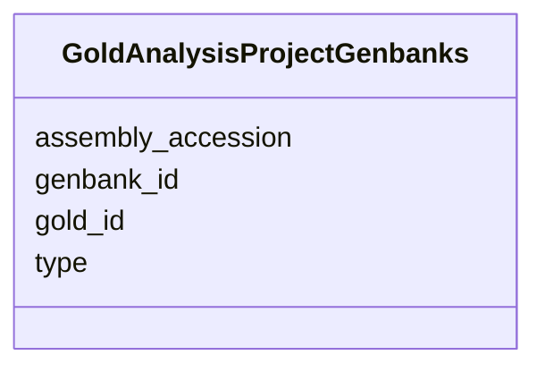

# Class: GoldAnalysisProjectGenbanks 


URI: [imgsg_dev:GoldAnalysisProjectGenbanks](https://w3id.org/jgi/imgsg_dev/GoldAnalysisProjectGenbanks)





<!-- no inheritance hierarchy -->


## Slots

| Name | Cardinality and Range | Description | Inheritance |
| ---  | --- | --- | --- |
| [gold_id](gold_id.md) | 0..1 <br/> [String](String.md) |  | direct |
| [genbank_id](genbank_id.md) | 0..1 <br/> [String](String.md) |  | direct |
| [assembly_accession](assembly_accession.md) | 0..1 <br/> [String](String.md) |  | direct |
| [type](type.md) | 0..1 <br/> [String](String.md) |  | direct |


## Identifier and Mapping Information


### Schema Source


* from schema: https://w3id.org/jgi/imgsg_dev


## Mappings

| Mapping Type | Mapped Value |
| ---  | ---  |
| self | imgsg_dev:GoldAnalysisProjectGenbanks |
| native | imgsg_dev:GoldAnalysisProjectGenbanks |


## LinkML Source

<!-- TODO: investigate https://stackoverflow.com/questions/37606292/how-to-create-tabbed-code-blocks-in-mkdocs-or-sphinx -->

### Direct

<details>
```yaml
name: gold_analysis_project_genbanks
from_schema: https://w3id.org/jgi/imgsg_dev
attributes:
  gold_id:
    name: gold_id
    from_schema: https://w3id.org/jgi/imgsg_dev
    domain_of:
    - analysis_project_permissions
    - env_sample
    - gold_analysis_project
    - gold_analysis_project_genbanks
    - gold_analysis_project_jgi_award_dois
    - gold_analysis_project_lookup
    - gold_analysis_project_lookup2
    - gold_analysis_project_sra_runs
    - gold_analysis_project_users
    - gold_ap_genbank_anomalous_reasons
    - gold_ap_publications
    - gold_sequencing_project
    - gold_sp_cell_arrangement
    - gold_sp_collaborator
    - gold_sp_disease
    - gold_sp_energy_source
    - gold_sp_genome_publications
    - gold_sp_habitat
    - gold_sp_metabolism
    - gold_sp_phenotype
    - gold_sp_relevance
    - gold_sp_seq_center
    - gold_sp_seq_method
    - gold_sp_sra
    - gold_sp_study_gold_id
    - gold_study
    - gold_study_info
    - rnaseq_notify_phajek
    - rnaseq_notify_phajek_dev
    - study_load
    - v5_ap_imperfect_view
    - vsample
    range: string
    required: false
  genbank_id:
    name: genbank_id
    from_schema: https://w3id.org/jgi/imgsg_dev
    rank: 1000
    domain_of:
    - gold_analysis_project_genbanks
    - gold_ap_genbank
    - project_info_natural_prods
    - project_info_nprods_metadata
    - submission
    - x_project_info_np
    range: string
    required: false
  assembly_accession:
    name: assembly_accession
    from_schema: https://w3id.org/jgi/imgsg_dev
    rank: 1000
    domain_of:
    - gold_analysis_project_genbanks
    - gold_ap_genbank
    - load_genbank_prok_data
    - ncbi_accessions
    - ncbi_accessions_jbtest
    - project_info
    range: string
    required: false
  type:
    name: type
    from_schema: https://w3id.org/jgi/imgsg_dev
    domain_of:
    - announcement
    - gold_analysis_project_genbanks
    - ncbi_accessions
    - ncbi_accessions_jbtest
    - workflow_stats
    range: string
    required: false

```
</details>

### Induced

<details>
```yaml
name: gold_analysis_project_genbanks
from_schema: https://w3id.org/jgi/imgsg_dev
attributes:
  gold_id:
    name: gold_id
    from_schema: https://w3id.org/jgi/imgsg_dev
    alias: gold_id
    owner: gold_analysis_project_genbanks
    domain_of:
    - analysis_project_permissions
    - env_sample
    - gold_analysis_project
    - gold_analysis_project_genbanks
    - gold_analysis_project_jgi_award_dois
    - gold_analysis_project_lookup
    - gold_analysis_project_lookup2
    - gold_analysis_project_sra_runs
    - gold_analysis_project_users
    - gold_ap_genbank_anomalous_reasons
    - gold_ap_publications
    - gold_sequencing_project
    - gold_sp_cell_arrangement
    - gold_sp_collaborator
    - gold_sp_disease
    - gold_sp_energy_source
    - gold_sp_genome_publications
    - gold_sp_habitat
    - gold_sp_metabolism
    - gold_sp_phenotype
    - gold_sp_relevance
    - gold_sp_seq_center
    - gold_sp_seq_method
    - gold_sp_sra
    - gold_sp_study_gold_id
    - gold_study
    - gold_study_info
    - rnaseq_notify_phajek
    - rnaseq_notify_phajek_dev
    - study_load
    - v5_ap_imperfect_view
    - vsample
    range: string
    required: false
  genbank_id:
    name: genbank_id
    from_schema: https://w3id.org/jgi/imgsg_dev
    rank: 1000
    alias: genbank_id
    owner: gold_analysis_project_genbanks
    domain_of:
    - gold_analysis_project_genbanks
    - gold_ap_genbank
    - project_info_natural_prods
    - project_info_nprods_metadata
    - submission
    - x_project_info_np
    range: string
    required: false
  assembly_accession:
    name: assembly_accession
    from_schema: https://w3id.org/jgi/imgsg_dev
    rank: 1000
    alias: assembly_accession
    owner: gold_analysis_project_genbanks
    domain_of:
    - gold_analysis_project_genbanks
    - gold_ap_genbank
    - load_genbank_prok_data
    - ncbi_accessions
    - ncbi_accessions_jbtest
    - project_info
    range: string
    required: false
  type:
    name: type
    from_schema: https://w3id.org/jgi/imgsg_dev
    alias: type
    owner: gold_analysis_project_genbanks
    domain_of:
    - announcement
    - gold_analysis_project_genbanks
    - ncbi_accessions
    - ncbi_accessions_jbtest
    - workflow_stats
    range: string
    required: false

```
</details>