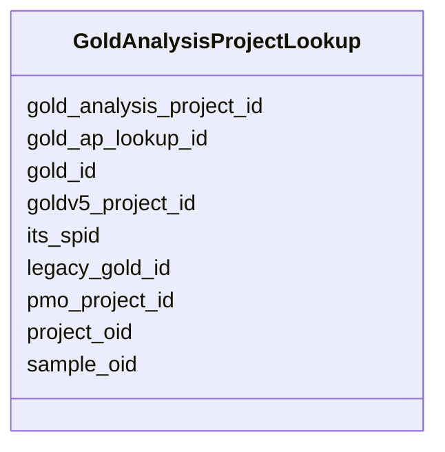

# Class: GoldAnalysisProjectLookup 


URI: [imgsg_dev:GoldAnalysisProjectLookup](https://w3id.org/jgi/imgsg_dev/GoldAnalysisProjectLookup)





<!-- no inheritance hierarchy -->


## Slots

| Name | Cardinality and Range | Description | Inheritance |
| ---  | --- | --- | --- |
| [gold_ap_lookup_id](gold_ap_lookup_id.md) | 0..1 <br/> [Integer](Integer.md) |  | direct |
| [gold_analysis_project_id](gold_analysis_project_id.md) | 0..1 <br/> [Integer](Integer.md) |  | direct |
| [its_spid](its_spid.md) | 0..1 <br/> [Integer](Integer.md) |  | direct |
| [project_oid](project_oid.md) | 0..1 <br/> [Integer](Integer.md) |  | direct |
| [sample_oid](sample_oid.md) | 0..1 <br/> [Integer](Integer.md) |  | direct |
| [pmo_project_id](pmo_project_id.md) | 0..1 <br/> [Integer](Integer.md) |  | direct |
| [goldv5_project_id](goldv5_project_id.md) | 0..1 <br/> [Integer](Integer.md) |  | direct |
| [gold_id](gold_id.md) | 0..1 <br/> [String](String.md) |  | direct |
| [legacy_gold_id](legacy_gold_id.md) | 0..1 <br/> [String](String.md) |  | direct |


## Identifier and Mapping Information


### Schema Source


* from schema: https://w3id.org/jgi/imgsg_dev


## Mappings

| Mapping Type | Mapped Value |
| ---  | ---  |
| self | imgsg_dev:GoldAnalysisProjectLookup |
| native | imgsg_dev:GoldAnalysisProjectLookup |


## LinkML Source

<!-- TODO: investigate https://stackoverflow.com/questions/37606292/how-to-create-tabbed-code-blocks-in-mkdocs-or-sphinx -->

### Direct

<details>
```yaml
name: gold_analysis_project_lookup
from_schema: https://w3id.org/jgi/imgsg_dev
attributes:
  gold_ap_lookup_id:
    name: gold_ap_lookup_id
    from_schema: https://w3id.org/jgi/imgsg_dev
    rank: 1000
    domain_of:
    - gold_analysis_project_lookup
    range: integer
    required: false
  gold_analysis_project_id:
    name: gold_analysis_project_id
    from_schema: https://w3id.org/jgi/imgsg_dev
    domain_of:
    - gold_analysis_project
    - gold_analysis_project_lookup
    - gold_ap_genbank
    - ncbi_accessions
    - v5_ap_imperfect_view
    range: integer
    required: false
  its_spid:
    name: its_spid
    from_schema: https://w3id.org/jgi/imgsg_dev
    domain_of:
    - assembly
    - env_sample
    - gold_analysis_project_lookup
    - gold_analysis_project_lookup2
    - gold_sequencing_project
    - goldv5_view
    - project_info
    - project_info_04112013
    - rnaseq_notify_phajek
    - rnaseq_notify_phajek_dev
    - t_all_gold_jgi_projects
    range: integer
    required: false
  project_oid:
    name: project_oid
    from_schema: https://w3id.org/jgi/imgsg_dev
    domain_of:
    - bioproject_propagation
    - biosample
    - data_quality_flags
    - env_sample_soil_metadata
    - genbank_refseq_crossover
    - gold_analysis_project_lookup
    - gold_analysis_project_lookup2
    - gold_img_nat_prod_entity
    - ncbi_accessions
    - ncbi_accessions_jbtest
    - proj_info_cell_arrange_042014
    - project_info
    - project_info_04112013
    - project_info_bioproject
    - project_info_body_products
    - project_info_body_sites
    - project_info_cell_arrangement
    - project_info_collaborators
    - project_info_cyano_metadata
    - project_info_data_links
    - project_info_data_links_112013
    - project_info_diseases
    - project_info_energy_source
    - project_info_habitat
    - project_info_jgi_url
    - project_info_metabolism
    - project_info_natural_prods
    - project_info_nitrogen_fixation
    - project_info_nprods_metadata
    - project_info_phenotypes
    - project_info_project_relevance
    - project_info_seq_method
    - project_meta_updates
    - study_load
    - t_alex_test
    - t_all_gold_jgi_projects
    range: integer
    required: false
  sample_oid:
    name: sample_oid
    from_schema: https://w3id.org/jgi/imgsg_dev
    domain_of:
    - contact_sample_perms
    - env_sample
    - env_sample_data_links
    - env_sample_diseases
    - env_sample_energy_source
    - env_sample_habitat_type
    - env_sample_jgi_url
    - env_sample_metabolism
    - env_sample_misc_meta_data
    - env_sample_phenotypes
    - env_sample_seq_method
    - gold_analysis_project_lookup
    - gold_analysis_project_lookup2
    - project_info
    - project_info_04112013
    - project_info_bioproject
    - project_info_biosample
    - submission
    - submission_samples
    - vsample
    range: integer
    required: false
  pmo_project_id:
    name: pmo_project_id
    from_schema: https://w3id.org/jgi/imgsg_dev
    domain_of:
    - assembly
    - env_sample
    - gold_analysis_project_lookup
    - gold_analysis_project_lookup2
    - gold_sequencing_project
    - goldv5_view
    - project_info
    - project_info_04112013
    range: integer
    required: false
  goldv5_project_id:
    name: goldv5_project_id
    from_schema: https://w3id.org/jgi/imgsg_dev
    domain_of:
    - env_sample
    - gold_analysis_project_lookup
    - project_info
    range: integer
    required: false
  gold_id:
    name: gold_id
    from_schema: https://w3id.org/jgi/imgsg_dev
    domain_of:
    - analysis_project_permissions
    - env_sample
    - gold_analysis_project
    - gold_analysis_project_genbanks
    - gold_analysis_project_jgi_award_dois
    - gold_analysis_project_lookup
    - gold_analysis_project_lookup2
    - gold_analysis_project_sra_runs
    - gold_analysis_project_users
    - gold_ap_genbank_anomalous_reasons
    - gold_ap_publications
    - gold_sequencing_project
    - gold_sp_cell_arrangement
    - gold_sp_collaborator
    - gold_sp_disease
    - gold_sp_energy_source
    - gold_sp_genome_publications
    - gold_sp_habitat
    - gold_sp_metabolism
    - gold_sp_phenotype
    - gold_sp_relevance
    - gold_sp_seq_center
    - gold_sp_seq_method
    - gold_sp_sra
    - gold_sp_study_gold_id
    - gold_study
    - gold_study_info
    - rnaseq_notify_phajek
    - rnaseq_notify_phajek_dev
    - study_load
    - v5_ap_imperfect_view
    - vsample
    range: string
    required: false
  legacy_gold_id:
    name: legacy_gold_id
    from_schema: https://w3id.org/jgi/imgsg_dev
    domain_of:
    - env_sample
    - gold_analysis_project_lookup
    - goldv5_view
    - project_info
    - study_load
    range: string
    required: false

```
</details>

### Induced

<details>
```yaml
name: gold_analysis_project_lookup
from_schema: https://w3id.org/jgi/imgsg_dev
attributes:
  gold_ap_lookup_id:
    name: gold_ap_lookup_id
    from_schema: https://w3id.org/jgi/imgsg_dev
    rank: 1000
    alias: gold_ap_lookup_id
    owner: gold_analysis_project_lookup
    domain_of:
    - gold_analysis_project_lookup
    range: integer
    required: false
  gold_analysis_project_id:
    name: gold_analysis_project_id
    from_schema: https://w3id.org/jgi/imgsg_dev
    alias: gold_analysis_project_id
    owner: gold_analysis_project_lookup
    domain_of:
    - gold_analysis_project
    - gold_analysis_project_lookup
    - gold_ap_genbank
    - ncbi_accessions
    - v5_ap_imperfect_view
    range: integer
    required: false
  its_spid:
    name: its_spid
    from_schema: https://w3id.org/jgi/imgsg_dev
    alias: its_spid
    owner: gold_analysis_project_lookup
    domain_of:
    - assembly
    - env_sample
    - gold_analysis_project_lookup
    - gold_analysis_project_lookup2
    - gold_sequencing_project
    - goldv5_view
    - project_info
    - project_info_04112013
    - rnaseq_notify_phajek
    - rnaseq_notify_phajek_dev
    - t_all_gold_jgi_projects
    range: integer
    required: false
  project_oid:
    name: project_oid
    from_schema: https://w3id.org/jgi/imgsg_dev
    alias: project_oid
    owner: gold_analysis_project_lookup
    domain_of:
    - bioproject_propagation
    - biosample
    - data_quality_flags
    - env_sample_soil_metadata
    - genbank_refseq_crossover
    - gold_analysis_project_lookup
    - gold_analysis_project_lookup2
    - gold_img_nat_prod_entity
    - ncbi_accessions
    - ncbi_accessions_jbtest
    - proj_info_cell_arrange_042014
    - project_info
    - project_info_04112013
    - project_info_bioproject
    - project_info_body_products
    - project_info_body_sites
    - project_info_cell_arrangement
    - project_info_collaborators
    - project_info_cyano_metadata
    - project_info_data_links
    - project_info_data_links_112013
    - project_info_diseases
    - project_info_energy_source
    - project_info_habitat
    - project_info_jgi_url
    - project_info_metabolism
    - project_info_natural_prods
    - project_info_nitrogen_fixation
    - project_info_nprods_metadata
    - project_info_phenotypes
    - project_info_project_relevance
    - project_info_seq_method
    - project_meta_updates
    - study_load
    - t_alex_test
    - t_all_gold_jgi_projects
    range: integer
    required: false
  sample_oid:
    name: sample_oid
    from_schema: https://w3id.org/jgi/imgsg_dev
    alias: sample_oid
    owner: gold_analysis_project_lookup
    domain_of:
    - contact_sample_perms
    - env_sample
    - env_sample_data_links
    - env_sample_diseases
    - env_sample_energy_source
    - env_sample_habitat_type
    - env_sample_jgi_url
    - env_sample_metabolism
    - env_sample_misc_meta_data
    - env_sample_phenotypes
    - env_sample_seq_method
    - gold_analysis_project_lookup
    - gold_analysis_project_lookup2
    - project_info
    - project_info_04112013
    - project_info_bioproject
    - project_info_biosample
    - submission
    - submission_samples
    - vsample
    range: integer
    required: false
  pmo_project_id:
    name: pmo_project_id
    from_schema: https://w3id.org/jgi/imgsg_dev
    alias: pmo_project_id
    owner: gold_analysis_project_lookup
    domain_of:
    - assembly
    - env_sample
    - gold_analysis_project_lookup
    - gold_analysis_project_lookup2
    - gold_sequencing_project
    - goldv5_view
    - project_info
    - project_info_04112013
    range: integer
    required: false
  goldv5_project_id:
    name: goldv5_project_id
    from_schema: https://w3id.org/jgi/imgsg_dev
    alias: goldv5_project_id
    owner: gold_analysis_project_lookup
    domain_of:
    - env_sample
    - gold_analysis_project_lookup
    - project_info
    range: integer
    required: false
  gold_id:
    name: gold_id
    from_schema: https://w3id.org/jgi/imgsg_dev
    alias: gold_id
    owner: gold_analysis_project_lookup
    domain_of:
    - analysis_project_permissions
    - env_sample
    - gold_analysis_project
    - gold_analysis_project_genbanks
    - gold_analysis_project_jgi_award_dois
    - gold_analysis_project_lookup
    - gold_analysis_project_lookup2
    - gold_analysis_project_sra_runs
    - gold_analysis_project_users
    - gold_ap_genbank_anomalous_reasons
    - gold_ap_publications
    - gold_sequencing_project
    - gold_sp_cell_arrangement
    - gold_sp_collaborator
    - gold_sp_disease
    - gold_sp_energy_source
    - gold_sp_genome_publications
    - gold_sp_habitat
    - gold_sp_metabolism
    - gold_sp_phenotype
    - gold_sp_relevance
    - gold_sp_seq_center
    - gold_sp_seq_method
    - gold_sp_sra
    - gold_sp_study_gold_id
    - gold_study
    - gold_study_info
    - rnaseq_notify_phajek
    - rnaseq_notify_phajek_dev
    - study_load
    - v5_ap_imperfect_view
    - vsample
    range: string
    required: false
  legacy_gold_id:
    name: legacy_gold_id
    from_schema: https://w3id.org/jgi/imgsg_dev
    alias: legacy_gold_id
    owner: gold_analysis_project_lookup
    domain_of:
    - env_sample
    - gold_analysis_project_lookup
    - goldv5_view
    - project_info
    - study_load
    range: string
    required: false

```
</details>