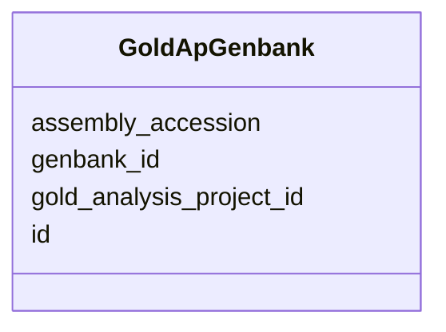

# Class: GoldApGenbank 


URI: [imgsg_dev:GoldApGenbank](https://w3id.org/jgi/imgsg_dev/GoldApGenbank)





<!-- no inheritance hierarchy -->


## Slots

| Name | Cardinality and Range | Description | Inheritance |
| ---  | --- | --- | --- |
| [id](id.md) | 0..1 <br/> [Integer](Integer.md) |  | direct |
| [gold_analysis_project_id](gold_analysis_project_id.md) | 0..1 <br/> [Integer](Integer.md) |  | direct |
| [genbank_id](genbank_id.md) | 0..1 <br/> [String](String.md) |  | direct |
| [assembly_accession](assembly_accession.md) | 0..1 <br/> [String](String.md) |  | direct |


## Identifier and Mapping Information


### Schema Source


* from schema: https://w3id.org/jgi/imgsg_dev


## Mappings

| Mapping Type | Mapped Value |
| ---  | ---  |
| self | imgsg_dev:GoldApGenbank |
| native | imgsg_dev:GoldApGenbank |


## LinkML Source

<!-- TODO: investigate https://stackoverflow.com/questions/37606292/how-to-create-tabbed-code-blocks-in-mkdocs-or-sphinx -->

### Direct

<details>
```yaml
name: gold_ap_genbank
from_schema: https://w3id.org/jgi/imgsg_dev
attributes:
  id:
    name: id
    from_schema: https://w3id.org/jgi/imgsg_dev
    domain_of:
    - dacc_logon
    - env_sample_data_links
    - gold_ap_genbank
    - master_list
    - oprop
    - ora_aspnet_personaliznperuser
    - ora_aspnet_sitemap
    - pig_genbank_emailed_accs
    - pig_reruns
    - pig_retractions
    - pig_tracks
    - plan_table
    - plan_table_20131114
    - project_info_data_links
    - project_info_data_links_112013
    - t_reddy_test
    - workflow_stats
    range: integer
    required: false
  gold_analysis_project_id:
    name: gold_analysis_project_id
    from_schema: https://w3id.org/jgi/imgsg_dev
    domain_of:
    - gold_analysis_project
    - gold_analysis_project_lookup
    - gold_ap_genbank
    - ncbi_accessions
    - v5_ap_imperfect_view
    range: integer
    required: false
  genbank_id:
    name: genbank_id
    from_schema: https://w3id.org/jgi/imgsg_dev
    domain_of:
    - gold_analysis_project_genbanks
    - gold_ap_genbank
    - project_info_natural_prods
    - project_info_nprods_metadata
    - submission
    - x_project_info_np
    range: string
    required: false
  assembly_accession:
    name: assembly_accession
    from_schema: https://w3id.org/jgi/imgsg_dev
    domain_of:
    - gold_analysis_project_genbanks
    - gold_ap_genbank
    - load_genbank_prok_data
    - ncbi_accessions
    - ncbi_accessions_jbtest
    - project_info
    range: string
    required: false

```
</details>

### Induced

<details>
```yaml
name: gold_ap_genbank
from_schema: https://w3id.org/jgi/imgsg_dev
attributes:
  id:
    name: id
    from_schema: https://w3id.org/jgi/imgsg_dev
    alias: id
    owner: gold_ap_genbank
    domain_of:
    - dacc_logon
    - env_sample_data_links
    - gold_ap_genbank
    - master_list
    - oprop
    - ora_aspnet_personaliznperuser
    - ora_aspnet_sitemap
    - pig_genbank_emailed_accs
    - pig_reruns
    - pig_retractions
    - pig_tracks
    - plan_table
    - plan_table_20131114
    - project_info_data_links
    - project_info_data_links_112013
    - t_reddy_test
    - workflow_stats
    range: integer
    required: false
  gold_analysis_project_id:
    name: gold_analysis_project_id
    from_schema: https://w3id.org/jgi/imgsg_dev
    alias: gold_analysis_project_id
    owner: gold_ap_genbank
    domain_of:
    - gold_analysis_project
    - gold_analysis_project_lookup
    - gold_ap_genbank
    - ncbi_accessions
    - v5_ap_imperfect_view
    range: integer
    required: false
  genbank_id:
    name: genbank_id
    from_schema: https://w3id.org/jgi/imgsg_dev
    alias: genbank_id
    owner: gold_ap_genbank
    domain_of:
    - gold_analysis_project_genbanks
    - gold_ap_genbank
    - project_info_natural_prods
    - project_info_nprods_metadata
    - submission
    - x_project_info_np
    range: string
    required: false
  assembly_accession:
    name: assembly_accession
    from_schema: https://w3id.org/jgi/imgsg_dev
    alias: assembly_accession
    owner: gold_ap_genbank
    domain_of:
    - gold_analysis_project_genbanks
    - gold_ap_genbank
    - load_genbank_prok_data
    - ncbi_accessions
    - ncbi_accessions_jbtest
    - project_info
    range: string
    required: false

```
</details>