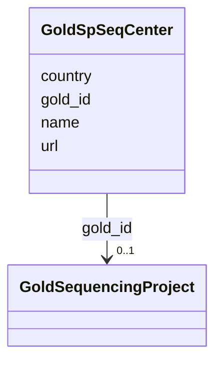

# Class: GoldSpSeqCenter 


URI: [imgsg_dev:GoldSpSeqCenter](https://w3id.org/jgi/imgsg_dev/GoldSpSeqCenter)





<!-- no inheritance hierarchy -->


## Slots

| Name | Cardinality and Range | Description | Inheritance |
| ---  | --- | --- | --- |
| [gold_id](gold_id.md) | 0..1 <br/> [GoldSequencingProject](GoldSequencingProject.md) | Foreign key to gold_sequencing_project | direct |
| [name](name.md) | 0..1 <br/> [String](String.md) |  | direct |
| [country](country.md) | 0..1 <br/> [String](String.md) |  | direct |
| [url](url.md) | 0..1 <br/> [String](String.md) |  | direct |


## Identifier and Mapping Information


### Schema Source


* from schema: https://w3id.org/jgi/imgsg_dev


## Mappings

| Mapping Type | Mapped Value |
| ---  | ---  |
| self | imgsg_dev:GoldSpSeqCenter |
| native | imgsg_dev:GoldSpSeqCenter |


## LinkML Source

<!-- TODO: investigate https://stackoverflow.com/questions/37606292/how-to-create-tabbed-code-blocks-in-mkdocs-or-sphinx -->

### Direct

<details>
```yaml
name: gold_sp_seq_center
from_schema: https://w3id.org/jgi/imgsg_dev
attributes:
  gold_id:
    name: gold_id
    description: Foreign key to gold_sequencing_project
    from_schema: https://w3id.org/jgi/imgsg_dev
    domain_of:
    - analysis_project_permissions
    - env_sample
    - gold_analysis_project
    - gold_analysis_project_genbanks
    - gold_analysis_project_jgi_award_dois
    - gold_analysis_project_lookup
    - gold_analysis_project_lookup2
    - gold_analysis_project_sra_runs
    - gold_analysis_project_users
    - gold_ap_genbank_anomalous_reasons
    - gold_ap_publications
    - gold_sequencing_project
    - gold_sp_cell_arrangement
    - gold_sp_collaborator
    - gold_sp_disease
    - gold_sp_energy_source
    - gold_sp_genome_publications
    - gold_sp_habitat
    - gold_sp_metabolism
    - gold_sp_phenotype
    - gold_sp_relevance
    - gold_sp_seq_center
    - gold_sp_seq_method
    - gold_sp_sra
    - gold_sp_study_gold_id
    - gold_study
    - gold_study_info
    - rnaseq_notify_phajek
    - rnaseq_notify_phajek_dev
    - study_load
    - v5_ap_imperfect_view
    - vsample
    range: gold_sequencing_project
    required: false
  name:
    name: name
    from_schema: https://w3id.org/jgi/imgsg_dev
    domain_of:
    - collaboratorcv
    - contact
    - gold_analysis_project_users
    - gold_sp_collaborator
    - gold_sp_seq_center
    - load_genbank_prok_data
    - luseq_center
    - request_account
    - seq_centercv
    - t_reddy_test
    range: string
    required: false
  country:
    name: country
    from_schema: https://w3id.org/jgi/imgsg_dev
    domain_of:
    - contact
    - country_load
    - gold_sp_collaborator
    - gold_sp_seq_center
    - institutes
    - request_account
    - t_institutes_bak
    range: string
    required: false
  url:
    name: url
    from_schema: https://w3id.org/jgi/imgsg_dev
    domain_of:
    - env_sample_data_links
    - env_sample_jgi_url
    - gold_sp_collaborator
    - gold_sp_seq_center
    - institutes
    - luseq_center
    - ora_aspnet_sitemap
    - project_info_data_links
    - project_info_data_links_112013
    - project_info_jgi_url
    - t_institutes_bak
    range: string
    required: false

```
</details>

### Induced

<details>
```yaml
name: gold_sp_seq_center
from_schema: https://w3id.org/jgi/imgsg_dev
attributes:
  gold_id:
    name: gold_id
    description: Foreign key to gold_sequencing_project
    from_schema: https://w3id.org/jgi/imgsg_dev
    alias: gold_id
    owner: gold_sp_seq_center
    domain_of:
    - analysis_project_permissions
    - env_sample
    - gold_analysis_project
    - gold_analysis_project_genbanks
    - gold_analysis_project_jgi_award_dois
    - gold_analysis_project_lookup
    - gold_analysis_project_lookup2
    - gold_analysis_project_sra_runs
    - gold_analysis_project_users
    - gold_ap_genbank_anomalous_reasons
    - gold_ap_publications
    - gold_sequencing_project
    - gold_sp_cell_arrangement
    - gold_sp_collaborator
    - gold_sp_disease
    - gold_sp_energy_source
    - gold_sp_genome_publications
    - gold_sp_habitat
    - gold_sp_metabolism
    - gold_sp_phenotype
    - gold_sp_relevance
    - gold_sp_seq_center
    - gold_sp_seq_method
    - gold_sp_sra
    - gold_sp_study_gold_id
    - gold_study
    - gold_study_info
    - rnaseq_notify_phajek
    - rnaseq_notify_phajek_dev
    - study_load
    - v5_ap_imperfect_view
    - vsample
    range: gold_sequencing_project
    required: false
  name:
    name: name
    from_schema: https://w3id.org/jgi/imgsg_dev
    alias: name
    owner: gold_sp_seq_center
    domain_of:
    - collaboratorcv
    - contact
    - gold_analysis_project_users
    - gold_sp_collaborator
    - gold_sp_seq_center
    - load_genbank_prok_data
    - luseq_center
    - request_account
    - seq_centercv
    - t_reddy_test
    range: string
    required: false
  country:
    name: country
    from_schema: https://w3id.org/jgi/imgsg_dev
    alias: country
    owner: gold_sp_seq_center
    domain_of:
    - contact
    - country_load
    - gold_sp_collaborator
    - gold_sp_seq_center
    - institutes
    - request_account
    - t_institutes_bak
    range: string
    required: false
  url:
    name: url
    from_schema: https://w3id.org/jgi/imgsg_dev
    alias: url
    owner: gold_sp_seq_center
    domain_of:
    - env_sample_data_links
    - env_sample_jgi_url
    - gold_sp_collaborator
    - gold_sp_seq_center
    - institutes
    - luseq_center
    - ora_aspnet_sitemap
    - project_info_data_links
    - project_info_data_links_112013
    - project_info_jgi_url
    - t_institutes_bak
    range: string
    required: false

```
</details>