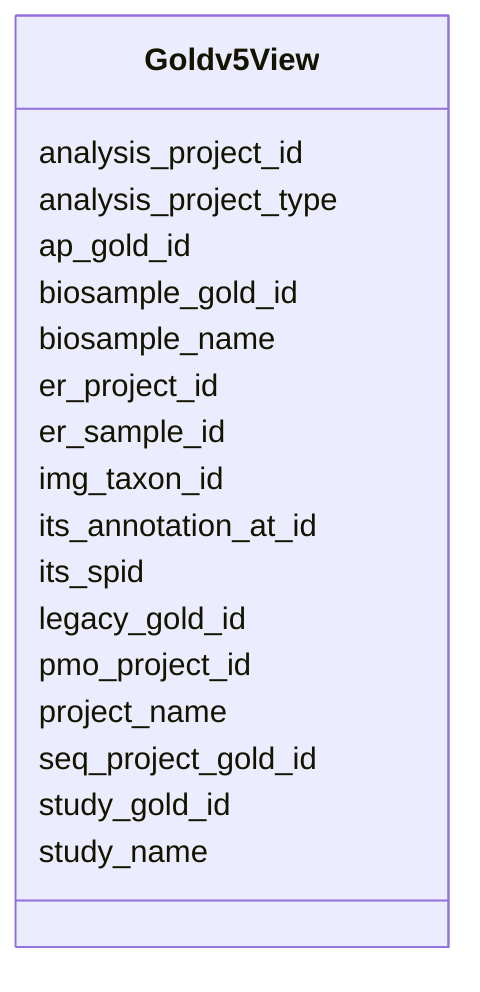

# Class: Goldv5View 


_snapshot table for snapshot IMGSG_DEV.GOLDV5_VIEW_


URI: [imgsg_dev:Goldv5View](https://w3id.org/jgi/imgsg_dev/Goldv5View)





<!-- no inheritance hierarchy -->


## Slots

| Name | Cardinality and Range | Description | Inheritance |
| ---  | --- | --- | --- |
| [ap_gold_id](ap_gold_id.md) | 0..1 <br/> [String](String.md) |  | direct |
| [analysis_project_id](analysis_project_id.md) | 0..1 <br/> [Integer](Integer.md) |  | direct |
| [img_taxon_id](img_taxon_id.md) | 0..1 <br/> [Integer](Integer.md) |  | direct |
| [its_annotation_at_id](its_annotation_at_id.md) | 0..1 <br/> [Integer](Integer.md) |  | direct |
| [analysis_project_type](analysis_project_type.md) | 0..1 <br/> [String](String.md) |  | direct |
| [seq_project_gold_id](seq_project_gold_id.md) | 0..1 <br/> [String](String.md) |  | direct |
| [legacy_gold_id](legacy_gold_id.md) | 0..1 <br/> [String](String.md) |  | direct |
| [er_project_id](er_project_id.md) | 0..1 <br/> [Integer](Integer.md) |  | direct |
| [er_sample_id](er_sample_id.md) | 0..1 <br/> [Integer](Integer.md) |  | direct |
| [its_spid](its_spid.md) | 0..1 <br/> [Integer](Integer.md) |  | direct |
| [pmo_project_id](pmo_project_id.md) | 0..1 <br/> [Integer](Integer.md) |  | direct |
| [project_name](project_name.md) | 0..1 <br/> [String](String.md) |  | direct |
| [biosample_gold_id](biosample_gold_id.md) | 0..1 <br/> [String](String.md) |  | direct |
| [biosample_name](biosample_name.md) | 0..1 <br/> [String](String.md) |  | direct |
| [study_gold_id](study_gold_id.md) | 0..1 <br/> [String](String.md) |  | direct |
| [study_name](study_name.md) | 0..1 <br/> [String](String.md) |  | direct |


## Identifier and Mapping Information


### Schema Source


* from schema: https://w3id.org/jgi/imgsg_dev


## Mappings

| Mapping Type | Mapped Value |
| ---  | ---  |
| self | imgsg_dev:Goldv5View |
| native | imgsg_dev:Goldv5View |


## LinkML Source

<!-- TODO: investigate https://stackoverflow.com/questions/37606292/how-to-create-tabbed-code-blocks-in-mkdocs-or-sphinx -->

### Direct

<details>
```yaml
name: goldv5_view
description: snapshot table for snapshot IMGSG_DEV.GOLDV5_VIEW
from_schema: https://w3id.org/jgi/imgsg_dev
attributes:
  ap_gold_id:
    name: ap_gold_id
    from_schema: https://w3id.org/jgi/imgsg_dev
    rank: 1000
    domain_of:
    - goldv5_view
    range: string
    required: false
  analysis_project_id:
    name: analysis_project_id
    from_schema: https://w3id.org/jgi/imgsg_dev
    rank: 1000
    domain_of:
    - goldv5_view
    - rnaseq_notify_phajek
    - rnaseq_notify_phajek_dev
    - submission
    range: integer
    required: false
  img_taxon_id:
    name: img_taxon_id
    from_schema: https://w3id.org/jgi/imgsg_dev
    rank: 1000
    domain_of:
    - goldv5_view
    range: integer
    required: false
  its_annotation_at_id:
    name: its_annotation_at_id
    from_schema: https://w3id.org/jgi/imgsg_dev
    domain_of:
    - gold_analysis_project
    - goldv5_view
    - v5_ap_imperfect_view
    range: integer
    required: false
  analysis_project_type:
    name: analysis_project_type
    from_schema: https://w3id.org/jgi/imgsg_dev
    rank: 1000
    domain_of:
    - goldv5_view
    range: string
    required: false
  seq_project_gold_id:
    name: seq_project_gold_id
    from_schema: https://w3id.org/jgi/imgsg_dev
    rank: 1000
    domain_of:
    - goldv5_view
    range: string
    required: false
  legacy_gold_id:
    name: legacy_gold_id
    from_schema: https://w3id.org/jgi/imgsg_dev
    domain_of:
    - env_sample
    - gold_analysis_project_lookup
    - goldv5_view
    - project_info
    - study_load
    range: string
    required: false
  er_project_id:
    name: er_project_id
    from_schema: https://w3id.org/jgi/imgsg_dev
    rank: 1000
    domain_of:
    - goldv5_view
    range: integer
    required: false
  er_sample_id:
    name: er_sample_id
    from_schema: https://w3id.org/jgi/imgsg_dev
    rank: 1000
    domain_of:
    - goldv5_view
    - project_info
    - project_info_04112013
    range: integer
    required: false
  its_spid:
    name: its_spid
    from_schema: https://w3id.org/jgi/imgsg_dev
    domain_of:
    - assembly
    - env_sample
    - gold_analysis_project_lookup
    - gold_analysis_project_lookup2
    - gold_sequencing_project
    - goldv5_view
    - project_info
    - project_info_04112013
    - rnaseq_notify_phajek
    - rnaseq_notify_phajek_dev
    - t_all_gold_jgi_projects
    range: integer
    required: false
  pmo_project_id:
    name: pmo_project_id
    from_schema: https://w3id.org/jgi/imgsg_dev
    domain_of:
    - assembly
    - env_sample
    - gold_analysis_project_lookup
    - gold_analysis_project_lookup2
    - gold_sequencing_project
    - goldv5_view
    - project_info
    - project_info_04112013
    range: integer
    required: false
  project_name:
    name: project_name
    from_schema: https://w3id.org/jgi/imgsg_dev
    rank: 1000
    domain_of:
    - goldv5_view
    - project_info_bioproject
    - t_jgi_catalogue
    range: string
    required: false
  biosample_gold_id:
    name: biosample_gold_id
    from_schema: https://w3id.org/jgi/imgsg_dev
    domain_of:
    - gold_sequencing_project
    - goldv5_view
    range: string
    required: false
  biosample_name:
    name: biosample_name
    from_schema: https://w3id.org/jgi/imgsg_dev
    domain_of:
    - biosample
    - env_sample
    - goldv5_view
    range: string
    required: false
  study_gold_id:
    name: study_gold_id
    from_schema: https://w3id.org/jgi/imgsg_dev
    domain_of:
    - gold_analysis_project
    - gold_sp_study_gold_id
    - goldv5_view
    - v5_ap_imperfect_view
    range: string
    required: false
  study_name:
    name: study_name
    from_schema: https://w3id.org/jgi/imgsg_dev
    domain_of:
    - gold_study
    - goldv5_view
    - study
    - study_load
    range: string
    required: false

```
</details>

### Induced

<details>
```yaml
name: goldv5_view
description: snapshot table for snapshot IMGSG_DEV.GOLDV5_VIEW
from_schema: https://w3id.org/jgi/imgsg_dev
attributes:
  ap_gold_id:
    name: ap_gold_id
    from_schema: https://w3id.org/jgi/imgsg_dev
    rank: 1000
    alias: ap_gold_id
    owner: goldv5_view
    domain_of:
    - goldv5_view
    range: string
    required: false
  analysis_project_id:
    name: analysis_project_id
    from_schema: https://w3id.org/jgi/imgsg_dev
    rank: 1000
    alias: analysis_project_id
    owner: goldv5_view
    domain_of:
    - goldv5_view
    - rnaseq_notify_phajek
    - rnaseq_notify_phajek_dev
    - submission
    range: integer
    required: false
  img_taxon_id:
    name: img_taxon_id
    from_schema: https://w3id.org/jgi/imgsg_dev
    rank: 1000
    alias: img_taxon_id
    owner: goldv5_view
    domain_of:
    - goldv5_view
    range: integer
    required: false
  its_annotation_at_id:
    name: its_annotation_at_id
    from_schema: https://w3id.org/jgi/imgsg_dev
    alias: its_annotation_at_id
    owner: goldv5_view
    domain_of:
    - gold_analysis_project
    - goldv5_view
    - v5_ap_imperfect_view
    range: integer
    required: false
  analysis_project_type:
    name: analysis_project_type
    from_schema: https://w3id.org/jgi/imgsg_dev
    rank: 1000
    alias: analysis_project_type
    owner: goldv5_view
    domain_of:
    - goldv5_view
    range: string
    required: false
  seq_project_gold_id:
    name: seq_project_gold_id
    from_schema: https://w3id.org/jgi/imgsg_dev
    rank: 1000
    alias: seq_project_gold_id
    owner: goldv5_view
    domain_of:
    - goldv5_view
    range: string
    required: false
  legacy_gold_id:
    name: legacy_gold_id
    from_schema: https://w3id.org/jgi/imgsg_dev
    alias: legacy_gold_id
    owner: goldv5_view
    domain_of:
    - env_sample
    - gold_analysis_project_lookup
    - goldv5_view
    - project_info
    - study_load
    range: string
    required: false
  er_project_id:
    name: er_project_id
    from_schema: https://w3id.org/jgi/imgsg_dev
    rank: 1000
    alias: er_project_id
    owner: goldv5_view
    domain_of:
    - goldv5_view
    range: integer
    required: false
  er_sample_id:
    name: er_sample_id
    from_schema: https://w3id.org/jgi/imgsg_dev
    rank: 1000
    alias: er_sample_id
    owner: goldv5_view
    domain_of:
    - goldv5_view
    - project_info
    - project_info_04112013
    range: integer
    required: false
  its_spid:
    name: its_spid
    from_schema: https://w3id.org/jgi/imgsg_dev
    alias: its_spid
    owner: goldv5_view
    domain_of:
    - assembly
    - env_sample
    - gold_analysis_project_lookup
    - gold_analysis_project_lookup2
    - gold_sequencing_project
    - goldv5_view
    - project_info
    - project_info_04112013
    - rnaseq_notify_phajek
    - rnaseq_notify_phajek_dev
    - t_all_gold_jgi_projects
    range: integer
    required: false
  pmo_project_id:
    name: pmo_project_id
    from_schema: https://w3id.org/jgi/imgsg_dev
    alias: pmo_project_id
    owner: goldv5_view
    domain_of:
    - assembly
    - env_sample
    - gold_analysis_project_lookup
    - gold_analysis_project_lookup2
    - gold_sequencing_project
    - goldv5_view
    - project_info
    - project_info_04112013
    range: integer
    required: false
  project_name:
    name: project_name
    from_schema: https://w3id.org/jgi/imgsg_dev
    rank: 1000
    alias: project_name
    owner: goldv5_view
    domain_of:
    - goldv5_view
    - project_info_bioproject
    - t_jgi_catalogue
    range: string
    required: false
  biosample_gold_id:
    name: biosample_gold_id
    from_schema: https://w3id.org/jgi/imgsg_dev
    alias: biosample_gold_id
    owner: goldv5_view
    domain_of:
    - gold_sequencing_project
    - goldv5_view
    range: string
    required: false
  biosample_name:
    name: biosample_name
    from_schema: https://w3id.org/jgi/imgsg_dev
    alias: biosample_name
    owner: goldv5_view
    domain_of:
    - biosample
    - env_sample
    - goldv5_view
    range: string
    required: false
  study_gold_id:
    name: study_gold_id
    from_schema: https://w3id.org/jgi/imgsg_dev
    alias: study_gold_id
    owner: goldv5_view
    domain_of:
    - gold_analysis_project
    - gold_sp_study_gold_id
    - goldv5_view
    - v5_ap_imperfect_view
    range: string
    required: false
  study_name:
    name: study_name
    from_schema: https://w3id.org/jgi/imgsg_dev
    alias: study_name
    owner: goldv5_view
    domain_of:
    - gold_study
    - goldv5_view
    - study
    - study_load
    range: string
    required: false

```
</details>