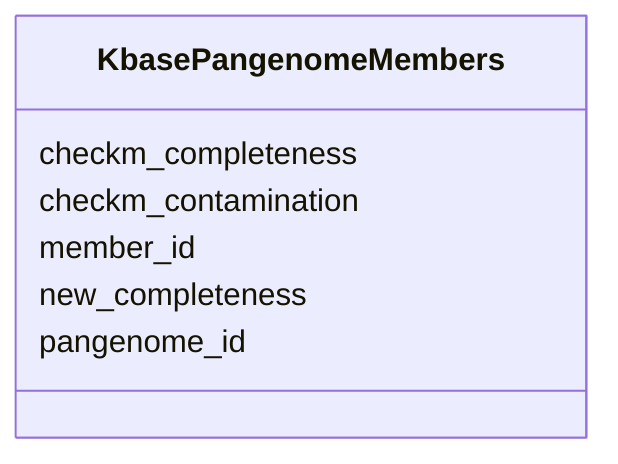

# Class: KbasePangenomeMembers 


URI: [imgsg_dev:KbasePangenomeMembers](https://w3id.org/jgi/imgsg_dev/KbasePangenomeMembers)





<!-- no inheritance hierarchy -->


## Slots

| Name | Cardinality and Range | Description | Inheritance |
| ---  | --- | --- | --- |
| [pangenome_id](pangenome_id.md) | 0..1 <br/> [String](String.md) |  | direct |
| [member_id](member_id.md) | 0..1 <br/> [String](String.md) |  | direct |
| [checkm_completeness](checkm_completeness.md) | 0..1 <br/> [Float](Float.md) |  | direct |
| [checkm_contamination](checkm_contamination.md) | 0..1 <br/> [Float](Float.md) |  | direct |
| [new_completeness](new_completeness.md) | 0..1 <br/> [Float](Float.md) |  | direct |


## Identifier and Mapping Information


### Schema Source


* from schema: https://w3id.org/jgi/imgsg_dev


## Mappings

| Mapping Type | Mapped Value |
| ---  | ---  |
| self | imgsg_dev:KbasePangenomeMembers |
| native | imgsg_dev:KbasePangenomeMembers |


## LinkML Source

<!-- TODO: investigate https://stackoverflow.com/questions/37606292/how-to-create-tabbed-code-blocks-in-mkdocs-or-sphinx -->

### Direct

<details>
```yaml
name: kbase_pangenome_members
from_schema: https://w3id.org/jgi/imgsg_dev
attributes:
  pangenome_id:
    name: pangenome_id
    from_schema: https://w3id.org/jgi/imgsg_dev
    domain_of:
    - kbase_pangenome
    - kbase_pangenome_members
    range: string
    required: false
  member_id:
    name: member_id
    from_schema: https://w3id.org/jgi/imgsg_dev
    rank: 1000
    domain_of:
    - kbase_pangenome_members
    range: string
    required: false
  checkm_completeness:
    name: checkm_completeness
    from_schema: https://w3id.org/jgi/imgsg_dev
    rank: 1000
    domain_of:
    - kbase_pangenome_members
    range: float
    required: false
  checkm_contamination:
    name: checkm_contamination
    from_schema: https://w3id.org/jgi/imgsg_dev
    rank: 1000
    domain_of:
    - kbase_pangenome_members
    range: float
    required: false
  new_completeness:
    name: new_completeness
    from_schema: https://w3id.org/jgi/imgsg_dev
    rank: 1000
    domain_of:
    - kbase_pangenome_members
    range: float
    required: false

```
</details>

### Induced

<details>
```yaml
name: kbase_pangenome_members
from_schema: https://w3id.org/jgi/imgsg_dev
attributes:
  pangenome_id:
    name: pangenome_id
    from_schema: https://w3id.org/jgi/imgsg_dev
    alias: pangenome_id
    owner: kbase_pangenome_members
    domain_of:
    - kbase_pangenome
    - kbase_pangenome_members
    range: string
    required: false
  member_id:
    name: member_id
    from_schema: https://w3id.org/jgi/imgsg_dev
    rank: 1000
    alias: member_id
    owner: kbase_pangenome_members
    domain_of:
    - kbase_pangenome_members
    range: string
    required: false
  checkm_completeness:
    name: checkm_completeness
    from_schema: https://w3id.org/jgi/imgsg_dev
    rank: 1000
    alias: checkm_completeness
    owner: kbase_pangenome_members
    domain_of:
    - kbase_pangenome_members
    range: float
    required: false
  checkm_contamination:
    name: checkm_contamination
    from_schema: https://w3id.org/jgi/imgsg_dev
    rank: 1000
    alias: checkm_contamination
    owner: kbase_pangenome_members
    domain_of:
    - kbase_pangenome_members
    range: float
    required: false
  new_completeness:
    name: new_completeness
    from_schema: https://w3id.org/jgi/imgsg_dev
    rank: 1000
    alias: new_completeness
    owner: kbase_pangenome_members
    domain_of:
    - kbase_pangenome_members
    range: float
    required: false

```
</details>