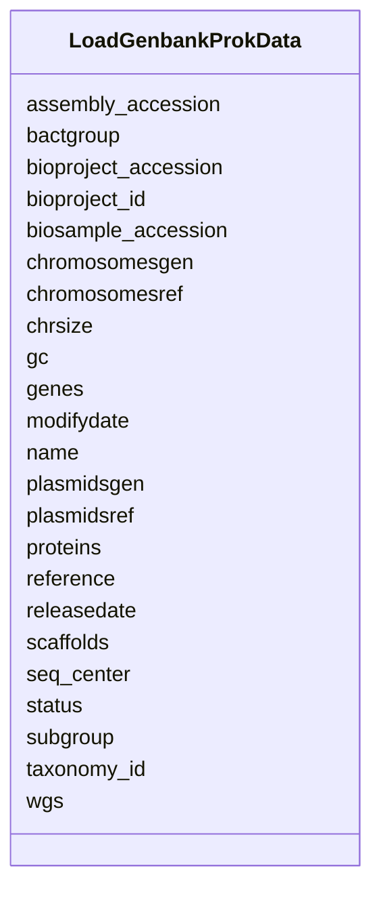

# Class: LoadGenbankProkData 


URI: [imgsg_dev:LoadGenbankProkData](https://w3id.org/jgi/imgsg_dev/LoadGenbankProkData)





<!-- no inheritance hierarchy -->


## Slots

| Name | Cardinality and Range | Description | Inheritance |
| ---  | --- | --- | --- |
| [name](name.md) | 0..1 <br/> [String](String.md) |  | direct |
| [bioproject_id](bioproject_id.md) | 0..1 <br/> [String](String.md) |  | direct |
| [bactgroup](bactgroup.md) | 0..1 <br/> [String](String.md) |  | direct |
| [subgroup](subgroup.md) | 0..1 <br/> [String](String.md) |  | direct |
| [chrsize](chrsize.md) | 0..1 <br/> [Float](Float.md) |  | direct |
| [gc](gc.md) | 0..1 <br/> [Float](Float.md) |  | direct |
| [chromosomesref](chromosomesref.md) | 0..1 <br/> [String](String.md) |  | direct |
| [chromosomesgen](chromosomesgen.md) | 0..1 <br/> [String](String.md) |  | direct |
| [plasmidsref](plasmidsref.md) | 0..1 <br/> [String](String.md) |  | direct |
| [plasmidsgen](plasmidsgen.md) | 0..1 <br/> [String](String.md) |  | direct |
| [wgs](wgs.md) | 0..1 <br/> [String](String.md) |  | direct |
| [scaffolds](scaffolds.md) | 0..1 <br/> [Integer](Integer.md) |  | direct |
| [genes](genes.md) | 0..1 <br/> [Integer](Integer.md) |  | direct |
| [proteins](proteins.md) | 0..1 <br/> [Integer](Integer.md) |  | direct |
| [releasedate](releasedate.md) | 0..1 <br/> [String](String.md) |  | direct |
| [modifydate](modifydate.md) | 0..1 <br/> [String](String.md) |  | direct |
| [status](status.md) | 0..1 <br/> [String](String.md) |  | direct |
| [taxonomy_id](taxonomy_id.md) | 0..1 <br/> [Integer](Integer.md) |  | direct |
| [seq_center](seq_center.md) | 0..1 <br/> [String](String.md) |  | direct |
| [bioproject_accession](bioproject_accession.md) | 0..1 <br/> [String](String.md) |  | direct |
| [biosample_accession](biosample_accession.md) | 0..1 <br/> [String](String.md) |  | direct |
| [assembly_accession](assembly_accession.md) | 0..1 <br/> [String](String.md) |  | direct |
| [reference](reference.md) | 0..1 <br/> [String](String.md) |  | direct |


## Identifier and Mapping Information


### Schema Source


* from schema: https://w3id.org/jgi/imgsg_dev


## Mappings

| Mapping Type | Mapped Value |
| ---  | ---  |
| self | imgsg_dev:LoadGenbankProkData |
| native | imgsg_dev:LoadGenbankProkData |


## LinkML Source

<!-- TODO: investigate https://stackoverflow.com/questions/37606292/how-to-create-tabbed-code-blocks-in-mkdocs-or-sphinx -->

### Direct

<details>
```yaml
name: load_genbank_prok_data
from_schema: https://w3id.org/jgi/imgsg_dev
attributes:
  name:
    name: name
    from_schema: https://w3id.org/jgi/imgsg_dev
    domain_of:
    - collaboratorcv
    - contact
    - gold_analysis_project_users
    - gold_sp_collaborator
    - gold_sp_seq_center
    - load_genbank_prok_data
    - luseq_center
    - request_account
    - seq_centercv
    - t_reddy_test
    range: string
    required: false
  bioproject_id:
    name: bioproject_id
    from_schema: https://w3id.org/jgi/imgsg_dev
    rank: 1000
    domain_of:
    - load_genbank_prok_data
    - pig_genbank_emailed_accs
    - pig_retractions
    - pig_tracks
    - project_info_genbank
    range: string
    required: false
  bactgroup:
    name: bactgroup
    from_schema: https://w3id.org/jgi/imgsg_dev
    rank: 1000
    domain_of:
    - load_genbank_prok_data
    range: string
    required: false
  subgroup:
    name: subgroup
    from_schema: https://w3id.org/jgi/imgsg_dev
    rank: 1000
    domain_of:
    - load_genbank_prok_data
    range: string
    required: false
  chrsize:
    name: chrsize
    from_schema: https://w3id.org/jgi/imgsg_dev
    rank: 1000
    domain_of:
    - load_genbank_prok_data
    range: float
    required: false
  gc:
    name: gc
    from_schema: https://w3id.org/jgi/imgsg_dev
    rank: 1000
    domain_of:
    - load_genbank_prok_data
    range: float
    required: false
  chromosomesref:
    name: chromosomesref
    from_schema: https://w3id.org/jgi/imgsg_dev
    rank: 1000
    domain_of:
    - load_genbank_prok_data
    range: string
    required: false
  chromosomesgen:
    name: chromosomesgen
    from_schema: https://w3id.org/jgi/imgsg_dev
    rank: 1000
    domain_of:
    - load_genbank_prok_data
    range: string
    required: false
  plasmidsref:
    name: plasmidsref
    from_schema: https://w3id.org/jgi/imgsg_dev
    rank: 1000
    domain_of:
    - load_genbank_prok_data
    range: string
    required: false
  plasmidsgen:
    name: plasmidsgen
    from_schema: https://w3id.org/jgi/imgsg_dev
    rank: 1000
    domain_of:
    - load_genbank_prok_data
    range: string
    required: false
  wgs:
    name: wgs
    from_schema: https://w3id.org/jgi/imgsg_dev
    rank: 1000
    domain_of:
    - load_genbank_prok_data
    range: string
    required: false
  scaffolds:
    name: scaffolds
    from_schema: https://w3id.org/jgi/imgsg_dev
    rank: 1000
    domain_of:
    - load_genbank_prok_data
    range: integer
    required: false
  genes:
    name: genes
    from_schema: https://w3id.org/jgi/imgsg_dev
    rank: 1000
    domain_of:
    - load_genbank_prok_data
    range: integer
    required: false
  proteins:
    name: proteins
    from_schema: https://w3id.org/jgi/imgsg_dev
    rank: 1000
    domain_of:
    - load_genbank_prok_data
    range: integer
    required: false
  releasedate:
    name: releasedate
    from_schema: https://w3id.org/jgi/imgsg_dev
    rank: 1000
    domain_of:
    - load_genbank_prok_data
    range: string
    required: false
  modifydate:
    name: modifydate
    from_schema: https://w3id.org/jgi/imgsg_dev
    rank: 1000
    domain_of:
    - load_genbank_prok_data
    range: string
    required: false
  status:
    name: status
    from_schema: https://w3id.org/jgi/imgsg_dev
    domain_of:
    - gold_analysis_project
    - lanl_project
    - load_genbank_prok_data
    - mer_submissions_queue
    - merfs_aggregate_file_size
    - ornl_project
    - request_account
    - submission
    - submission_history
    - t_jgi_catalogue
    - v5_ap_imperfect_view
    range: string
    required: false
  taxonomy_id:
    name: taxonomy_id
    from_schema: https://w3id.org/jgi/imgsg_dev
    rank: 1000
    domain_of:
    - load_genbank_prok_data
    range: integer
    required: false
  seq_center:
    name: seq_center
    from_schema: https://w3id.org/jgi/imgsg_dev
    rank: 1000
    domain_of:
    - load_genbank_prok_data
    range: string
    required: false
  bioproject_accession:
    name: bioproject_accession
    from_schema: https://w3id.org/jgi/imgsg_dev
    domain_of:
    - env_sample
    - gold_sequencing_project
    - load_genbank_prok_data
    - ncbi_accessions
    - ncbi_accessions_jbtest
    - project_info
    - project_info_04112013
    range: string
    required: false
  biosample_accession:
    name: biosample_accession
    from_schema: https://w3id.org/jgi/imgsg_dev
    domain_of:
    - biosample
    - biosample_attribute
    - env_sample
    - gold_sequencing_project
    - load_genbank_prok_data
    - project_info
    - project_info_04112013
    range: string
    required: false
  assembly_accession:
    name: assembly_accession
    from_schema: https://w3id.org/jgi/imgsg_dev
    domain_of:
    - gold_analysis_project_genbanks
    - gold_ap_genbank
    - load_genbank_prok_data
    - ncbi_accessions
    - ncbi_accessions_jbtest
    - project_info
    range: string
    required: false
  reference:
    name: reference
    from_schema: https://w3id.org/jgi/imgsg_dev
    rank: 1000
    domain_of:
    - load_genbank_prok_data
    range: string
    required: false

```
</details>

### Induced

<details>
```yaml
name: load_genbank_prok_data
from_schema: https://w3id.org/jgi/imgsg_dev
attributes:
  name:
    name: name
    from_schema: https://w3id.org/jgi/imgsg_dev
    alias: name
    owner: load_genbank_prok_data
    domain_of:
    - collaboratorcv
    - contact
    - gold_analysis_project_users
    - gold_sp_collaborator
    - gold_sp_seq_center
    - load_genbank_prok_data
    - luseq_center
    - request_account
    - seq_centercv
    - t_reddy_test
    range: string
    required: false
  bioproject_id:
    name: bioproject_id
    from_schema: https://w3id.org/jgi/imgsg_dev
    rank: 1000
    alias: bioproject_id
    owner: load_genbank_prok_data
    domain_of:
    - load_genbank_prok_data
    - pig_genbank_emailed_accs
    - pig_retractions
    - pig_tracks
    - project_info_genbank
    range: string
    required: false
  bactgroup:
    name: bactgroup
    from_schema: https://w3id.org/jgi/imgsg_dev
    rank: 1000
    alias: bactgroup
    owner: load_genbank_prok_data
    domain_of:
    - load_genbank_prok_data
    range: string
    required: false
  subgroup:
    name: subgroup
    from_schema: https://w3id.org/jgi/imgsg_dev
    rank: 1000
    alias: subgroup
    owner: load_genbank_prok_data
    domain_of:
    - load_genbank_prok_data
    range: string
    required: false
  chrsize:
    name: chrsize
    from_schema: https://w3id.org/jgi/imgsg_dev
    rank: 1000
    alias: chrsize
    owner: load_genbank_prok_data
    domain_of:
    - load_genbank_prok_data
    range: float
    required: false
  gc:
    name: gc
    from_schema: https://w3id.org/jgi/imgsg_dev
    rank: 1000
    alias: gc
    owner: load_genbank_prok_data
    domain_of:
    - load_genbank_prok_data
    range: float
    required: false
  chromosomesref:
    name: chromosomesref
    from_schema: https://w3id.org/jgi/imgsg_dev
    rank: 1000
    alias: chromosomesref
    owner: load_genbank_prok_data
    domain_of:
    - load_genbank_prok_data
    range: string
    required: false
  chromosomesgen:
    name: chromosomesgen
    from_schema: https://w3id.org/jgi/imgsg_dev
    rank: 1000
    alias: chromosomesgen
    owner: load_genbank_prok_data
    domain_of:
    - load_genbank_prok_data
    range: string
    required: false
  plasmidsref:
    name: plasmidsref
    from_schema: https://w3id.org/jgi/imgsg_dev
    rank: 1000
    alias: plasmidsref
    owner: load_genbank_prok_data
    domain_of:
    - load_genbank_prok_data
    range: string
    required: false
  plasmidsgen:
    name: plasmidsgen
    from_schema: https://w3id.org/jgi/imgsg_dev
    rank: 1000
    alias: plasmidsgen
    owner: load_genbank_prok_data
    domain_of:
    - load_genbank_prok_data
    range: string
    required: false
  wgs:
    name: wgs
    from_schema: https://w3id.org/jgi/imgsg_dev
    rank: 1000
    alias: wgs
    owner: load_genbank_prok_data
    domain_of:
    - load_genbank_prok_data
    range: string
    required: false
  scaffolds:
    name: scaffolds
    from_schema: https://w3id.org/jgi/imgsg_dev
    rank: 1000
    alias: scaffolds
    owner: load_genbank_prok_data
    domain_of:
    - load_genbank_prok_data
    range: integer
    required: false
  genes:
    name: genes
    from_schema: https://w3id.org/jgi/imgsg_dev
    rank: 1000
    alias: genes
    owner: load_genbank_prok_data
    domain_of:
    - load_genbank_prok_data
    range: integer
    required: false
  proteins:
    name: proteins
    from_schema: https://w3id.org/jgi/imgsg_dev
    rank: 1000
    alias: proteins
    owner: load_genbank_prok_data
    domain_of:
    - load_genbank_prok_data
    range: integer
    required: false
  releasedate:
    name: releasedate
    from_schema: https://w3id.org/jgi/imgsg_dev
    rank: 1000
    alias: releasedate
    owner: load_genbank_prok_data
    domain_of:
    - load_genbank_prok_data
    range: string
    required: false
  modifydate:
    name: modifydate
    from_schema: https://w3id.org/jgi/imgsg_dev
    rank: 1000
    alias: modifydate
    owner: load_genbank_prok_data
    domain_of:
    - load_genbank_prok_data
    range: string
    required: false
  status:
    name: status
    from_schema: https://w3id.org/jgi/imgsg_dev
    alias: status
    owner: load_genbank_prok_data
    domain_of:
    - gold_analysis_project
    - lanl_project
    - load_genbank_prok_data
    - mer_submissions_queue
    - merfs_aggregate_file_size
    - ornl_project
    - request_account
    - submission
    - submission_history
    - t_jgi_catalogue
    - v5_ap_imperfect_view
    range: string
    required: false
  taxonomy_id:
    name: taxonomy_id
    from_schema: https://w3id.org/jgi/imgsg_dev
    rank: 1000
    alias: taxonomy_id
    owner: load_genbank_prok_data
    domain_of:
    - load_genbank_prok_data
    range: integer
    required: false
  seq_center:
    name: seq_center
    from_schema: https://w3id.org/jgi/imgsg_dev
    rank: 1000
    alias: seq_center
    owner: load_genbank_prok_data
    domain_of:
    - load_genbank_prok_data
    range: string
    required: false
  bioproject_accession:
    name: bioproject_accession
    from_schema: https://w3id.org/jgi/imgsg_dev
    alias: bioproject_accession
    owner: load_genbank_prok_data
    domain_of:
    - env_sample
    - gold_sequencing_project
    - load_genbank_prok_data
    - ncbi_accessions
    - ncbi_accessions_jbtest
    - project_info
    - project_info_04112013
    range: string
    required: false
  biosample_accession:
    name: biosample_accession
    from_schema: https://w3id.org/jgi/imgsg_dev
    alias: biosample_accession
    owner: load_genbank_prok_data
    domain_of:
    - biosample
    - biosample_attribute
    - env_sample
    - gold_sequencing_project
    - load_genbank_prok_data
    - project_info
    - project_info_04112013
    range: string
    required: false
  assembly_accession:
    name: assembly_accession
    from_schema: https://w3id.org/jgi/imgsg_dev
    alias: assembly_accession
    owner: load_genbank_prok_data
    domain_of:
    - gold_analysis_project_genbanks
    - gold_ap_genbank
    - load_genbank_prok_data
    - ncbi_accessions
    - ncbi_accessions_jbtest
    - project_info
    range: string
    required: false
  reference:
    name: reference
    from_schema: https://w3id.org/jgi/imgsg_dev
    rank: 1000
    alias: reference
    owner: load_genbank_prok_data
    domain_of:
    - load_genbank_prok_data
    range: string
    required: false

```
</details>