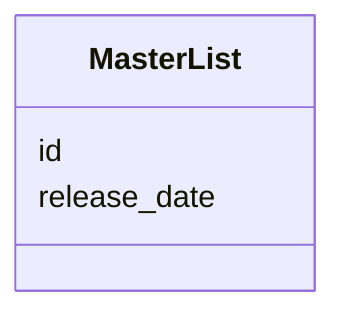

# Class: MasterList 


URI: [imgsg_dev:MasterList](https://w3id.org/jgi/imgsg_dev/MasterList)





<!-- no inheritance hierarchy -->


## Slots

| Name | Cardinality and Range | Description | Inheritance |
| ---  | --- | --- | --- |
| [id](id.md) | 0..1 <br/> [Integer](Integer.md) |  | direct |
| [release_date](release_date.md) | 0..1 <br/> [Datetime](Datetime.md) |  | direct |


## Identifier and Mapping Information


### Schema Source


* from schema: https://w3id.org/jgi/imgsg_dev


## Mappings

| Mapping Type | Mapped Value |
| ---  | ---  |
| self | imgsg_dev:MasterList |
| native | imgsg_dev:MasterList |


## LinkML Source

<!-- TODO: investigate https://stackoverflow.com/questions/37606292/how-to-create-tabbed-code-blocks-in-mkdocs-or-sphinx -->

### Direct

<details>
```yaml
name: master_list
from_schema: https://w3id.org/jgi/imgsg_dev
attributes:
  id:
    name: id
    from_schema: https://w3id.org/jgi/imgsg_dev
    domain_of:
    - dacc_logon
    - env_sample_data_links
    - gold_ap_genbank
    - master_list
    - oprop
    - ora_aspnet_personaliznperuser
    - ora_aspnet_sitemap
    - pig_genbank_emailed_accs
    - pig_reruns
    - pig_retractions
    - pig_tracks
    - plan_table
    - plan_table_20131114
    - project_info_data_links
    - project_info_data_links_112013
    - t_reddy_test
    - workflow_stats
    range: integer
    required: false
  release_date:
    name: release_date
    from_schema: https://w3id.org/jgi/imgsg_dev
    domain_of:
    - assembly
    - img_group_news
    - master_list
    - project_info_bioproject
    - project_info_biosample
    range: datetime
    required: false

```
</details>

### Induced

<details>
```yaml
name: master_list
from_schema: https://w3id.org/jgi/imgsg_dev
attributes:
  id:
    name: id
    from_schema: https://w3id.org/jgi/imgsg_dev
    alias: id
    owner: master_list
    domain_of:
    - dacc_logon
    - env_sample_data_links
    - gold_ap_genbank
    - master_list
    - oprop
    - ora_aspnet_personaliznperuser
    - ora_aspnet_sitemap
    - pig_genbank_emailed_accs
    - pig_reruns
    - pig_retractions
    - pig_tracks
    - plan_table
    - plan_table_20131114
    - project_info_data_links
    - project_info_data_links_112013
    - t_reddy_test
    - workflow_stats
    range: integer
    required: false
  release_date:
    name: release_date
    from_schema: https://w3id.org/jgi/imgsg_dev
    alias: release_date
    owner: master_list
    domain_of:
    - assembly
    - img_group_news
    - master_list
    - project_info_bioproject
    - project_info_biosample
    range: datetime
    required: false

```
</details>