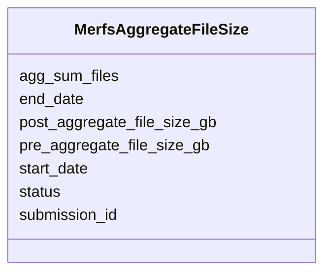

# Class: MerfsAggregateFileSize 


URI: [imgsg_dev:MerfsAggregateFileSize](https://w3id.org/jgi/imgsg_dev/MerfsAggregateFileSize)





<!-- no inheritance hierarchy -->


## Slots

| Name | Cardinality and Range | Description | Inheritance |
| ---  | --- | --- | --- |
| [pre_aggregate_file_size_gb](pre_aggregate_file_size_gb.md) | 0..1 <br/> [Float](Float.md) |  | direct |
| [submission_id](submission_id.md) | 0..1 <br/> [Integer](Integer.md) |  | direct |
| [post_aggregate_file_size_gb](post_aggregate_file_size_gb.md) | 0..1 <br/> [Float](Float.md) |  | direct |
| [status](status.md) | 0..1 <br/> [Integer](Integer.md) |  | direct |
| [start_date](start_date.md) | 0..1 <br/> [Datetime](Datetime.md) |  | direct |
| [end_date](end_date.md) | 0..1 <br/> [Datetime](Datetime.md) |  | direct |
| [agg_sum_files](agg_sum_files.md) | 0..1 <br/> [Float](Float.md) |  | direct |


## Identifier and Mapping Information


### Schema Source


* from schema: https://w3id.org/jgi/imgsg_dev


## Mappings

| Mapping Type | Mapped Value |
| ---  | ---  |
| self | imgsg_dev:MerfsAggregateFileSize |
| native | imgsg_dev:MerfsAggregateFileSize |


## LinkML Source

<!-- TODO: investigate https://stackoverflow.com/questions/37606292/how-to-create-tabbed-code-blocks-in-mkdocs-or-sphinx -->

### Direct

<details>
```yaml
name: merfs_aggregate_file_size
from_schema: https://w3id.org/jgi/imgsg_dev
attributes:
  pre_aggregate_file_size_gb:
    name: pre_aggregate_file_size_gb
    from_schema: https://w3id.org/jgi/imgsg_dev
    rank: 1000
    domain_of:
    - merfs_aggregate_file_size
    range: float
    required: false
  submission_id:
    name: submission_id
    from_schema: https://w3id.org/jgi/imgsg_dev
    domain_of:
    - annotation_contigs_proteins_counts
    - annotation_job_sbatch_args
    - annotation_job_stats
    - annotation_step_stats
    - bad_depth_file_warnings
    - bioproject_propagation
    - gold_analysis_project
    - mer_submissions_queue
    - merfs_aggregate_file_size
    - phajek_test
    - pig_tracks
    - project_info_bioproject
    - project_info_biosample
    - project_info_genbank
    - rnaseq_notify_phajek
    - rnaseq_notify_phajek_dev
    - submission
    - submission_data_files
    - submission_data_files_dmpath
    - submission_history
    - submission_img_contacts
    - submission_proc_stats
    - submission_proc_steps
    - submission_reads_file
    - submission_samples
    - t1_audit
    - v5_ap_imperfect_view
    range: integer
    required: false
  post_aggregate_file_size_gb:
    name: post_aggregate_file_size_gb
    from_schema: https://w3id.org/jgi/imgsg_dev
    rank: 1000
    domain_of:
    - merfs_aggregate_file_size
    range: float
    required: false
  status:
    name: status
    from_schema: https://w3id.org/jgi/imgsg_dev
    domain_of:
    - gold_analysis_project
    - lanl_project
    - load_genbank_prok_data
    - mer_submissions_queue
    - merfs_aggregate_file_size
    - ornl_project
    - request_account
    - submission
    - submission_history
    - t_jgi_catalogue
    - v5_ap_imperfect_view
    range: integer
    required: false
  start_date:
    name: start_date
    from_schema: https://w3id.org/jgi/imgsg_dev
    domain_of:
    - batch
    - merfs_aggregate_file_size
    range: datetime
    required: false
  end_date:
    name: end_date
    from_schema: https://w3id.org/jgi/imgsg_dev
    rank: 1000
    domain_of:
    - merfs_aggregate_file_size
    range: datetime
    required: false
  agg_sum_files:
    name: agg_sum_files
    from_schema: https://w3id.org/jgi/imgsg_dev
    rank: 1000
    domain_of:
    - merfs_aggregate_file_size
    range: float
    required: false

```
</details>

### Induced

<details>
```yaml
name: merfs_aggregate_file_size
from_schema: https://w3id.org/jgi/imgsg_dev
attributes:
  pre_aggregate_file_size_gb:
    name: pre_aggregate_file_size_gb
    from_schema: https://w3id.org/jgi/imgsg_dev
    rank: 1000
    alias: pre_aggregate_file_size_gb
    owner: merfs_aggregate_file_size
    domain_of:
    - merfs_aggregate_file_size
    range: float
    required: false
  submission_id:
    name: submission_id
    from_schema: https://w3id.org/jgi/imgsg_dev
    alias: submission_id
    owner: merfs_aggregate_file_size
    domain_of:
    - annotation_contigs_proteins_counts
    - annotation_job_sbatch_args
    - annotation_job_stats
    - annotation_step_stats
    - bad_depth_file_warnings
    - bioproject_propagation
    - gold_analysis_project
    - mer_submissions_queue
    - merfs_aggregate_file_size
    - phajek_test
    - pig_tracks
    - project_info_bioproject
    - project_info_biosample
    - project_info_genbank
    - rnaseq_notify_phajek
    - rnaseq_notify_phajek_dev
    - submission
    - submission_data_files
    - submission_data_files_dmpath
    - submission_history
    - submission_img_contacts
    - submission_proc_stats
    - submission_proc_steps
    - submission_reads_file
    - submission_samples
    - t1_audit
    - v5_ap_imperfect_view
    range: integer
    required: false
  post_aggregate_file_size_gb:
    name: post_aggregate_file_size_gb
    from_schema: https://w3id.org/jgi/imgsg_dev
    rank: 1000
    alias: post_aggregate_file_size_gb
    owner: merfs_aggregate_file_size
    domain_of:
    - merfs_aggregate_file_size
    range: float
    required: false
  status:
    name: status
    from_schema: https://w3id.org/jgi/imgsg_dev
    alias: status
    owner: merfs_aggregate_file_size
    domain_of:
    - gold_analysis_project
    - lanl_project
    - load_genbank_prok_data
    - mer_submissions_queue
    - merfs_aggregate_file_size
    - ornl_project
    - request_account
    - submission
    - submission_history
    - t_jgi_catalogue
    - v5_ap_imperfect_view
    range: integer
    required: false
  start_date:
    name: start_date
    from_schema: https://w3id.org/jgi/imgsg_dev
    alias: start_date
    owner: merfs_aggregate_file_size
    domain_of:
    - batch
    - merfs_aggregate_file_size
    range: datetime
    required: false
  end_date:
    name: end_date
    from_schema: https://w3id.org/jgi/imgsg_dev
    rank: 1000
    alias: end_date
    owner: merfs_aggregate_file_size
    domain_of:
    - merfs_aggregate_file_size
    range: datetime
    required: false
  agg_sum_files:
    name: agg_sum_files
    from_schema: https://w3id.org/jgi/imgsg_dev
    rank: 1000
    alias: agg_sum_files
    owner: merfs_aggregate_file_size
    domain_of:
    - merfs_aggregate_file_size
    range: float
    required: false

```
</details>