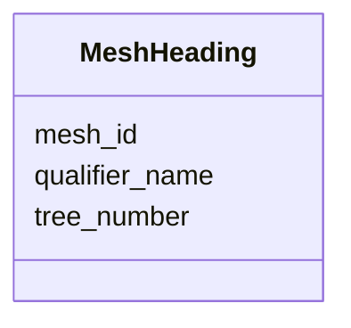

# Class: MeshHeading 


URI: [imgsg_dev:MeshHeading](https://w3id.org/jgi/imgsg_dev/MeshHeading)





<!-- no inheritance hierarchy -->


## Slots

| Name | Cardinality and Range | Description | Inheritance |
| ---  | --- | --- | --- |
| [mesh_id](mesh_id.md) | 0..1 <br/> [Integer](Integer.md) |  | direct |
| [tree_number](tree_number.md) | 0..1 <br/> [String](String.md) |  | direct |
| [qualifier_name](qualifier_name.md) | 0..1 <br/> [String](String.md) |  | direct |


## Identifier and Mapping Information


### Schema Source


* from schema: https://w3id.org/jgi/imgsg_dev


## Mappings

| Mapping Type | Mapped Value |
| ---  | ---  |
| self | imgsg_dev:MeshHeading |
| native | imgsg_dev:MeshHeading |


## LinkML Source

<!-- TODO: investigate https://stackoverflow.com/questions/37606292/how-to-create-tabbed-code-blocks-in-mkdocs-or-sphinx -->

### Direct

<details>
```yaml
name: mesh_heading
from_schema: https://w3id.org/jgi/imgsg_dev
attributes:
  mesh_id:
    name: mesh_id
    from_schema: https://w3id.org/jgi/imgsg_dev
    rank: 1000
    domain_of:
    - mesh_heading
    range: integer
    required: false
  tree_number:
    name: tree_number
    from_schema: https://w3id.org/jgi/imgsg_dev
    rank: 1000
    domain_of:
    - mesh_heading
    range: string
    required: false
  qualifier_name:
    name: qualifier_name
    from_schema: https://w3id.org/jgi/imgsg_dev
    rank: 1000
    domain_of:
    - mesh_heading
    range: string
    required: false

```
</details>

### Induced

<details>
```yaml
name: mesh_heading
from_schema: https://w3id.org/jgi/imgsg_dev
attributes:
  mesh_id:
    name: mesh_id
    from_schema: https://w3id.org/jgi/imgsg_dev
    rank: 1000
    alias: mesh_id
    owner: mesh_heading
    domain_of:
    - mesh_heading
    range: integer
    required: false
  tree_number:
    name: tree_number
    from_schema: https://w3id.org/jgi/imgsg_dev
    rank: 1000
    alias: tree_number
    owner: mesh_heading
    domain_of:
    - mesh_heading
    range: string
    required: false
  qualifier_name:
    name: qualifier_name
    from_schema: https://w3id.org/jgi/imgsg_dev
    rank: 1000
    alias: qualifier_name
    owner: mesh_heading
    domain_of:
    - mesh_heading
    range: string
    required: false

```
</details>