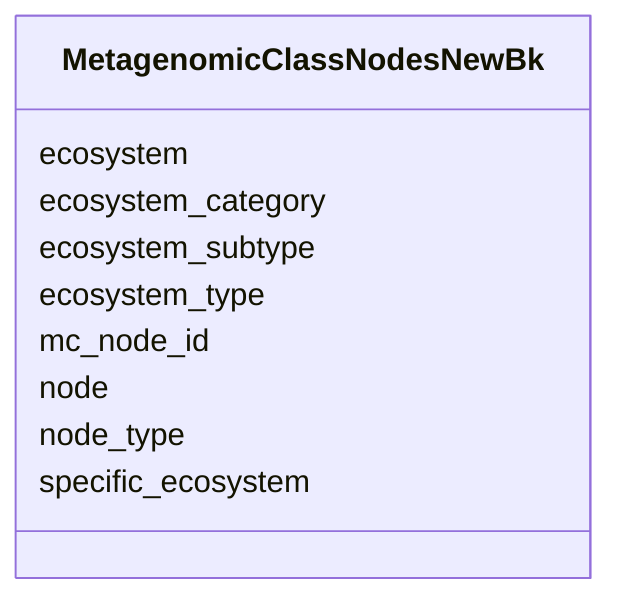

# Class: MetagenomicClassNodesNewBk 


URI: [imgsg_dev:MetagenomicClassNodesNewBk](https://w3id.org/jgi/imgsg_dev/MetagenomicClassNodesNewBk)





<!-- no inheritance hierarchy -->


## Slots

| Name | Cardinality and Range | Description | Inheritance |
| ---  | --- | --- | --- |
| [mc_node_id](mc_node_id.md) | 0..1 <br/> [Integer](Integer.md) |  | direct |
| [node](node.md) | 0..1 <br/> [String](String.md) |  | direct |
| [ecosystem](ecosystem.md) | 0..1 <br/> [String](String.md) |  | direct |
| [ecosystem_category](ecosystem_category.md) | 0..1 <br/> [String](String.md) |  | direct |
| [ecosystem_type](ecosystem_type.md) | 0..1 <br/> [String](String.md) |  | direct |
| [ecosystem_subtype](ecosystem_subtype.md) | 0..1 <br/> [String](String.md) |  | direct |
| [specific_ecosystem](specific_ecosystem.md) | 0..1 <br/> [String](String.md) |  | direct |
| [node_type](node_type.md) | 0..1 <br/> [String](String.md) |  | direct |


## Identifier and Mapping Information


### Schema Source


* from schema: https://w3id.org/jgi/imgsg_dev


## Mappings

| Mapping Type | Mapped Value |
| ---  | ---  |
| self | imgsg_dev:MetagenomicClassNodesNewBk |
| native | imgsg_dev:MetagenomicClassNodesNewBk |


## LinkML Source

<!-- TODO: investigate https://stackoverflow.com/questions/37606292/how-to-create-tabbed-code-blocks-in-mkdocs-or-sphinx -->

### Direct

<details>
```yaml
name: metagenomic_class_nodes_new_bk
from_schema: https://w3id.org/jgi/imgsg_dev
attributes:
  mc_node_id:
    name: mc_node_id
    from_schema: https://w3id.org/jgi/imgsg_dev
    domain_of:
    - metagenomic_class_nodes
    - metagenomic_class_nodes_new
    - metagenomic_class_nodes_new_bk
    range: integer
    required: false
  node:
    name: node
    from_schema: https://w3id.org/jgi/imgsg_dev
    domain_of:
    - metagenomic_class_nodes
    - metagenomic_class_nodes_new
    - metagenomic_class_nodes_new_bk
    range: string
    required: false
  ecosystem:
    name: ecosystem
    from_schema: https://w3id.org/jgi/imgsg_dev
    domain_of:
    - cvecosystem
    - env_sample
    - gold_analysis_project
    - gold_sequencing_project
    - gold_study
    - metagenomic_class_nodes
    - metagenomic_class_nodes_new
    - metagenomic_class_nodes_new_bk
    - metagenomic_classification
    - project_info
    - project_info_04112013
    - v5_ap_imperfect_view
    - vsample
    range: string
    required: false
  ecosystem_category:
    name: ecosystem_category
    from_schema: https://w3id.org/jgi/imgsg_dev
    domain_of:
    - cvecosystem_category
    - env_sample
    - gold_analysis_project
    - gold_sequencing_project
    - gold_study
    - metagenomic_class_nodes
    - metagenomic_class_nodes_new
    - metagenomic_class_nodes_new_bk
    - metagenomic_classification
    - project_info
    - project_info_04112013
    - v5_ap_imperfect_view
    - vsample
    range: string
    required: false
  ecosystem_type:
    name: ecosystem_type
    from_schema: https://w3id.org/jgi/imgsg_dev
    domain_of:
    - cvecosystem_type
    - env_sample
    - gold_analysis_project
    - gold_sequencing_project
    - gold_study
    - metagenomic_class_nodes
    - metagenomic_class_nodes_new
    - metagenomic_class_nodes_new_bk
    - metagenomic_classification
    - project_info
    - project_info_04112013
    - v5_ap_imperfect_view
    - vsample
    range: string
    required: false
  ecosystem_subtype:
    name: ecosystem_subtype
    from_schema: https://w3id.org/jgi/imgsg_dev
    domain_of:
    - cvecosystem_subtype
    - env_sample
    - gold_analysis_project
    - gold_sequencing_project
    - gold_study
    - metagenomic_class_nodes
    - metagenomic_class_nodes_new
    - metagenomic_class_nodes_new_bk
    - metagenomic_classification
    - project_info
    - project_info_04112013
    - v5_ap_imperfect_view
    - vsample
    range: string
    required: false
  specific_ecosystem:
    name: specific_ecosystem
    from_schema: https://w3id.org/jgi/imgsg_dev
    domain_of:
    - cvspecific_ecosystem
    - env_sample
    - gold_analysis_project
    - gold_sequencing_project
    - gold_study
    - metagenomic_class_nodes
    - metagenomic_class_nodes_new
    - metagenomic_class_nodes_new_bk
    - metagenomic_classification
    - project_info
    - project_info_04112013
    - v5_ap_imperfect_view
    - vsample
    range: string
    required: false
  node_type:
    name: node_type
    from_schema: https://w3id.org/jgi/imgsg_dev
    domain_of:
    - metagenomic_class_nodes
    - metagenomic_class_nodes_new
    - metagenomic_class_nodes_new_bk
    range: string
    required: false

```
</details>

### Induced

<details>
```yaml
name: metagenomic_class_nodes_new_bk
from_schema: https://w3id.org/jgi/imgsg_dev
attributes:
  mc_node_id:
    name: mc_node_id
    from_schema: https://w3id.org/jgi/imgsg_dev
    alias: mc_node_id
    owner: metagenomic_class_nodes_new_bk
    domain_of:
    - metagenomic_class_nodes
    - metagenomic_class_nodes_new
    - metagenomic_class_nodes_new_bk
    range: integer
    required: false
  node:
    name: node
    from_schema: https://w3id.org/jgi/imgsg_dev
    alias: node
    owner: metagenomic_class_nodes_new_bk
    domain_of:
    - metagenomic_class_nodes
    - metagenomic_class_nodes_new
    - metagenomic_class_nodes_new_bk
    range: string
    required: false
  ecosystem:
    name: ecosystem
    from_schema: https://w3id.org/jgi/imgsg_dev
    alias: ecosystem
    owner: metagenomic_class_nodes_new_bk
    domain_of:
    - cvecosystem
    - env_sample
    - gold_analysis_project
    - gold_sequencing_project
    - gold_study
    - metagenomic_class_nodes
    - metagenomic_class_nodes_new
    - metagenomic_class_nodes_new_bk
    - metagenomic_classification
    - project_info
    - project_info_04112013
    - v5_ap_imperfect_view
    - vsample
    range: string
    required: false
  ecosystem_category:
    name: ecosystem_category
    from_schema: https://w3id.org/jgi/imgsg_dev
    alias: ecosystem_category
    owner: metagenomic_class_nodes_new_bk
    domain_of:
    - cvecosystem_category
    - env_sample
    - gold_analysis_project
    - gold_sequencing_project
    - gold_study
    - metagenomic_class_nodes
    - metagenomic_class_nodes_new
    - metagenomic_class_nodes_new_bk
    - metagenomic_classification
    - project_info
    - project_info_04112013
    - v5_ap_imperfect_view
    - vsample
    range: string
    required: false
  ecosystem_type:
    name: ecosystem_type
    from_schema: https://w3id.org/jgi/imgsg_dev
    alias: ecosystem_type
    owner: metagenomic_class_nodes_new_bk
    domain_of:
    - cvecosystem_type
    - env_sample
    - gold_analysis_project
    - gold_sequencing_project
    - gold_study
    - metagenomic_class_nodes
    - metagenomic_class_nodes_new
    - metagenomic_class_nodes_new_bk
    - metagenomic_classification
    - project_info
    - project_info_04112013
    - v5_ap_imperfect_view
    - vsample
    range: string
    required: false
  ecosystem_subtype:
    name: ecosystem_subtype
    from_schema: https://w3id.org/jgi/imgsg_dev
    alias: ecosystem_subtype
    owner: metagenomic_class_nodes_new_bk
    domain_of:
    - cvecosystem_subtype
    - env_sample
    - gold_analysis_project
    - gold_sequencing_project
    - gold_study
    - metagenomic_class_nodes
    - metagenomic_class_nodes_new
    - metagenomic_class_nodes_new_bk
    - metagenomic_classification
    - project_info
    - project_info_04112013
    - v5_ap_imperfect_view
    - vsample
    range: string
    required: false
  specific_ecosystem:
    name: specific_ecosystem
    from_schema: https://w3id.org/jgi/imgsg_dev
    alias: specific_ecosystem
    owner: metagenomic_class_nodes_new_bk
    domain_of:
    - cvspecific_ecosystem
    - env_sample
    - gold_analysis_project
    - gold_sequencing_project
    - gold_study
    - metagenomic_class_nodes
    - metagenomic_class_nodes_new
    - metagenomic_class_nodes_new_bk
    - metagenomic_classification
    - project_info
    - project_info_04112013
    - v5_ap_imperfect_view
    - vsample
    range: string
    required: false
  node_type:
    name: node_type
    from_schema: https://w3id.org/jgi/imgsg_dev
    alias: node_type
    owner: metagenomic_class_nodes_new_bk
    domain_of:
    - metagenomic_class_nodes
    - metagenomic_class_nodes_new
    - metagenomic_class_nodes_new_bk
    range: string
    required: false

```
</details>